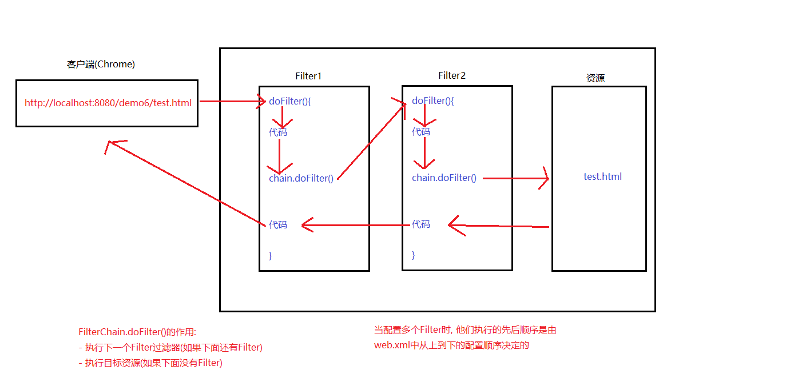

# webpack


Servlet 程序、Listener 监听器、Filter 过滤器
Filter 过滤器它的作用是：拦截请求, 主要做权限检查.
当请求进来时, 先会经过`filter`,如果符合`url-parttern`, 则由`fitler`来处理
<!--more-->
### 使用`fitler`实现登录校验

详细代码见javaweb/demo6


### 实现Filter
Filter 过滤器的使用步骤：
1. 编写一个类去实现 Filter 接口
2. 实现过滤方法 doFilter()
3. 到 web.xml 中去配置 Filter 的拦截路径
    - 精确匹配 `<url-pattern>/test.html</url-pattern>`
    - 匹配文件夹下所有 `<url-pattern>/admin/*</url-pattern>`
    - 匹配某类型资源 `<url-pattern>*.html</url-pattern>`

### Filter的声明周期
1. 构造器方法(web工程启动的时候执行)
2. init 初始化方法(web工程启动的时候执行)
3. doFilter 过滤方法(每次拦截到请求，就会执行)
4. destroy 销毁(停止 web 工程的时候)


### FilterConfig
- 获取 Filter 的名称 filter-name 的内容
- 获取在 Filter 中配置的 init-param 初始化参数
- 获取 ServletContext 对象

```java
@Override
public void init(FilterConfig filterConfig) throws ServletException {
    System.out.println("filter-name 的值是：" + filterConfig.getFilterName());

    System.out.println("初始化参数 username 的值是：" + filterConfig.getInitParameter("username"));
    System.out.println("初始化参数 url 的值是：" + filterConfig.getInitParameter("url"));

    System.out.println(filterConfig.getServletContext());
}
```


```xml
<filter>
    <filter-name>AdminFilter</filter-name>
    <filter-class>claroja.LoginFilter</filter-class>
    <init-param>
        <param-name>username</param-name>
        <param-value>root</param-value>
    </init-param>
    <init-param>
        <param-name>url</param-name>
        <param-value>jdbc:mysql://localhost:3306/test</param-value>
    </init-param>
</filter>

```

### `FilterChain`



代码详细见javaweb/demo7