# 民事法律行为_效力待定的法律行为

## 最佳实践

效力待定的法律行为:

1. 效力待定合同转化为自始无效:
    1. 被代理人明确表示拒绝追认
    2. 被代理人收到催告, 30日后未表示的, 视为拒绝追认
    3. 如果相对人是善意, 在被代理人追认前, 可以行使任意撤销权

2. 效力待定合同转化为自始有效:
    1. 被代理人向代理人或相对人, 追认后(明示和默示)

可撤销法律行为的撤销权和善意相对人的撤销权
1. 行使的方式不同
    1. 🚪民法_152可撤销法律行为的撤销权, 不能以通知的方式, 只能以诉讼仲裁的方式
    2. 善意相对人的撤销权行使的方式`不受限制`, 提起诉讼, 申请仲裁, 书面口头通知
2. 除斥期间不同
    1. 可撤销法律行为的撤销权, 双重除斥期间, 最长5年, 短期1年90日
    2. 效力待定善意相对人的撤销权, 是效力待定合同成立以后, 代理人追认以前

## 效力待定的法律行为的分类

1. 限制民事行为能力人依法不能独立订立的合同，效力待定🚪民法_145
1. 因无权代理(但不构成表见代理)订立的合同，效力待定🚪民法_171

## 限民🚪民法_145

### 效力的转化
甲为限制民事行为能力人。未经其法定代理人代理，亦未经其法定代理人事先同意，甲与乙订立买卖合同约定：`甲将其A电脑以9000元的价格出卖给乙。`根据🚪民法_145的规定，甲、乙的A电脑买卖合同属于效力待定的合同。若作`一般化的表述`，该效力待定合同的效力转化规则如下：

出现下列三种情形之一时，效力待定的合同转化为自始无效的合同：
1. 法定代理人明确表示拒绝追认的；
1. 法定代理人自收到相对人的催告通知之日起三十日内未作表示，视为拒绝追认的；
1. 善意相对人行使撤销权撤销效力待定合同的。

法定代理人追认的，自追认生效时，效力待定的合同溯及自合同成立时自始有效。关于追认，须注意以下几点：
1. 追认权系形成权，追认系单方法律行为，可采用明示、推定(默示)或者单纯沉默(单纯沉默限于相对人与法定代理人有约定时)的形式。
2. 追认的意思表示作出后，自到达受领人(非对话方式)或者自受领人了解时(对话方式)生效(🚪民法_137)。
3. 追认的意思表示的相对人既可以是限制民事行为能力，亦可以是与限制民事行为能力交易的相对人。
4. 追认生效时所发生的法律效果，具有溯及力，效力待定的合同溯及自成立之时自始有效。

### 相对人的保护(之一)：相对人(无论善意恶意)享有催告权

1. 催告的第一种效力：催告前，法定代理人已经向限制民事行为人作出追认或者拒绝追认的意思表示，于到达时(或了解时)生效。根据通说，若相对人对此知情，该追认或者拒绝追认的意思表示`终局确定生效`；若相对人对此不知情，并催告法定代理人，此前已经生效的追认或者拒绝追认的意思表示，因该催告而失去效力，合同重回效力待定状态，此后，法定代理人不能向限制民事行为能力人而只能向相对人作出追认或者拒绝追认的意思表示，追认或者拒绝追认的意思表示于到达时(或者了解时)生效。
2. 催告的第二种效力：法定代理人自收到催告通知起三十日内未作表示的，视为拒绝追认。

### 相对人的保护(之二)：善意相对人享有撤销权

1. 仅善意相对人享有撤销权，恶意相对人不享有撤销权。所谓`善意`，指订立合同时不知道也不应当知道对方系限制民事行为能力人。
2. 撤销权既可以诉讼的方式行使，也可以诉讼外通知的方式行使(但不能以公告方式行使)，诉状副本(仲裁书副本)或者诉讼外通知到达限制民事行为能力人(或者法定代理人)时，产生撤销的效果。
3. 撤销权适用除斥期间，应当在法定代理人的追认生效前，法定代理人的追认生效时，善意相对人的撤销权消灭。换言之，该除斥期间为为`效力待定合同成立之后，法定代理人追认生效之前`。

### 案例

🍐甲(14岁)，未经父母事先同意，甲于1月1日用压岁钱在乙订购跑车一部。甲的父母于1月3日得知此事后，深感欣慰，对甲表示同意(但乙对此一直不知情)。2月1日，乙给甲的父母打电话催告，甲的父母对乙表示追认甲的购车合同。
1. 根据🚪民法_137的规定，1月3日，甲的法定代理人追认的意思表示自甲了解(或到达甲)时，追认生效。
2. 2月1日，不知情的乙催告后，已于1月3日生效的追认失效，买卖合同重归效力待定状态，此后，甲的法定代理人只能向乙作出追认或者拒绝追认的意思表示
3. 甲的法定代理人于2月1日向乙作出追认，追认于2月1日生效(对话方式作出，自乙了解时生效)，汽车买卖合同溯及1月1日生效

相对人乙:
1. 无论善意还是恶意, 享有催告权, 30日除斥期间
2. 在追认以前, 善意相对人享有, 任意撤销权. 行使的方式不受限制, 提起诉讼, 申请仲裁, 书面口头通知甲或代理人

🍐李某收藏有某名牌高级白酒3瓶(正品每瓶价值3000元左右)，全家人都以为是正品名酒，一直舍不得喝，其实3瓶酒都是假酒(市值每瓶100元左右)。一日，李某的儿子小东(14岁)偷偷拿走一瓶，以2000元的价格出卖给张某，并用所得价款在王某处购得心仪已久的山地自行车一辆。对此，下列表述正确的是？(2023年·客观题·单选·回忆版)
A.小东向张某出卖假酒成立欺诈，张某有权以遭受欺诈为由撤销
B.小东向张某出卖假酒成立显示公平，张某有权以显示公平为由撤销
C.小东以2000元的价格出卖假酒，属于纯获利益，该买卖合同有效
D.小东购买自行车的买卖，因小东属于限制行为能力而效力待定

答案: D

### 限制民事行为能力人实施`诈术`所订立的合同

根据通说，限制民事行为能力人采用`诈术`冒充完全民事行为能力人与`善意`相对人订立的合同有效.

🍐男15岁，在乙处购买价值2万元的笔记本电脑，乙问及其年龄，甲出示的假身份证显示为21周岁；乙问其是否是高中生，乙出示假工作证。乙对甲具有完全行为能力深信不疑，遂与甲签订电脑买卖合同。
1. 🚪民法_145的立法目的在于保护心智不完备的限制民事行为能力人，一旦限制民事行为能力人实施诈术，冒充完全民事行为能力人与善意相对人订立合同，即失去保护的必要性。
2. 根据通说观点，甲、乙的买卖合同有效。

## 因无权代理(但不构成表见代理)订立的合同🚪民法_171, 503

### 概念

🍐1日，未经甲授权，丙擅自以甲的名义与乙订立一份买卖合同。15日，乙请求甲支付价款，甲表示`请求乙宽限一周`。
1. 因狭义的无权代理，甲、乙的买卖合同效力待定。
2. 15日，甲以`默示方式`向乙表示了追认(推定)，甲的追认于15日生效，甲、乙间的买卖合同溯及自成立的1日自始生效。

甲乙效力待定合同转化为自始无效:
1. 甲明确表示拒绝追认
2. 甲收到催告, 30日后未表示的, 视为拒绝追认
3. 如果乙是善意, 在甲追认前, 可以行使任意撤销权

甲乙效力待定合同转化为自始有效:
1. 甲向乙或丙, 追认后(明示和默示)

### 可撤销法律行为的撤销权和善意相对人的撤销权:

1. 相同点:
    1. 都是形成权
    2. 效果都是导致法律行为自始无效

2. 不同点:
    1. 行使的方式不同
        1. 🚪民法_152可撤销法律行为的撤销权, 不能以通知的方式, 只能以诉讼仲裁的方式
        2. 善意相对人的撤销权行使的方式`不受限制`, 提起诉讼, 申请仲裁, 书面口头通知
    2. 除斥期间不同
        1. 可撤销法律行为的撤销权, 双重除斥期间, 最长5年, 短期1年90日
        2. 效力待定善意相对人的撤销权, 是效力待定合同成立以后, 代理人追认以前
        
        诉讼状副本仲裁副本是特别的通知, 这里的通知主要是区别公告🚪民法_145

🍐甲用伪造的乙公司公章，以乙公司名义与不知情的丙公司签订食用油买卖合同，以次充好，将劣质食用油卖给丙公司。合同没有约定仲裁条款。关于该合同，下列哪一表述是正确的？
A.如乙公司追认，则丙公司有权通知乙公司撤销
B.如乙公司追认，则丙公司有权请求法院撤销
C.无论乙公司是否追认，丙公司均有权通知乙公司撤销
D.无论乙公司是否追认，丙公司均有权要求乙公司履行

答案: B
