# 代理的构造

## 最佳实践
1. 代理的三方法律关系构造:
    1. `被代理人与代理人`的`内部关系`
        1. 授权关系(`委托代理权`或`法定代理权`)
        2. `基础关系`
    2. `代理人与相对人`的`代理关系`
    3.  `被代理人与相对人`的法律效果`归属关系`
2. 代表的二方法律关系构造: 被代表的单位与相对人之间双方结构，代表人无独立人格

## 代理的构造
代理在构造上，必须形成一种三方结构，涉及三方当事人、产生三种法律关系。无此构造，不成立代理。

1. `被代理人与代理人`的`内部关系`，即被代理人和代理人之间的授权关系(`委托代理权`或`法定代理权`)以及被代理人和代理人之间的`基础关系`
2. `代理人与相对人`的`代理关系`，即代理人独立与相对人(第三人)实施法律行为(作出意思表示或者受领意思表示)
3. `被代理人与相对人`的法律效果`归属关系`，即代理人独立实施法律行为的效果，或者直接、间接归属于被代理人承受，或者能否归属于被代理人承受处于`未定状态`。

## 代理和代表区别

1. 在公司中:
    1. 法定代表人是代表
    2. 非法人代表是代理
2. 无权包含(身份不对, 权限不够)
    1. 在回答有权的时候, 身份+权限展开讲
    2. 在回答表见的时候, 身份+权限合成无权讲
3. 公司的表见代表比普通表见代表多了一条是以公司的名义

代理|代表
--|--
代理行为形成`三方结构`(被代理人、代理人、相对人之间的三方结构，代理人有独立人格)|代表行为形成`双方结构`(被代表的单位与相对人之间双方结构，代表人无独立人格)
委托代理`须有独立的授权行为，否则代理人无代理权`|`无须`独立的授权行为，法定表人当然享有代表权
原则上无权代理订立的合同属于效力待定的合同🚪民法_171|越权代表所订立的合同不得对抗善意相对人🚪民法_504

🍐乙为甲公司法定代表人(公司章程规定，乙未经董事会表决同意，不得对外签订标的额为1000万元以上的合同)。后乙参加广交会期间，未经董事会表决同意，擅自以甲的名义与丙公司订立买卖合同，标的额高达3000万元。乙以甲公司的名义订立合同，属于代表行为，(相较于代理)其特点在于：
1. 形成的是一个`双方结构`，而非三方结构。乙作为法定代表人，系法人机关，法人机关以法人名义实施行为时`无独立人格`，法人机关的行为就是法人的行为，法人机关的人格`被吸收`
2. 无须`独立的授权行为`，乙即享有以甲的名义实施法律行为的概括代表权限
3. 就`越权行为的效力`而言，法人的章程或者权力机构对法定代表人的代表权范围的限制，不得对抗善意相对人，即若丙为善意，可主张无须甲公司追认，标的额为3000万元的买卖合同直接归属于甲公司承受

🍐乙为甲公司的司机(按照公司安排，乙只给董事长开车，不染指公司业务). 乙擅自以甲公司名义向朋友丙订购春茶100斤。乙以甲的名义订立合同，属于代理行为，(相较于代表行为)其特点在于：
1. 形成的是一个`三方结构`，而非双方结构
2. 需`独立的授权行为`，乙才享有以甲公司的名义实施法律的权限(委托代理权)
3. 就`越权行为的效力`而言，原则上乙因无权代理订立的买卖合同`效力待定`，仅在构成表见代理时，善意相对人才有权主张该买卖合同直接归属于甲公司承受。

🍐下列哪些情形属于代理？
A.甲请乙从国外代购1套名牌饮具，乙自己要买2套，故乙共买3套一并结账
B.甲请乙代购茶叶，乙将甲写好茶叶名称的纸条交给销售员，告知其是为自己朋友买茶叶
C.甲律师接受法院指定担任被告人乙的辩护人
D.甲介绍歌星乙参加某演唱会，并与主办方签订了三方协议

答案: ABC, D是中介, 不是代理

## 代理人与使者的区别
代理|使者
--|--
代理人`独立`为意思表示|使者不能独立为意思表示, 使者仅能传达他人已经确定了内容的意思表示(类似于录音机)(类似于录音机)
代理人需要具有相应的民事行为能力|使者不需要具有相应的民事行为能力
意思表示是否发生错误，应就`代理人`是否发生错误予以认定|意思表示是否发生错误，应就`本人`是否发生错误予以认定
不得代理的法律行为，代理行为不发生代理的效力|不得代理的法律行为，仍可通过使者传达意思表示(如离婚、代书遗瞩)

🍐甲授予律师乙以代理权(购买一件价格100万元以内的文物)。乙最终以甲的名义与丙订立买卖合同约定：`丙向甲出售某清代瓷瓶，价款435万元。`乙为甲的代理人，(相较于使者)其特点在于：
1. 乙独立为意思表示。到底购买瓷瓶，还是字画，由乙决定；若决定购买瓷瓶，以多少钱购买，也由乙决定(当然不能超过100万元)
2. 代理人须有`相应的民事行为`能力，无民事行为能力人不得为代理人

🍐甲吩咐5岁的儿子乙道：`去跟丙说，爸爸出100万元买他们瓷瓶`, 乙告诉丙后，取出瓷瓶交给乙。乙为甲的使者，(相较于代理人)其特点在于：
1. 买卖合同的内容是由甲决定的，乙仅代为传达甲已经决定了内容的意思表示，乙无权独立决定意思表示的内容。
2. 乙虽为`无民事行为`能力人，只要具有正确传达甲的意思的能力，仍可担任使者。

