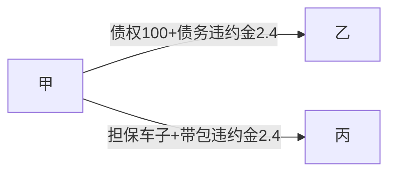
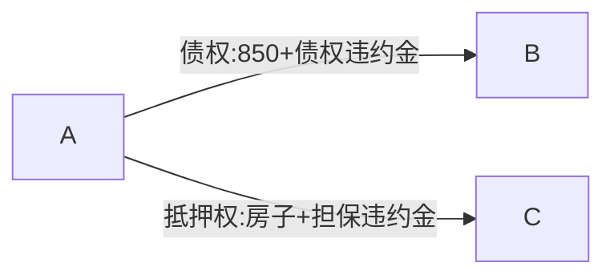
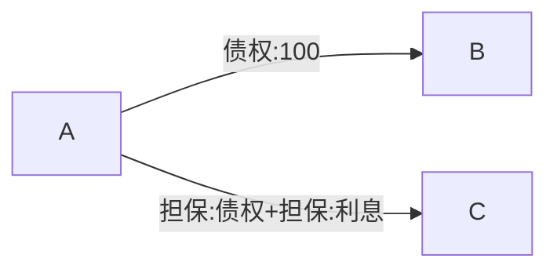

# 范围上的从属性
## 最佳实践
1. 担保物权担保的范围以主债权的范围为限(小于等于主债权)🚪民法_389
2. 排除担保合同范围上从属性的条款无效🚪担保解释_3_1
3. 担保人承担的责任超出债务人应当承担的责任范围

## 担保物权担保的范围以主债权的范围为限(小于等于主债权)

🍐乙向甲借款100万元，约定：`借期1年；乙不支付借期利息；若乙到期未还款，迟延还款一日支付400元的迟延利息。`丙与甲订立抵押合同约定：`丙以其A车抵押担保乙对甲100万元借款债务；若乙到期未还款，丙应当立即履行与甲协议将A车折价归甲所有以抵偿乙对甲借款债务的抵押合同义务，丙迟延履行该义务一日，支付400元的违约金。`后，乙到期无力还款，丙也一直未履行与甲协议将A车折价归甲所有的抵押合同义务。1年后，甲申请法院拍卖A车，并主张对A车变卖得款优先受偿的数额为104.8万元(乙对甲100万元借款本金+乙对甲2.4万元迟延利息+丙到期不对甲履行抵押合同义务的2.4万元违约金)。

1. 乙对甲的主债务仅为102.4万元(100万元本金+2.4万元迟延利息)，基于担保物权内容与范围上的从属性，丙抵押的A车亦仅在此范围承担抵押担保责任。
2. 丙、甲为丙专门约定不履行到期的抵押担保责任的违约责任(丙到期不对甲履行将A车折价归甲所有的义务的2.4万元违约金)，不生效力，甲对A车行使抵押权时，不得主张。
3. 注意：不是说不能基于抵押合同产生违约责任。比如，若丙、甲A车抵押合同成立生效后，丙一直不履行为甲办理抵押登记的抵押合同义务，则甲有权依照生效的抵押合同请求丙承担违约责任。

🍐B与A签订借款合同(主合同)，双方约定：`B向A借款850万元，借款期限为1年，如到期不还款，需承担日万分之五的违约金。`当日，C与A签订抵押合同，约定：`C将自己的房屋为B的借款作抵押担保，如C未依约履行担保责任，需从逾期之日起`另行支付逾期违约金`。`
1. 抵押人C不仅需要`支付债务人B因违约而支付的违约金`，还要`支付自己违约所要支付的违约金`，其结果是，如果说债务人B违约只需要承担日万分之五的违约金，而抵押人C则可能要承担日万分之十的违约金。

🍐B向A借款100万元，借期1年，未约定利息。1月5日，C向A单方以书面形式出具保证函，上书`愿意与B承担连带保证责任，担保范围包括本金100万元及利息`。后B无力还款，债权人A起诉连带责任保证人C承担了100万元的本金及10万元利息。
1. B和A之间的借款系自然人之间的借款合同，`没有约定利息，视为无利息`。
2. C承担110万元的责任，仅能向B追偿100万元，超出的10万元有权基于不当得利请求A返还。据此，担保人的责任范围`绝对不能超过主债务`人。

## 排除担保合同范围上从属性的条款无效🚪担保解释_3_1

当事人对担保责任的承担约定专门的违约责任，或者约定的担保责任范围超出债务人应当承担的责任范围，担保人主张仅在债务人应当承担的责任范围内承担责任的，人民法院应予支持🚪担保解释_3_1

🍐甲向乙借款100万元，约定：`借期1年，自2020年4月2日至2021年4月1日；甲不支付借期利息；若甲到期未还款，迟延还款一日支付400元的迟延利息。`丙与乙订立抵押合同约定：`丙以其A车抵押担保甲对乙100万元借款债务；若甲到期未还款，丙应当立即履行‘与乙协议将A车折价归乙所有以优先抵偿甲对乙借款债务’的抵押合同义务，丙迟延履行该义务一日，支付400元的违约金。`后，甲到期无力还款，丙也一直未履行与乙协议将A车折价归乙所有的抵押合同义务。2021年6月2日，乙申请法院拍卖A车，并主张对A车变卖得款优先受偿的数额为104.8万元(甲对乙100万元借款本金+甲对乙2.4万元迟延利息+丙到期不对乙履行到期抵押合同义务的2.4万元违约金)。①甲对乙的主债务仅为102.4万元(100万元本金+2.4万元迟延利息)，基于担保物权内容与范围上的从属性，丙抵押的A车亦仅在此范围承担抵押担保责任。②丙、乙为丙专门约定不履行到期的抵押担保责任的违约责任(丙到期不对乙履行将A车折价归乙所有的义务的2.4万元违约金)，不生效力，乙对A车行使抵押权时，不得主张。

## 担保人承担的责任超出债务人应当承担的责任范围

担保人承担的责任超出债务人应当承担的责任范围担保人向债务人追偿，债务人主张仅在其应当承担的责任范围内承担责任的，人民法院应予支持；担保人请求债权人返还超出部分的，人民法院依法予以支持🚪担保解释_3_2。

🍐甲基于买卖合同对乙负担100万元价款债务，丙提供担保。甲未支付到期的100万元价款，乙请求甲履行，因为依照🚪民法_525的规定，甲享有同时履行抗辩权，甲对乙主张同时履行抗辩权，拒绝履行相应的40万元价款义务。乙于是请求丙承担100万元的担保责任。①因甲对乙主张同时履行抗辩权，甲对乙的主债务暂时由100万元缩减为60万元，基于担保责任内容与范围上的从属性，丙对乙的担保责任相应地由100万元缩减为60万元。②乙请求丙承担100万元担保责任时，根据🚪民法_701的规定，丙应当援用甲已经对乙主张的同时履行抗辩权，仅对乙承担60万元的担保责任。③若丙未援用，对乙承担100万元的责任，那么，丙超出60万元主债务多对乙承担的40万元责任就不属于担保责任，丙只有权对甲追偿60万元。另外40万元，属于非债清偿，成立不当得利，丙有权请求乙返还不当得利。

