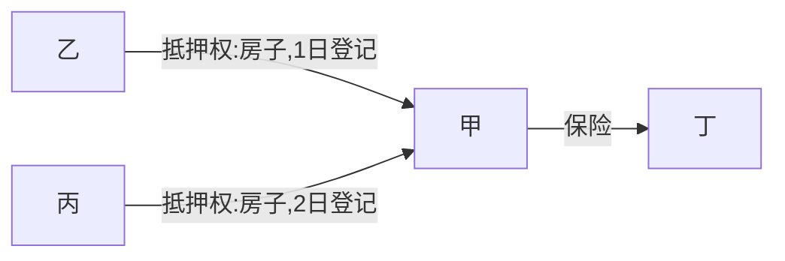

# 物上代位权🚪民法_390, 🚪担保解释_41, 42
## 最佳实践
1. 物上代位权, 对保险金仍享有优先受偿权
2. 法定债权质权, 法定债权质权成立的通知到达支付义务人后, 支付义务人向原债权人支付的，不发生清偿的效力
3. 担保物发生添附时担保物权的物上代位规则🚪担保解释_41

## 物上代位权
1. 担保物权仅支配担保财产的交换价值，不支配担保财产的使用价值，因此，担保物权具有物上代位性。担保期间，担保财产毁损灭失的，对于担保财产毁损、灭失后的`现存交换价值(如保险金、赔偿金、补偿金等)`，`担保物权人仍享有优先受偿权`。
2. 关于担保物权物上代位性的原理，有`担保物权继续存续说`和`法定债权质权说`。🚪担保解释_42_2采`法定债权质权说`。依照`法定债权质权说`，担保物权存续期间，担保财产毁损、灭失或者被征收的，担保物权自动`依法`转化为以`保险金请求权、损害赔偿请求权、征收补偿费请求权`等为标的的`法定债权质权`，因此，该法定债权质权成立的通知到达支付义务人后，支付义务人向原债权人支付保险金、赔偿金、补偿金的履行行为被冻结，`支付义务人向原债权人支付的，不发生清偿的效力`，`支付义务人只能向主张物上代位权的原担保物权人支付`。
3. 担保物权人基于物上代位性对保险金、赔偿金或者补偿金优先受偿时，该担保物权基于🚪民法_414、415、416、456等规定拥有的优先受偿权的`顺位`，维持不变。

🍐甲将房屋先后抵押给乙和丙，1日为乙办理抵押登记，2日为丙办理抵押登记。甲在丁保险公司为其A房屋投保了意外毁损险。3日(在保险期限内)，房屋因雷击被楚毁。

1. 基于物上代位性，对保险金请求权，乙、丙均享有优先受偿权，分别为第一顺位与第二顺位。
2. 丁保险公司接到乙、丙要求向其给付的通知之前，已经向甲支付的保险金，乙、丙不再享有请求丁再向自己支付并优先受偿的权利。
3. 丁保险公司接到乙、丙要求向其给付的通知之后，丁向甲支付保险金的履行行为被冻结，丁向甲支付保险金的，不发生清偿效力，乙、丙仍享有请求丁再向自己支付并优先受偿的权利。
4. 3日A房屋被楚毁时，若抵押权担保的债权尚未到期，乙、丙有权请求丁保险公司将保险金予以提存，等债权到期后，再对提存的保险金优先受偿。

🍐债务人向银行借款500万元用于购买房屋，并以房屋办理抵押手续，同时应银行要求向该房产投了火灾险。
1. 房屋起火，获保险赔偿200万元。银行是否可以就该200万元主张优先受偿权？
答：有权。因为基于担保物权的物上代位性，担保物权人(债权人)工商银行可以就获得的保险金优先受偿。
2. 房屋被洪水冲毁，没有赔偿。债务人是否应当继续履行债务？
答：应当继续履行债务。因为担保财产因不可抗力毁损、灭失且无代位物的，担保物权(从权利)消灭，但主债权依然存在，债务人应当继续履行债务。

## 担保物发生添附时担保物权的物上代位规则🚪担保解释_41
1. 担保物因添附(包括附合、混合、加工)发生所有权变动的，基于担保物权的物上代位性，担保物权继续作用于原担保物的现存交换价值，对该现存的交换价值继续享有担保物权。
2. 🚪担保解释_41仅就抵押物因添附发生所有权的变动时抵押权的物上代位规则作了规定，但是，基于相同的理由，质押物、留置物因添附发生所有权变动时，质权和留置权的物上代位规则，可以准用(或者`类推`)适用🚪担保解释_41。
3. 根据🚪担保解释_41的规定，抵押权存续期间，抵押财产(抵押物)因添附(附合、混合、加工)发生所有权变动时，该抵押权的物上代位规则如下：
    1. 添附物归第三人单独所有的，抵押权的效力及于补偿金(抵押人对第三人享有的补偿金请求权)。
    2. 添附物归抵押人单独所有的，抵押权的效力及于添附物，但有范围上的限制，添附导致抵押财产价值增加的，抵押权的效力不及于增加的价值部分。
    3. 添附物归抵押人与第三人按份共有的，抵押权的效力及于抵押人对共有物享有的份额。

🍐将其价值10万元的玉石抵押给乙，办理了抵押登记，担保乙的20万元债权(于2021年9月1日到期)。乙的债务人到期未偿还20万元债务。①假设9月5日，玉石被善意的丙加工成价值60万元的玉雕，根据添附(加工)规则，玉雕归丙所有，甲对玉石的所有权消灭。则乙对玉石动产抵押权的物上代位规则是：乙对玉雕不享有优先受偿权；对甲对丙享有的10万元补偿金请求权(不当得利返还请求权或侵权损害赔偿请求权)，乙享有优先受偿权。②假设9月5日，玉石被恶意的丙加工成价值60万元的玉雕，根据添附(加工)规则，玉雕归甲所有。则乙对玉石动产抵押权的物上代位规则是：乙对玉雕享有优先受偿权，但优先受偿的范围仅为10万元，因加工增加的50万元价值部分，乙不享有优先受偿权。③假设9月5日，丙所有的价值10万元的名贵朱砂渗透进玉石，玉石变成价值20万元的翡翠，根据添附(附合)规则，价值20万元的翡翠由甲、丙按份共有，份额各占二分之一。则乙对玉石动产抵押权的物上代位规则是：甲对翡翠按份共有的份额，乙享有优先受偿权

