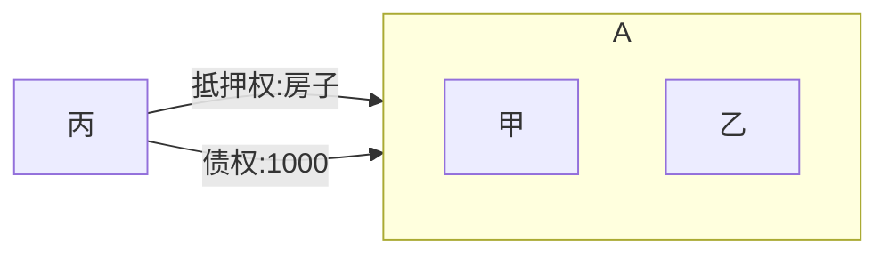

# 不可分性🚪担保解释_38, 39

## 最佳实践

1. 担保物权的不可分性🚪担保解释_38~39

## 不可分型
1. 基于相同的理由，《担保解释》第38条与第39条也可准用于或者类推适用于质权、留置权等典型担保物权和让与担保、保留所有权等非典型担保物权，
2. 担保物权的不可分性，包括两个方面的内容：
    1. `担保物的全部`担保着被担保`债权的每一部分`；
    2. `担保物的每一部分`担保着被担保`债权的全部`。

🍐甲、乙按份共有房屋(一共4层)，价值800万元。甲、乙共同将房屋抵押给丙，担保1000万元的债权，办理了抵押登记。

1. 假设丙就1000万元债权对房屋行使抵押权时，房屋市价已涨至2000万元，丙有权一并对4层楼房行使抵押权。
2. 假设丙将1000万元债权中的500万元债权转让给丁，则丙保有的500万元债权和丁受让的500万元债权均受4层楼房整体的抵押担保。
3. 假设债务人到期仅向丙清偿了500万元，丙剩余的500万元债权仍就4层楼房整体享有抵押权。
4. 假设抵押期间，甲、乙分割A房屋，甲分得第1层和第2层，乙分得第3层和第4层，丙对甲、乙分得的房屋均享有抵押权。
5. 假设抵押期间，甲、乙将第3层和第4层转让给丁，丙对甲、乙保有的第1层、第2层和丁受让的第3层、第4层均享有抵押权。

🍐1月1日，债务人向一行借款1000万元。担保人以10辆车做担保，并办理担保手续。1月2日债务人向银行还款200万元，到期后无力偿还剩余800万元。银行可以行使10辆车的抵押权。  
1月1日，债务人向一行借款1000万元。担保人以10辆车做担保，并办理担保手续。担保人将10辆车平均分给子公司。债务到期后无力偿还剩余800万元。银行可以行使10辆车的抵押权。

