# 价款超级优先权

## 最佳实践

1. `价款超级优先权`的要件有三：
    1. 担保财产担保人购买的动产或者融资租赁的动产；
    2. 担保的债权为担保人买卖该动产的价金债权、担保人融资租赁该动产的租金债权或者为担保人购置该动产的价款(租金)支付提供融资所生的债权
    3. 自该动产交付给担保人后10日内办理抵押登记或者保留所有权登记
2. 留置权 > 价款超级优先权 > 抵押权质权

## 超级动产抵押权

担保的主债权是标的物的购买价金。只要在交付后10日内进行购买价金抵押权的登记，该购买价金担保权便具有`超级优先权`，亦即该购买价金担保权优先于其他登记在前的担保物权.

优先顺位: 购买价金担保权的超级优先顺位奉行`后登记者优先`，在同一个动产之上既然有动产浮动抵押权，又有购买价金担保权(超级动产抵押权)，还有留置权时，担保物权之间的优先顺位为：留置权>购买价金担保权(超级动产抵押权)>动产浮动抵押权

⭐为什么购买价金担保权 > 动产浮动抵押权? 因为购买价金担保权都是分期付款, 如果买受人无法支付余款, 就是非正常经营买受人, 

超级动产抵押权, `买卖合同之债`优先于`借款合同之债`. 动产标的物的出卖人, 优先于买受人其他担保物权人. 宽限期10天办理抵押登记, 可以后来者居上.

🍐1月1日，甲将其车以20万元出卖给法某，法某于合同订立之日支付5万元，余款6个月内付清。为担保剩余15万元价款义务的履行，法某将车抵押给甲。1月1日，甲向法某交付了车。1月5日，法某将车质押给乙，并同日完成现实交付。1月8日，法某为甲办理了车的抵押登记。
1. 虽然甲对车抵押权公示(登记)的时间晚于乙对车质权公示(交付)的时间，但根据🚪民法_416的规定，甲对车享有的抵押权属于`超级动产抵押权`，在顺位上优先于乙对A车的质权
2. 成立`超级动产抵押权`的要件有三：
    1. 抵押财产系抵押权人出卖给抵押人的动产
    2. 抵押权担保的债权系抵押人购买该抵押动产的价金债权
    3. 须于买卖动产交付给抵押人后10日内办理动产抵押权设立登记

🍐1日，银行贷款给A公司600万元, 2年期. A公司以现有的以及将有的生产设备、原材料、半成品、产品作为抵押物设定抵押, 2日办理动产抵押登记.
3日, A公司从B公司购买, 甲乙丙三套设备, 并以这三套设备作为抵押物, 4日办理动产抵押登记.
4日, A公司将甲仪器送C公司进行检修, 因A公司拖欠修理费用未支付，C公司将甲设备扣押。

1. B公司的动产抵押权与银行的抵押权何者效力优先？
    1. B公司的动产抵押权效力优先
    2. 因为`购买价金担保权`自抵押财产`交付后10日内办理抵押登记`的，其效力优先于动产浮动抵押权。
    3. 法律依据：🚪民法_416。

2. C公司、B公司和银行对A套设备的优先权效力如何排序？
    C公司>B公司>银行。(留置权>超级动产抵押权>抵押权)

## 由`超级动产抵押权`扩张到`价款超级优先权`

1. 🚪担保解释_57条将🚪民法_416条规定的`超级动产抵押权`扩张为`价款超级优先权`。从而，`价款超级优先权`包括四种：
    1. `超级动产抵押权`
    2. `动产保留所有权买卖`出卖人对出卖动产享有的价款超级优先权
    3. `动产融资租赁`出租人对租赁动产享有的价款超级优先权
    4. 为动产买卖或者动产融资租赁价款(租金)支付提供融资的债权人对该动产享有的超级动产抵押权
2. 在顺位上，无论公示的先后，`价款超级优先权`优先于`在其成立之前`以及`在其成立之后`在该动产上设立的其他抵押权与质权；但劣后于此后在该动产上成立的留置权
3. 成立`价款超级优先权`的要件有三：
    1. 担保财产为担保人购买的动产或者融资租赁的动产；
    2. 担保的债权为担保人买卖该动产的价金债权、担保人融资租赁该动产的租金债权或者为担保人购置该动产的价款(租金)支付提供融资所生的债权
    3. 自该动产交付给担保人后10日内办理抵押登记或者保留所有权登记
4. 同一动产上并存多个价款超级优先权的，先登记的优先于后登记的

🍐法某以其现有以及将有的动产为甲设立动产浮动抵押。1月1日，法某为甲办理了抵押登记。后，乙将铲车融资租赁给法某，融资租赁期间，乙保留对铲车的所有权。2月1日，与乙订立买卖合同的出卖人向法某交付了铲车，2月9日，法某为乙办理了保留所有权登记。2月5日，法某向丙借款300万元，专项用于法某向乙支付融资租赁合同项下的租金。法某以铲车为丙设立抵押权。法某于当日(2月5日)为丙办理了A铲车的抵押登记。3月1日，铲车撞伤戊(依法成立过错侵权)，戊依法留置A铲车。

1. 乙对A铲车享有`动产融资租赁价款优先权`，丙对铲车享有`超级动产抵押权`，因丙登记在先，丙的价款超级优先权优先于乙的价款超级优先权
2. 在甲的动产浮动抵押权的`休眠期内`，法某融资租赁取得的铲车，自动进入动产浮动抵押，成为抵押财产，因此甲对铲车享有动产浮动抵押权。
3. 综上，铲车上的四个动产担保物权的顺位是：第一顺位，戊的留置权；第二顺位，丙的`超级动产抵押权`；第三顺位，乙的`动产融资租赁价款优先权`；第四顺位，甲的动产浮动抵押权。

乙保留所有权, 非正常所有权, 类似于抵押权, 所以法某可以设立抵押
