# 不动产抵押权

## 最佳实践

1. 抵押权设立的要件有三：🚪民法_402
    1. 抵押人拥有处分权
    2. 抵押合同有效
    3. 办理完毕抵押登记

## 不动产抵押设立 🚪民法_402
以下列四种标的物设立不动产(或不动产权利)抵押权的，
4. 建筑物和其他土地附着物；
5. 建设用地使用权；
6. 海域使用权；
7. 正在建造的建筑物(只能先办理抵押的预告登记，建筑物办理所有权初始登记后，才能办理抵押权的本登记)。

抵押权设立的要件有三：
1. 抵押合同有效
2. 抵押人拥有处分权
3. 办理完毕抵押登记。

总结:
1. 签合同, 但未登记→区分原则
    1. 抵押合同(债权), 有效, 担保义务(违约责任), 协助登记
    2. 抵押权(物权), 未设立
2. 签合同, 且登记→抵押权设立, 优先受偿权

🍐银行A贷款给乙500万元, 签订抵押合同, 约定3日办理登记

1. 乙拒绝配合办理登记, 二者的抵押合同效力如何?银行如何救济?
    合法有效，基于区分原则，未办理物权登记的，不影响合同效力。基于合法有效的房屋抵押合同，追究乙的违约责任，请求乙协助自己办理抵押登记手续。

2. 因登记机构无法办理登记, 银行A是否取得抵押权? 如何救济?
    未取得。银行A可以请求不动产登记机构赔偿。

3. 2日乙的房屋被政府征收, 赔偿450万元, 银行可否对该450万元行使物上代位权？
    不可以。因为房屋抵押权尚未办理抵押登记手续，工商银行尚未取得抵押权，不存在物上代位权问题。此时，工商银行可以在450万元的范围内请求乙承担违约责任。

4. 2日, 乙将房屋卖给丙, 丙办理过户登记, 丙可否主张善意取得房屋所有权？工商银行如何救济自己的合法权益？
    不可以。因为乙的卖房行为系有权处分，马某继受取得房屋所有权。
    基于合法有效的房屋抵押合同，在500万元范围内追究乙的违约责任。

