# 动产抵押权

## 最佳实践

1. 抵押权的设立要件有二：
    1. 抵押人拥有处分权
    2. 抵押合同有效
2. 登记的动产抵押权不能对抗善意第三人

## 动产抵押权
🚪民法_403
🚪担保解释_54
🚪担保解释_67

### 动产抵押权的设立规则🚪民法_403
1. 以动产为标的物设立抵押权的，抵押权的设立要件有二：(a)抵押合同有效；(b)抵押人拥有处分权。
2. 动产抵押权的设立，采`意思主义`的物权变动模式，无须公示，既不需要交付(因为抵押不移转抵押物的占有)，也不需要登记。
3. 未登记的动产抵押权不能对抗善意第三人。

## 总结

1. 抵押**合同生效**
2. **登记对抗**
    1. 登记: 第三人善恶在所不问, 抵押权不受影响
    2. 未登记: 
        1. 第三人恶意, 抵押权成立
        2. 第三人善意, 抵押权消灭
3. `不需要交付`

🍐乙将车抵押给甲，一直未办理抵押登记。抵押期间，未经甲同意，乙将车出卖给丙并交付。
1. 若甲能够证明丙受让车交付时恶意，对丙取得所有权的车，甲的抵押权不受影响，甲继续享有未登记的动产抵押权
2. 若甲不能证明丙受让车交付时为恶意，推定丙为善意，对丙取得所有权的车，甲的未登记动产抵押权消灭

🍐乙将其车抵押给甲，一直未办理抵押登记。后，乙将车出租给丙并交付，约定租期1年(2020年3月2日至2021年3月1日)。2020年9月1日，甲行使对车的抵押权，申请法院拍卖车。
1. 若甲能够证明丙于订立A车租赁合同时为恶意，则乙、丙的车租赁合同不适用买卖不破租赁规则
2. 若甲不能够证明丙于订立A车租赁合同时为恶意，推定丙为善意，则乙、丙的车租赁合同适用买卖不破租赁规则

🍐乙将其车抵押给甲，一直未办理抵押登记。因机动车道路交通事故责任，乙对丙负担30万元的侵权损害赔偿责任。除车外，乙暂无其他财产。
1. 若法院尚未依丙的申请对车作出财产保全裁定或者采取执行措施，则甲可主张就车优先于丙受偿。理由：未登记的动产抵押权优先于抵押人的普通债权人的债权(`物权优先于债权`)
2. 若法院已经依丙的申请对车作出财产保全裁定或者采取执行措施，则甲不得主张就车优先于丙受偿。理由：未登记的动产抵押权，不得对抗抵押人的查封债权人的债权

🍐1日, `B公司`向`A银行贷款`(主合同)2000万元，将自己的一台`铲车抵押`(动产抵押权)给A银行，双方签订了书面抵押合同(要式合同)，并`办理了抵押登记`(有内部效力有外部效力)手续。2日，B公司将该铲车以3000万元的价格出卖给C公司并交付，C公司对铲车已经抵押给A银行的事实并不知情(善意相对人)。后B公司无法偿还A银行贷款。A银行是否有权向C公司请求行使抵押权，拍卖铲车优先受偿？

    有权。因为A银行的铲车抵押权已登记，可以对抗善意第三人。

🍐1日, `B公司向A银行贷款`(主合同)2000万元，将自己的一台`铲车抵押(动产抵押权)`给A银行，双方签订了书面抵押合同(要式合同)，但`未办理抵押登记`(有内部效力无外部效力)手续。2日，B公司将该铲车以3000万元的价格`出卖给C公司并交付`，C公司对铲车已经抵押给A银行的事实并不知情(善意相对人)。后B公司无法偿还A银行贷款。A银行是否有权向C公司请求行使抵押权，拍卖铲车优先受偿？

    无权。因为A银行的铲车抵押权未登记，不得对抗善意第三人。

    善意取得一定是善意第三人. 善意第三人 不一定是善意取得, C公司是善意第三人, 但是继受取得, 因为甲是有权处分.
    继受取得 = **所有权(有权处分)**+有效合同+登记/交付
    善意取得 = **所有权(无权处分)**+有效合同+登记/交付

🍐`B公司向A银行贷款`(主合同)2000万元，将自己的一`台铲车抵押`(动产抵押权)给A银行，双方签订了书面抵押合同(要式合同)，但`未办理抵押登记`(有内部效力无外部效力)手续。2日，B公司将该铲车`出租给丙`公司并交付，C公司对铲车已经抵押给A银行的事实并不知情(善意相对人)。后B公司无法偿还A银行贷款。

    1. A银行可否行使抵押权拍卖铲车优先受偿？

        可以。因为物权优于债权，物权具有优先效力。

    2. 如A银行将铲车拍卖，丁公司获得铲车所有权。丁公司是否有权请求C公司返还铲车？

        答：无权。因为丁公司虽然是铲车的所有权人，但C公司对铲车的占有系有权占有。因此，丁公司无权向C公司行使返还原物请求权。(成立在先原则的成立是登记的意思)

## 总结

1. 动产抵押权
2. 价款超级优先权
    1. 超级动产抵押权
    2. 动产所有权保留买卖合同
    3. 动产融资租赁合同
3. 动产浮动抵押权
4. 让与担保
5. 动产质押权
6. 动产留置权

## 动产所有权保留买卖合同VS超级动产抵押权

项目|动产所有权保留买卖合同|超级动产抵押权
--|--|--
相同点1|买卖合同|买卖合同
相同点2|担保价款履行|担保价款履行
相同点3|保护出卖人利益|保护出卖人利益
性质|非典型担保|典型担保
交付后果|不转移动产所有权|转移动产所有权
登记|未经登记不得对抗善意第三人|未经登记不得对抗善意第三人(宽限期10日/交付标的物之日起)
买方支付能力|相对较弱|相对较强