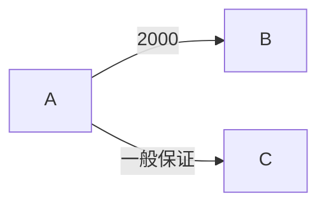
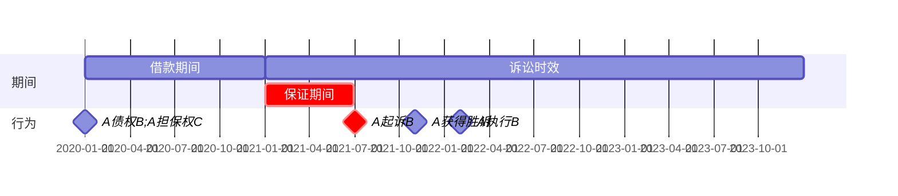
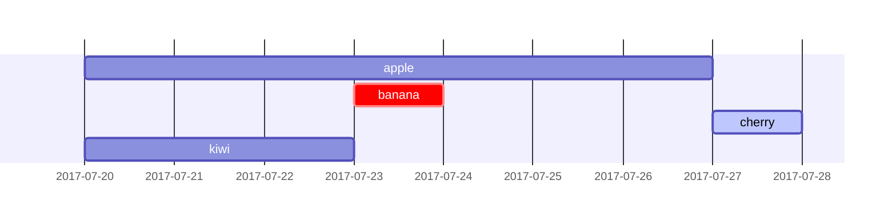

# 保证期间

## 最佳实践
1. 保证期间的概念🚪民法_693, 🚪担保解释_27
2. 共同保证的保证期间🚪担保解释_29
3. 保证期间长度的确定🚪民法_692, 🚪担保解释_32
4. 保证合同无效的保证期间🚪担保解释_33

## 保证期间的概念🚪民法_693, 🚪担保解释_27

### 基本概念

含义: 确定保证人承担保证责任的期间, 除斥期间，不发生中止、中断和延长

1. 在保证期间内，若债权人未依法定方式行使债权，其法律效果是，保证期间经过(又称`保证期间届满`)，保证人对债权人的保证责任消灭。

    1. 保证期间属于`除斥期间`。
    2. 保证期间为`不变期间`。对此，🚪民法_692_1规定：`保证期间是确定保证人承担保证责任的期间，不发生中止、中断和延长。`

2. 一般保证和连带保证的保证期间:

    1. 一般保证: 一般保证的债权人未在保证期间内对债务人提起诉讼或申请仲裁的，保证人不再承担保证责任
    2. 连带保证: 连带责任保证的债权人未在保证期间对保证人主张(通知即可)承担保证责任的，保证人不再承担保证责任

🍐2020年1月1日，B向A借款2000万元，期限为1年，C为一般保证人。到期B未还款。A于2021年7月1日起诉B，8月1日获得生效的胜诉判决。经法院强制执行于2022年2月1日确认B无财产，执行未果。然后A请求C承担保证责任。
C无需承担保证责任。因为债权人A未在保证期间(2021年1月1日至2021年6月31日)内起诉债务人B，一般保证人C免责。关键看起诉时间是否在保证期间内.

🍐2020年1月1日，B向A借款2000万元，期限为1年，C为一般保证人。到期B未还款。A于2021年1月2日起诉B。2月1日，法院判决A胜诉，执行顺序为先B后C。经法院强制执行于6月1日确认B无财产可执行，作出终结本次执行程序的裁定并于当日送达债权人。一般保证人C丧失先诉抗辩权，自6月2日起开始起算保证债务`3年诉讼时效期间`，即2021年6月2日至2024年6月1日。该3年内，债权人A均有权申请执行一般保证人C的财产。

1. `保证债务的诉讼时效`，又称保证合同的诉讼时效，是指债权人依据保证合同请求保证人履行保证债务的请求权的诉讼时效。
2. `保证期间和保证债务诉讼时效不可能同时并存`，二者`水火不容`。保证期间存在就不可能起算保证债务诉讼时效，一旦起算保证债务诉讼时效，保证期间即已消灭。

### 深入理解

1. 一般保证。`或诉或裁` 起诉仲裁又撤诉, 等于没有起诉, 一般保证人免责
    
    对于一般保证人而言，由于保证人`享有先诉抗辩权`，债权人必须在保证期间内通过对债务人提起诉讼或申请仲裁的方式行使。否则，保证责任消灭，保证人不再承担保证责任。此时，如果债权人没有在保证期间内以对债务人提起诉讼或申请仲裁的方式主张权利，而只是向债务人主张权利，因其行使权利的方式不符合🚪民法_693_1款的规定，保证人的保护责任消灭。

    问题在于：一般保证的债权人在保证期间内对债务人提起诉讼或申请仲裁后，又撤回起诉或仲裁申请的，一般保证人是否需要继续承担保证责任？
    
    🚪担保解释_31_1款采纳了`否定说`。理由在于：所谓保证期间，就是确定保证人承担保证责任的期间，该期间不发生中止、中断和延长。法律上设立保证期间的根本目的在于限制保证人的责任，维护保证人的利益。同时还在于督促债权人按照法律规定的方式主张权利，在一般保证中就是要求债权人针对债务人提起诉讼或申请仲裁，并在取得生效判决或裁决后及时申请对债务人财产进行强制执行。如果依然不能实现债权，则保证人丧失先诉抗辩权，债权人可以请求保证人承担保证责任。债权人起诉或申请仲裁后，在取得生效的法律文书前又撤回起诉或仲裁申请，并在保证期间届满时没有再次起诉或申请仲裁的，倘若认为保证期间因此失去效力，保证人不得以保证期间届满为由免除保证责任，就会出现以下弊端：
    1. 由于此时保证期间已经失去效力，因此保证人不能以保证期间届满为由免除保证责任。
    2. 由于一般保证人依法并未丧失先诉抗辩权，因此，在保证期间失去效力的情况下，保证债务的诉讼时效却还没有开始起算。这就意味着债权人可以通过决定何时再行起诉或申请仲裁来控制保证债务的诉讼时效起算时间点，这对于保证人显然是不利的。为了尽早确定保证期间的诉讼时效并督促债权人通过诉讼或申请仲裁以及后续的强制执行程序实现债权，从而开始起算保证债务的诉讼时效。

    🚪担保解释_31_1款规定，一般保证的债权人在保证期间内对债务人提起诉讼或申请仲裁后，又撤回起诉或仲裁申请，债权人在保证期间届满前未再行提起诉讼或申请仲裁，保证人主张`不再承担保证责任的`，人民法院予以支持。

1. 连带责任保证。`或诉或裁或通知`, 只要到达就视为行权了
    
    由于连带责任保证的保证人`不享有先诉抗辩权`。因此，债权人`只有在保证期间内`对于保证人主张承担保证责任的，保证人才承担保证责任。否则，保证责任消灭，保证人不再承担保证责任。

    问题在于：连带责任保证的债权人在保证期间届满前向保证人提起诉讼或申请仲裁请求其承担保证责任后，又撤回起诉或仲裁申请的，能否认定债权人在保证期间内向保证人主张了权利？
    对此，理论和实践争议很大，存在如下三种观点：
    观点一：只要债权人在保证期间届满前向保证人提起诉讼或申请仲裁，即使之后又撤回起诉或仲裁申请的，都应认定债权人在保证期间内向保证人主张了权利。
    观点二：根据撒回起诉视为没有起诉的原理，不论起诉状副本或仲裁申请书副本是否发送保证人，均应认定债权人在保证期间没有向保证人主张权利。
    观点三：应分别情形处理：如果人民法院将起诉状副本或仲裁机构将仲裁申请书副本发送保证人的，则应当认定债权人在保证期间对保证人主张了权利：如果人民法院没有将起诉状副本或仲裁机构没有将仲裁申请书副本发送保证人的，则应当认定债权人在保证期间内没有对保证人主张权利。

    🚪担保解释_31_2款采纳了`观点三`。该条规定，连带责任保证的债权人在保证期间内对保证人`提起诉讼或申请仲裁后，又撤回起诉或仲裁申请`，`起诉状副本或仲裁申请书副本已经送达保证人的`，人民法院应当认定债权人已经在保证期间内向保证人`行使了权利`。

2. 如何认定保证人继续承担保证责任。
    
    保证人在因保证期间届满而免责后，又在债权人向其发出的催收贷款通知书、对账单履行担保责任通知书等文书上签章的，能否认为保证人放弃了因保证期间届满而免除保证责任的利益？
    对此，司法实践中争议很大，存在`肯定说`和`否定说`两种截然相反的观点。《担保解释》采纳了`否定说`。
    🚪担保解释_34第2款规定，债权人在保证期间内未依法行使权利的，保证责任消灭。`保证责任消灭后`，债权人书面通知保证人要求承担保证责任，保证人在通知书上签字、盖章或者按指印，`债权人请求保证人继续承担保证责任的，人民法院不予支持`(想死不让死)，`但是债权人有证据证明成立了新的保证合同的除外`。

## 保证期间长度的确定🚪民法_692, 🚪担保解释_32

1. 有约定

    保证人与债权人就保证期间的长度有明确约定的，按约定(可约定为3个月，亦可约定为5年. 注意：有例外，下列两种类型的约定，不按约定内容确定保证期间的长度：
    1. 约定的保证期间早于主债务履行期限或者与主债务履行期限同时届满的，视为对保证期间没有约定(🚪民法_692_2)。
    2. 约定保证人承担保证责任直至主债务本息还清时为止等类似内容的，视为对保证期间约定不明(🚪担保解释_32)。

3. 未约定

    保证人与债权人就保证期间没有约定或者约定不明确的, 无论一般保证或者连带责任保证，保证期间均为六个月。六个月的起算点是：
    1. 自主债务履行期限届满之日起计算(🚪民法_692_2)。
    2. 对主债务履行期限没有约定或者约定不明确的，自债权人请求债务人履行债务的宽限期届满之日起计算(🚪民法_692_3)。
    3. 债务人被宣告破产的，自破产程序终结之日起计算(通说观点)。

🍐乙向甲借款100万元，2021年3月1日借款到期。丙提供保证，未约定保证方式，亦未约定保证期间。
1. 丙的保证方式为一般保证。
2. 保证期间为主债务履行期届满之日起6个月，即自2021年3月2日至2021年9月1日。
3. 甲须在9月1日之前起诉、申请仲裁或者依照赋予强制执行效力的公证债权文书申请强制执行。
4. 若甲直到9月2日既未起诉，亦未申请仲裁或者亦未申请强制执行，保证期间经过，丙的保证债务消灭。

🍐乙向甲借款100万元，2021年3月1日借款到期。丙提供保证，虽明确约定为连带责任保证，但未约定保证期间。
1. 丙的保证方式为连带责任保证。
2. 保证期间为主债务履行期届满之日起6个月，即自2021年3月2日至2021年9月1日。
3. 甲须在9月1日之前请求丙承担保证责任(提起诉讼或者诉讼外提出履行请求均可)。
4. 若甲直到9月2日不曾以任何方式请求丙承担保证责任，保证期间经过，丙的保证债务消灭。

甲向乙借款10万元，由丙作为保证人，约定`如果甲到期不能偿还该债务，由丙承担保证责任，直至甲的债务本息还清为止`。下列哪些选项是正确的？(2008年·四川卷三·53题)

A.该保证为一般保证
B.该保证为连带责任保证
C.保证期间为主债务履行期届满之日起2年
D.保证期间为主债务履行期届满之日起6个月

答案: AD

## 保证合同无效的保证期间🚪担保解释_33

1. 保证合同无效的：
    1. 保证人不承担保证责任；
    2. 保证人无过错的，亦不承担缔约过失责任；
    3. 保证人有过错的，承担缔约过失责任。

2. 保证合同无效的，在无效保证合同约定的保证期间内或者法律规定的保证期间内：
    1. 一般保证，债权人既未起诉亦未申请仲裁的，保证期间经过，有过错的保证人的缔约过失责任消灭；
    2. 连带责任保证，债权人未请求保证人承担缔约过失责任的，保证期间经过，有过错的保证人的缔约过失责任消灭。

## 共同保证的保证期间🚪担保解释_29

1. 共同保证，无论按份共同保证还是非按份共同保证，债权人依法定方式在保证期间内对某一保证人行使权利的行为，`不产生`债权人依法定方式在保证期间内对其他保证人行使权利的法律效果，即`无涉他效力`。
2. 共同保证，保证人之间相互有追偿权，债权人未在保证期间内依法定方式对某一保证人行使权利，致使该保证人的保证责任消灭的，其他保证人有权主张在不能向该保证人追偿的范围内免除保证责任。

🍐乙向甲借款100万元(2021年3月1日到期)。丙提供连带责任保证，约定保证期间为6个月。丁也提供连带责任保证，约定保证期间为6个月。乙到期无力还款(不考虑利息)，甲于2021年6月1日请求丙承担100万元的保证责任，直到2021年11月1日，丙仅对甲承担了20万元的保证责任。甲于2021年11月1日`第一次`请求丁对剩余的80万元债务承担保证责任。
1. 共同保证人丙、丁的保证期间均为6个月，自2021年3月2日至2021年9月1日。
2. 在保证期间内，甲于2021年6月1日请求丙承担保证责任，丙的保证期间未经过，丙应对甲承担保证责任。但是，该行为不产生甲请求丁承担保证责任的法律效力
3. 在保证期间内，甲没有请求丁承担保证责任，丁的保证期间经过，丁对甲的保证责任消灭。

🍐乙向甲借款100万元(2021年3月1日到期)。丙提供连带责任保证，约定保证期间为6个月。丁也提供连带责任保证，约定保证期间为1年。丙丁还约定一方对甲承担责任后有权按二分之一的比例向对方追偿。乙到期无力还款(不考虑利息)。甲于2021年11月1日请求丁对100万元债务承担保证责任，但此前，甲未以任何方式对丙行使权利。
1. 丙、丁成立连带共同保证，一方承担保证责任后，可按照二分之一的分担比例向另一方追偿。
2. 丙的保证期间为6个月，自2021年3月2日至2021年9月1日，甲未于该期限内请求丙承担保证责任，丙的保证期间经过，丙对甲的保证责任消灭。
3. 丁的保证期间为1年，自2021年3月2日至2022年3月1日，甲于该期限内请求丁承担保证责任，丁的保证期间未经过，丁对甲的保证责任未消灭，但是，在丁不能请求丙分摊的50万元范围内，丁免除保证责任，丁有权主张对甲的保证责任范围仅为50万元。

## ✨保证责任(债务)受三重时间上的限制

无论一般保证还是连带责任保证，保证人对债权人的保证责任，`受三重时间上的限制`，任何一个时间上的限制期间经过，保证人均可主张不再承担保证责任。具体而言：

1. `保证期间`。在保证期间内，债权人未依🚪民法_693规定的`法定方式`行使债权的(一般保证，债权人未起诉、未申请仲裁或者未依照赋予强制执行效力的公证债权文书申请强制执行；连带责任保证，债权人未请求保证人承担保证责任)，保证期间经过，保证人对债权人的保证责任消灭。
2. `保证债务诉讼时效期间`。在保证期间内，若债权人依照🚪民法_693规定的`法定方式`行使债权，则根据🚪民法_694的规定开始计算为期3年的保证债务的诉讼时效期间。开始计算后，若债权人持续3年以上未对保证人主张过权利，保证债务诉讼时效期间经过，保证债务虽不因此消灭，但债权人请求保证人承担保证责任时，保证人可主张保证债务时效期间经过的抗辩权，拒绝承担保证责任。
3. `主债务诉讼时效期间`。若主债务诉讼时效期间经过，即使保证债务诉讼时效期间尚未经过，无论主债务人是否放弃、是否行使主债务时效抗辩权，基于保证债务所具有的`内容与范围上的从属性`，根据🚪民法_701的规定，保证人均可`援用`主债务时效经过的抗辩权，拒绝承担保证责任。
