# 融资租赁合同

## 最佳实践

1. 传统融资租赁合同❤️🟨🚪20主观_5
2. 售后回租型融资租赁合同(让与担保)

## 传统融资租赁合同

融资租赁合同是`出租人`根据`承租人`对`出卖人`、租赁物的选择，`向出卖人购买租赁物`，`提供给承租人使用`，承租人支付租金的合同。

🍐A(出租人)向购买C(出卖人)的90台挖掘机，共5000万元。然后出租给B(承租人)。

1. 🔴A与C签订90台挖掘机买卖合同后，C应当将挖掘机交付给谁？🚪民法_739
    
    直接交付给B(向第三人履行的合同)。

2. 🔴B在90台挖掘机安装完毕后，发现有2台不能正常运行，B应当如何处理？🚪民法_741
    
    基于挖掘机质量瑕疵而直接向C索赔，请求C修理(真正利益第三人合同)。

3. 🔴半年后，又有2台挖掘机不能正常运转。B可否请求A承担违约责任？🚪民法_742
    
    不可以。因为租赁物不符合约定或不符合使用目的的，出租人不承担责任。但是，承租人依赖出租人的技能确定租赁物或出租人干预选择租赁物的除外。

4. 🔴半年后，又有2台挖掘机不能正常运转。B在自行维修2台挖掘机期间，是否需要依约支付租金？🚪民法_742
    
    需要。因为承租人对出卖人行使索赔权利，不影响其履行支付租金的义务。但是，承租人依赖出租人的技能确定租赁物或出租人干预选择租赁物的，承租人可以请求减免相应租金。

5. 租期届满后，如A和B关于挖掘机归属没有约定的，如何处理？🚪民法_745
    
    归A所有。

6. 🔴如在B施工过程中，当地发生地震(不可抗力一定是风险)导致其中10台挖掘机毁损、灭失的，该风险由谁来负担？
    
    B。因为承租人占有租赁物期间，租赁物毁损、灭失的，出租人有权请求承租人继续支付租金，但是法律另有规定或当事人另有约定的除外。🚪民法_756

7. 如B在施工过程中，挖掘机上的零部件坠落砸伤(侵权/物件损害责任)王某，花去医药费2000元，王某应当向谁主张权利？🚪民法_749
    
    B。因为承租人占有租赁物期间，租赁物造成第三人的人身损害或财产损失的，出租人不承担责任。

8. 如A和B约定：租期届满，B仅需向A支付2万元象征性价款即可。租期届满后，挖掘机归谁所有？🚪民法_757, 759
    
    归B所有。因为当事人约定租赁期限届满，承租人仅需向出租人支付象征性价款的，视为约定的租金义务履行完毕后租赁物的所有权归承租人。

## 售后回租型融资租赁合同❓❓

售后回租, 承租人将其自有物出卖给出租人，再通过融资租赁合同将租赁物从出租人处租回的，承租人和出卖人系同一人不影响融资租赁合同的成立(双方是虚假意思表示)

❓(AB错位需要重新确认)B向A申请360万融资租赁贷款，将设备作为租赁物折价360万，租期3年。双方未办理融资租赁登记。

1. 🟡A和B之间系何种民事法律关系？
    
    融资租赁合同关系。因为承租人将其自有物出卖给出租人，再通过融资租赁合同将租赁物从出租人处租回的，承租人和出卖人系同一人不影响融资租赁合同的成立。

2. 🟡融资租赁合同是诺成性合同还是实践性合同？

    诺成性合同。实践性合同共4个，2个与钱有关，`定金合同`和`自然人之间的借款合同`；2个与物有关，`保管合同`和`借用合同`。

3. 🟡事后查明，B并不存在设备，属于虚构租赁物。A和B之间的融资租赁合同效力如何？🚪民法_737
    
    无效。因为融资租赁合同的立法功能之一就是金融服务实体，因此，虚构租赁物的，融资租赁合同无效。

4. 🔴事后查明，B并不存在医疗器械经营许可证。A和B之间的融资租赁合同效力如何？🚪民法_738

    合法有效。因为依照法律、行政法规的规定，对于租赁物的经营使用应当取得行政许可的，出租人未取得行政许可不影响融资租赁合同的效力。

5. 2日，A将设备以300万元的价格出卖给不知情的C公司的行为是有权处分还是无权处分？
    
    无权处分。因为无权处分是指以自己的名义处分他人或共有的财产

6. 2日，A和C公司签订的设备买卖合同效力如何？

    合法有效。因为无权处分的买卖合同合法有效

7. 2日，A将设备以300万元的价格出卖给不知情的C公司并交付。C公司是继受取得还是善意取得设备的所有权？

    善意取得🚪民法_311

8. 3日，因B未按期给付租金，A发现B出卖租赁物一事后，可否请求C公司返还设备？
    
    不可以。因为出租人对租赁物享有的所有权，未经登记，不得对抗善意第三人🚪民法_745