# 合同的权利义务终止

## 最佳实践

1. 清偿抵充

    1. 清偿抵充的成立条件🚪民法_560_1
    2. 清偿抵充的类型及抵充规则🚪民法_560❤️🟨🚪21主观_4, 23主观_7
        1. 约定抵充🚪民法_560_1
        2. 指定抵充🚪民法_560_1, 571
        3. 法定抵充🚪民法_560_2, 561
2. 合同的解除
    1. 合同解除的类型🚪民法_562~563
        1. 协议解除🚪民法_562_1
        2. 约定解除🚪民法_562_2
        3. 法定解除
            1. 一般法定解除权🚪民法_563, 533
            2. 特殊法定解除权
        4. 视为协议解除的两种特定情形🚪合同通则解释_52_2
        5. 从给付义务的合同解除🚪合同通则解释_26

    2. 合同解除的行使
        1. 解除权的除斥期间🚪民法_564
        2. 解除权的行使
            1. 通知到达解除🚪民法_565_1
            2. 通知履行届满解除🚪民法_565_1
            3. 副本到达解除🚪民法_565_2
            4. 再次起诉副本到达解除🚪合同通则解释_54❤️🟨🚪23主观_2
    3. 合同解除的法律效果

        1. 合同终止的溯及力
            1. 非继续性合同(买卖合同), 溯及自合同成立时终止
            2. 继续性合同(租赁合同), 仅解除后的合同关系终止，解除合同前的合同关系并不终止
        2. 已经履行的，可以请求恢复原状或者采取其他补救措施，并有权请求赔偿损失🚪民法_566_1
        3. 合同因违约解除不影响违约责任的承担🚪民法_566_2, 567
        4. 担保人对债务人应当承担的民事责任`仍应当承担担保责任`，但是`担保合同另有约定的除外`🚪民法_566_3

    4. 合同僵局中的诉讼解除🚪民法_580

## 总结

1. 合同解除权的获得:
    

    🟨表示需要理解记忆的
    🟩表示通过查阅法条获得, 如委托合同的双方任意解除权, 出现在18年主观第3问, 考场上需要先定位到委托合同章节, 再找到🚪民法_933作答

2. 合同解除流程

    

## 合同解除VS合同撤销

项目|对象|行权后果|责任承担
--|--|--|--
解除权|尚未履行或尚未履行完毕且合法有效的合同|权利义务终止|违约责任
撤销权|效力有瑕疵的合同|自始无效|缔约过失责任

1. `欺诈`→撤销权→或诉或裁
    1. 撤销→合同自始无效→退房→缔约过失责任
    2. 不撤销→合同自始有效→不退房→违约责任
2. `根本违约`→解除权→通知(或诉或裁)
    1. 解除→合同权利义务终止→退房→违约责任
    2. 不解除→合同自始有效→不退房→违约责任

🍐A为了(行为目的)父母养老与B公司签订房屋买卖合同，价款850万元，约定未来小区内配有全套养老设施(从给付义务)，约定2日前交房(债权效力)，3日完成过户登记(物权效力)。

1. 1日，当地发生地震房屋毁损灭失，无法于约定的日期交房并办理过户登记手续。此时谁可以解除合同？解除合同的同时可否追究对方的违约责任？
    双方。不可以。因为因不可抗力致使不能实现合同目的(根本违约)的，双方当事人均可以解除合同。同时，不可以追究对方的违约责任(因为不可抗力属于法定的违约责任免责事由)。

2. 1日，A发现B公司按期交房无望。此时谁可以解除合同？解除合同的同时可否追究对方的违约责任？
    非违约方(A)单方可以解除合同，可以追究对方(B)的违约责任。因为在履行期限届满之前，当事人一方明确表示或以自己的行为表明不履行主要债务(预期违约)的，非违约方单方可以解除合同。同时，可以追究对方的违约责任。

3. 1日房屋建设完毕并配有全套养老设施，但3日无法给A办理过户登记手续，经A催告后仍无法办理。此时谁可以解除合同？解除合同的同时可否追究对方的违约责任？
    非违约方(A)单方可以解除合同，可以追究对方(B)的违约责任。因为当事人一方迟延履行主要债务，经催告后在合理期限内仍未履行的，非违约方单方可以解除合同。同时，可以追究对方的违约责任。

4. 1日将房屋建设完毕但却没有全套养老设施。此时谁可以解除合同？解除合同的同时可否追究对方的违约责任？
    非违约方(A)单方可以解除合同，可以追究对方(B)的违约责任。因为当事人一方迟延履行债务或有其他违约行为致使不能实现合同目的(根本违约)的，非违约方单方可以解除合同。同时，可以追究对方的违约责任。

5. 1日，房屋建设完毕并配有全套养老设施。但此时由于国家出台房地产调控政策，A不再具备购买第二套房的资格。此时谁可以解除合同？解除合同的同时可否追究对方的违约责任？
    双方。不可以。因为因情势变更导致合同解除的，双方当事人均可以解除合同。同时，不可以追究对方的违约责任。

## 抵销

具有简化清偿功能和担保功能的抵销制度，主要保护的是主动债权人的利益，并以促进市场交易、降低交易成本为制度目的，追求的价值更倾向于`效率`。

1. 法定抵销
    1. 互债
    1. 同类
    1. 主动债权已到期

2. 意定抵销

法定抵销VS意定抵销

项目|法定抵销|意定抵销
--|--|--
性质|单方民事法律行为|双方民事法律行为
抵销根据|法律规定|当事人约定
标的物|种类、品质相同|没有限制
期限|主动债权已到期|没有限制
期限|主动债权已到期|没有限制
实现方式|通知|协议
效力|通知到达时|达成抵销协议时

