# 动产所有权保留买卖合同

## 最佳实践
1. 保留所有权买卖的特征
    1. 仅适用于动产买卖，不适用不动产买卖
    2. 合同有效, 未发生无权变动, 因为附条件
    3. 附条件
        1. 条件成就前: 甲所有权, 乙占有权
        2. 条件成就后: 甲无权, 乙所有权, 占有权
        3. 条件未成就: 甲所有权, 占有权, 取回权
1. 买受人的`期待权`: 条件成就前, 出卖人不能卖给其他人
2. 保留所有权买卖与分期付款买卖
    1. 75%以上的价款, 不享有`基于保留所有权制度`的`取回权`
    2. `75%<x<80%`, 出卖人享有解除权, 解除后后取回权
3. 买受人的回赎权
4. 出卖人的再次出卖权

## 保留所有权买卖的概念🚪民法_641~643, 🚪买卖合同解释_25

🍐甲把车出卖给乙，约定：`价款30万元，乙分10期支付价款，每期支付3万元，在乙支付全部价款之前，甲保留车的所有权`。

## 保留所有权买卖的特征

1. 仅适用于动产买卖，不适用不动产买卖

    保留所有权买卖`仅适用于动产买卖，不适用不动产买卖`。不动产买卖合同，当事人约定保留所有权的，该约定违反物权法定，不发生物权效力(🚪买卖合同解释_25条)

2. 合同有效, 未发生无权变动, 因为附条件
    
    1. 甲、乙的车买卖合同有效，甲拥有相应的处分权，甲已经完成A车的交付，符合🚪民法_224规定的基于法律行为的动产物权变动规则。
    2. 甲将车交付给乙之时，未发生物权变动的效果，因为，根据甲、乙的约定，基于法律行为的动产物权变动效果的发生附生效条件。

3. 占有状况
    1. 约定条件成就前，甲的占有为间接占有；乙的占有为直接占有、`有权占有`
    2. 约定条件成就前，乙未履行支付价款或者其他义务的，乙的占有变更为`无权占有，甲享有取回权`
    3. 约定条件成就时，`乙取得汽车所有权`(乙变更为自主占有)，甲的占有因此消灭

4. 所有权状况
    
    1. 约定条件成就前，`甲为所有权人`，`乙将汽车出卖(质押)给他人的，属于无权处分`。
    2. 约定条件成就时，`乙取得汽车所有权`，`甲的所有权消灭`。

5. 甲保留的所有权的属性
    
    1. 约定为甲保留的所有权，在本质上，属于非典型担保物权。
    2. 约定为甲保留的所有权，不同于普通的动产所有权，甲不得为担保目的之外的其他处分。
    3. 约定为甲保留的所有权，未经登记，不得对抗善意第三人；不得对抗善意三人的范围，依照🚪担保解释_54。

## 买受人的`期待权`

保留所有权买卖，所附生效条件成就前，乙尚未取得所有权，但是，乙取得A车所有权的期待地位受保护，因受此保护，乙享有期待权。假设在所附条件成就前，甲将A车出卖给丙，并完成交付，丙能否取得A车的所有权呢？此时，为保护乙的期待权，丙取得A车所有权受法律上的限制，根据通说观点，丙能否取得A车所有权，关键是看两点：第一，甲、乙的保留所有权买卖这一交易是否登记；第二，丙受让A车交付时是否知情。具体而言：
1. 若甲、乙的保留所有权买卖这一交易已经办理登记，无论丙受让A车交付时善意还是恶意(是否知道A车系甲、乙保留所有权买卖的标的物)，丙均不能取得A车所有权。
2. 若甲、乙的保留所有权买卖这一交易尚未办理登记，分两种情形而有不同：
    1. 若丙受让A车交付时为恶意(知道或者应当知道A车系甲、乙保留所有权买卖的标的物)，丙不能取得A车所有权。
    2. 若丙受让A车交付时为善意(不知道也不应当知道A车系甲、乙保留所有权买卖的标的物)，丙取得对A车的所有权。

## 出卖人的取回权

🍐假设，乙按照约定支付了前六期价款，但未支付已到期的第七期和第八期的价款，经催告后经过合理期限仍未支付。

甲享有取回权的情形:

根据🚪民法_642，买受人有下列情形之一，造成出卖人损害的，除当事人另有约定外，出卖人有权取回标的物：
1. 未按照约定支付价款，经催告后在合理期限内仍未支付；
2. 未按照约定完成特定条件；
3. 将标的物出卖、出质或者作出其他不当处分。

甲行使取回权的方式。

🚪民法_642_2规定：`出卖人可以与买受人协商取回标的物；协商不成的，可以参照适用担保物权的实现程序。`

甲取回权的阻却。根据🚪买卖合同解释_26，即使乙的行为符合🚪民法_642_2的规定，但属于下列两种情形之一的，甲仍不享有取回权：
1. 买受人(乙)已经支付标的物总价款的75%以上的；
2. 买受人(乙)实施无权处分后，第三人已经善意取得标的物的所有权或者其他物权的。

✨`乙已支付75%以上价款`VS`乙欠付到期价款达总额五分之一`(既`75%<x<80%`)

假设乙已向甲支付75%的价款，但乙对甲欠付的到期价款也达到标的额的20%，应如何处理？

1. 就`保留所有权买卖`而言，因乙已支付75%以上的价款，根据🚪买卖合同解释_26，甲对乙不享有`基于保留所有权制度`的`取回权`
2. 就`分期付款买卖`而言，因乙对甲欠付的到期价款达到标的额的五分之一，经催告后经过合理期间仍不支付，根据🚪民法_634，甲对乙享有`基于分期付款买卖`的`解除权`，甲有权通知乙解除买卖合同(解除后，甲当然有权请求乙返还, 当然甲也要返还已经收取的价款, 一般人不愿意这么干)

## 买受人乙的回赎权

🍐假设乙按照约定支付了前六期价款，但未支付已经到期的第七期和第八期的价款，经催告后经过合理期限仍未支付。甲行使取回权，申请法院从乙处取回该汽车。

回赎的内容。

甲行使取回权取回汽车后，乙在回赎期内享有回赎权。回赎的内容是：乙仅须消除自己的违约行为(消除出卖人取回标的物的事由)。
1. 比如，在上面的例子中，乙仅须支付拖欠的第七期和第八期价款，而无须支付第九期和第十期价款。
2. 再比如，乙对汽车实施无权处分的，乙只要能消除因此在汽车上产生的负担即可。
3. 乙行使回权后，甲的取回权消灭，甲应将汽车返还给乙。

回赎期。

1. 乙的回赎权仅存在于回赎期内。
2. 回赎期的长度：由甲、乙约定。不能约定的，由甲指定一个合理的期间(🚪民法_643_1)

### 出卖人甲的再次出卖权

甲取回后，若乙未在回期内行使回赎权，甲可以另行出卖标的物，可以以合理价格将标的物出卖给第三人。

甲出卖所得价款依次`优先清偿`取回和保管费用、再交易费用、利息、未清偿的价金后仍有剩余的，应返还给乙；如有不足，甲有权要求乙继续清偿。

🍐周某以6000元的价格向吴某出售一台电脑，双方约定五个月内付清货款，每月支付1200元，在全部价款付清前电脑所有权不转移。合同生效后，周某将电脑交给吴某使用。期间，电脑出现故障，吴某将电脑交周某修理，但周某修好后以6200元的价格将该电脑出售并交付给不知情的王某。对此，下列哪些说法是正确的？

A.王某可以取得该电脑所有权
B.在吴某无力支付最后一个月的价款时，周某可行使取回权
C.如吴某未支付到期货款达1800元，周某可要求其一次性支付剩余货款
D.如吴某未支付到期货款达1800元，周某可要求解除合同，并要求吴某支付一定的电脑使用费

答案: ACD, A不能仅根据民法_224的动产交易确定, 而要根据保留所有权买卖合同, 未登记, 不能对抗善意第三人. CD是分期付款, 民法_634

## `协商取回之外`的保留所有权行使方式🚪担保解释_64

保留所有权买卖，若出卖人(甲)享有取回权，但`不能协商取回`的，根据《担保解释》第64条的规定，出卖人(甲)可采用以下两种方式之一行使取回权并行使作为非典型担保的保留所有权：

1. 通过非讼程序，申请法院参照`实现担保物权案件`的有关规定，拍卖、变卖标的物(A车)，并就变卖所得价款`优先受偿`。
2. 通过诉讼程序行使取回权，诉请买受人(乙)返还A车。同时，买受人(乙)可采取以下两种方式之一维护自已的权益：第一，反诉，诉请出卖人(甲)将标的物价值超过欠付价款及其他费用的部分返还给买受人(乙)；第二，抗辩，即以`标的物的价值大于欠付价款及其他费用`为由抗辩，请求人民法院拍卖、变卖标的物，出卖人(甲)仅能就变卖所得价款优先受偿。

## 特别提示：如何理解`约定保留的所有权，未登记的，不能对抗善意第三人`？

🍐甲把A车出卖给乙，约定：`价款30万元，乙分10期支付价款，每期支付3万元，在乙支付全部价款之前，甲保留A车的所有权。`甲向乙完成A车的现实交付，但一直未办理保留所有权登记。

1. 乙向甲支付全部价款之前，乙以市价将A车出卖给丙并现实交付。(a)若乙受让A车交付时恶意(知道或者应当知道A车系甲、乙保留所有权的标的物)，乙不能善意取得对A车的所有权，甲对A车仍享有约定保留的所有权。(b)若乙受让A车交付时善意(不知道也不应当知道A车系甲、乙保留所有权的标的物)，乙善意取得对A车的所有权，甲对A车约定保留的所有权因此消灭。
2. 乙向甲支付全部价款之前，乙以将A车出租给丙，约定租期2年。租期内，甲对A车行使约定保留的所有权，拍卖A车，被丁购得。(a)若丙租赁A车时为恶意，乙、丙的A车租赁合同不适用买卖不破租赁。(b)若丙租赁A车时为善意，乙、丙的A车租赁合同适用买卖不破租赁。

## 案例
1日，甲将50万元车卖给乙，约定每月10日支付2万，付清全款前甲保留轿车的所有权，2日，甲将车交付给乙，未办理动产所有权保留登记(不得对象善意第三人)。

1. 🔴双方关于轿车所有权保留的约定应**可以口头约定**
2. 2日，轿车的所有权归甲所有。因为甲和乙之间的买卖合同系动产所有权保留买卖合同，交付并不转移标的物所有权。动产所有权变动:
    1. 原则: 交付
    2. 例外:
        1. 政法封继
        2. 所有权保留
3. 🟡乙支付了20万元购车款后不再按期支付，经甲催告后在合理期限内仍不付款。甲有权行使**取回权**。因为买受人未按照约定支付价款，**经催告**后在合理期限内仍未支付，出卖人有权行使取回权。
4. 🟡甲行使取回权后，乙又按约及时补交了拖欠的购车款。乙有**回赎权**。因为出卖人取回标的物后，买受人在双方约定的或出卖人指定的回赎期间内，消除出卖人取回标的物的事由的，可以请求回赎标的物。
5. 乙支付了20万元购车款后不再按期支付，甲催告乙依约付款。乙一怒之下将轿车出卖给了不知情的C并交付。请问：乙将轿车出卖给C的行为是有权处分还是无权处分？
答：无权处分。因为在乙未付清全款前，轿车的所有权属于甲，乙以自己的名义出卖他人的轿车系无权处分。
   1. 乙和C之间的轿车买卖合同效力如何？
   答：合法有效。因为无权处分的买卖合同合法有效。
   2. C如何取得轿车的所有权？
   答：善意取得🚪民法_311条
   3. 🟡C善意取得轿车的所有权后，甲是否有权行使取回权？
   答：无权。
   理由一：因为第三人已经善意取得标的物所有权或其他物权，出卖人无权取回标的物。
   理由二：因为出卖人对标的物保留的所有权，未经登记，不得对抗善意第三人。
1. 🔴乙支付了40万元购车款后不再按期支付，甲无取回权。因为买受人已经支付标的物总价款的75%以上(37.5万元)，出卖人无权取回标的物。
2. 🔴乙支付了40万元购车款后不再按期支付，恰逢甲的邻居王某欲购买该轿车且能一次性付款。甲当即决定将轿车出卖给不知情的王某并以指示交付(自已所有，他人占有/观念交付的一种)的方式完成交付。甲是**有权处分**。因为甲依然是宝马轿车的所有权人。

总结：
1. 付款 x < 75%， 甲有取回权， 且有所有权
2. 付款 75< x <100%, 甲无取回权，但依然有所有权
