# 二审范围

## 最佳实践

1. 应试策略: 🟩定位为主, 🟨记忆为辅, 
2. 法条检索🟩:
    1. 限制一( `上诉请求`范围)：🚪民诉解释_321
    2. 限制二(`两审终审`): 🚪民诉解释_324~327

3. 辅助记忆🟨:

## 二审程序的审理范围

二审范围的两个限制:
1. `上诉请求`范围(处分原则) 
2. `两审终审`制度

## 限制一( `上诉请求`范围)：🚪民诉解释_321

二审法院应当围绕当事人的`上诉请求`进行审理。`当事人没有提出请求的，不予审理`，但一审判决违反法律禁止性规定，或者损害国家利益、社会公共利益、他人合法权益的除外🚪民诉解释_321

🍐甲诉A公司商品房买卖合同纠纷案，甲要求判令被告支付`违约金5万元`：因房屋质量问题，`请求被告修缮`，费用由被告支付。一审法院判决被告败诉，`认可了原告全部诉讼请求`。A公司不服令其`支付5万元违约金`的判决，提起上诉。二审法院经过审理认为一审判决A公司赔偿违约金的判项认定事实清楚，适用法律正确：但一审法院关于房屋有质量问题的事实认定错误。本案二审法院应当如何处理？

1. 本案二审法院应当判决驳回上诉，维持原判
2. 根据司法解释，二审应当围绕当事人的上诉请求进行审理。当事人没有提出请求的，不予审理，但一审判决违反法律禁止性规定，或者损坏国家利益、社会公共利益、他人合法权益的除外
3. 本案二审应当围绕A公司关于违约金的上诉请求进行审理，而该上诉请求不能成立；虽然一审判决关于房屋质量问题认定事实错误，但上诉人并未对此提出上诉，同时该内容也并未违反法律禁止性规定，并未损害国家、社会、第三人利益，故二审法院不予改判

## 限制二(`两审终审`)🚪民诉解释_324~327

有🚪民诉解释_324~327情形的，按照相应规定处理:

1. 漏判的: 当事人在一审中`已提出的诉讼请求，原审人民法院未作审理、判决, 二审法院可以调解`, 调解不成，发回重审
2. 没来的: 必须参加诉讼的`当事人或者有独三在一审中没有参加诉讼的, 二审法院可以调解`, 调解不成，发回重审
3. 新增的: `原告新增独立的诉讼请求或者被告提出反诉的`, 调解不成，另行起诉
4. `一审判决不准离婚，二审法院认为应当判决离婚的，对财产分割和子女抚养问题`, 调解不成，发回重审

3和4, 此两种情形中，如果当事人同意二审法院一并审理的，可以由二审法院一并审理

🍐`张三和李四`合伙开火锅店，后来因为理念不合产生诸多矛盾，张三唆使赵家兄弟`赵甲、赵乙`将李四打伤，李四起诉赵甲、赵乙要求赔偿医疗费60000元和误工损失10000元，一审法院判决赵甲、赵乙连带赔偿医疗费60000元。赵甲、赵乙不服一审判决，提起上诉。在二审中赵甲、赵乙承认是受到张三唆使，李四遂要求追加张三参加诉讼，坚持要求赔偿医疗费60000元和误工损失10000元，并要求法院判决退伙析产。请分析本案二审法院应当如何处理？

5. 对于一审`遗漏的误工损失这一诉讼请求`，二审法院可以调解，调解不成撤销原判发回重审
6. 对于一审`遗漏了共同被告张三`，二审法院可以追加张三进行调解，调解不成撤销原判发回重审
7. 对于二审中李四`新增的退伙析产这一诉讼请求`，二审法院可以调解，调解不成告知当事人`另行起诉`，但当事人同意由二审法院一并审理的除外

🍐18主观题第5问

🍐甲诉A公司商品房买卖合同纠纷案，甲要求判令被告支付违约金5万元；因房屋质量问题，请求被告修，费用由被告支付。一审法院判决被告败诉，认可了原告全部诉讼请求。A公司不服令其支付5万元违约金的判决，提起上诉。二审法院发现一审法院关于房屋有质量问题的事实认定，证据不充分。关于二审法院对本案的处理，下列哪些说法是正确的？

A.应针对上诉人不服违约金判决的请求进行审理
B.可对房屋修问题在查明事实的情况下依法改判
C.应针对上诉人上诉请求所涉及的事实认定和法律适用进行审理
D.应全面审查一审法院对案件的事实认定和法律适用

答案: AC
