# 二审的裁判🚪民诉_177

## 总结

1. 认定事实清楚, 适用法律正确: 驳回上诉, 维持原判(纠正瑕疵后维持)
2. 认定事实错误, 适用法律错误: 改判
3. 认定事实不清: 发回重审或查明事实后改判
4. 严重违反程序: 发回重审❤️🟨🚪17主观_4

注意: 发回重审默认需要撤销原判

## 二审裁判

1. 原判决、裁定认定事实清楚，适用法律`正确`用判决、裁定方式驳回上诉，维持原判(直接维持或纠正瑕疵后维持)🚪民诉_177_1_1

    原判决、裁定认定事实或者适用法律虽有瑕疵，但裁判结果正确的，第二审法院可以在判决、裁定中`纠正瑕疵`后，依法予以维持🚪民诉解释_332

2. 原判决、裁定认定事实或者适用法律`错误`用判决、裁定方式`改判、撤销、变更`(有错必改)🚪民诉_177_1_2

    1. 人民法院依照第二审程序审理案件，认为依法不应由人民法院受理的，可以由第二审人民法院直接裁定撤销原裁判，驳回起诉🚪刑诉解释_328
    2. 人民法院依照第二审程序审理案件，认为第一审人民法院受理案件违反专属管辖规定的，应当裁定撤销原裁判并移送有管辖权的人民法院。🚪刑诉解释_329
    3. 第二审人民法院查明第一审人民法院作出的不予受理裁定有错误的，应当在撤销原裁定的同时，指令第一审人民法院立案受理；查明第一审人民法院作出的驳回起诉裁定有错误的，应当在撤销原裁定的同时，指令第一审人民法院审理。刑诉解释_330

3. 原判决认定`基本事实不清`可以撤销原判发回重审，也可以查清事实后改判🚪民诉_177_1_3

    基本事实，是指用以确定当事人主体资格、案件性质、民事权利义务等对原判决、裁定的结果有实质性影响的事实。🚪民诉解释_333

4. 原判决`严重违反法定程序`撤销原判，发回重审🚪民诉_177_1_4, 
    
    严重违反法定程序是指: 🚪民诉解释_323
    1. 审判组织的组成不合法的；
    2. 应当回避的审判人员未回避的；
    3. 无诉讼行为能力人未经法定代理人代为诉讼的；
    4. 违法剥夺当事人辩论权利的。

> [!tips]
> 注意，认定事实清楚和认定事实错误的区别
> 1. 认定事实清楚, 是指证据本身没有问题
> 2. 认定事实错误, 是指根据证据做出的结论有问题

🍐甲起诉乙、丙侵权纠纷一案，在开庭审理5天前，法院送达人员将乙和丙的传票都交给丙，告其将传票转交给乙。开庭时，甲、丙按时到庭，乙迟迟未到庭。法庭询问丙是否将开庭传票交给了乙，丙表示4天之前就交了。法院据此在乙没有出庭的情况下对案件进行审理并作出了判决。一审判决送达后，乙不服，在上诉期内提起上诉。
请分析一审法院存在什么错误，二审法院应当如何处理。

1. 法院通过丙向乙转交开庭传票的做法错误
2. 对乙未经传票传唤即缺席判决的做法错误
3. 一审程序违法，剥夺当事人辩论权，故二审法院应当撤销原判，发回一审法院重审

🍐一审法院作出判决后，当事人不服提出上诉，在二审案件的审理过程中，一审法院发现原一审判决存在错误。关于本案的处理，下列说法中正确的是？

A.一审法院应该裁定补正相关错误
B.二审法院应当将案件发回一审法院重审
C.二审法院应当向上级法院移送全部案卷
D.一审法院可以提出一审判决有错误的意见，报送二审法院

答案: D

🍐原告甲起诉被告乙要求赔偿医疗费3.5万元，主张乙开车撞倒自己：被告乙否认该事实。双方向法庭出示了相关证据，一审法院认定现有证据`不足以认定被告乙撞倒甲`，但就算乙并未撞倒甲，由于乙车型大，车速快，完全有可能吓倒甲，同时甲横穿马路，对事故也负有一定责任，故判决被告乙对甲的损失承担60%的赔偿责任。甲对该判决不服，提起上诉，二审法院经过审理后，认为根据现有证据足以`认定乙撞倒甲`，但是一审法院对事故责任的认定符合法律规定，故判决驳回上诉，雏持原判决。请评价本案二审法院的做法，并说明理由。

1. 二审法院驳回上诉，维持原判的做法错误
2. 因为二审法院认定事实与一审法院认定的事实不一致，根据《民事诉讼法》规定，二审法院经过审理后认为一审法院认定事实或者适用法律错误的，应当依法改判、撤销、变更