## 二审程序的和解🚪民诉解释_337

二审中的诉讼和解后的程序选择:

1. 请求法院对双方达成的`和解协议`进行审查并`制作调解书`结案
2. 撤诉
    1. 申请`撤回上诉`：当事人不履行和解协议的，可以申请法院执行一审裁判
    2. 申请`撤回起诉`：没有留下执行依据，之后也不得再次起诉

🍐A公司诉B公司返还货款及迟延履行期间的利息，法院一审判决B公司支付货款230万元和利息20万元，B公司不服提起上诉，之后双方达成和解，约定B公司一个月内支付货款200万元，A公司放弃剩余货款及利息，B公司撤回上诉，和解获得法院批准。但B公司并未足额支付货款，A公司的救济方式正确的是？

A.申请对一审判决强制执行
B.申请法院执行和解协议
C.申请恢复二审审理程序
D.申请依据和解协议做调解书

答案: A

