# 仲裁程序

## 最佳实践

    
🚪仲裁, 第四章仲裁程序, 按小节标题搜索, 不牵涉🚪仲裁解释

1. 申请和受理🚪21~29
    1. 或裁或审的特殊情况🚪仲裁_26, 5
    2. 仲裁保全🚪仲裁_28
2. 仲裁庭组成🚪30~38
    1. 仲裁庭组成🚪仲裁_30~33❤️🟩🚪09主观_3
    2. 仲裁员回避🚪仲裁_34~37❤️🟩🚪09主观_2, 3
3. 开庭和裁决🚪仲裁39~57
    1. 不公开🚪仲裁_40
    2. 和解协议🚪仲裁_49, 50
    3. 调解协议🚪仲裁_51, 52
    4. 裁决🚪仲裁_53~55

## 申请和受理

### 一般程序
`仲裁程序` -> `第一节　申请和受理` 🚪仲裁_21~29

### 仲裁保全

1. 仲裁前保全：由申请人直接向法院提交保全申请。🚪仲裁法_28
2. ❓仲裁中保全：当事人应当通过仲裁机构向法院提交保全申请书等相关材料，法院裁定采取保全措施或者裁定驳回申请的，应当将裁定书送达当事人并通知仲裁机构。简言之，由当事人提交仲裁委员会，通过仲裁委员会转交法院。

❓无论是仲裁前还是仲裁中保全，都只能`依申请`启动，因为仲裁机构没有保全裁定权，也没有保全裁定的执行权。

3. 仲裁保全的管辖❓
    1. 级别管辖：国内仲裁的保全申请，由基层法院裁定；涉外仲裁的保全申请，由中级法院管辖

        除了国内仲裁保全由基层法院管辖外，其他与仲裁相关的事项大多由中级法院管辖，例如确认仲裁协议效力、申请撤销或不予执行仲裁裁决等，由中级法院管辖

    2. 地域管辖

        1. 仲裁前证据保全：证据所在地、被申请人住所地或者对案件有管辖权的人民法院
        2. 仲裁中证据保全：证据所在地法院
        3. 仲裁前财产保全：被保全财产所在地、被申请人住所地或者对案件有管辖权的人民法院
        4. 仲裁中财产保全：被申请人住所地或财产所在地法院

4. 裁定与救济❓

    1. 法院依照民事诉讼法的规定对保全申请进行审查，作出是否保全的裁定
    2. 对该裁定当事人有权申请复议一次，但复议不停止裁定的执行。
    3. 申请有错误的，申请人应当赔偿被申请人因财产保全遭受的损失，仲裁委员会不承担赔偿责任。

## 仲裁庭的组成 

1. 仲裁组织形式🚪仲裁法_30, 31

    1. 三名仲裁员组成的合议仲裁庭
    2. 独任仲裁庭

2. 组庭的程序：确定仲裁庭的组成形式 -> 确定仲裁员🚪仲裁法_32
    1. 仲裁庭组成形式的确定：有约定从约定，若当事人未在规定期限约定，由仲裁委员会主任指定。
    2. 仲裁员的确定

    合议仲裁庭仲裁员的产生方式：先由当事人各自选定或者各自委托仲裁委员会主任指定一名仲裁员，第三名仲裁员即首席仲裁员由当事人共同选定或共同委托仲裁委员会主任指定；
    
    独任制仲裁庭仲裁员的产生方式：与合议仲裁庭选定首席仲裁员的方式一样，即当事人共同选定或共同委托仲裁委员会主任指定。

1. 仲裁员的回避

    1. 回避理由：是本案的当事人或者当事人、代理人的近亲属；与本案有利害关系；与本案当事人、代理人有其他利害关系，可能影响案件公正仲裁的；私自会见当事人、代理人，或者接受当事人、代理人的请客送礼的。🚪仲裁法_34
    2. 回避申请的提出时间：在首次开庭前提出；回避事由在首次开庭后知道的，可以在最后一次开庭终结前提出。🚪仲裁_35
    3. 回避的决定权🚪仲裁_36
        1. 对仲裁员的回避申请，由仲裁委员会主任决定；
        2. 仲裁委主任担任仲裁员时的回避申请，由仲裁委员会决定。

    4. 回避的后果🚪仲裁_37
        1. 被准许回避的仲裁员退出仲裁庭，重新选定或者指定仲裁员；
        2. 当事人可以请求已经进行的仲裁程序重新进行，是否准许，由仲裁庭决定。仲裁庭也可以自行决定已进行的仲裁程序是否重新进行。

    🍐甲公司与乙公司因合同纠纷向某仲裁委员会申请仲裁，第一次开庭后，甲公司的代理律师发现合议庭首席仲裁员苏某与乙公司的老总汪某在一起吃饭，遂向仲裁庭提出回避申请。关于本案仲裁程序，下列哪一选项是正确的？

    A.苏某的回避应由仲裁委员会集体决定
    B.苏某回避后，合议庭应重新组成
    C.已经进行的仲裁程序应继续进行
    D.当事人可请求已进行的仲裁程序重新进行

    答案: D, A,主任决定, B换一个人就行,  C可能, 不是一定

## 开庭和裁决

### 仲裁的审理方式：以不公开审理、开庭审理为原则

1. 开庭审理为原则、书面审理为例外：当事人协议不开庭的可以书面审理。🚪仲裁法_39
2. 不公开审理为原则、公开审理为例外（保密性）：当事人协议公开的，可以公开，但涉及国家秘密的除外。🚪仲裁法_40

## 撤回仲裁申请和缺席裁决

1. 缺席仲裁的适用情形🚪仲裁法_42
2. 撤回仲裁申请后反悔的，当事人可以依据原仲裁协议申请仲裁。撤回仲裁申请并不影响原仲裁协议的效力，其仍旧排斥起诉权🚪仲裁法50

## 仲裁的和解、调解与裁决

### 仲裁和解

1. 仲裁和解协议的效力：无强制执行力，不能作为执行依据。
2. 和解后的选择
    1. 可以请求仲裁庭根据和解协议制作仲裁裁决书🚪仲裁法_49
    2. 撤回仲裁申请：此时并不影响仲裁协议的效力，之后若反悔还可以依据原仲裁协议申请仲裁🚪仲裁法_50
    3. 可以请求仲裁庭根据和解协议制作仲裁调解书🚪仲裁法_51

### 仲裁调解

1. 仲裁庭在作出裁决前，可以先行调解。当事人自愿调解的，仲裁庭应当调解。调解不成的，应当及时作出裁决。🚪仲裁法_51_1
2. 经仲裁庭调解，双方当事人达成协议的，仲裁庭应当制作调解书。仲裁庭除了可以制作仲裁调解书之外，也可以根据协议的结果制作裁决书。调解书和裁决书具有同等法律效力。🚪仲裁法_51_2
3. 调解书经双方当事人签收后发生法律效力。如果调解书签收前当事人反悔的，仲裁庭应当及时作出裁决。🚪仲裁法_52
4. ❓(一裁终局)调解解决纠纷后，当事人不得以同一事实和理由向仲裁委员会申请仲裁，也不得向人民法院起诉。

### 仲裁裁决

1. 仲裁裁决的作出方式
    1. 少数服从多数：仲裁裁决应当按照多数仲裁员的意见作出，少数仲裁员的不同意见可以记人笔录。对裁决持不同意见的仲裁员，可以在裁决书上签名，也可以不签名。(诉讼中, 不能达成一致, 要提交给委员会)🚪仲裁法_53, 54
    2. 仲裁庭不能形成多数意见时，裁决应当按照首席仲裁员的意见作出。🚪仲裁法_53

2. 仲裁裁决的内容🚪仲裁法_54

    1. 仲裁裁决书的内容：仲裁请求、争议事实、裁决理由、裁决结果、仲裁费用的负担和裁决日期；
    2. 当事人协议，可以不在仲裁裁决书中写明争议事实和裁决理由。

3. 部分裁决🚪仲裁_55

3. 仲裁裁决的生效❓

    1. 作出即生效（一裁终局）：仲裁裁决书自作出之日起发生法律效力。
    2. 一事不再理、或裁或审：当事人不得就已经裁决的事项再行申请仲裁，也不得就此提起诉讼。
    3. 仲裁裁决具有执行力，是法定的执行依据之一。

## 撤回VS撤销VS不予执行
1. 撤回申请, 返回未经过实体裁决, 仲裁协议依然有效, 只能仲裁不能诉讼
2. 被撤销, 经过实体裁决, 原仲裁协议无效, 可以重新约定仲裁或诉讼
3. 不予执行, 经过实体裁决, 原仲裁协议无效, 可以重新约定仲裁或诉讼

