# 仲裁的仲裁撤销执行

## 最佳实践

    
🚪仲裁_58~61, 第五章申请撤销裁决; 🚪仲裁解释_17~25
1. 撤销裁决的法定理由: 🚪仲裁_58, 🚪仲裁解释_20, 21
    1. 当事人之间根本`没有达成`仲裁协议
    2. 视为没有仲裁协议：仲裁协议被认定`无效`或者仲裁协议`被撤销`❤️🟨

2. 撤销管辖: 🚪仲裁_58❤️🟩🚪09主观_4
3. 重新仲裁: 🚪仲裁_61, 🚪仲裁解释_22~24❤️🟩🚪09主观_4
4. 撤销与执行🚪仲裁_64, 🚪仲裁解释_25~26

裁决撤销纠纷解决: 仲裁裁决一旦撤销，`当事人可以重新达成仲裁协议申请仲裁，或者向法院提起诉讼`, 但不能上诉.❤️🟨🚪09主观_6

## 申请撤销国内仲裁裁决

1. 启动方式：以`当事人申请`撤销为原则，但法院认定仲裁裁决违背社会`公共利益的`，应当裁定撤销🚪仲裁法_58
1. 申请主体：仲裁当事人（仲裁申请人、被申请人），仲裁委员会无此资格🚪仲裁法_58
2. 管辖：仲裁委所在地`中级`法院🚪仲裁法_58
3. 撤销仲裁裁决的法定情形（🚪仲裁法_58）

    1. 没有仲裁协议的🚪仲裁法解释_18
        - 当事人之间根本`没有达成`仲裁协议
        - 视为没有仲裁协议：仲裁协议被认定`无效`或者仲裁协议`被撤销`
    
    2. 裁决的事项不属于仲裁协议的范围或者仲裁委员会无权仲裁的

        - 裁决的事项超出仲裁协议约定的范围
        - 裁决的事项属于依照法律规定或者当事人选择的仲裁规则规定的不可仲裁事项
        - 裁决内容超出当事人仲裁请求的范围
        - 作出裁决的仲裁机构非仲裁协议所约定

    3. 仲裁庭的组成或者仲裁的程序违反法定程序的🚪仲裁法解释_20

    4. 裁决所根据的证据是伪造的🚪仲裁法解释_21
        - 该证据已被仲裁裁决采信
        - 该证据属于认定案件基本事实的主要证据
        - 该证据经查明确属通过捏造、变造、提供虚假证明等非法方式形成或者获取，违反证据的客观性、关联性、合法性要求。

    5. 对方当事人隐瞒了足以影响公正裁决的证据的🚪仲裁法解释_21
        - 该证据属于认定案件基本事实的主要证据
        - 该证据仅为对方当事人掌握，但未向仲裁庭提交
        - 仲裁过程中知悉存在该证据，且要求对方当事人出示或者请求仲裁庭责令其提交，但对方当事人无正当理由未予出示或者提交

    6. 仲裁员在仲裁该案时有索贿受贿、徇私舞、枉法裁决行为的

    撤销仲裁裁决仅限以上六种情形，归纳为三大类：一是程序错误(1-3)；二是伪造、隐瞒证据(4-5)；三是仲裁员徇私舞(6)。
    
    ⭐事实不清, 证据不足, 适用法律错误均不能撤销仲裁裁决。

4. 申请时间：收到仲裁裁决书之日起6个月内🚪仲裁法_59

5. 审理方式和期限
    
    1. 法院受理当事人提出的撤销裁决的申请后，必须组成合议庭审理，并询问当事人🚪仲裁法解释_24
    1. 法院应当在受理之日起两个月内审查🚪仲裁法_60

6. 法院审查后的不同处理方式

    1. 驳回撤销申请❓

        经审查没有发现撤销事由，裁定驳回撤销仲裁裁决的申请，该裁定不能上诉，驳回后，原仲裁裁决具有执行力
    
    2. 撤销仲裁裁决经审查，发现法定撤销理由的，裁定撤销仲裁裁决；若属于超裁情形且超裁部分与其他部分裁决可分，则可以撤销部分裁决🚪仲裁_19

    3. 通知重新仲裁🚪仲裁法_61, 🚪仲裁法解释_22, 23
        1. 仲裁裁决所根据的证据是伪造的；
        2. 对方当事人隐瞒了足以影响公正裁决的证据的。人民法院应当在通知中说明要求重新仲裁的具体理由。

        是否重新仲裁，由仲裁庭自己决定。若仲裁庭拒绝重新仲裁的，人民法院应当裁定恢复撤销程序；若仲裁庭接受建议开始重新仲裁的，仲裁庭无须重新组成，由原仲裁庭仲裁，也无须当事人重新达成仲裁协议。

7. 撤销仲裁裁决的后果
    
    1. 人民法院受理当事人撤销仲裁裁决的申请后，另一方当事人申请执行同一仲裁裁决的，受理执行申请的人民法院应当在受理后裁定中止执行。🚪仲裁解释_25

    1. 对于人民法院作出的撤销仲裁裁决的裁定或者驳回申请的裁定，当事人`不得上诉`。仲裁裁决一旦撤销，`当事人可以重新达成仲裁协议申请仲裁，或者向法院提起诉讼`(和`撤回仲裁`区别)。❓

    🚪甲公司与乙公司因借款合同发生纠纷，甲公司依据合同中的仲裁条款向深圳仲裁委员会申请仲裁，仲裁庭经过审理裁决乙公司向甲公司返还借款90万元。之后乙公司向深圳市中级人民法院申请撤销仲裁裁决，法院经过审理裁定撤销该裁决。请问甲公司如何救济自身的权益？

    A.甲公司可以向法院提起诉讼，要求乙公司返还借款
    B.甲公司可以依据原先的仲裁条款，向深圳仲裁委重新申请仲裁
    C.甲公司可以向深圳市中级法院申诉，请求法院自行启动再审予以纠错
    D.甲公司可以向广东省人民检察院申请提出抗诉

    答案: A, B重新达成仲裁协议, CD是诉讼

🍐大光明公司与华泰公司发生购销合同纠纷后，依据合同的仲裁条款由A仲裁委员会作出了仲裁裁决。华泰公司以该仲裁裁决所依据的证据系伪造为由，向A仲裁委员会所在地的中级人民法院申请撤销该仲裁裁决。中级人民法院经审查核实，裁定撤销该裁决。请问：此时大光明公司可以通过哪些途径来解决与华泰公司之间的争议？

解析：大光明公司可以向有管辖权的法院起诉；或者与华泰公司重新达成仲裁协议并申请仲裁。