# 仲裁执行

## 最佳实践

1. 应试策略: 🟩定位为主, 🟨记忆为辅
2. 法条检索🟩:
    
    🚪仲裁_62~64, 第六章执行; 🚪仲裁解释_27~29
    1. 撤销与执行🚪仲裁_64, 🚪仲裁解释_25~26
    2. 仲裁协议效力与执行🚪仲裁解释_27
    3. 不予执行调解书或裁决书🚪仲裁解释_28
    4. 执行管辖🚪仲裁解释_29❤️🟩🚪09主观_4

3. 辅助记忆🟨:

## 申请执行仲裁裁决的条件

- 主体要件：只能由当事人申请🚪仲裁_62
- 申请时限：两年，可中止、中断❓
- 管辖要件：被执行人住所地或者被执行人财产所在地的`中级`人民法院；经上级法院批准，中级法院可以指定相应的基层法院管辖仲裁执行案件❓

    《最高人民法院关于人民法院办理仲裁裁决执行案件若干问题的规定》第2条第1、2款规定，当事人对仲裁机构作出的仲裁裁决或者仲裁调解书申请执行的，由被执行人住所地或者被执行的财产所在地的中级人民法院管辖。符合下列条件的，经上级人民法院批准，中级人民法院可以参照《民事诉讼法》第38条的规定指定基层人民法院管辖：（1）执行标的额符合基层人民法院一审民商事案件级别管辖受理范围；（2）被执行人住所地或者被执行的财产所在地在被指定的基层人民法院辖区内。

- 救济机制：申请执行人对驳回执行申请裁定不服的，可以自裁定送达之日起10日内向上级法院申请复议❓
- 执行遇到撤销: 如果一方申请执行裁决，另一方申请撤销裁决，则裁定中止执行。之后法院裁定撤销裁决的，应裁定终结执行；法院驳回撤销申请的，裁定恢复执行。🚪仲裁法解释_25, 🚪仲裁_64

    

    🍐甲公司与乙公司的贸易合同由A仲裁委员会进行审理并作出裁决，仲裁庭支持了申请人甲公司的全部仲裁请求。之后，乙公司以甲公司伪造证据为由向法院申请撤销该仲裁裁决，法院在对乙公司的撤销申请进行审查的过程中，甲公司向法院申请强制执行该仲裁裁决。请问：法院应当如何处理甲公司的执行申请？

    1. 🚪仲裁解释_25，法院受理当事人撤销仲裁裁决的申请后，另一方当事人申请执行同一仲裁裁决的，受理执行申请的法院应当在受理后裁定中止执行。
    2. 因此，法院应当受理甲公司的执行申请，但受理申请后应当裁定中止执行。之后若法院裁定撤销甲公司与乙公司的仲裁裁决，则裁定终结执行；若法院驳回乙公司的撤销申请，则裁定恢复执行。

## 申请不予执行

2. 司法监督标准的一致性：不予执行国内仲裁裁决的六项事由与撤销国内仲裁裁决的事由完全相同🚪裁决法_63
1. 管辖：受理执行申请的法院🚪仲裁法解释_29
3. 申请时间：当事人请求不予执行仲裁裁决的，应当在执行终结前提出❓
4. 法院不支持不予执行的情形

    1. 禁止重复申请：当事人向法院申请撤销仲裁裁决被驳回后，又在执行程序中以相同事由提出不予执行申请的，法院不予支持；当事人向法院申请不予执行被驳回后，又以相同事由申请撤销仲裁裁决的，法院不予支持。🚪仲裁法解释_26
    2. 当事人在仲裁程序中未对仲裁协议的效力提出异议，在仲裁裁决作出后以仲裁协议无效为由主张撤销仲裁裁决或者提出不予执行抗辩。🚪仲裁法解释_27
    3. 被执行人申请不予执行仲裁调解书或者根据当事人之间的和解协议、调解协议作出的仲裁裁决，法院不予支持，但该仲裁调解书或者仲裁裁决违背社会公共利益的除外。🚪仲裁法解释_28

        🍐甲电子公司与乙电脑公司签订技术服务合同，并约定一切纠纷均提交北京仲裁委员会解决。随后争议发生，在北京仲裁委员会的调解下，双方达成和解协议，仲裁庭作出调解书。该调解书可以申请法院强制执行，但不能申请法院不予执行。执行仲裁调解书，应当向被执行人住所地或被执行财产所在地的中级法院申请。

1. 部分不予执行仲裁裁决（🚪民诉解释_475）
    1. 仲裁机构裁决的事项，部分有🚪民宿_248_2，法院应当裁定对该部分不予执行。
    2. 应当不予执行部分与其他部分不可分的，法院应当裁定不予执行仲裁裁决。

> [!tips]
> 仲裁裁决被裁定不予执行后，对该裁定不能申请复议或提出执行异议，可以重新达成仲裁协议后申请仲裁，或者直接向法院起诉。仲裁裁决被裁定不予执行后，其丧失了执行力，就间接否定了仲裁裁决的法律效力。

1. 案外人申请不予执行仲裁裁决：防范虚假仲裁❓

    - 案外人向法院申请不予执行仲裁裁决或仲裁调解书的条件：
        - 有证据证明仲裁案件当事人恶意申请仲裁或者虚假仲裁，损害其合法权益；
        - 案外人主张的合法权益所涉及的执行标的尚未执行终结；
        - 自知道或者应当知道法院对该标的采取执行措施之日起30日内提出。
    - 法院支持案外人不予执行申请的条件：
        - 案外人系权利或者利益的主体；
        - 案外人主张的权利或者利益合法、真实；
        - 仲裁案件当事人之间存在虚构法律关系，捏造案件事实的情形；
        - 仲裁裁决主文或者仲裁调解书处理当事人民事权利义务的结果部分或者全部错误，损害案外人合法权益。
    - 法院基于案外人申请裁定不予执行仲裁裁决或者仲裁调解书，当事人不服的，可以自裁定送达之日起10日内向上一级法院申请复议；法院裁定驳回或者不予受理案外人提出的不予执行仲裁裁决、仲裁调解书申请，案外人不服的，可以自裁定送达之日起10日内向上一级法院申请复议。

1. 关于仲裁司法审查案件报核的规定（《最高人民法院关于仲裁司法审查案件报核问题的有关规定》）
    第2条第2款：各中级人民法院或者专门人民法院办理非涉外涉港澳台仲裁司法审查案件，经审查拟认定仲裁协议无效，不予执行或者撤销我国内地仲裁机构的仲裁裁决，应当向本辖区所属高级人民法院报核；待高级人民法院审核后，方可依高级人民法院的审核意见作出裁定。
    第3条：本规定第二条第二款规定的非涉外涉港澳台仲裁司法审查案件，高级人民法院经审查，拟同意中级人民法院或者专门人民法院以违背社会公共利益为由不予执行或者撤销我国内地仲裁机构的仲裁裁决的，应当向最高人民法院报核，待最高人民法院审核后，方可依最高人民法院的审核意见作出裁定。

案例:

甲市L区居民叶某购买了住所在乙市M区的大亿公司开发的位于丙市N区的商品房一套，合同中约定双方因履行合同发生争议可以向位于丙市的仲裁委员会（丙市仅有一家仲裁机构）申请仲裁。因大亿公司迟迟未按合同约定交付房屋，叶某向仲裁委员会申请仲裁。大亿公司以仲裁机构约定不明，向仲裁委员会申请确认仲裁协议无效。经审查，仲裁委员会作出了仲裁协议有效的决定。在第一次仲裁开庭时，大亿公司声称其又向丙市中级法院请求确认仲裁协议无效，申请仲裁庭中止案件审理。在仲裁过程中仲裁庭组织调解，双方达成了调解协议，仲裁庭根据协议内容制作了裁决书。后因大亿公司不按调解协议履行义务，叶某向法院申请强制执行，而大亿公司则以调解协议内容超出仲裁请求为由，向法院申请不予执行仲裁裁决。

问题:
1.大亿公司向丙市中级法院请求确认仲裁协议无效，丙市中级法院应当如何处理该请求？

    有权确认仲裁协议效力的机构为仲裁委员会和人民法院，原则上法院的确认权优先，但一方请求法院作出裁定，另一方请求仲裁委员会作出决定，仲裁机构先于法院接受申请并已经作出决定的，法院不予受理；若仲裁机构接受申请后尚未作出决定，法院应予受理并同时通知仲裁机构中止仲裁。本案中，仲裁委员会已经作出了仲裁协议有效的决定，此时大亿公司又向法院申请确认仲裁协议无效的，法院不予受理，仲裁庭应当继续开庭审理。

2.双方当事人在仲裁过程中达成了调解协议，此时仲裁庭有哪些可能的结案方式？

    2.经仲裁庭调解，双方当事人达成协议的，仲裁庭应当制作调解书。仲裁庭除了可以制作仲裁调解书之外，也可以根据协议的结果制作裁决书。调解书和裁决书具有同等法律效力。

3.大亿公司以调解协议超出仲裁请求范围请求法院不予执行仲裁裁决，法院应当如何处理该申请？

    依据《民事诉讼法》及《仲裁法》的相关规定，当事人请求不予执行仲裁调解书或者根据当事人之间的和解协议作出的仲裁裁决书的，法院不予受理该类申请。本题中，大亿公司申请不予执行仲裁裁决的事由是调解协议超出了仲裁请求的范围，属于上述不予受理申请的情形，因此法院应当不予支持大亿公司的申请，继续执行。

