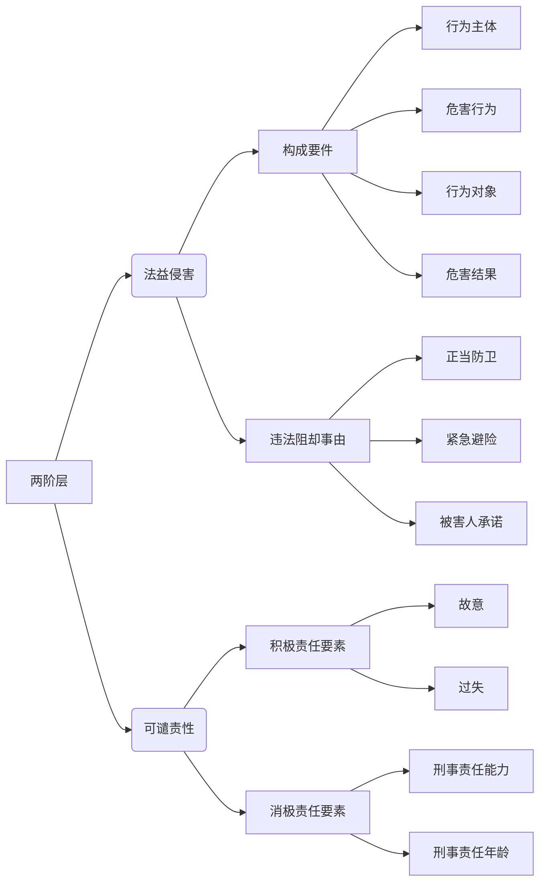

# 犯罪构成体系

## 犯罪构成体系的不同观点

人类的理性是有有限的, 所有的构成要件理论, 都是为了解决如何定罪的问题, 具有相对的合理性, 同样也具有一定的缺陷

### 平面式的四要件理论

一荣俱荣, 一损俱损, 分为主体, 客体, 主观方面, 客观方面. 

无法解决共犯问题: 13岁男孩和18岁男孩实施性侵, 按四要件, 是一人犯罪, 不属于共同犯罪, 13岁不构成犯罪, 18岁构成. 无法解决正当防卫问题: 精神病砍人, 反击是否犯罪? 因为是精神病人, 主体就不符合, 所以不是犯罪行为, 不能正当防卫. 智能紧急避险, 紧急避险呢他说保全的利益,必须要大于啊这个损害的结果.正当防卫呢可以大于也可以小于. 所以按照四要件就只能是紧急避险.

### 递进式的三阶层:
1. 构成要件: 包括主观构成要件和客观构成要件
2. 违法阻却事由
3. 责任阻却事由

### 递进式的二阶层

把三阶层的主观部分放在有责性里讨论. 缺点是: 二阶层: 客观不法, 主观有则, 在共犯可能存在问题, 共同过失也属于共同犯罪.

## 构成要件进一步分类:

1. 基本构成要件: 刑法分则关于某个犯罪主观和客观要素的规定, 比如故意杀人罪🚪刑法_232, 主观上要求故意, 客观上有杀人行为并致死
2. 修正构成要件: 主观上想杀人, 客观上没把人杀死, 要参考总则犯罪未遂的规定. 总则把分则的条款修改了, 就叫修正的构成要件. 同样的总则共同犯罪也是修正构成要件.

1. 封闭的构成要件: 刑法完整规定了犯罪构成的所有要素, 司法机关不需要进行补充
2. 开发性的构成要件: 司法机关需要补充, 比如不作为犯

1. 积极构成要件要素: 入罪的要素
2. 消极构成要件要素: 出罪的要素, 如🚪刑法_389, 因被勒索给予国家工作人员以财务, 没有获得不正当利益, 不是行贿

1. 描述性构成要件要素: 司法机关不需要进行价值判断, 比如故意杀人, 什么叫人, 拐卖妇女儿童, 什么叫妇女儿童
2. 规范性构成要件要素: 司法机关需要进行价值判断, 比如什么叫淫秽物品
    1. 社会评价要素: 淫秽物品, 威胁
    2. 经验法则: 以危险方法危害公共安全, 要足以危及公共安全, 什么样的程度算足以
    3. 法律评价要素: 比如什么叫国家工作人员, 什么叫司法工作人员

✨法律的概念具有模糊性, 跟人类的理性有关, 因为人是有限的, 所以设计出来的概念有一定的模糊性.

1. 不成文的构成要件: 🚪刑法_266, 没有写非法占有, 就是不成文的构成要素
2. 成文的构成要件: 🚪刑法_193集资诈骗罪, 明确说以非法占有为目的, 就是成文的构成要素

## 二阶层构成要件理论

犯罪构成体系区分违法与责任的要素，认为`构成犯罪的是行为`，`受到处罚的是行为人`，前者回答刑法禁止什么的违法性问题，后者回答能否处罚行为人的有责性问题。

### 犯罪构成体系的分类

根据违法性判断的标准不同，又分为`行为无价值论`与`结果无价值论`的犯罪构成体系。`故意、过失、目的与动机`是`违法的要素还是责任的要素`，这是行为无价值论与结果无价值论的显著区别。

刑法中的行为无价值，是指行为人的行为，违反刑法规范，应受到谴责。比如，伤害行为、盗窃行为、诈骗行为、杀人行为等，这些行为都是无价值的，应受谴责的。其实，所谓的无价值，是指在负值以下。行为无价值偏向于主观，而结果无价值更多的偏向于客观。

1. 行为是人格的表现，行为无价值，是对行为人人格的评价，也就是行为人某一行为方面的人格无价值。
2. 结果无价值，就是造成的结果不值得赞赏，应受谴责。🍐杀死了人、盗窃5000元的财物、强奸既遂、放火烧毁了房屋、投毒药死了十人等，这些结果都是无价值的，应受谴责的。结果无价值是对客观的评价。

#### 行为无价值论的二分体系(少数)

认为违法阶层包含`客观行为与主观意识`。

1. 违法阶层，包含`客观违法要素`（即危害行为、行为对象、危害结果、定罪身份与因果关系等内容）、`主观违法要素`（即故意与过失的罪过心理、目的与动机等内容）以及`违法阻却事由`(即正当防卫、紧急避险与其他违法阻却事由等内容)
2. 有责性，包含责任能力、刑事法定年龄、期待可能性与违法性认识的可能性等内容

#### 结果无价值论的二分体系(多数)

认为违法的要素`仅限于客观的要素`，主观方面的内容（故意、过失、目的、动机）不属于违法的要素，而是属于责任的要素

1. 违法性，包含`构成要件符合性`（即危害行为、行为对象、危害结果、因果关系、定罪身份等内容）与`违法阻却事由`（正当防卫、紧急避险与其他违法阻却事由）
2. 有责性，包含`积极的责任要素`（故意与过失的罪过心理、目的与动机）与`消极的责任要素`(责任能力、刑事法定年龄、期待可能性、违法性认识的可能性)

### 结果无价值论拓展

#### 事实判断和价值评价
对一件事物的判断分为两个步骤：
1. `事实判断`
2. `价值评价`
   
🍐`今天下雨了`, 这是`事实判断`; `下雨天真糟糕`，这是`价值评价`。`这个人真是个坏人、罪犯！`这是价值评价.

判断一个人的行为是否构成犯罪，也要分两个步骤:
1. 先进行事实判断(`客观违法阶层`)，看行为人有无制造法益侵害的事实
2. 然后进行价值评价(`主观责任阶层`)，就其制造的法益侵害事实而言，能否谴责行为人，对其作出否定评价

#### 判断犯罪的阶层顺序
`客观违法阶层`和`主观责任阶层`, 具体如下:

1. 客观违法阶层
    1. `客观要件`
        1. `危害行为`
        3. `危害结果`
        4. `因果关系`
    2. `违法阻却事由`, 如正当防卫、紧急避险、被害人承诺等

    🍐甲杀了乙，首先在客观要件上，存在`行为主体`（甲）、`危害行为`（杀人）、行为对象（乙）、`危害结果`（乙死亡）、`因果关系`（乙死亡是由甲的行为导致的），因此甲的行为暂时被判断为具有法益侵害性, `客观要件成立`。但是，接下来调查发现甲杀乙属于`正当防卫`，那么最终认为甲的行为不具有法益侵害性。

2. 主观责任阶层
    1. `主观要件`
        1. `故意`
        2. `过失`
        3. `意外与不可抗力`
        4. `事实认识错误`
    2. `责任阻却事由`, 责任年龄, 责任能力, 违法性认识可能性、期待可能性

    🍐甲为了复仇杀了乙，首先在`客观`上具有了`法益侵害性`，其次在`责任阶层`上因为`存在故意`。但是经查证，甲的年龄只有10周岁，未达到`责任年龄`，刑法无法谴责他；或者甲是完全的`精神病患者`，无`责任能力`, 刑法也无法谴贵他。因此，甲`不用负刑事责任`。

#### 题目

甲将`面粉冒充海洛因`欺骗乙，让乙出卖，然后二人`均分所得款项`。乙出卖后获款4000元，但在未来得及分赃时，被公安机关查获。对甲乙该如何处理？

1. 对于乙:
    1. 是否构成贩卖毒品罪?
        1. 结果无价值论: 乙的行为虽然形式上是在贩卖毒品，但是由于实际上不是毒品，而是头痛粉，因此乙没有贩卖毒品的可能性和危险性，没有侵犯毒品犯罪的法益的危险性，因此，客观上不属于贩卖毒品的行为，不构成贩卖毒品罪。虽然乙主观上有贩卖毒品的故意，但是定罪的顺序应当先看客观行为。
        2. 行为无价值论: 乙主观上有贩卖毒品的故意，客观上也有贩卖毒品的行为，因此构成贩卖毒品罪，由于没有贩卖成功，所以构成贩卖毒品罪未遂。但是这种看法有误。
    2. 是否构成诈骗罪?
        1. 在客观违法阶层乙是“实行犯”，乙主观上没有实施诈骗罪的故意，因此最终不构成诈骗罪。

2. 对于甲:
    1. 是否构成贩卖毒品罪
        1. 结果无价值论: 同上
        2. 行为无价值论: 主观没有, 不构成
    2. 是否构成诈骗罪
        1. 甲虽然欺骗乙，但不是欺骗乙的`钱财`，因此对乙`不构成诈骗罪`。
        2. 甲欺骗乙，主要是想利用乙的不知情，利用乙实施贩卖毒品罪的故意，让乙充当了自己实施诈骗罪的工具去诈骗买家。甲是诈骗罪的间接正犯。在客观违法阶层，甲乙构成诈骗罪的共同犯罪，甲是教唆犯，乙是客观违法阶层的“实行犯”。甲既构成诈骗罪的间接正犯，又构成诈骗罪的教唆犯，就高不就低，最终认定为诈骗罪的间接正犯。

❓购买海洛因的钱财也受到法律保护吗?被欺骗人购买海洛因, 本身不也违法吗?

