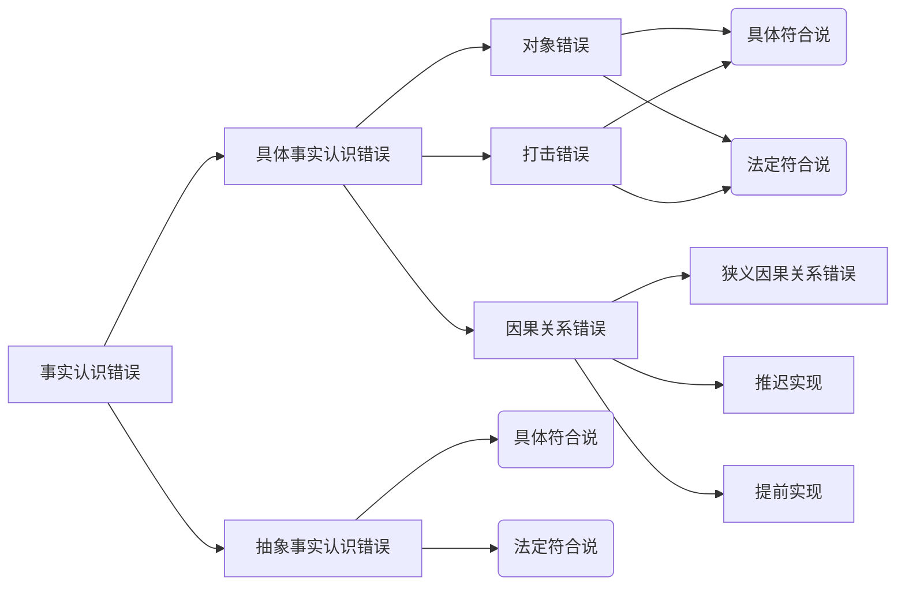

# 犯罪构成_责任阶层_认识错误

## 最佳实践
1. 主客观同时存在原则(行为与责任同时存在)
2. 主客观相统一原则: 认识错误
1. 具体事实认识错误(同一犯罪构成内)
    
    1. 对象错误: 
        1. 普通罪名中具体符合说法定符合说结论一致🚪17主观_1
        2. 选择罪名具体符合说分类判断, 法定符合说具体判断.
    
    2. 方法错误: 🚪17主观_1
        1. 具体符合说分类讨论, 法定符合一故意: 故意杀人未遂, 过失致人死亡
        2. 法定符合数故意: 故意杀人未遂, 故意杀人罪
        3. 非难重点说: 不成立犯罪, 故意杀人罪
        4. 因为仅有一个杀人, 一个杀人故意, 所以观点非难重点说更具有合理性

    3. 因果关系认识错误
        1. 狭义的因果关系认识错误. `因果关系认识错误不影响故意的认定`
        2. 结果的提前发生(事后故意)❤️🟥🍐下药勒死案🚪15主观_1_1, 
            客观阶层没有分歧, 主观上上有分歧(预备, 无既遂的故意, 有既遂的故意)
            
            1. 前行为
                1. 已经着手: 
                    1. 故意(间接)杀人罪, 因果关系认识错误不影响故意的认定
                    2. 故意杀人罪未遂 + 过失致人死亡罪, 想象竞合
                2. 尚未着手: 故意杀人罪预备 + 过失致人死亡, 想象竞合
            2. 后行为
                1. 但有观点认为，该行为客观上不可能侵犯他人生命，属于`不可罚的不能犯`，不成立犯罪（此为通说）
                2. 有观点认为，该行为属于违法行为，但因`偶然原因不能致人死亡`，成立`故意杀人罪未遂`
        
        3. 结果的推迟发生(事前故意)❤️🟥🍐杀人毁尸案🚪19主观_1, 16主观_2
            1. 毁尸行为是介入因素不异常, 没有切断前行为和死亡结果的因果关系, 而`因果关系认识错误不影响故意的认定`
            
            2. 毁尸行为介入因素异常, 切断了切断前行为和死亡结果的因果关系, 各个行为分别分析.

2. 抽象事实认识错误(不同犯罪构成间)❤️🟨🚪21主观_1, 🚪18主观_3
    1. 主客观无重合内容: 抽象符合说分别判断轻罪的既遂重罪的过失或重罪的未遂轻罪的`既遂`;`法定符合说主客观不一致不成立犯罪`.
    2. 主客观有重合内容: 抽象符合说分开讨论`可能多罪`; 法定符合说仅在主客观统一范围内`一罪`.🚪17主观_1

## 主客观同时存在原则(行为与责任同时存在)

## 主客观相统一原则: 认识错误

认识错误包括事实上的错误和法律上的错误

1. 事实上的错误: 猫头鹰是小鸡
2. 法律上的错误, 也称评价的错误: 知道这是猫头鹰, 但认为猫头鹰不保护

## 事实认识错误

事实认识错误分为具体的事实认识错误与抽象的事实认识错误

1. 具体的事实认识错误: 也叫`同一犯罪构成内`的错误. 🍐想杀甲杀了乙, 主观上想杀人, 客观上也杀了人, 没有超越故意杀人这个构成要件

2. 抽象的事实认识错误: 也叫`不同犯罪构成间`的错误. 🍐想偷钱, 偷了枪. 前者是盗窃罪, 后者是盗窃枪支罪.

## 具体事实认识错误

### 基本概念

`具体事实认识错误`，又称`同一犯罪构成内`的错误，即行为人所认识的事实与现实所发生的事实虽然不一致，但`没有超出同一犯罪构成`的范围.

### 对象错误

行为人误把甲对象当作乙对象加以侵害，而甲对象与乙对象体现相同的法益，行为人的认识内容与客观事实仍然属于同一犯罪构成的情况。

1. 在对象错误中，具体符合说与法定符合说的结论一致，即该错误不影响犯罪故意的认定，只成立故意犯罪一罪。
    🍐甲开枪打乙, 乙死了, 后来发现不是乙, 是丙. 主观上甲搞错了, 客观上也打错了.
    
    1. 甲的行为属于具体事实认识错误中的对象错误, 主要存在以下观点:
    2. 古老的具体符合说: 认为具体到个人, 构成故意杀人的未遂和过失致人死亡罪, 但是问题是刑法没有规定故意杀乙罪, 只规定了故意杀人罪
    3. 具体符合说，只需要具体到人的程度, 不需要具体到乙的程度. 主观上你想杀掉你前面这个具体的人, 客观上你杀掉这个人, 主客观相统一, 成立故意杀人的既遂
    4. 法定符合说，不关注具体的人, 只关注抽象的人, 主观上想杀人, 客观上人也死了, 主客观相同, 成立故意杀人的既遂

    > [!tips]
    > 刑法没有规定故意杀具体人的错误, 只规定了故意杀人, 只要是人符合该罪构成, 故具体符合说和法定符合说的结论是一致的

2. 例外: 选择性罪名, 按照具体符合说，有的案件会得出不同的结论
   
   🍐甲误将15周岁的少女当作13周岁的男童而拐卖给他人。

    1. 甲的行为属于具体事实认识错误中的对象错误, 主要存在以下观点:
    2. 按照具体符合说，行为人想拐卖的是`男童`，但事实上却拐卖了`妇女`；儿童与妇女虽然都是人，但是🚪刑法_240（拐卖妇女、儿童罪）并没有使用`人`这个上位概念。所以，按照具体符合说，甲构成拐卖儿童罪未遂（或者不能犯），对拐卖妇女属于过失，不构成犯罪。
    3. 按照法定符合说，无论拐卖儿童还是妇女，均成立拐卖妇女、儿童罪，由于实际拐卖了妇女，故甲成立拐卖妇女罪既遂。
    4. 显然，法定符合说更具有合理性。

### 打击错误(方法错误, 行为误差)

概念: 由于行为本身的差误，导致行为人所欲攻击的对象与实际受害的对象不一致的情况，但这种不一致仍然`没有超出同一犯罪构成`。

🍐甲意图杀乙，因未瞄准乙而打死附近的丙。

甲的行为属于具体事实认识错误的打击错误。存在不同观点：

1. 观点一认为，按照`具体符合说`，甲对乙构成`故意杀人罪未遂`；对丙缺乏杀人故意，仅构成过`失致人死亡罪`，属于想象竞合犯，从一重罪论处。该观点尊重甲仅有一个杀人故意的事实，但最终甲无法承担杀人既遂的责任，无法实现罪刑相适应原则。
2. 观点三认为，按照`法定符合说中的一故意说`，甲对乙构成故意杀人罪未遂，对丙构成过失致人死亡罪，二者属于想象竞合犯。该观点与具体符合说的结论一致，具有类似的不足。
3. 观点二认为，按照`法定符合说中的数故意说`，甲对乙构成`故意杀人罪未遂`，对丙构成`故意杀人罪既遂`，因为甲以杀人故意实施的行为，对导致他人死亡的结果均存在杀人故意，二者属于想象竞合犯。该观点的处理结论合理，但无法解释行为人甲对乙、丙均具有杀人故意。
4. 观点四认为，按照`非难重点说`，甲以杀人故意，发生了丙死亡的实害结果，甲应对丙承担故意杀人罪既遂的刑事责任。因甲仅有一个杀人行为、一个杀人故意，故甲对其他人无法认定故意犯罪，仅存在过失，而甲对乙未导致其他实害结果，故不构成犯罪。

5. 相比较而言，该观点避免了前述其他观点的不足，更具有合理性。

> [!tips]
> 1. 具体符合说就是分类讨论
> 2. 法定符合说一故意说和具体符合说一样, 数故意说, 是将故意复制了一份给意外伤害的人
> 3. 非难重点说将故意转移给意外伤害的人

🍐甲将丙的照片交给乙，让乙杀丙，但乙误将丁当成丙予以杀害。如何评价甲、乙的行为？

1. 甲教唆乙杀丙，但乙误将丁当作丙杀害，乙属于具体事实认识错误中的对象错误，无论按照法定符合说还是具体符合说，乙对丁都成立故意杀人罪既遂。
2. 对甲而言，甲教唆乙杀丙，甲在乙实施杀人行为时不存在对象错误，是由于乙的行为导致了实际的侵犯结果与甲期望的结果不一样，属于方法错误。
    1. 按照具体符合说，甲对于丁的死亡不存在杀人故意，如果甲对于乙杀死丁的事实存在过失，则可能成立过失致人死亡罪，否则属于意外事件。
    2. 按照法定符合一故意说，与具体符合说结论一致
    3. 按照法定符合数故意说, 甲对丁成立故意杀人罪既遂的教唆犯, 甲对丙成立故意杀人罪预备或未遂的教唆犯, 主要看乙是否对丙造成现实紧迫的危险.
    4. 按照非难重点说, 甲仅有一个教唆行为, 一个杀人故意, 故甲对其他人无法认定故意犯罪，仅存在过失，而甲对乙未导致其他实害结果，故不构成犯罪。甲仅对丁成立故意杀人罪既遂的教唆犯.

## 抽象的事实认识错误

`抽象的事实认识错误`，又称`不同犯罪构成间`的错误，即行为人所认识的事实与现实所发生的事实，分别属于不同的犯罪构成, 包括对象错误、方法错误，不存在因果关系错误。

### 抽象符合说与法定符合说案例

1. 主客观没有重合内容
    
    1. 抽象符合说: 

        1. 以轻罪的故意实现了重罪的事实时，是轻罪的既遂与重罪的过失的想象竞合。
        2. 以重罪的故意实现了轻罪的事实时，是对重罪的未遂（或不能犯）与对轻罪的故意犯的既遂，将二者合一按较重一方的罪（杀人罪）的未遂（在不能犯的场合，按毁坏财物罪的既遂）处断❓为何不是轻罪的过失
    
    2. 法定符合说:
    
        `不同犯罪构成之间`的错误原则上阻却故意的成立或者仅成立故意犯罪未遂

    🍐甲将头痛粉冒充海洛因欺骗乙，让乙出卖`海洛因`，然后二人均分所得款项。乙出卖后获款4000元，但在未来得及分赃时，被公安机关查获。
    2. 甲利用不知情的乙实施了诈骗行为，甲成立诈骗罪的间接正犯。
    3. 乙主观上具有贩卖毒品的故意，客观上是诈骗行为
        1. 按照抽象符合说，乙成立贩卖毒品罪未遂（或主张不能犯）与诈骗罪既遂的想象竞合犯
        2. 按照法定符合说，乙的行为主客观不具有一致性，不成立犯罪

1. 主客观有重合内容
    1. 主观上想犯轻罪，客观上却触犯重罪

        抽象符合说: 只要主观上想实施重罪, 客观上实施的轻罪, 一律在轻罪的范围内重合
        法定符合说: `构成要件不同`，如果`犯罪是同质的`，那么，在重合的范围内，成立轻罪的故意既遂犯

        🍐甲想盗窃普通财物，客观上只盗窃了枪支。
        1. 按照抽象符合说，甲成立盗窃罪。
        2. 按照法定符合说，甲盗窃枪支的行为符合盗窃枪支罪的客观要件，同时也符合盗窃罪的客观要件（枪支也可以评价为财物），但主观上只有盗窃罪的故意，故甲在盗窃罪范围内主客观一致，成立盗窃罪；甲的行为不构成盗窃枪支罪，因为甲没有盗窃枪支的故意。

        🍐甲误将他人占有的财物当作遗忘物而非法据为己有。本案中，甲虽然在客观上实施的是盗窃行为（重罪），具有盗窃罪的违法性；但主观上仅具有侵占遗忘物（轻罪）的故意，缺乏盗窃罪的有责性；由于可以将他人占有的财物评价为遗忘物，故甲的行为在侵占罪范围内主客观一致，成立侵占罪。

    2. 主观上想犯重罪，客观上发生轻罪的结果。

        抽象符合说: 分开讨论
        法定符合说: 仅在轻罪上主客观统一

        🍐甲误将劣药当作假药而销售，造成严重后果。甲主观上是销售假药罪的故意，客观上是销售劣药罪的行为。
        1. 按照抽象符合说，甲成立销售假药罪未遂（或主张不能犯）与销售劣药罪既遂的想象竞合犯。
        2. 按照法定符合说，甲的行为在销售劣药罪范围内主客观一致，仅成立销售劣药罪。

    
    ✨ 这里的重罪轻罪是指同质的不同名称罪名, 抽象认识错误的法定符合说: **在A罪与A+B罪之间产生认识错误，无论是主观想犯A罪、客观犯了A+B罪，还是主观想犯A+B罪、客观犯了A罪，行为人在A罪的范围内都能做到主客观相一致，至少能构成A罪既遂**。如果还构成A+B罪的未遂，则想象竞合，择一重罪论处。
    1. 故意杀人罪→故意伤害罪
    2. 强奸罪→强制猥亵罪
    3. 绑架罪→非法拘禁罪
    4. 拐卖儿童罪→拐骗儿童罪
    5. 抢劫罪→抢夺罪，抢夺罪→盗窃罪，抢劫罪→盗窃罪，盗窃罪→侵占罪
    6. 盗窃枪支罪→盗窃罪
    7. 金融诈骗罪→诈骗罪
    枪支具备普通财物的所有特征(A),而且比普通财物还多了一个火药杀伤力的功能(B)。枪支与普通财物属于A+B与A的关系。枪支可以包容评价为普通财物。盗窃枪支罪可以包容评价为**普通盗窃**罪。
    🍐偷钱的故意偷了枪。
    12. 将盗窃罪作为大前提推理，甲客观上有**盗窃枪支**的行为，可以包容评价为盗窃**普通财物**的行为；甲主观上有**盗窃罪**的故意；所以甲构成**盗窃罪既遂**。
    13. 将盗窃枪支罪作为大前提推理，甲客观上**盗窃了枪支**，主观上只有**盗窃普通财物**的故意，因此**不构**成盗窃了枪支罪。
    🍐偷枪的故意偷了钱。
    14. 将盗窃枪支罪作为大前提推理，甲构成**该罪的未遂**。
    15. 将盗窃罪作为大前提推理，甲客观上是**盗窃普通财物**的行为，主观上有**盗窃枪支**的故意，可以包容评价为**盗窃普通财物**的故意，构成**盗窃罪既遂**。
    16. 想象竟合，择一重罪论处，一般定**盗窃枪支罪未遂**。

## 因果关系错误

行为人侵害的对象没有错误，但造成侵害的因果关系的发展过程与行为人所预想的发展过程不一致，以及侵害结果推后或者提前发生的情况。

### 狭义的因果关系错误

通说认为，`因果关系, 是危害行为和危害结果客观的联系, 不属于构成要件要素, 因此因果关系认识错误不影响故意的认定`，相应地，故意的认定不要求行为人明确认识客观行为因果发展的具体样态，而只要求认识到自己的行为会发生危害结果即可

🍐甲以杀人故意将乙推入井中，但井中无水，乙被摔死的，甲没有对象错误，也没有方法错误，但甲致使乙死亡的因果进程偏离了甲的认识，甲对乙的死亡存在故意，甲的杀人行为与乙的死亡之间存在因果关系，故甲对乙的死亡应成立故意杀人罪既遂。

二阶层的分析方法:

1. 客观阶层无因果关系, 🍐白雪公主吃毒苹果, 噎死, 毒液没进胃里起作用. 是**故意杀人罪未遂**.
2. 客观阶层有因果关系, 进主观阶层, 以为是A死法，实际是B死法。🍐将乙推入井里，欲淹死乙，井里没水，摔死了乙, **构成**故意杀人罪既遂。

### 结果的提前发生

行为人本想第二行为导致危害结果，但第一行为却导致了危害结果，即提前实现了行为人所预想的结果。前行为(计划杀人预备行为) + 后行为(计划杀人的实行行为), 前行为导致死亡结果

✨ 结果提前发生, 主要讨论的是着手的问题, 而不是介入因素问题, 因为结果提前发生了, 没有介入因素可言.

🍐(下药勒死)甲想杀害身材高大的乙，打算先用安眠药使乙昏迷（前一行为），然后勒乙的脖子（第二行为），致其室息死亡。由于甲投放的安眠药较多，乙吞服安眠药后死亡。

1. 甲的行为属于结果的提前发生
    1. 观点一认为:
        1. 甲的第一个行为`尚未着手`，只是为杀人而实施的`预备行为`，甲成立`故意杀人罪预备`。甲的第一个行为导致了乙的死亡，二者之间具有因果关系，
        2. `甲不承担故意责任，而应对致人死亡的事实承担过失的责任`，故甲`成立过失致人死亡罪，与故意杀人罪预备属于想象竞合犯`。
    2. 观点二认为:
        1. 甲的`第一个行为`具有导致乙死亡的`具体紧迫危险性`，该行为`导致了乙的死亡`，二者之间具有刑法上的`因果关系`。
        2. 甲在实施该行为时，`明知自已的行为可能导致乙死亡，仍然实施该行为，至少放任乙的死亡`，表明甲具有`杀人既遂的故意`。
        3. 客观的`因果发展进程与行为人预想的因果进程不一样`，这属于`因果关系错误`，`而因果关系错误不属与犯罪构成要素, 不影响故意的认定`，故甲成立故意杀人罪既遂一罪。
    3. 观点三认为
        1. 甲的`第一个行为`具有导致乙死亡的`具体紧迫危险性`，该行为`导致了乙的死亡`，二者之间具有刑法上的`因果关系`。
        2. 甲在实施该行为时并无以此剥夺乙生命的故意，即`缺乏既遂的故意`，故`成立故意杀人罪未遂`。
        3. 甲对于第一个行为致使乙死亡`至少存在过失的罪过心理`，应承担`过失致人死亡罪的责任`，`与故意杀人罪未遂属于想象竞合犯`。

    > [!tips]
    > 第二个行为无所谓有无

2. 至于甲以杀人故意意图让乙安眠药中毒死亡，但实际上乙已经死亡，故甲的行为属于对象不能犯。
    1. 有观点认为，该行为属于违法行为，但因`偶然原因不能致人死亡`，成立`故意杀人罪未遂`
    2. 但有观点认为，该行为客观上不可能侵犯他人生命，属于`不可罚的不能犯`，不成立犯罪（此为通说）

### 结果的推迟发生(事前故意)

行为人误认为第一个行为已经造成危害结果，出于其他目的实施了第二个行为，但实际上是第二个行为才导致预期的结果发生的情况。前行为(故意杀人, 重伤后以为死亡) + 后行为(抛尸导致死亡). 焦点在于第一行为与死亡结果是否存在因果关系。

✨ 结果提前发生, 主要讨论的是介入因素问题, 焦点在于第一行为与死亡结果是否存在因果关系。

🍐(杀人毁尸案)甲以杀人故意对乙实施了杀人行为，误以为乙已死亡，遂实施了毁尸灭迹的行为；证据表明，乙死于毁尸灭迹行为。

1. 甲的行为属于事前故意，存在不同处理意见:
2. 观点一(通说):
    1. 杀人后毁户灭迹的介入因素具有通常性(高概率事件)，不异常的, 没有切断前行为和死亡结果的因果关系, 因此甲的第一行为与死亡结果之间具有因果关系
    2. `客观的因果发展进程与行为人预想的因果进程不一样，这属于因果关系错误`，而`因果关系错误不属与犯罪构成要素, 不影响故意的认定`，故应以`故意杀人罪既遂一罪论处`。
3. 观点二，甲的第一行为成立故意杀人未遂，第二行为成立过失致人死亡罪；其中有人认为成立想象竞合犯，有人主张成立数罪。该观点尊重了案件客观事实，但违反了社会的一般观念：行为人以杀人的故意杀害了所要杀害的人，却成立杀人未遂
4. 观点三, 将甲的`前后两个行为视为一个行为`，将支配行为的故意视为概括的故意，故只成立一个故意杀人既遂。这种观点的处理结论合理，但歪曲了事实
5. 观点四，类似案件分两种情形：
    1. 如果甲在实施第二行为之际，对于死亡持间接故意，则整体上成立一个故意杀人既遂
    2. 如果在实施第二行为之际，相信死亡结果已经发生，则成立故意杀人未遂与过失致人死亡罪
    该观点存在疑问：客观事实完全相同，只因行为人是否误信结果发生，就决定是否将行为分割为两个行为，缺乏理由

✨ 如果介入了异常、罕见、偶然的因素独立导致结果发生，则不属于事前故意。

🍐甲故意杀乙，误以为乙已经死亡，遂对乙实施“奸户”行为，但尸检报告表明：“奸户”行为导致乙死亡。本案中，杀人后的奸户行为属于异常、偶然、罕见的介入因素，并独立导致了死亡结果的发生，故甲的杀人行为与乙的死亡之间不存在因果关系，不属于事前故意的情形。甲成立故意杀人罪未遂、侮辱户体罪既遂与过失致人死亡罪（其中侮辱户体罪与过失致人死亡罪属于想象竞合犯），应当数罪并罚。

🍐甲意图杀死超市店员乙以劫取财物，遂使用暴力将乙打倒后取走店内财物；临走前为了破坏现场，放火焚毁超市，事后证明乙死于火灾。甲抢劫杀人的行为与乙的死亡是否具有刑法上的因果关系？甲的行为在刑法理论上被称作什么？有哪些不同的处理意见？

1. 甲以非法占有为目的，对被害人乙实施足以致死的杀人行为，压制了乙的反抗，强行取得财物，成立抢劫罪，同时成立故意杀人罪，属于想象竞合犯。
2. 甲为毁尸灭迹而实施放火行为，造成严重后果，成立放伙罪。事后证明，乙系死于甲的放火行为。甲误以为自已的抢劫杀人行为致使乙死亡，但实际上乙死于自已的毁尸灭迹行为，甲的行为属于因果关系错误中的事前故意。刑法理论上对此存在不同观点：
    1. 甲的行为成立抢劫（致人死亡）罪与故意杀人罪既遂的想象竞合犯，从一重罪论处，并与放火罪数罪并罚。理由如下：
        1. 甲的抢劫杀人行为制造了乙死亡的危险，是杀人的实行行为, 二者具有因果关系
        2. 乙死于甲的介入行为，即甲的毁尸灭迹行为。甲在抢劫杀人后实施毁尸灭迹行为，具有通常性，虽然该介入因素致使乙死亡，也应将乙的死亡结果归属于甲的抢劫杀人行为
        3. 甲成立抢劫（致人死亡）罪与故意杀人罪既遂的想象竞合犯，与放火罪数罪并罚
    2. 甲的抢劫杀人行为与乙的死亡之间不存在因果关系，甲成立抢劫（致人死亡）罪未遂与故意杀人罪未遂的想象竞合犯，从一重罪论处，并与放火罪数罪并罚，而乙的死亡结果应归属于甲的放火行为。
3. 甲抢劫杀人后，为毁尸灭迹、破坏现场，实施放火行为，造成严重后果，具有毁灭、伪造证据的属性，但本犯实施毁灭、伪造证据的行为不具有期待可能性，不成立犯罪；但该行为同时成立放火罪，不仅侵犯了新的法益，而且具有期待可能性，应当定罪处罚，与先前的犯罪数罪并罚。

## 其他事实认识错误

### 违法阻却事由的认识错误

1. 假想的正当行为。假想的正当行为，不属于违法性认识错误，而是事实错误，阻却故意。如果行为人主观上存在过失，则成立过失犯罪，否则属于意外事件。

2. 利用假想正当行为的情形。如果甲明知乙假想防卫而故意“帮助”乙的，甲的行为属于利用乙的过失行为（或者意外事件）的间接正犯。当然，如果甲的行为不符合间接正犯的成立条件，可能乙的违法行为的帮助犯（乙的行为属于违法行为，因为故意不属于违法要素）

### 故意与认识错误认定中的几个特殊问题

1. 选择性罪名中选择性事项间的错误。发生在选择性罪名内的错误，视为具体的事实错误，按照法定符合说处理，不影响故意的认定与既遂的成立。🍐误以为是枪支而盗窃，但客观上盗窃了弹药的，成立盗窃弹药罪既遂（可谓具体的对象错误）。

2. 同一犯罪的不同加重构成要件之间的认识错误。应视为具体的事实认识，按照法定符合说处理，不影响故意的认定与加重法定刑的适用。🍐误将抢险物资当作为军用物资，或者误将军用物资当作金融机构资金抢劫的，不影响加重法定刑的适用（可谓具体的对象错误）。

3. 同一犯罪的普通构成要件与加重构成要件之间的认识错误。按照抽象的事实认识错误处理，只能认定为普通情形。🍐以为是普通财物而抢劫，但事实上抢劫了军用物资的，只能认定为普通抢劫罪，而不能适用加重的法定刑。

## 案例

🍐林业果树研究所投资40万元，历经10年培育研制葡萄新品种，一共种植110株，每株分别编号跟踪研究，9月份为果实成熟期，对该品种的鉴定、验收定在2003年9月。但甲等四人于2003年8月某晚翻墙进入该研究所内，偷摘了其中10株果实，导致整个研究链断裂。甲等四人的行为是否成立盗窃罪？为什么？
1. 甲等四人不成立盗窃罪。其理由存在两种观点：
2. 观点一认为，甲等四人盗窃葡萄的价值尚未达到数额较大的标准，因其不符合资窃罪的违法构成要件，不成立盗窃罪。
3. 观点二认为，甲等四人实际盗窃了数额巨大的财物，但甲等四人在实施盗窃行为时没有认识到财物价值数额较大，缺乏盗窃罪的故意，因而不成立犯罪。

🍐甲（20周岁）、乙（15周岁）为勒索财物，将一小孩丙（5周岁）控制。但由于丙无法准确说出家里的联系方式，致使甲、乙二人不知道向谁索要财物。

1. 乙唆使甲不如将孩子杀掉，甲遂将丙杀死，随后甲、乙被抓获。如何评价甲、乙的行为？

    甲成立绑架罪，属于绑架杀害被绑架人的结合犯；乙对绑架罪不负刑事责任，仅成立故意杀人罪既遂；甲、乙在故意杀人罪范围内成立共犯。

2. 如果仅导致丙重伤，如何评价甲、乙的行为？

    如果仅导致丙重伤，则乙成立故意杀人罪未遂，甲的行为性质存在分歧：观点一认为，甲属于绑架杀害被绑架人的结合犯，同时适用未遂的规定；观点二认为，甲属于绑架伤害被绑架人致使其重伤的结合犯。

3. 如果导致丙轻伤，又该如何评价甲、乙的行为？
    
    如果导致丙轻伤，则乙成立故意杀人罪未遂，甲的行为性质存在分歧：观点一认为，甲属于绑架杀害被绑架人的结合犯，同时适用未遂的规定；观点二认为，甲属于绑架罪与故意杀人罪未遂，应当并罚。
