# 共同犯罪

## 最佳实践

1. 角色分类:
    1. 直接正犯: 行为人直接实施行为造成法益侵害
    2. 间接正犯: 行为人通过支配他人实施行为造成法益侵害❤️🟨🚪19主观_4
    3. 共犯: 行为人引起他人实施行为造成法益侵害
        1. 教唆犯❤️🟨🚪12主观_4
        2. 帮助犯

    教唆犯、帮助犯与间接正犯不是对立关系，而是包容关系

2. 共犯的从属性: 将正犯的犯罪行为归属于共犯(解决客观阶层的因果关系问题)❤️🟨🚪18主观_3, 🚪20主观新_1~2
3. 共同犯罪理论:
    1. 成立条件: 客观上有行为的分担，主观上有意思的联络❤️🟨🚪20主观_7, 🚪12主观_3
        1. 事前共谋: 为犯罪行为的实施提供了`物理和心理`的作用. 如果是仅共谋则仅有心理的作用.❤️🟨🚪19主观_1
        2. 事中参与: `承继的共同正犯, 客观上先前行为仍在持续，主观上后行为人存在共犯意思(事前没有共谋), 仅对参与后的行为负责`❤️🟨🚪19主观_4, 🚪16主观_3
        3. 事后帮助: 
            1. 前行为既遂后, 不可能是共同犯罪. 对象是`犯罪人`，构成`窝藏、包庇罪`; 对象是`赃物`，构成`掩饰、隐瞒犯罪所得罪`;对象是`证据`，构成`帮助毁灭、伪造证据罪`
            2. 如果是, 则数罪并罚或者认定不可罚的事后行为.
        4. 中途退出: 要求消除物理和心理的影响, 负责不能脱离共犯关系. ❤️🟨🚪20主观_6, 🚪15主观_3_
    2. 违法阶层:`因果归属: 部分实行, 全部负责`❤️🟨🚪20主观_7
    3. 责任阶层:`责任具有独立性, 分别处理`
4. 过失的共同犯罪:观点分歧是要求有主观故意, 还是仅要求有意思联络🍐两人杀猪伤人案❤️🟥🚪18主观_3
5. 片面的共同犯罪:🍐压制方法帮助盗窃案 ❤️🟥
    1. 片面共犯，是指参与同一犯罪的人中，一方认识到自己是在和他人共同犯罪，而另一方没有认识到有他人和自己共同犯罪。
    2. 片面共犯仅对知情的一方适用共犯的处罚原则，对不知情的一方不适用共犯的处罚原则
6. 实行过限❤️🟨🚪20主观新_2, 🚪12主观_4

## 共犯分类

### 对法益侵害的方式区分

1. 正犯(共同正犯, 间接正犯)
2. 教唆犯
3. 帮助犯

### 在犯罪中起到的作用区分
1. 主犯
2. 从犯
3. 胁从犯

## 方法技巧

两人以上实行的犯罪行为, 可能两个人都有罪, 也可能只有一个人有罪.

在分析共同犯罪的案例时，应遵循如下分析思路：

1. 首先，按照违法层面的共犯理论，判断是否存在符合构成要件且违法的行为，认定正犯（包括共同正犯），确定正犯之后，就必须将结果或者危险结果归属于正犯行为。
2. 其次，按照共犯从属性原则，判断哪些参与人的行为与正犯结果之间具有因果性，只要有因果性，就可以肯定其为不法层面的共犯。
3. 再次，判断各参与人的责任（如刑事法定年龄、责任能力、故意内容等），进而确定参与人所触犯的罪名。
4. 最后，按照我国刑法关于主犯、从犯、胁从犯、教唆犯的处罚原则，分别给予参与人量刑。

## 🍐
🍐甲（男，20周岁）、乙（男，15周岁）、丙（男，13周岁）共润控制丁女后图轮奸丁女。乙、丙奸淫丁女之后，甲放弃了奸淫行为。分析界乙、丙的刑事任。

1. 甲、乙、丙三人共同对丁女实施强奸行为，乙、丙奸淫了丁女，属于轮奸情节。甲、乙、丙三人在强奸违法事实层面成立共同犯罪，应将轮奸既遂的违法事实归属于甲、乙、丙三人。

2. 虽然丙没达到刑事法定年龄，对强奸行为不负刑事责任，即不成立犯罪，但不影响强奸罪共同犯罪的认定，因为这里的“共同犯罪”是指“共同实施违法行为”。

3. 甲、乙二人达到刑事法定年龄，具有责任能力，应对强奸罪承担刑事责任，属于轮奸既遂的情形。

4. 至于甲放弃奸淫行为的，不成立强奸罪中止，因为甲参与实施了强奸（轮奸）罪既遂的违法事实，为强奸（轮奸）既遂的事实提供了重要作用，属于共同正犯，按照部分实行全部责任的原则，甲应当承担强奸（轮奸）罪既遂的刑事责任。因乙未满18周岁，不得判处死刑，而且应当从轻或者减轻处罚。

🍐甲欲杀丙，假意与乙商议去丙家“盗窃”，由乙在室外望风，乙照办。甲进入丙家将丙杀害，出来后骗乙说未窃得财物。乙信以为真，然离去。甲、乙是否成立共犯？为什么？
1. 甲非法侵入丙的住宅，然后实施了杀人行为，成立非法侵入住宅罪与故意杀人罪既遂；但二者之间具有类型性的手段与目的关系，属于牵连犯，应当择一重罪故意杀人罪既遂论处。甲对乙谎称盗窃财物，但甲并未实施盗窃行为，故不成立盗窃罪。
2. 乙以帮助甲盗窃财物的故意而为其实施了望风行为，甲实际上并未实施盗窃行为，按照共犯从属性理论，乙不成立盗窃罪的帮助犯。甲实施了故意杀人行为，乙为甲的杀人行为提供了客观上的帮助行为，也起到了心理的帮助作用，但乙缺乏帮助杀人的故意，对乙不能以故意杀人罪的共犯论处。但乙为甲非法侵入住宅的行为提供了心理帮助，主观上也有帮助的故意，故乙成立非法侵入住宅罪的共犯。

🍐甲指着丙家门口的石狮子对乙说：“这是我家的财物，卖给你。”乙明知是丙的财物，仍然支付1万元后将石狮子运走。分析甲、乙行为的刑事责任。

1. 乙以非法占有为目的，故意非法转移了丙家财物的占有，成立盗窃罪既遂，属于直接正犯。

2. 甲本想利用乙盗窃丙家的财物，具有盗窃罪间接正犯的故意，但客观上只是引起了乙实施盗窃罪的违法行为，是盗窃罪的教唆行为，甲的行为属于不同共犯形式之间的认识错误，按照法定符合说，甲的行为成立盗窃罪的教唆犯。❓
3. 同时，甲以非法占有为目的，意图骗取乙的财物，乙识破了骗局后仍然给予甲财物的，甲成立诈骗罪未遂。甲的同一行为，既成立盗窃罪的教唆犯，还成立诈骗罪未遂，属于想象竞合犯，从一重罪论处。

🍐甲、乙约好在餐馆吃饭。先到的甲发现邻桌的丙上洗手间时将手包放在座位上，遂对刚进来的乙说：“这是别人的包，快拿好，咱们换个餐馆吃饭。”乙却误以为这是甲的包，并认为是甲让自已帮其拿着，遂将手包拿着，与甲一起离开。结合共犯从属性理论，分析乙的行为属于或者不属于违法行为对甲的行为的影响。

1. 共犯从属性理论是解决教唆犯、帮助犯违法性根据和来源的理论而不是解决教唆犯、帮助犯的责任从属性问题，因为对于犯罪人的责任问题，应当独立判断，无所谓从属于正犯的问题。

2. 按照结果无价值论，违法性的判断是客观的判断，因为只有客观事实才可能侵犯法益，故意、过失的主观认识等不可能侵犯法益。乙客观上转移了他人财物的占有状态，属于盗窃罪的违法行为，但乙主观上没有犯盗窃罪的故意，故乙不成立犯罪。按照共犯从属性理论，甲的行为引起了乙实施盗窃罪的违法行为，无论乙是否承担刑事责任，都应将乙的违法事实归属于甲，甲对此应承担教唆犯的刑事责任，即甲成立盗窃罪既遂的教唆犯。

3. 按照行为无价值论，只有故意或者过失罪过心理支配下实施刑法禁止的行为，才属于刑法上的违法行为。乙因缺乏犯罪故意或者过失，其实施的盗窃行为不属于刑法上的违法行为。甲唆使乙实施盗窃行为，不属于教唆他人实施违法行为，甲不成立盗窃罪的教唆犯。同理，甲也不可能成立盗窃罪的帮助犯。要认定甲成立犯罪，只有认定甲属于盗窃罪的正犯。但甲没有直接实施转移财物占有的行为，不可能成立盗窃罪的直接正犯，唯有认定甲支配、控制了乙的行为，即甲成立盗窃罪的间接正犯，才能认定甲成立盗窃罪。但这种观点无视甲主观上只有教唆乙实施盗窃行为的故意，故并不可取。

🍐甲在乙骑摩托车必经的偏僻路段精心设置路障，欲让乙摔死。丙得知甲的杀人计划后，诱骗仇人丁骑车经过该路段，丁果真摔死。根据刑法规定和刑法理论，分析甲、丙行为的刑事责任。

1. 甲为杀乙，实施了足以导致乙死亡的杀人行为，而该行为直接导致了丁的死亡。没有甲的行为，就不会有丁的死亡，甲的行为与丁的死亡之间存在“没有前者就没有后者”的条件关系；甲的行为制造了他人可能被路障摔死的危险，丁正是死于路障，该死亡结果是甲制造的危险现实化的结果，应将其归属于甲的杀人行为，故甲的行为与丁的死亡之间存在因果关系。

    如果认为甲设置路障属于故意杀人的预备行为，而当被害人经过该路段，有导致其死亡的紧迫、现实危险时，才是杀人行为的着手，则在杀人行为着手之际，甲误将丁当作乙杀害，甲的行为属于具体事实认识错误中的对象错误。无论按照具体符合说还是法定符合说，甲都对丁成立故意杀人罪既遂。

    如果认为甲设置路障就是杀人行为的着手，则甲对乙成立故意杀人罪未遂，对丁的死亡属于打击错误，按照法定符合说，甲对丁成立故意杀人罪既遂，与故意杀人罪未遂属于想象竞合犯；按照具体符合说，甲对丁仅成立过失致人死亡罪，与故意杀人罪未遂属于想象竞合犯；按照非难重点说，甲仅对丁构成故意杀人罪既遂。

2. 丙明知甲设置的障碍有导致骑车人摔死的紧迫、现实危险，还利用该障碍致使丁死亡，丙成立故意杀人罪既遂；而且丙之前预想的违法事实与客观的违法事实完全一致，不存在事实认识错误问题。但丙并未直接实施导致丁死亡的违法事实，而是利用了甲之前创设的危险障碍，丙在致使丁死亡的违法事实中起了决定性作用，故丙的行为有可能被认定为间接正犯。当然，本案中甲成立故意杀人罪的直接正犯，丙成立故意杀人罪的间接正犯，这并不矛盾。因为甲、丙对丁的死亡都起了决定性作用，但甲直接实施了致使丁死亡的行为，属于直接正犯，而丙并未直接实施致使丁死亡的违法行为，故属于间接正犯。

    当然，对丙的行为存在不同的处理意见，即认为对于丁的死亡而言，甲的行为起到了关键作用，而丙只是让丁从路障处经过，即丙仅对甲杀人的事实起到了辅助性作用，应成立故意杀人罪的帮助犯。

🍐甲明知丁打算到“莲花仓库”2号仓库盗窃，遂给予丁一把“万能钥匙”，随后邀请乙、丙为自已盗窃望风。乙误入“莲花仓库”旁边的“荷花仓库”2号库房外蹲了半夜。丁到现场后发现乙未到场，就问丙，丙表示不知情。丙在丁开锁时告诉丁，自己打算洗手不干了，然后离开现场。丁在开锁时发现“万能钥匙”无法使用，遂翻窗进入库房盗窃了一台冰箱。如何评价甲、乙、丙、丁的行为？

1. 丁以非法占有为目的，使用“万能钥匙”盗窃财物，因意志以外的原因未得逞的，成立盗窃罪未遂；丁转而翻窗进入库房盗窃冰箱的，成立盗窃罪既遂。丁既遂的违法事实吸收之前的未遂行为，仅成立盗窃罪既遂一罪。

2. 甲以帮助丁盗窃财物的故意提供了帮助行为，给了丁“万能钥匙”，但并未对丁盗窃既遂的违法事实起到物理的或者心理的帮助效果，不能将丁盗窃既遂的违法事实归属于甲；甲的帮助行为仅对丁盗窃未遂的违法事实起到了物理的帮助效果，故应将丁盗窃未遂的违法事实归属于甲，甲仅成立盗窃罪未遂的帮助犯。

3. 乙虽然实施了望风行为，也有望风故意，但乙走错了地方，对丁的盗窃行为没有起到物理的帮助效果；丁也知道乙未到现场，乙的行为对丁实施盗窃行为也没有起到精神的鼓舞或者心理的促进作用。故不能将丁的盗窃行为归属于乙，乙的行为属于帮助未遂。按照共犯从属性说，乙的行为缺乏违法性，不成立犯罪。

4. 丙为丁的盗窃行为望风，在丁盗窃既遂之前，丙表示退出犯罪，消除了帮助行为的影响，属于共犯脱离的情形，不能将之后丁盗窃既遂的违法事实归属于丙。由于丙脱离共犯的行为具有自动性，与既遂事实没有因果关系，故丙的行为成立盗窃罪中止。

🍐甲盗窃丙的财物，被发现后逃跑，丙追赶。甲逃跑途中遇见乙，告知乙真相，请乙帮助自已殴打丙、拦住丙。乙便对丙实施暴力，将丙打倒，致丙轻伤。分析甲、乙的行为性质。

事后抢劫不是身份犯，而是由两个实行行为构成的犯罪，即“犯盗窃、诈骗、抢夺罪”行为与“为窝藏赃物、抗拒抓捕或者毁灭罪证而当场实施暴力或者以暴力相威胁”的行为。因此，没有犯盗窃等罪的人，也能实施后行为（承继的共犯）。在共同犯罪的情况下，只要有人实施了实行行为即可，而不是所有的共犯人都必须实施实行行为。当甲实施了盗窃行为后，唆使乙对被害人丙实施暴力的，乙与甲就事后抢劫的部分实行行为具有共同的故意与行为，因而成立了事后抢劫罪的共同犯罪。换言之，在本案中，甲实施了前行为（犯盗窃罪）并教唆了后行为，乙实施了后行为（暴力行为），而且甲、乙对后行为具有共犯故意与共犯行为，后行为又是事后抢劫行为的一部分，故甲、乙成立事后抢劫的共犯。

有观点主张事后抢劫是一种真正的身份犯，即“犯盗窃、诈骗、抢夺罪”是对身份的要求，“当场实施暴力或者以暴力相威胁”才是事后抢劫的实行行为。据此认为，甲实施了盗窃罪行为，但未实施事后抢劫的实行行为，不成立事后抢劫罪；乙实施了暴力行为，但缺乏特定身份，不成立事后抢劫罪。但为了合理解决本案的定性问题，认为甲利用了缺乏身份的乙实施了暴力行为，甲成立事后抢劫罪的间接正犯，乙成立帮助犯。但这种观点并不合理：

1. 就单独的事后抢劫而言，如果仅着眼于行为人必须先实施盗窃行为，后出于特定目的实施暴力行为，则可以认为，实施暴力行为的主体必须是已经实施盗窃行为的人。在此意义上说，事后抢劫是身份犯。但是，一方面，任何人都可能实施盗窃、诈骗、抢夺罪，但这些犯罪并不是身份犯。另一方面，将事先实施盗窃作为身份看待，过于扩大了身份的范围。因为事后抢劫是一种独立的犯罪，由两个特定行为组成：两个行为之间，不仅具有时间与场合的密切性，而且具有心理的联系性。倘若将实施前行为作为身份看待，那么，由二个以上行为构成的犯罪（如普通抢劫、强奸等）都会被理解为身份犯。例如，根据上述观点，我国《刑法》第239条所规定的绑架杀人也属于身份犯（即绑架犯杀人的才成立绑架杀人）。这可能难以被人接受。

2. 事后抢劫依然属于财产犯罪，其实行行为必须具有侵犯财产的内容。倘若将犯盗窃等罪作为主体身份的要素对待，那么，事后抢劫的实行行为就只剩下暴力与以暴力威胁。可是，单纯的暴力与暴力威胁不具有财产犯罪的性质。只有将作为前行为的盗窃等行为理解为事后抢劫的实行行为，才能解释事后抢劫的财产犯罪性质。

3. 倘若认为事后抢劫属于身份犯，那么，作为前行为的盗窃等行为，只是表明身份的要素，而不是事后抢劫的实行行为的一部分。然而，身份的有无并不影响犯罪的既遂与未遂的区分，故作为前行为的盗窃既遂与否便与事后抢劫既遂与否无关。于是，当行为人犯盗窃等罪未遂时，为了抗拒抓捕或者毁灭罪证而当场实施暴力的，也成立事后抢劫罪的既遂。这显然与事后抢劫的既遂、未遂区分标准相冲突。

