# 共同犯罪_正犯

正犯是指对法益侵害起到支配作用的人。正犯并非仅存在于共同犯罪之中.

共同犯罪分为**实行犯(正犯), 教唆犯、帮助犯**, 从分工上看
正犯包括**直接正犯**和**间接正犯**, 从方式上看
正犯包括**单独正犯**(单独犯罪)和**共同正犯**(共同犯罪), 从数量上

 

1. 直接正犯

    行为人`直接实施`符合构成要件的`行为`并造成`法益侵害`、危险结果。直接正犯可能单独成立犯罪，也可能存在于共犯之中。

2. 间接正犯
    
    通过`支配``他人的行为``造成法益侵害`、危险结果。对此，应将被利用者的行为直接归属于间接正犯。

3. 共同正犯(两个正犯)
    
    共同对造成法益侵害、危险结果起实质的支配作用。按照`部分实行全部责任原则`，应将危害结果归属于所有参与共同正犯的人。

    > [!tips]
    > `共同正犯`指两个正犯
    > `共犯`指一个正犯, 和教唆犯或帮助犯, 比如`共犯从属性`的`共犯`

4. 同时正犯

    二人以上`没有共谋`同时侵犯同一法益。如果无法证明谁导致危害结果的，应当适用存疑时有利于行为人的原则。同时正犯不属于共犯，不适用共犯的原则。
    
    🍐甲、乙`没有共谋`同时向丙开枪，其中一发子弹导致丙死亡，但查不清是谁射出的子弹。本案就属于同时正犯，由于查不清是谁导致了丙死亡，按照存疑时有利于行为人的原则，不能将死亡归属于甲、乙的行为，甲、乙仅成立故意杀人罪未遂。
    🍐甲、乙`共谋`同时向丙开枪，其中一发子弹导致丙死亡，但查不清是谁射出的子弹。本案就属于共同正犯，甲、乙仅成立故意杀人罪既遂。

