# 教唆犯

## 最佳实践

1. 教唆犯, 引起犯意

## 概念

故意`唆使并引起`他人实施违法行为

## 成立条件

1. 教唆对象

    1. 教唆对象的法定年龄以及责任能力

        1. 限制从属性说认为，教唆对象可以是无责任能力的人，但要有一定规范意识的人，否则成立间接正犯(通说)
        2. 极端从属性说认为，违极端从属性说认为，教唆对象必须是有责任能力的人

        🍐甲唆使15周岁的警察乙（因篡改年龄而成为警察）刑讯逼供，乙接受教唆后实施了刑讯逼供行为。
        
        1. 极端从属性说，由于乙没有责任能力，甲不成立刑讯逼供罪的教唆犯；甲又缺乏司法工作人员的身份，不成立刑讯逼供罪的间接正犯，其结局是甲无罪
        2. 限制从属性说，虽然乙没有责任能力, 但具有规范意识，故甲成立刑讯逼供罪的教唆犯，而非间接正犯，其中乙只是未达到法定年龄，不负刑事责任而已

2. 教唆行为

    1. 教唆行为必须引起他人实施`违法行为的意思`（不等于犯罪故意），进而使之实行犯罪。

        1. 故意唆使他人实施`过失犯罪的`，成立`间接正犯`❓ 看下面第三的否定说, 成立教唆犯, 而不是间接正犯
        2. 如果威胁、强迫导致被教唆者完全丧失意志自由的，成立间接正犯
        3. 教唆犯的成立是否要求正犯必须具有犯罪故意，刑法理论上存在肯定说与否定说的分歧：

            1. 肯定说认为，只有当被教唆者因为受教唆产生了实行犯罪的故意，并且着手实行犯罪，才成立教唆犯；如果被教唆者没有因为受教唆而产生故意，教唆者就不可能成立教唆犯

            2. 否定说认为，违法行为的认定不要求行为人主观上具有故意等罪过心理，只要有客观上实施了侵犯法益的违法事实即可。该观点填补了处罚漏洞，维护了刑法的公平正义性，是当前我国刑法理论的通说。

            🍐甲教唆乙说：“丙是坏人，你将这个毒药递给他喝。”乙却听成了“丙是病人，你将这个土药递给他喝”，于是将毒药递给丙，丙喝下毒药后死亡，但乙没有杀人故意。
            
            1. 按照肯定说，由于甲没有引起乙的杀人故意，故甲不成立教唆犯；即使认定甲在不法层面属于间接正犯，但甲主观上不具有间接正犯的故意，也不成立间接正犯。结局是，甲不成立任何犯罪。
            2. 按照否定说，乙客观上实施了符合构成要件的违法行为，甲的教唆行为引起了乙实施该行为，而且甲主观上具有教唆杀人的故意，故甲成立故意杀人罪的教唆犯。

            🍐甲为普通公民，乙为国有公司出纳（国家工作人员），二人关系密切。甲谎称购房需要首付，唆使乙将公款挪给自已使用，并谎称两周后自己的定期存款到期，即可归还。乙信以为真，便将公款50万元挪出交给甲。甲使用该公款贩卖毒品获利后，两周内将50万元归还给乙所在的国有公司。

            1. 乙客观上挪用公款进行非法活动，属于挪用公款罪的违法行为；但乙缺乏挪用公款进行非法活动的故意，不成立挪用公款罪。又因为甲两周内归还公款，乙的行为也不属于挪用公款超过3个月未还的情形，同样不成立挪用公款罪。
            2. 对于甲的行为，存在不同的处理意见：
                1. 观点一认为，甲的行为客观上引起了乙实施挪用公款的行为，但没有引起乙挪用公款的故意。故甲不成立挪用公款罪的教唆犯。由于甲没有国家工作人员的身份，也不能成立挪用公款罪的间接正犯，最终只能认定甲无罪。
                2. 观点二认为，乙客观上实施了挪用公款的违法行为，甲故意引起乙实施了该违法事实，甲成立挪用公款罪的教唆犯。原因在于：违法行为的认定不要求行为人主观上具有故意等罪过心理，只要有客观上实施了侵犯法益的违法事实即可。所以，国家工作人员乙实施了挪用公款的违法行为，甲对其起到了心理的引起作用，即使甲缺乏国家工作人员身份，也不影响教唆犯的认定。

    2. 教唆对象已有犯意的

        1. 他人已经具有犯某罪的意图，此时教唆其犯该罪，不构成教唆犯。🍐甲教峻乙杀害丙，乙表面答应，实际上乙*早有此意*，乙杀害了小芳。甲**不成立教峻犯**，因为乙的杀害行为不是甲的教骏行为引起的。
        2. 他人已经有犯轻罪的意图，教唆他人犯重罪，则教唆者构成重罪的教唆犯。🍐乙本想诈骗，甲教唆乙：“诈骗多累啊，直接抢劫最快！”乙便实施抢劫。甲**构成抢劫罪的教骏犯**
        3. 他人已有犯基本犯的意图，教唆他人犯情节加重犯，则教唆者构成情节加重犯的教唆犯。🍐乙本想抢劫，甲教唆乙持枪枪劫，乙便持枪抢劫。甲**构成持枪枪劫的教唆犯**
        4. 他人已有犯基本犯的意图，教唆他人犯数额加重犯，则教唆者构成数额加重犯的（心理的）帮助犯。🍐乙本想盗窃数额较大的财物，甲教唆乙盗窃数额巨大的财物。甲**构成盗窃数额巨大财物的帮助犯**
        5. 他人已经有犯重罪的意图，教唆他人犯性质*相同*的轻罪，则教唆者不构成教唆犯，也不构成心理的帮助犯，因为降低了法益受到的危险。🍐乙本想抢劫，甲教唆乙：“抢劫要判死刑的，还是偷吧！”乙便实施盗窃。甲**不构成犯罪**
        6. 他人已经有犯重罪的意图，教唆他人犯性质*不同*的轻罪，则教唆者构成该轻罪的教唆犯。🍐乙本想抢劫，甲教唆乙：“别去抢劫，还是去强制猥亵吧！”乙便强制猥亵。甲**构成强制猥亵罪的教唆犯**
        7. 他人打算*将来*实施*犯罪，教唆他人*现在*就实施，成立教唆犯。

        总结: 小于或等于原先犯意的, 都不构成教唆犯

3. 教唆故意
    
    认识到自己的教唆行为会使被教唆人产生犯罪意图进而实施犯罪，希望或者放任被教唆人实施犯罪行为及其危害结果的发生。显然，过失教唆不可能成立教唆犯。

    🍐甲教唆乙杀害丙，乙在寻找丙的过程中遇见自己的情敌丁，进而杀死丁。

    1. 乙对丁的死亡承担故意杀人罪既遂的责任，属于直接正犯
    2. 甲对丁的死亡不负刑事责任，因为甲的教唆行为与丁的死亡之间不具有因果性，丁系死于乙实行过限的行为。
    3. 由于乙已经开始实施值得处罚的杀丙的预备行为，故甲仅对乙杀人预备的行为承担教唆犯的责任。

    🍐甲教唆乙杀丙，乙误将丁当作丙杀害。
    
    1. 乙属于具体事实认识错误中的对象错误，无论按照法定符合说还是具体符合说，都不影响杀人故意的认定，乙成立故意杀人罪既遂一罪。
    2. 按照共犯从属性说，应将乙杀人的违法事实归属于甲。甲不存在教唆杀人的对象错误问题，而是因正犯乙的行为而导致了丁的死亡，属于方法错误。
        1. 按照法定符合说，甲成立故意杀人罪既遂的教唆犯
        2. 按照具体符合说，甲只可能是过失或者意外事件

## 教唆犯的认定

1. 责任范围: 教唆犯只对与自已的教唆行为具有`心理因果`性联系的结果承担责任。

    🍐甲教唆乙杀害丙，乙在寻找丙的过程中遇见自己的情敌丁，进而杀死丁的，乙对丁的死亡承担故意杀人罪既遂的责任，属于直接正犯；
    1. 甲对丁的死亡不负刑事责任，因为甲的教唆行为与丁的死亡之间不具有因果性。
    2. 但是由于乙已经开始实施值得处罚的杀丙的预备行为，故甲仅对乙杀人预备的行为承担教唆犯的责任。

2. 教唆犯的罪名: 对教唆犯，应当依照他所教唆的罪定罪，而不能笼统地定教唆罪。

3. 间接教唆。教唆教唆他人犯罪的, 成立教唆犯；教唆帮助他人犯罪的，成立帮助犯。
    
    🍐甲教唆乙去教唆丙实施了犯罪行为的，丙是直接正犯，乙是直接教唆犯，甲是间接教唆犯。但是，甲唆使乙去帮助丙犯罪的，丙是直接正犯，乙是帮助犯，甲同样是帮助犯。

4. 教唆行为的正犯化。当刑法分则条文将教唆他人实施特定犯罪的行为规定为独立犯罪时（共犯的正犯化），对教唆者不能依所教唆的罪定罪，而应依照刑法分则条文规定的犯罪定罪，不适用刑法总则关于教唆犯的规定。例如，妨害作证罪。

### 处罚原则

1. 教唆他人犯罪的，应当按照他在共同犯罪中所起的作用处罚：起主要作用的，认定为主犯；起次要作用的，认定为从犯（也有可能成立胁从犯）
    
    🍐胁从犯的例子, 甲威胁乙教唆丙杀人, 乙就是胁从犯, 也是教唆犯

2. 在被教唆的人只是实施了犯罪预备行为的情况下（以处罚犯罪预备为前提），教唆犯与被教唆者成立共同犯罪，对教唆犯适用本规定的同时，还应适用🚪刑法_22_2(犯罪预备的处罚规定)。

#### 从重处罚情节

教唆不满18周岁的人犯罪的，应当从重处罚。

1. 成立范围

    1. 按照`限制从属性`说，“不满十八周岁的人”包括没有达到法定年龄的人，即如果教唆未达到刑事法定年龄的人犯罪的，也应当从重处罚；即使认定这种行为成立间接正犯，但由于间接正犯与教唆犯并不是对立关系，这种情形的间接正犯完全符合教唆犯的成立条件，故应当对其从重处罚（当然解释）

    2. 按照`极端从属性`说，“教唆不满18周岁的人犯罪”，仅指教唆已满16周岁不满18周岁的人实施任何故意犯罪、教唆已满14周岁不满16周岁的人实施🚪刑法_17_2规定的犯罪以及教唆已满12周岁不满14周岁的人实施🚪刑法_17_3规定的犯罪

2. 法条竞合

    如果刑法分则条文作了特殊规定的，应适用分则规定（特殊法条优先），如🚪刑法_347_6“利用、唆使未成年人走私、贩卖、运输、制造毒品的，从重处罚”。

#### 从宽处罚规定

被教唆的人没有犯被教唆的罪，对于教唆犯，可以从轻或者减轻处罚。

1. 共犯独立性说教唆未遂。包括被教唆人拒绝教唆犯的教唆、被教唆人接受教唆后没有实施犯罪行为、被教唆人实施的犯罪不是教唆行为所致、被教唆人所犯之罪的性质与教唆犯所教唆的犯罪性质完全不同。

2. 共犯从属性说未遂（犯）的教唆犯。被教唆者（正犯）已经着手实施了值得处罚的违法行为，只是没有既遂。这种情形中的教唆者构成犯罪，可以从轻或减轻处罚（适用《刑法》第29条第2款之后，不再适用未遂犯的处罚规定）；对于被教唆者，如果犯罪未遂的，则适用《刑法》第23条未遂犯的处罚规定

🍐甲教唆乙杀人，乙并未实施杀人行为的，

1. 按照共犯独立性说，甲属于教唆未遂，成立故意杀人罪的教唆犯，按照🚪刑法_29_2的规定，可以从轻、减轻处罚；
2. 按照共犯从属性说，教唆未遂不成立犯罪，故甲无罪。如果乙接受教唆后实施杀人行为，因意志以外的原因未得逞的，乙成立故意杀人罪未遂，属于正犯，适用🚪刑法_23未遂犯的处罚规定；但甲属于未遂犯的教唆犯，成立故意杀人罪，适用🚪刑法_29_2的规定，可以从轻、减轻处罚。

## 其他案例

🍐甲将伪造的现金支票（面额10万元）递给银行柜台工作人员乙（甲的好友），乙一眼识破是伪造的支票，但在甲的暗示下仍然为甲付款，将10万元现金交付给甲。如何评价甲的行为？

乙利用主管、管理、经营、经手单位财物的便利，将单位财产10万元交给好友甲，属于将单位财产非法据为已有的行为。因为非法占为已有不限于自已占有，还包括让特定的第三人占有，因此，乙的行为成立职务侵占罪，属于实行犯。甲指使乙利用其职务便利侵吞单位财产的行为，成立职务侵占罪的教唆犯。
