# 生命健康_故意杀人罪

## 最佳实践

### 总结

##  犯罪构成🚪刑法_232

1. 违法要素
    1. 杀人行为
    2. 死亡危险或者死亡（既遂）
2. 有责要素
    1. 犯罪故意
    2. 已满12周岁并具有责任能力的自然人

## 违法要素

### 行为对象为人

1. `人`包括自己和他人(文理解释)，故自杀行为也属于违法行为（不负刑事责任）
2. 故按照这种理解，教唆、帮助他人自杀的，也成立故意杀人罪。

### 危害行为

1. 杀人方式既可以是作为，也可以是不作为
1. 既可以是物理的方式，也可以是心理的方法

注意：故意杀人的行为也符合故意伤害的构成要件。

### 危害结果
1. 没有导致死亡结果的，成立故意杀人未遂、中止或者预备
1. 杀人行为导致死亡结果的，成立故意杀人既遂

## 有责要素
### 主观要件
1. 故意
2. 法定年龄为“已满12周岁”

注意: 如果行为人误以为自己是在实施正当防卫行为，则属于假想防卫，不成立故意杀人罪。

### 违法阻却事由

1. 依法执行命令枪决罪犯、符合法定条件的正当防卫杀人等行为，阻却违法性，不构成故意杀人罪。
2. 积极的安乐死（为免除患者的痛苦，而提前结束其生命的行为）、尊严死不阻却行为的违法性，但消极安乐死不成立犯罪。

## 法律拟制

1. 非法拘禁使用暴力致人死亡的（🚪刑法_238），应以故意杀人罪论处。
2. 刑讯逼供或暴力取证致人死亡的（🚪刑法_247），或者虐待被监管人致人死亡的（🚪刑法_248），应以故意杀人罪论处。
3. 聚众打砸抢致人死亡的（🚪刑法_289），应以故意杀人罪论处。
4. 聚众斗殴致人死亡的（🚪刑法_292），（对首要分子或者积极参加者）应以故意杀人罪论处。

## 自杀关联行为

1. 相约自杀：二人以上相互约定自愿共同自杀
    1. 甲、乙相约自杀身亡的，都不负刑事责任
    2. 甲、乙相约各自实施自杀行为，乙死亡，甲自杀未逞的，甲也不负刑事责任
    3. 甲、乙相约自杀，甲杀死乙后自杀未逞的，甲成立故意杀人罪（可从轻处罚）

2. 引起他人自杀：行为人所实施的某种行为引起他人自杀身亡
    1. 正当行为、错误行为或者轻微违法行为引起他人自杀的，不成立犯罪
    2. 严重违法行为引起他人自杀身亡，可认为情节严重而追究刑事责任（如诽谤罪）
    3. 犯罪行为引起他人自杀身亡，如果不成立故意杀人罪，可按先前的犯罪行为定罪并从重处罚
    4. 少数结果加重犯包括自杀的，按照结果加重犯的法定刑处罚，如暴力干涉婚姻自由行为、虐待行为引起被害人自杀的

3. 教唆或帮助自杀。当教唆、帮助（与共同犯罪中的教唆、帮助不是等同概念）自杀的行为，具有间接正犯性质时，成立故意杀人罪
    1. 欺骗不能理解死亡意义的儿童或者精神病患者等人，使其自杀的，属于故意杀人罪的间接正犯
    2. 凭借某种权势或利用某种特殊关系，以暴力、威胁或者其他心理强制方法，使他人自杀身亡的，成立故意杀人罪的间接正犯
        🍐组织和利用邪教组织制造、散布迷信邪说，指使、胁迫其成员或者其他人实施自杀行为的，邪教组织成员组织、策划、煸动、教唆、帮助邪教组织成员自杀的，应92083以故意杀人罪论处。
    3. 行为人教唆自杀的行为使被害人对法益的有无、程度、情况等产生错误，其对死亡的同意无效时，也应认定为故意杀人罪
    4. 对自杀者具有救助义务的人故意不救助被害人的，可能成立不作为的故意杀人罪

## 罪数

1. 想象竞合

    1. 以放火、爆炸、投放危险物质等危险方法杀人，危害公共安全的，属于想象竞合犯，从一重罪（故意杀人罪）处罚。
    2. 非法拘禁、诬告陷害、徇私枉法、劫持航空器等行为本身具有导致被害人死亡的可能性，行为人对此有认识的，成立想象竞合犯。
    3. 为杀人准备条件，准备条件行为成立其他犯罪实行行为的，则是故意杀人罪（预备）与其他犯罪的想象竞合犯；一旦着手实施杀人行为的，则要数罪并罚。

4. 结合犯
    绑架杀害被绑架人的，成立绑架罪，处无期徒刑或者死刑，并处没收财产：但已满14周岁不满16周岁的未成年人绑架杀害被绑架人的，仅以故意杀人罪论处

5. 牵连犯

    为杀人而非法侵人住宅或者毁坏财物的，按照牵连犯原则处理；但为了杀人而盗窃枪支，之后实施了杀人行为的，则应数罪并罚。

6. 数罪并罚

    1. 强奸过程中杀害前来阻止的第三人的，应以强奸罪与故意杀人罪并罚；而抢劫过程中杀害前来阻止的第三人的，成立抢劫（致人死亡）罪与故意杀人罪的想象竞合。
    2. 强奸妇女、奸淫幼女过程中或者之后故意杀害被害人的，应以强奸罪与故意杀人罪并罚；而强奸妇女、奸淫幼女行为本身致使被害人死亡的，成立强奸罪的结果加重犯与故意伤害罪等，属于想象竞合。
    3. 拐卖妇女、儿童过程中超出拐卖行为而故意杀害被害人或者被害人近亲属等，应以拐卖妇女、儿童罪与故意杀人罪并罚。而拐卖妇女、儿童行为本身造成被拐卖的妇女、儿童或者其亲属死亡的，成立拐卖妇女、儿童罪的结果加重犯；如果同时成立故意杀人罪的，属于拐卖妇女、儿童罪与故意杀人罪的想象竞合犯。
    4. 非法拘禁、刑讯逼供、暴力取证、虐待被监管人之后，故意杀害被害人的，数罪并罚。而非法拘禁行为本身过失导致被害人死亡的，成立非法拘禁罪的结果加重犯；非法拘禁之后的暴力行为导致被害人死亡的，法律拟制为故意杀人罪一罪；刑讯逼供、暴力取证、虐待被监管人行为本身导致被害人死亡的，法律拟制为故意杀人罪一罪。
