# 生命健康_过失致人重伤罪

## 最佳实践

### 总结
1. 过失致人轻伤无罪❤️🟨🚪13主观_2

## 犯罪构成🚪刑法_235
1. 违法要素
    1. 致人重伤的行为
    2. 重伤结果
2. 责任要素
    1. 主观要件: 犯罪过失
    2. 已满16周岁并具有责任能力的自然人

1.过失致人轻伤，不成立犯罪
2.行为人具有轻伤故意，但过失造成他人重伤的，成立故意伤害（重伤）罪
3.过失行为当场致人重伤，但因抢救无效死亡的，成立过失致人死亡罪