# 非法拘禁罪

## 最佳实践

1. 拘禁罪基本犯
2. 拘禁罪加重犯与法律拟制❤️🟨🚪21主观_3
    1. 结果加重犯: 非法拘行为本身（过失）致人重伤、死亡
    2. 法律拟制: `使用暴力致人伤残、死亡的`，按照故意伤害罪、故意杀人罪定罪处罚。
        1. 观点一认为，非法拘禁`使用暴力致人伤残、死亡的`，是指非法拘禁后，使用超出非法拘禁之外的其他暴力行为，`过失致人`伤残、死亡。对此，刑法将全案`拟制为`故意伤害罪、故意杀人罪。相应地，如果非法拘禁之后`故意伤害、故意杀人的`，不符合上述规定，应当`以非法拘禁罪与故意伤害罪或者故意杀人罪数罪并罚`
        
        2. 观点二认为，非法拘禁`使用暴力致人伤残、死亡的`，是指非法拘禁后，`故意伤害、杀害被害人，致使被害人伤残、死亡的`，即刑法将非法拘禁后故意伤害（重伤）、故意杀人（既遂）的情形`结合为故意伤害罪、故意杀人罪一罪`。✨此种观点如果是过失, 也是拟制为故意杀人罪, 这种情况与观点一一致. 两种观点, 仅在故意这种情况下存在分歧.
        
        3. 观点一更具有合理性。《刑法》第238条第2款后半段的规定是为了预防行为人非法拘禁后对被害人使用暴力行为，`为了防止更严重的危害结果发生`。因此，`非法拘禁后的暴力过失致人伤残、死亡的，刑法拟制为更严重的故意伤害罪、故意杀人罪`。非法拘禁后故意伤害、故意杀人的，其后的行为本来就成立故意伤害罪、故意杀人罪。俏若这时候全案仅成立故意伤害罪、故意杀人罪，则`无法评价非法拘禁罪的行为`，这样对案件事实`做不到完整、全面的评价，做不到罪刑相适应`，不利于预防犯罪。

3. 为索取债务❤️🟨🚪18主观_2, 🚪17主观_1

    为索取债务非法扣押、拘禁他人的，以非法拘禁罪论处

4. 国家机关工作人员利用职权非法拘禁, 从重处罚

## 法条

🚪刑法_238 `非法拘禁`他人或者以其他方法非法剥夺他人人身自由的，处三年以下有期徒刑、拘役、管制或者剥夺政治权利。`具有殴打、侮辱情节的`，从重处罚。  
犯前款罪，`致人重伤的`，处三年以上十年以下有期徒刑；`致人死亡的`，处十年以上有期徒刑。使用暴力致人伤残、死亡的，依照🚪刑法_234(故意伤害罪)、🚪刑法_232(故意杀人罪)定罪处罚。  
为`索取债务`非法扣押、拘禁他人的，依照前两款的规定处罚。  
`国家机关工作人员利用职权`犯前三款罪的，依照前三款的规定从重处罚。  

## 法益内容

1. `现实的自由说`（通说）认为，非法拘禁罪属于`侵害犯`，只有侵犯了他人现实的身体活动自由，才成立非法拘禁罪。故针对熟睡者、烂醉者、婴儿等，不成立非法拘禁罪。此为。
2. `可能的自由说`认为，非法拘禁罪属于`危险犯`，只要他人具有可能的、潜在的自由，即使因一时的原因而丧失行动自由或者昏迷无意识者，也可以成为非法拘禁罪的对象。

🍐将入睡的人反锁在房间，在其醒来之前又将锁打开的，按照现实的自由说，该行为不成立非法拘禁罪；但按照可能的自由说，该行为成立非法拘禁罪。

## 犯罪构成

1. 不法
    1. 非法剥夺人身自由的行为
    2. 结果为剥夺人身自由
2. 有责
    1. 主观要件: 犯罪故意
    2. 已满16周岁并具有责任能力的自然人

## 不法要素

### 行为对象

`他人`，是具有身体活动自由的自然人，并且认识到自己被剥夺自由的事实，但不要求认识到有人对自已实施非法拘禁罪。
 
### 危害行为

`拘禁`，即剥夺他人人身自由，属于持续犯(继续犯)

#### 行为方式
    
包括作为与不作为（如超期羁押）、有形与无形（将妇女洗澡时的换洗衣服拿走，使其基于羞耻心无法走出浴室）的方式。

#### 具体方法

🍐向警察报假案，欺骗警察拘留了他人. 构成非法拘禁罪的间接正犯（也有可能同时触犯诬告陷害罪）。

🍐驾驶汽车高速行驶，使欲下车的乘客基于恐惧心理无法下车。

🍐发现将同学错关在房间里，却故意不开门，构成不作为的非法拘禁。

🍐甲欺骗乙进入电梯后关闭电源，使乙无法出电梯，对乙谎称停电检修。虽然乙**没有意识到甲的欺骗行为, 但客观失去了身体自由**。甲属于非法拘禁。

🍐甲得知乙欲见丙，欺骗乙待在房间，谎称丙一会儿就来，乙便长时间待在房间。在客观上乙没有失去身体自由，在主观上乙也没意识到自己失去身体自由。甲不构成非法拘禁。（如果甲以此向乙的亲人勒索财物，也不构成绑架罪，而构成诈骗罪和敲诈勒索罪，想象竞合）

#### 从重处罚情节(第1款第2句)

1. `具有殴打、侮辱情节的，从重处罚`，这是一项基本规定，应当适用于🚪刑法_238_2、3、4

    1. 如果行为人非法拘禁他人，殴打或其他暴力`致人伤残、死亡的`，法律拟制为`故意伤害罪、故意杀人罪`，不再适用`具有殴打情节的，从重处罚`的规定
    2. 如果该暴力同时属于侮辱情节的，也不能适用`具有侮辱情节的，从重处罚`的规定，否则违反了禁止重复评价的原则
    3. 如果还有暴力行为以外的其他侮辱方式，则应适用`具有侮辱情节的，从重处罚`的规定
    4. 如果侮辱行为构成强制猥亵、侮辱罪或者侮辱罪，应当数罪并罚

2. 国家机关工作人员利用职权犯非法拘禁罪的，依照相关规定从重处罚。

#### 结果加重犯(第2款第1句)

`致人重伤的`，处三年以上十年以下有期徒刑；`致人死亡的`，处十年以上有期徒刑，要求`非法拘禁行为`本身致被害人重伤、死亡。

这是本罪的**结果加重犯**，也即非法拘禁罪（过失）致人重伤、死亡。根据结果加重犯的基本原理，注意三点：

1. 客观上是**本罪的实行行为**
   
   🍐甲非法拘禁乙两天，已经构成非法拘禁罪；第三天，甲忽然发现乙死亡，原来绳子勒得太紧，窒息死亡。死亡结果是用绳子勒的行为，这是非法拘禁罪的实行行为，因此构成非法拘禁罪致人死亡。(同时也是过失致人死亡罪,想象竞合)
   
2. 主观上，对加重结果**持过失心理**。如果持故意心理，则不属于非法拘禁罪致人重伤、死亡, 而是故意伤人和杀人
   
   🍐甲为了非法拘禁乙，大力反扭乙的胳膊，致其胳膊折断（重伤）。此时伤害行为是为了拘禁乙，也是非法拘禁罪的实行行为。甲的一个伤害行为同时触犯非法拘禁罪和故意伤害罪（重伤），想象竞合，择一重罪论处，定故意伤害罪（重伤）。

3. `因`与`果`要有因果关系。在此注意介入因素。
    
    🍐甲为了索债，将乙关在屋子里，甲外出。乙感觉无力还债，便跳楼**自杀身亡**。该**介入因素异常**，死亡结果与甲的拘禁行为没有刑法上的因果关系。甲不构成非法拘禁罪致人死亡。
    🍐甲非法拘禁乙，乙悄悄解开绳子逃跑，**甲发现后紧追，乙跑向阳台呼救时不慎跌落摔死**。该**介入因素不异常**，乙的死亡与甲的拘禁行为有因果关系，甲构成非法拘禁罪致人死亡。

4. 非法拘禁罪结果加重犯的认定，不要求非法拘禁行为构成既遂为前提。
    🍐甲意图非法拘禁乙，在强行拉拽时导致乙摔倒在地，经抢救无效而死亡的，应认定为非法拘禁罪（未遂），属于`致人死亡`的结果加重犯

#### 拘禁罪的法律拟制

`使用暴力致人伤残、死亡的`，按照故意伤害罪、故意杀人罪定罪处罚。

1. （通说）认为，这属于法律拟制，而非注意规定。非法拘禁的行为人使用超出非法拘禁以外的暴力致人伤残、死亡，即使其没有伤害、杀人的故意，也应认定为故意伤害罪、故意杀人罪；但是，要求行为人对伤残、死亡必须具有预见可能性（过失）。如果行为人非法拘禁后故意伤害、故意杀人的，则应以非法拘禁罪与故意杀人罪或者故意伤害罪数罪并罚。
    
    1. 客观上只能是非法拘禁罪的实行行为`之外`的暴力行为
    
    🍐甲捆绑住乙，乙辱骂甲，甲想教训乙，拿起鞭子要抽打乙，第一鞭子碰巧打到乙的太阳穴，导致乙死亡。甲用鞭子教训乙，目的不是拘禁乙，而是泄愤，因此不是非法拘禁罪的实行行为，该暴力行为过失致人死亡，应拟制为故意杀人罪。

    2. 主观要求。这里的`致人伤残、死亡`，是指**过失所为，被拟制为故意伤害罪、故意杀人罪**。如果故意将人打成重伤或故意杀人，则是正常的故意伤害罪（重伤）、故意杀人罪。

    🍐甲唆使乙非法拘禁丙，乙非法拘禁行为本身致使丙死亡的，即使甲嘱咐乙别把丙弄死了，甲、乙也均成立非法拘禁罪的结果加重犯
    
    🍐甲唆使乙非法拘禁丙，并指使乙对丙实施暴力致使丙死亡的，甲、乙均成立法律拟制的故意杀人罪既遂
    
    🍐甲唆使乙非法拘禁丙，并指使乙对丙实施杀人行为的，甲、乙均成立非法拘禁罪与故意杀人罪的共犯，应当并罚
    
    🍐甲唆使乙非法拘禁丙，乙使用其他暴力致使丙死亡的，乙成立法律拟制的故意杀人罪一罪，甲仅成立非法拘禁罪的基本犯
    
    🍐甲唆使乙非法拘禁丙，乙之后又故意杀害丙的，乙成立非法拘禁罪与故意杀人罪，应当并罚；甲成立非法拘禁罪的基本犯

2. 这属于注意规定。使用暴力致人伤残、死亡，只有原本就符合故意伤害罪、故意杀人罪的犯罪构成的，刑法才明文规定仅以故意伤害罪、故意杀人罪追究刑事责任。刑法将非法拘禁行为与故意伤害、故意杀人行为结合为故意伤害罪、故意杀人罪一罪，而不再认定为非法拘禁罪，即将该规定理解为非法拘禁罪与故意伤害罪、故意杀人罪的结合犯。

🍐刘某欠赵某债务，杨某提议拘禁刘某要其还钱，赵某遂将刘某拘禁。刘某声称：`你们把我拘禁了我怎么还钱，就是你们把我放出来我也不会还的。`拘禁刘某两日后，杨某提议把刘某的大拇指砍掉，赵某同意，造成刘某重伤。本案中，有观点认为赵某、杨某属于故意伤害罪；有观点认为赵某、杨某属于非法拘禁罪与故意伤害罪数罪并罚。哪种观点更合理，理由是什么？

赵某、杨某为索取债务非法拘禁刘某后，故意伤害刘某致其重伤。其行为性质取决于如何理解《刑法》第238条第2款后半段规定的性质。《刑法》第238条第2款后半段规定：`..…使用暴力致人伤残、死亡的，依照本法第二百三十四条、第二百三十二条的规定定罪处罚。`

1. 观点一认为，非法拘禁`使用暴力致人伤残、死亡的`，是指非法拘禁后，使用超出非法拘禁之外的其他暴力行为，`过失致人`伤残、死亡。对此，刑法将全案`拟制为`故意伤害罪、故意杀人罪。相应地，如果非法拘禁之后`故意伤害、故意杀人的`，不符合上述规定，应当`以非法拘禁罪与故意伤害罪或者故意杀人罪数罪并罚`。按照这种观点，杨某唆使赵某为索取债务而非法拘禁刘某的，赵某成立非法拘禁罪的正犯，杨某成立非法拘禁罪的教唆犯。之后杨某又故意唆使赵某重伤刘某的，赵某成立故意伤害（重伤）罪的正犯，杨某成立故意伤害（重伤）罪的教唆犯，均应与非法拘禁罪数罪并罚。

2. 观点二认为，非法拘禁`使用暴力致人伤残、死亡的`，是指非法拘禁后，`故意伤害、杀害被害人，致使被害人伤残、死亡的`，即刑法将非法拘禁后故意伤害（重伤）、故意杀人（既遂）的情形`结合为故意伤害罪、故意杀人罪一罪`。按照该观点，赵某、杨某非法拘禁被害人刘某后，故意重伤害刘某的，不能以非法拘禁罪与故意伤害罪数罪并罚，而应适用《刑法》第238条第2款后半段规定，仅以`故意伤害罪一罪论处`。

3. 观点一更具有合理性。《刑法》第238条第2款后半段的规定是为了预防行为人非法拘禁后对被害人使用暴力行为，`为了防止更严重的危害结果发生`。因此，`非法拘禁后的暴力过失致人伤残、死亡的，刑法拟制为更严重的故意伤害罪、故意杀人罪`。非法拘禁后故意伤害、故意杀人的，其后的行为本来就成立故意伤害罪、故意杀人罪。俏若这时候全案仅成立故意伤害罪、故意杀人罪，则`无法评价非法拘禁罪的行为`，这样对案件事实`做不到完整、全面的评价，做不到罪刑相适应`，不利于预防犯罪。

### 违法阻却事由

1. 依法强制治疗精神病患者
2. 公民扭送人犯
3. 依法采取拘留、逮捕的行为
4. 为了防止凶暴的醉汉危害他人的生命或身体，不得已拘束其身体的
5. 被害人基于真实的自由意志，瞩托或同意将自己置于特定场所的

## 有责要素

### 主观要件
罪过形式为故意，但不要求以出卖、勒索财物为目的

1. 如果以非法绑架、扣留他人的方法勒索财物的，成立绑架罪
2. 如果以出卖为目的非法绑架妇女、儿童的，成立拐卖妇女、儿童罪
3. 如果收买被拐卖的妇女、儿童后，非法剥夺其人身自由的，数罪并罚

### 目的: 索取债务(第238条第3款)

该款规定：`为索取债务非法扣押、拘禁他人的，以非法拘禁罪论处。`

🍐甲向乙讨债，乙不还，甲便将乙的妻子非法扣押，逼迫乙还债。甲构成非法拘禁罪。

1. 条文属性：**注意规定**而非法律拟制。`为了主张自己的债权`，不具有非法占有目的，所以不构成绑架罪，`只构成非法拘禁罪`。

2. 行为方式有三种情形：
    1. 拘禁债务人亲属，向债务人索债。
    2. 拘禁债务人，向其亲属索债。这里的亲属仅包括具有共同财产关系的亲属。如果向除此之外的亲友索债，就表明具有`非法占有`该亲友财物的目的，就构成绑架罪。
        🍐甲向乙讨债，乙不还。甲将乙非法扣押，逼迫乙的妻子还债。甲构成非法拘禁罪。
        🍐甲向乙讨债，乙不还。甲将乙非法扣押，逼迫乙的表弟替表哥还债。甲构成绑架罪。
    3. 拘禁债务人，向债务人本人索债。例如，甲向乙讨债，乙不还。甲将乙非法扣押，逼迫乙还债。这类似于抢劫，但由于没有非法占有目的，故不构成抢劫罪，只构成非法拘禁罪。

#### 行为原因: `为索取债务`

    按照相关司法解释，`债务`包括高利贷、赌债等法律不予保护的债务，但必须是双方都认可的债务，而非单方主张的债务。按照司法解释和刑法理论的主流观点，这不是单纯的主观目的，而是指客观原因。

#### 客观行为：`非法扣押、拘禁`。

1. 索取合法债务。

    1. 如果行为人为索取合法债务，而非法扣押、拘禁他人的，成立非法拘禁罪
    2. 如果以杀害、重大伤害相威胁索取合法债务，无论针对本人还是其家属索要财物，仅成立非法拘禁罪，不成立抢劫罪或者绑架罪

2. 索取非法债务
    
    1. 如果为索取法律不予保护的债务，而非法扣押、拘禁他人，但不以杀害、伤害等相威胁，声称只要还债便放人的，也成立非法拘禁罪。
    2. 如果以杀害、重大伤害相威胁索取赌债等非法债务，针对本人实施的，还是成立非法拘禁罪，不成立抢劫罪（司法解释规定，为索取赌债而强取对方财物的，不成立抢劫罪等财产犯罪；但是，其不当方式成立犯罪的，按照相关犯罪定罪处罚）
    3. 如果以杀害、重大伤害被害人相威胁，针对被害人家属等第三者实施索债行为的，可能成立绑架罪

3. 索取单方债务
    1. 如果以杀害、重大伤害相威胁索取单方面主张的债务，针对本人实施压制反抗强行取财的，成立抢劫罪；
    2. 针对其家属等第三者实施索债行为的，成立绑架罪。

#### 行为对象：`他人`

包括债务人本人，以及与债务人有共同财产关系、扶养、抚养关系的第三者。
故意制造骗局使他人欠债，然后以索债为由扣押被害人作为人质，要求被害人近亲属偿还债务的，成立绑架罪。
如果先前行为构成诈骗罪，则与绑架罪属于牵连犯。

## 犯罪形态

1. 开始实施剥夺他人自由的行为，为着手
2. 实际剥夺他人人身自由，为既遂

