# 人身自由犯罪_拐卖妇女儿童罪
## 最佳实践

### 总结

## 法条

第240条`拐卖`妇女、儿童的，处五年以上十年以下有期徒刑，并处罚金；有下列情形之一的，处十年以上有期徒刑或者无期徒刑，并处罚金或者没收财产；情节特别严重的，处死刑，并处没收财产：
（一）拐卖妇女、儿童集团的首要分子；
（二）拐卖妇女、儿童三人以上的；
（三）`奸淫`被拐卖的妇女的；
（四）诱骗、强迫被拐卖的妇女卖淫或者将被拐卖的妇女卖给他人迫使其卖淫的；
（五）以出卖为目的，使用暴力、胁迫或者麻醉方法绑架妇女、儿童的；
（六）以出卖为目的，偷盗婴幼儿的；
（七）造成被拐卖的妇女、儿童或者其亲属重伤、死亡或者其他严重后果的；
（八）将妇女、儿童卖往境外的。
拐卖妇女、儿童，是指以出卖为目的，有拐骗、绑架、收买、贩卖、接送、中转妇女、儿童的行为之一的。

## 犯罪构成

1. 违法要素
    1. 拐卖行为妇女、儿童
2. 有责要素
    1. 犯罪故意+以出卖为目的
    2. 已满16周岁并具有责任能力的自然人

## 保护法益
本罪的保护法益是妇女、儿童的身体安全与行动自由。

注意：**成年妇女如果同意放弃该法益**，则行为人不构成拐卖妇女罪。🍐甲对成年妇女乙讲：“我给你介绍个有钱人家，你愿不愿意？”乙愿意。甲将乙介绍给丙家，收了丙10万元。甲不构成拐卖妇女罪。

## 违法要素

### 行为对象：妇女与儿童

1. 出卖捡拾的婴儿的，或者以贩卖牟利为目的收养子女的，或者将亲生或收养的子女当作商品出卖的，成立拐卖儿童罪。
2. 医疗机构、社会福利机构等单位的工作人员以非法获利为目的，将所诊疗、护理、抚养的儿童贩卖给他人的，以拐卖儿童罪论处。
3. 拐卖已满14周岁的男性公民的行为，不成立本罪，符合其他犯罪构成的，可按其他犯罪（非法拘禁罪、故意伤害罪、侮辱罪等）论处，不能简单地认为无罪。

### 危害行为
`拐卖`行为，即拐骗、绑架、收买、贩卖、接送、中转妇女、儿童的行为。这些行为都属于正犯行为.

1. 实行行为一：绑架

    成立条件: 带着出卖目的实施控制
    既遂条件: 带着出卖目的完成控制

1. 实行行为二：贩卖

    贩卖行为要成为本罪的实行行为，前提条件是，不存在绑架行为

    成立条件: 贩卖行为
    既遂条件: 卖掉

    🍐甲捡了一个弃婴，然后想卖掉。由于检拾行为不属于绑架行为，不属于拐卖罪的实行行为，此时只有贩卖行为才是实行行为。甲带着出卖目的，实施出卖行为，便成立拐卖儿童罪；如果卖掉了，构成既遂。贩卖行为与赠与行为的区分：看收的钱的数额，能否评价为将妇女、儿童作为商品的对价。

    🍐甲想卖自己的孩子。由于不存在绑架到手或拐到手的环节，此时只有贩卖行为才是实行行为。甲带着出卖目的，实施出卖行为，便成立拐卖儿童罪；如果卖掉了，构成既遂。如果甲收对方的钱只有2000元，则属于赠与（免费送），不属于贩卖，不构成拐卖儿童罪。将亲生子女当作商品出卖，既构成拐卖儿童罪，也构成遗弃罪，想象竞合，择一重罪论处。

3. 实行行为三：收买
    带着出卖目的，实施收买行为，便成立拐卖妇女、儿童罪；买到手，构成既遂

4. 实行行为四：拐骗

    带着出卖目的，实施欺骗行为，便成立拐卖妇女、儿童罪；卖掉，构成既遂

## 有责要素

### 主观要件
罪过形式为故意，而且要求“以出卖为目的”。
1. 拐骗儿童，无法证明行为人具有出卖儿童的目的的，成立拐骗儿童罪
2. 以勒索财物为目的绑架妇女、儿童的，成立绑架罪
3. 无法证明行为人具有出卖的目的而收买被拐卖的妇女、儿童的，成立收买被拐卖的妇女、儿童罪。

### 违法阻却事由

行为得到了已满18周岁的妇女具体承诺，阻却构成要件符合性，不成立本罪。拐卖儿童的，即使征得儿童或者儿童父母同意的，承诺无效，成立拐卖儿童罪。

1. “出卖目的”不等于营利目的，故行为人实际上是否获利，不影响本罪的成立，如为了报复他人而贩卖妇女、儿童的，也成立本罪。

2. 行为人在妇女、儿童之间出现认识错误的，适用对象错误的处理原则，不影响本罪的成立，按照客观对象确定罪名。

## 加重犯

1. 拐卖妇女、儿童集团的首要分子。其中的`首要分子`既非定罪身份，也非量刑身份，而是属于支配性共谋共同正犯，不要求亲手实施拐卖行为。

2. 拐卖妇女、儿童三人以上。其中三人以上包含三人，包括妇女三人或者儿童三人或者妇女、儿童共三人的情形。如果针对同一被害人实施多个不同拐卖行为的，仅认定为一人。

3. 奸淫被拐卖的妇女的
    结合犯：本罪+强奸罪=本罪（加重处罚）。对此不再数罪并罚。
    法律没有规定本罪+强制猥亵罪=本罪（加重处罚）。因此，对这种情形应数罪并罚。

    1. 其中“妇女”包括幼女，但不能包括男童。
    2. 其中“奸淫”指犯罪分子在拐卖过程中，与被害妇女性交的行为。故强制猥亵、侮辱被拐卖的妇女或者儿童的，分别成立强制猥亵、侮辱罪或者猥亵儿童罪，与拐卖妇女、儿童罪并罚。
    3. 已满14周岁不满16周岁的人拐卖妇女、儿童的，不成立犯罪；但是，如果在拐卖妇女、儿童的过程中强奸妇女或者奸淫幼女的，则按照强奸罪定罪处罚。

4. 诱骗、强迫被拐卖的妇女卖淫或者将被拐卖的妇女卖给他人迫使其卖淫。
    结合犯：本罪+引诱卖淫罪、强迫卖淫罪=本罪（加重处罚）
    
    1. 属于结合犯，结合了引诱卖淫罪、引诱幼女卖淫罪、强迫卖淫罪与协助组织卖淫罪的行为。先引诱、强迫妇女卖淫，再拐卖妇女的，应当数罪并罚。
    2. 除了🚪刑法_240_1款规定的第（三）、（四）项情形，拐卖妇女、儿童，又对被拐卖的妇女、儿童实施故意杀害、伤害、猥亵、侮辱等行为，构成其他犯罪的，应当数罪并罚。
    3. 拐卖男童后又引诱、强迫男童卖淫的，则应当以引诱卖淫罪、强迫卖淫罪与拐卖儿童罪数罪并罚。

5. 以出卖为目的，使用暴力、胁迫或者麻醉方法绑架妇女、儿童的。

6. 以出卖为目的，偷盗婴幼儿。对婴幼儿采取欺骗、利诱等手段使其脱离监护人或者看护人的，属于“偷盗婴幼儿”（当然解释）。不满1周岁为婴儿，1周岁以上不满6周岁的为幼儿。

7. 造成被拐卖的妇女、儿童或者其亲属重伤、死亡或者其他严重后果。即由于犯罪分子拐卖妇女、儿童的行为，直接、间接造成被拐卖的妇女、儿童或者其亲属重伤、死亡或者其他严重后果的。如果故意杀害、伤害被害人的，应以拐卖妇女、儿童罪与故意杀人罪数罪并罚。
    结果加重犯：“造成被拐卖的妇女、儿童或者其亲属重伤、死亡或者其他严重后果的”，加重处罚。
    1. 伤亡结果与拐卖行为之间具有直接因果关系。🍐甲拐卖妇女，妇女自杀，不属于这里的死亡结果，但可以“其他严重后果”论处。
    2. 主观上是过失造成，或者为了实现拐卖目的故意造成。🍐妇女反抗时，为了制服妇女而对其实施暴力，致其重伤。如果不是出于拐卖目的，而是出于泄愤、报复等其他目的，故意将妇女打成重伤，则单独构成故意伤害罪，应与拐卖妇女罪并罚。

8. 将妇女、儿童卖往境外。其中“境外”包括港、澳、台地区。将外国妇女卖往中国境内的，也属于“将妇女、儿童卖往境外的”。实施本罪，同时又组织被拐卖的妇女、儿童偷越（国）边境的，应当数罪并罚。
    结合犯：本罪+组织、运送他人偷越国（边）境罪=本罪（加重处罚）

