# 财产犯罪的基本结构

## 最佳实践

1. 被害人失去财产, 行为人获得财产💛🟨🚪24瑞达刑法1_5
2. 数额问题_量刑情节

### 总结

## 财产犯罪的构成要件_被害人失去财产, 行为人获得财产
误转给第三人, 则是未遂, 因为行为人尚未获得财产

## 保护法益

合法占有 > 所有权 > 非法占有

1. 甲**盗窃**了乙的摩托车, **丙**从甲处盗窃了该摩托车,丙构成盗窃罪, 丙侵犯了甲的**非法占有**事实
2. 甲**盗窃**了乙的摩托车, **乙**从甲处盗窃回来, 乙不构成盗窃罪, 甲的**非法占有**事实不能对抗**乙的所有权**
3. 甲借到乙的摩托车,**乙**从甲处盗窃回来,乙构成盗窃罪,乙的**所有权**不能对抗甲的**合法占有**事实

> [!tips]
> 非法占有权, 也受法律保护, 也可有不同观点
> 🍐苏某与王某共同抢劫了周某的一部手机。二人约定销赃款平分，由苏某负责销赃。苏某销赃获得赃款1万元。随后，苏某对王某谎称手机仅卖得4000元，分给王某2000元。苏某对王某是否构成诈骗罪？
> 纯粹经济的财产说（少数说）：苏某构成诈骗罪。理由是，法秩序不予认可，但具有经济价值的财产性利益值得刑法保护。因此，苏某欺骗王某放弃该笔销赃款的“请求权”造成了王某的财产损失，因此苏某构成诈骗罪。
> 法律-经济的财产说（多数说）：苏某不构成诈骗罪。理由是，只有法秩序认可的财产性利益才值得刑法保护。王某在法律上不享有要求苏某支付剩余3000元销赃款的请求权，故其并未遭受“财产”损失。因此，苏某不构成诈骗罪。

## 数额问题
### 数额判断
1. 第一档：价值数额较大，值得刑法完整保护[^完整保护]。数额较大一般指2000元左右。🍐商场发行的购物卡，不记名、不挂失。存有3000元的购物卡本身就是价值数额较大的财物。盗窃这样的购物卡，就等于盗窃了价值数额较大的财物，构成盗窃罪。

2. 第二档：价值数额不大，但值得刑法有限保护[^有限保护]。🍐一辆价值300元的自行车、一张银行卡、存折、欠条，属于价值数额不大，但是值得刑法有限保护的财物。普通盗窃一辆300元的自行车，不构成盗窃罪，按照《治安管理处罚法》处理。`多次盗窃`300元的自行车，则构成盗窃罪。`抢劫`300元的自行车，则构成抢劫罪。

    **欠条**只是证明债权的一种证据，不等于债权（财产性利益）本身，记载3000元债权的欠条不等于价值3000元的财物，因此，用普通盗窃方式盗窃一张欠条或诈骗一张欠条，不构成盗窃罪、诈骗罪。但欠条属于虽然价值数额不大，但是值得刑法有限保护的财物。因此，**抢劫欠条**或**入户盗窃**欠条，构成抢劫罪或盗窃罪。

    **银行卡**的特征是实名制、设有密码、可挂失。盗窃了银行卡，并不能排他的控制支配卡里的资金，并不能对卡里资金建立自己的占有。因此，`盗窃了存有3000元的银行卡，不等于盗窃了价值3000元的财物`。因此，`用普通盗窃方式盗窃银行卡或诈骗银行卡，不构成盗窃罪或诈骗罪，只有此后使用卡，花了其中的钱，才可能构成犯罪`。不过，银行卡虽然价值数额不大，但值得刑法有限保护，因此，**抢劫**或**入户盗窃**一张银行卡，构成抢劫罪、盗窃罪。

3. 第三档：价值微薄，不值得刑法保护。例如，一张餐巾纸、一张普通名片、一根葱等，由于价值极其低廉，不是财产犯罪的对象。

[^完整保护]: 完整保护，是指所有的财产犯罪都要保护。
[^有限保护]: 不是所有财产犯罪都保护，只有四个罪名保护：抢劫罪，特殊类型的盗窃罪（入户盗窃、携带凶器盗窃、扒窃、多次盗窃），多次抢夺，多次敲诈勒索。

### 数额的主客观相一致
1. 主客观不一致时, 以二者较小的值, 来定罪(科技葡萄案)
   1. 主观 大于 客观, 则主观罪未遂, 客观罪既遂，想象竞合，择一重刑论处. 以为偷100万, 实际偷1万
   2. 客观 大于 主观, 则主观罪既遂, 客观无罪: 以为偷1万, 实际偷100万

### 金额问题的分歧

犯罪情节与法定刑的适用，存在不同的处理意见：
1. 观点一认为，数额巨大属于违法类型，存在未遂的问题，故甲的行为成立数额巨大（28万元）未遂与数额较大（2万元）既遂，从一重情形论处；
2. 观点二认为，数额巨大属于量刑规则，不存在未遂问题，故甲的行为仅成立数额较大（2万元）的既遂。

## 侵犯财产罪中的`财产`与`财物`

### 财产

关于财产的理解，存在三种观点：

1. 法律的财产说（强调民事权利）
2. 经济的财产说（强调经济价值）
3. 法律与经济的财产说（法秩序保护的具有经济价值的利益）

### 财物

1. 有体物、无体物与财产性利益

    🍐甲将存有50万元的银行卡行贿给乙，事后挂失后补办银行卡，将50万元取走的，甲盗窃了乙占有的使用银行卡的利益，成立盗窃罪

2. 安装在人体上的假肢、假牙属于财物，从人体分离出来的器官、血液、脂肪等属于财物
3. 债权凭证（要区分债权凭证本身与债权）。有的债权凭证本身属于财物，如国库券等；有的债权凭证属于财产性利益，如存折、存单、汇款单等（债权凭证本身价值较小）。故针对债权凭证犯罪的认定，要求被害人遭受了财产损失，否则难以认定为犯罪。

### 债权

🍐甲是A公司的业务员，一直负责向乙客户收款。A公司辞退了甲，但未将该情况及时通知乙客户。甲谎称代表公司来收款，乙客户不知情而将款项给了甲。做题方法：这种题有个三角关系，犯罪人—债权人一债务人。做题第一步，在债权人和债务人中找出被害人，也即遭受财产损失的人。对此判断，需要看债务人是否有效履行了债务。如果算是履行了债务，则债务人不是被害人，那么债权人就是被害人。在例1中，由于甲的收款行为具有权利外观，形成表见代理，乙客户算是履行了付款义务，没有财产损失，不是被害人。A公司不能再向乙客户行使债权，但钱款又没收到，因此是被害人。

观点一（少数说）：甲对A公司构成`盗窃罪`，在A公司不知情的情况下代为行使了A公司针对乙客户的债权，属于盗窃债权（财产性利益）。
观点二（多数说）：甲构成新型`三角诈骗`，受骗人是乙客户，被害人是A公司，`受骗人与被害人不是同一人`，所以是三角诈骗。之所以是新型三角诈骗，是因为，传统三角诈骗中，受骗人处分的是被害人的财物，而新型三角诈骗中，受骗人处分的是自己的财物。也即，受骗人乙客户处分的是自己的财物。

## 侵犯财产罪的结构

侵犯财产罪分为三大类：
1. 不履行债务的犯罪（拒不支付劳动报酬罪）
2. 毁坏财物的犯罪（毁弃罪）
3. 取得财物的犯罪（取得罪）

### 非法占有目的

非法占有目的由`排除意思`与`利用意思`构成：

1. `排除意思`: 使`盗窃罪、诈骗罪`与`一时使用他人财物的不可罚的盗用行为`相区别. 缺少排除意思，也即具有返还意思，不构成盗窃罪。🍐盗用他人自行车去买酱油，然后放回原地
    🍐甲买了电视为了看世界杯, 乙也为了看世界杯, 窃取了该电视, 世界杯结束后归还的. 乙排除甲利用可能性的意思，成立盗窃罪.
    🍐甲买了电视不经常观看, 乙为了看世界杯, 窃取了该电视, 世界杯结束后归还的. 乙未排除甲利用可能性的意思, 不成立盗窃罪.

2. `利用意思`: 使`盗窃罪、诈骗罪`与`故意毁坏财物罪`相区别

    🍐甲意图将乙的电视机抱到院子里摔坏，但刚将电视机抱起，电视机滑落在地被摔坏，成立故意毁坏财物罪既遂（犯罪构成的提前实现）
    🍐甲意图将乙的电视机抱到院子里摔坏，刚出乙的家门，甲发现乙回家，赶紧将电视机抱到自己家，事后予以积极利用的，成立侵占罪，之前故意毁坏财物的行为属于不可罚的事前行为
    🍐甲殴打乙，乙拿出手机要报警，甲为防止报警，抢夺了手机，殴打后离去，走了5公里后，将手机扔进水沟里。甲有排除意思，但没有利用意思，甲不构成抢夺罪，构成故意毁坏财物罪

### 是否转移占有

根据是否转移占有，又可以将取得财物的犯罪分为转移占有的犯罪（如抢劫罪、抢夺罪、盗窃罪、诈骗罪、敲诈勒索罪）与不转移占有的犯罪（如侵占罪）。

1. 财物的占有状况

    作为财产犯罪对象的他人财物，存在三种占有状况。

    1. 他人占有的财物: 行为为转移财物占有的行为, 如抢劫罪、抢夺罪、盗窃罪、诈骗罪、敲诈勒索罪。

    2. 行为人占有他人所有的财物(代为保管物): 实施变占有为所有行为的，成立侵占罪。

    3. 脱离他人占有但为他人所有的财物(遗忘物和埋藏物): 对于这种财物，行为人单纯建立占有关系（如捡拾遗忘物）并不成立犯罪，但行为人随后实施变占有为所有行为，则侵犯了被害人财产，可以成立犯罪。实施变占有为所有行为的，成立侵占罪（脱离占有物侵占）。

    注意：`代为保管物``遗忘物``埋藏物`是为了区分盗窃罪与侵占罪的表面的构成要件要素，即针对遗忘物、埋藏物等，不可能成立盗窃罪。就此而言，盗窃罪等与侵占罪是对立关系。但是，如果误将他人占有的财物当作遗忘物而据为已有的，属于`抽象事实认识错误`，成立侵占罪。

2. 占有主体: 刑法上的占有是指`人`的占有，仅限于自然人占有，不包括单位占有，也不包括机器占有（即不承认财物占有财物）

3. 占有判断的各种表现。占有的判断，包括是否存在占有以及谁占有两个方面。
    1. 观念占有: 虽然财物处于主人实力控制范围外，但是根据社会一般观念，可以推知有人在占有该财物。
        🍐甲将自行车停在家门前，去外地出差。身在外地，但对自行车仍在占有。有人偷走自行车，定盗窃罪。
    2. 他人身体或者身体部位现实控制的财物，属于他人直接控制的财物。但如果只是他人占有的辅助者，则不占有该财物，财物仍然属于权利人占有。当存在上下主从关系的时候，财物原则上属于上位者占有，其他人最多不过是占有的辅助者。
        🍐秘书与领导同行，帮领导拎包，包仍属于领导在占有，秘书拎包只是对领导占有的一种辅助手段
        🍐如果上级对下级比较信赖，充分授权，下级享有独立处分权，则表明下级在占有财物。上例中，甲让乙一起卖货，表明甲也在店里，乙只是辅助者，乙没有占有财物，构成盗窃。如果甲将一家分店交给乙经营，乙将店里财物拿回家，乙属于侵占，由于利用了职务便利，构成职务侵占罪。(上级所有的财物，下级有无占有，关键看上级对下级的授权大小)

        🍐观点展示: 特定场所的财物，主人丧失占有，便转化为场管理者占有。此时第三人将财物变成自己占有，构成盗窃罪。
    
        客人甲离开宾馆房间时，将钱包忘在房间，负责打扫的服务员看到后据为己有。虽然甲失去对钱包的占有，但是转化为宾馆管理者在占有，服务员的行为仍属于将他人占有的财物变成自己占有，构成盗窃罪。
        
        占有转化的条件：场所特定、人员流动不大、有明确管理人；概括而言，看场所管理人对场所里的财物的管控力大小。
        甲是高铁二等座的乘客，将钱包不慎掉在地上，然后下了车。旁边乘客乙看到钱包，将其据为己有。乙构成盗窃罪还是侵占罪？
        1. 第一种观点认为，甲的钱包不能转化为乘务员占有，因此乙不构成盗窃罪，而构成侵占罪。
        2. 第二种观点认为，甲的钱包转化为乘务员占有，因此乙构成盗窃罪。

    3. 他人短暂遗忘或者短暂离开，但处于他人支配力所能涉及范围的财物，属于他人占有的财物。
        🍐乙在餐厅吃完饭，去收银台结账时，将手机遗忘在餐桌上。服务员甲看到，将手机藏起来。由于手机仍在乙实际控制范围内，即使乙短暂遗忘，也不改变乙在占有。甲构成盗窃罪，而非侵占遗忘物
    
    
    4. 只有一定的管理者才能进人的场所中遗留的财物，属于管理者占有。但是公共汽车、大型客轮、火车中货架上遗留的财物，丧失了占有，属于遗忘物。
        🍐客人甲离开宾馆房间时，将钱包忘在房间，负责打扫的服务员看到后据为己有。虽然甲失去对钱包的占有，但是转化为宾馆管理者在占有，服务员的行为仍属于将他人占有的财物变成自己占有，构成盗窃罪。
    5. 共同占有。
        🍐甲乙各出资一半，共同购买一台电脑。甲趁乙不在，将电脑变卖。电脑是甲乙共同占有的财物。甲侵犯了乙的占有，构成盗窃罪。
    6. 死者的占有。包含四种情形：

        1. 行为人以`抢劫故意杀害他人`后，当场取得他人财物的，成立抢劫（致人死亡）罪（同时成立故意杀人罪，属于想象竞合犯）
        2. 行为人出于`其他目的`在他人`家中`等特定场合杀害他人后，产生非法占有他人财物的意思，取得死者的财物，因财物属于他人占有，故行为人成立盗窃罪，与故意杀人罪并罚
        3. 行为人在`野外`等场所杀人，事后回到现场或者路过的无关第三者从死者身上取得财物，成立侵占罪，行为人之前行为另行成立故意杀人罪
        4. 行为人在野外等场合杀人后，临时起意取得尸体身上财物，取得财物的行为成立什么犯罪，存在理论分歧：

            观点一（死者占有肯定说）认为，被害人死后对财物的占有继续进行，对行为人利用被害人死亡的状态取得财物的连串行为，应作整体把握，故取走死者财物的行为成立盗窃罪。
            观点二（死者的生前占有说）认为，死者生前的占有在其死亡不久之际还在延续，杀人者临时起意取走财物的行为就是侵害占有的行为，成立盗窃罪。
            观点三（继承人占有说）认为，继承人自动占有了死者身上的财物，故行为人临时起意拿走死者身上的财物，或者事后回到现场拿走财物，抑或第三者经过现场拿走财物的，都成立盗窃罪。
            观点四（死者占有否定说）认为，占有是“人”的占有，占有主体死亡，其对财物的占有自动消失；但该财物自动转归死者继承人所有（非占有），属于遗忘物，故无论是杀人者临时起意拿走财物，还是事后回到现场拿走财物，抑或第三者路过拾取死者身上财物的，都成立侵占罪。

    5. 存款来说，存款凭证属于财物，由存款人占有；存款债权本身属于存款人占有；存款债权指向的现金本身属于银行管理者占有。

        1. 在收款人收到无正当原因的汇款时，收款人只是事实上占有了`存款债权`，而`没有占有银行现金`, 其不返还存款债权的行为本身成立`侵占罪`

        2. 针对无正当原因的汇款，行为人领取现金的行为应当另行评价：

            第一，错误汇款的收款人对存款`债权的侵占`，并不妨碍其后领取现金的行为成立`诈骗罪`（从银行柜台取款）或者`盗窃罪`（在ATM机上取钱）

            第二，诈骗犯骗取他人汇款后又从银行领取现金的行为，同样成立诈骗罪（从银行柜台取款）或者盗窃罪（在ATM机上取钱），前后犯罪属于`包括的一罪`（择一重罪论处）；无通谋的`第三者`从银行领取他人诈骗所得汇款的行为，成立诈骗罪（从银行柜台取款）或者盗窃罪（在ATM机上取钱），同时成立掩饰、隐瞒犯罪所得罪的，属于想象竞合犯。

            🍐甲欺骗他人将款项汇入甲的储蓄卡，甲从银行取出现金的，甲前一行为成立诈骗罪，后一行为成立诈骗罪（从银行柜台取款）或者盗窃罪（在ATM机上取款），因被害人只有一个财产损失，属于包括的一罪，从一重罪论处。如果甲担心受到处罚而放弃取款念头时，第三者唆使甲取款的，第三者成立诈骗罪或者盗窃罪的教唆犯。

            🍐甲盗窃到乙的银行卡，在ATM机上取走2万元现金。甲盗窃卡的行为本身不构成盗窃罪(有限保护)。甲取走现金的行为构成犯罪，该行为针对乙构成盗窃罪，盗窃对象是乙的存款债权，乙的2万元存款债权丧失了；该行为针对银行构成盗窃罪，盗窃对象是银行2万元现金。甲的一个行为触犯两个罪，想象竞合，择一重罪论处，两个犯罪处罚一样重，定盗窃罪

    6.  封臧物: 刑法理论存在不同观点
        1. 委托人占有说
        2. 受托人占有说
        3. 区分说(通说): 即整体由受托人占有，内容物为委托人占有。受托人不法取得封臧物整体的，如果不能认定其占有内容物的，成立侵占罪；如果能够认定已经不法占有内容物的，成立盗窃罪。当然，如果直接取出其中的内容物，非法占为己有的，成立盗窃罪。

        🍐甲将一个行李箱交给乙保管。乙在保管时，打开行李箱，取走里面的珍贵珠宝。对乙该如何处理？结论：主人甲对内容物（珠宝）仍占有，受托人乙对封缄物的整体在占有。所以，乙打开封缄物，取走内容物，转移为自己占有，构成盗窃罪。乙将封缄物整体据为己有，不打开，也不归还，构成侵占罪。

### 转移占有的犯罪

#### 转移占有的犯罪分为

1. 夺取型即`完全违背对方的意志`取得财物的犯罪（抢劫、抢夺、盗窃）

    1. 实施足以`压制对方反抗`的手段强行劫取财物的行为，成立抢劫罪
    2. `直接夺取他人紧密占有的数额较大的财物、具有导致被害人伤亡可能性的`行为，成立抢夺罪
    3. 其他完全违背对方意志取得他人占有的财物的行为，成立盗窃罪

2. 交付型即`基于对方瑕疵的意思`取得财产的犯罪（诈骗、敲诈勒索）
    1. 使对方陷人处分财产的`错误认识`的欺骗行为骗取他人财产的，成立诈骗罪
    2. 使他人陷人`恐惧心理`进而处分财产的恐吓行为的，成立敲诈勒索罪

## 取得控制
1. 盗窃者将财物置于预定的隐蔽地点，就算是置于自己实际控制范围内

    甲在火车上趁对面乘客睡觉，将其行李箱扔出车厢，扔到自己村头预定的地点草丛中，就属于既遂。如果扔到了长江里，只能是未遂。如果甲将财物扔到僻静处，已经既遂后，下车后回头捡时，发现被别人捡走，仍然是既遂，不能变回未遂。

2. 因果关系

    甲诈骗乙，乙受骗，给甲汇钱，但是搞错卡号，将钱汇到了丙的账户。这时候，甲没有取得财物，构成诈骗罪未遂。不过，乙的财产损失与甲的诈骗行为仍有因果关系，甲应负赔偿责任。

###  取得型财产罪的既遂标准
取得型财产犯罪(盗窃罪、诈骗罪、敲诈勒索罪、抢劫罪、抢夺罪)要构成既遂，要求实现`非法占有目的`，也即要求`建立自己的占有`。因此，这类犯罪的既遂标准是`取得控制财物（取得控制说）`。
取得控制，是指行为人建立了对财物的占有，也即行为人将财物置于自己实际控制范围之内，排除了他人支配的可能性。

例，赵某敲诈勒索周某，威胁周某，若不给10万元，就在网上曝光其隐私。周某害怕，按照赵某的指示，将10万元现金放到指定的垃圾桶内。赵某告诉刘某真相，让刘某取回该10万现金。刘某取回现金后，二人予以平分。对刘某该如何处理？

1. 第一种观点认为，刘某构成敲诈勒索罪。理由有：
   1. 敲诈勒索罪的实行行为包括`恐吓行为`和`取财行为`。敲诈勒索罪的既遂标准是行为人取得财物，也即将占有控制了财物。当周某将现金放进垃圾桶后，赵某尚未排他地取得控制财物，因为现金随时会被清洁工或其他拾荒者发现并取走，所以，赵某此时尚未构成敲诈勒索罪既遂。
   2. 在赵某既遂之前，刘某帮助赵某取回现金，属于中途参与赵某的敲诈勒索罪，实施了敲诈勒索罪的取财行为，构成赵某的敲诈勒索罪的`承继的共犯`。二人构成敲诈勒索罪既遂。

1. 第二种观点认为，刘某构成掩饰、隐瞒犯罪所得罪。理由有：
   1. 当周某将现金放进垃圾桶并离开后，赵某便占有控制了现金，因为一般人不会知道垃圾桶内会有现金，该地点是个藏匿现金的秘密地点，所以赵某构成敲诈勒索罪既遂。
   2. 在赵某既遂之后，刘某帮助赵某取回现金，不属于中途参与赵某的敲诈勒索罪，而属于事后参与，因此不构成赵某的敲诈勒索罪的承继的共犯。刘某的取现金行为构成掩饰、隐瞒犯罪所得罪。

### 职务侵占罪
 1. 行为主体: **企业职员**, 对比**贪污罪是公务员**, 而盗窃等没有身份要求
 2. 行为对象: 单位的财物
 3. 行为方式: 利用职务便利, 而盗窃等没有此要求.
    1. 单纯的没有管理权的装卸工、撒运工、分拣员，不是这里的“职务”。但仓库管理员、产品质检员，具有一定管理权限，属于这里的“职务”。
    2. “利用”，是指实质的利用而非形式的利用(总监偷水案)

如果行为人利用自已或者其下属在公司、企业或者其他单位主管、管理、经营、经手单位财物或者资金的便利，将其据为已有或者挪用资金归个人使用的，则成立职务侵占罪（具有非法占有目的）或者挪用资金罪。单位挪用特定款物的，成立挪用特定款物罪；如果挪作个人使用的，成立挪用公款罪，从重处罚。

注意：职务侵占罪（贪污罪）是取得型财产犯罪的特殊法条，应当优先适用；如果不成立侵占罪（贪污罪），则根据取得的财产认定为普通财产犯罪。

### 挪用资金罪
1. 工作人员
2. 利用职务便利
3. 情形:
   1. 数额较大
   2. 进行营利活动
   3. 非法活动
   4. 超三个月

## 转移占有类型犯罪的法益内容

存在`所有权说`与`修正的占有说`之争。❓

后者为主流观点：首先是财产所有权及其他财产权，其次是需要通过法定程序恢复应有状态的占有（包括违禁品的占有）；但在相对于本权者的情况下，如果这种占有没有与本权者相对抗的合理理由，相对于本权者恢复权利的行为而言，则不是财产犯罪的法益。盗窃毒品等违禁品，应当按照盗窃罪处理的，根据情节轻重量刑。

情形|行为人|行为对象|结论
--|--|--|--
1|第三者|被害人所有并占有的财物|第三者成立盗窃罪
2|第三者|非所有权人合法占有的财物|第三者成立盗窃罪
3|第三者|非所有人非法占有的财物|第三者成立盗窃罪
4|所有人|他人合法占有的财物|所有人成立盗窃罪
5|所有人|他人非法占有财物|所有人无罪
6|原本的合法占有者|所有权人擅自取回的财物|原本的合法占有者无罪
7|原本的合法占有者|非法占有的财物|原本的合法占有者无罪
8|第三者|他人占有的违禁品|第三者成立盗窃罪

🍐(情形1) 甲盗窃乙所有（并占有）的电脑，甲侵犯了乙对电脑的所有权与占有，成立盗窃罪。正因为甲侵犯了乙对电脑的所有权，故之后甲毁坏电脑的行为属于共罚（不可罚）的事后行为。
🍐(情形2与4)甲将电脑质押给乙或者借给乙使用，或者将自己的金项链交给邮局托运，或者甲骑摩托车因为违章被交警扣押。由于电脑、金项链、摩托车属于他人合法占有，受到刑法保护，故第三者丙或者甲在晚上将电脑、金项链、摩托车窃走的，均成立盗窃罪。（情形6与7）如果原本的合法占有人乙从第三者丙或者甲处又将该财物窃走的，乙不成立盗窃罪。
🍐甲为实现其合法债权，或者甲的电脑被乙盗走，甲私自从乙处取回电脑。
①（情形5）由于乙非法占有电脑，不能对抗所有权人行使权利的行为，故甲取回电脑的行为不成立财产犯罪。
②如果实现合法债务或者取回电脑的方式不当，成立其他犯罪的，按照其他犯罪定罪处罚：采取非法拘禁的方式实现债权或者要回电脑的，成立非法拘禁罪；采取暴力方式实现债权或者取回财物，导致对方轻伤以上后果的，成立故意伤害罪。
③甲的电脑被乙盗走，甲发现后立即追赶，使用强力夺回财物的行为属于正当防卫。如果事后发现乙正要毁坏该电脑，甲若采取合法手段难以挽回损失，使用强力夺回财物的，属于自救行为。
④（情形3）乙非法占有电脑可以对抗其他第三者取走财物的行为，故第三者丙从乙处非法获取该财物的，成立相应的财产犯罪。
🍐（情形8）甲盗窃乙占有的毒品、假币、淫秽物品等违禁品的，虽然乙对违禁品的占有属于非法占有，但属于需要通过法定程序恢复应有状态的占有，也属于刑法保护的范围，故甲成立盗窃罪，只是不计算金额，而按照违禁品的数量和犯罪情节量刑。如果乙又从甲处窃走该违禁品的，由于甲对违禁品的占有也属于需要通过法定程序恢复应有状态的占有，故乙同样成立盗窃罪。

## 抢夺罪与盗窃罪的关系

关于抢夺罪与盗窃罪的关系，刑法理论存在不同观点。

观点一（传统观点）认为，抢夺罪与盗窃罪是对立关系，即抢夺罪要求乘人不备、公然夺取他人财物，而盗窃罪要求秘密窃取他人财物。故凡是公然非法获取他人财物的，不成立盗窃罪，而成立抢夺罪（或者抢劫罪）。

观点二认为，抢夺罪与盗窃罪并不是非此即彼的对立关系，抢夺行为都符合盗窃行为的特征，但盗窃行为不一定符合抢夺行为的特征，即二者是特别关系。抢夺罪是特殊法条，盗窃罪是普通法条。对于违背对方意志取得对方占有的财物的犯罪，究竟成立抢劫罪、抢夺罪还是盗窃罪，按照以下思路分析：如果能评价为“压制反抗、强行取得财物”的，则成立抢劫罪；否则，再判断是否属于“直接夺取他人紧密占有的财物、具有导致伤亡的可能性”的，如果得出肯定结论，就成立抢夺罪，否则，就成立盗窃罪。故盗窃罪是违背对方意志取得财物类型犯罪的兜底罪名。

如果采取传统观点，认为只要公然取财就成立抢夺罪而不成立盗窃罪的话，会得出以下结论：如果行为人正好带着凶器，则属于“携带凶器抢夺的”，成立抢劫罪，这种理解难以认定符合立法精神。如果公然取走他人紧密占有的财物，或者人户公然取走财物，数额不满500元的，由于抢夺行为未达到数额较大的标准，则难以认定为犯罪；但如果认定为盗窃行为，则对其至少可以认定为“扒窃”“人户盗窃”类型的盗窃罪，可以防止处罚的空隙。

## 非法使用他人支付宝、微信账户的行为性质

盗窃手机后使用他人支付宝、微信账户在机器上购物，或者将他人支付宝、微信账户中的债权转移到自己的微信、支付宝中的，存在两个盗窃行为，前一行为是盗窃手机，后一行为是盗窃支付宝、微信中的财产。但是，刑法理论上有观点认为，只要最终取得他人信用卡内财产的，均属于“冒用他人信用卡”的信用卡诈骗罪。该观点有类推解释的嫌疑。

🍐甲盗窃刘某手机（价值4000元），发现其微信账户没有余额，也没有绑定信用卡，遂将刘某的信用卡绑定了该微信账户，将信用卡中的1万元转入刘某微信账户，然后再将1万元转入自已微信账户。

通说认为甲的行为成立盗窃罪。理由如下：首先，甲将刘某的信用卡绑定在刘某的微信账户的行为，不可能造成刘某财产损失，不成立犯罪。其次，甲将刘某信用卡中的1万元转入刘某微信账户的行为也没有造成财产损失，不成立犯罪。最后，甲将刘某微信账户中的1万元转入自己微信账户侵犯了刘某的财产性利益，属于违反刘某意志转移财产性利益的行为，成立盗窃罪。该行为不成立信用卡诈骗罪，因为甲并未利用刘某的信用卡信息或者信用卡本身作为犯罪手段而骗取他人财物。

不同观点认为，甲的行为成立信用卡诈骗罪。因为甲通过绑定刘某的信用卡，最终取得的是信用卡内财产，属于冒用他人信用卡信息资料获取银行债权的情形。该观点一方面有对“冒用他人信用卡”作类推解释的嫌疑；另一方面有将预备行为理解为实行行为的嫌疑。

## 盗窃罪与诈骗罪的关系

观点一（通说）认为，诈骗罪与盗窃罪是对立关系。就同一个对象和法益而言，一个行为不可能同时触犯盗窃罪与诈骗罪，故盗窃罪与诈骗罪是对立关系；但是，如果一个行为侵害两个对象和法益的，针对不同对象，可能分别成立盗窃罪与诈骗罪，属于想象竞合犯。

观点二（少数说）认为，诈骗罪与盗窃罪是法条竞合关系。诈骗罪属于盗窃罪的间接正犯，即行为人利用被害人取得被害人的财物。换言之，所有诈骗罪都是符合盗窃罪的犯罪构成要件。

1. 基本标准
    行为人是否实施了足以使对方产生处分财产的认识错误的欺骗行为（行为人未取得财产的情形），或者被害人是否基于认识错误而处分财产（行为人取得财产的情形）。

    🍐甲将乙约到某餐厅吃饭时，声称需要借乙的手机打电话。乙将手机递给甲后，甲假装拨打电话，并谎称信号不好，一边与“电话中的对方”通话，边往餐厅外走，然后趁机逃走。即使甲拿着手机，但并不占有该手机，乙没有转移占有的行为和意识，甲完全违反乙的意志取得乙占有的手机，成立盗窃罪，而非诈骗罪。

2. 被骗人的要求
    被骗人是具有处分财产的权限或者处于可以处分财产地位的人，但不必是财物的所有人或占有人。“欺骗”没有处分能力的幼儿、重度精神病患者或者自动取款机、自动售货机等，取得财物的，对方不可能因被骗而处分财物，成立盗窃罪，不成立诈骗罪。

3. “调包”或者“调虎离山”的欺骗行为

    通过“调包”或者“调虎离山”式的欺骗，转移对方注意力，或者造成对方占有财物的迟缓状态，更容易接触对方占有的财物，从而完全违反对方意志，取得对方占有的财物，成立盗窃罪，而非诈骗罪。

    🍐甲谎称低价出售自己的翡翠戒指，乙答应购买并将1万元交给甲，甲将戒指交给乙后，谎称想再看一下戒指，乙将戒指交给甲，甲趁机用一个劣质戒指调换了翡翠戒指，将劣质戒指还给乙。

    本案中，当乙交付货款并取得戒指时，戒指就属于乙占有和所有。虽然甲之前隐瞒了想要调换戒指的想法，但甲、乙的交易行为有效。甲的欺骗行为没有侵犯乙的财产，导致乙遭受财产损失的行为是后来的调包行为。由于戒指已经属于乙占有，甲完全违反乙的意志而取得乙占有的财物，成立盗窃罪，而非诈骗罪。

    当然，如果甲谎称低价出售翡翠戒指，乙答应购买并将1万元交给甲，甲将劣质戒指交给乙的，甲针对乙的现金成立诈骗罪。

4. 三角诈骗和盗窃罪的间接正犯的区分标准

    被骗人（财产处分人）是否具有处分被害人财产的权限或者地位：如果被骗人具有处分被害人财产的权限或者地位，则行为人是基于对方有瑕疵的意思取得对方的财产，成立诈骗罪（行为人直接欺骗被骗人的场合是直接正犯；利用他人作为工具欺骗被骗人的场合则是间接正犯）。如果被骗人没有处分被害人财产的权限或者地位，则行为人是完全违背对方的意志取得他人占有的财物，成立盗窃罪（间接正犯）。

    （1）处分权限并非民法意义上的处分所有权的权限，而是指转移财物占有的权限（对债权来说，只要具有可以免除对方债务的权限即可）。
    （2）处分权限的来源既可以源于法律、法规的规定，也可以源于社会生活长期形成的惯例、事实。因此，被骗人是否具有处分权限，要结合社会生活内容具体分析、判断。
    （3）诉讼诈骗是典型的三角诈骗。行为人以提起民事诉讼为手段，提供虚假的陈述、出示虚假的证据，使法院作出有利于自已的判决，从而获得财产的行为，成立诈骗罪。当然，在民事诉讼中，被告人提供虚假的证据，使得法官被骗后作出判决，免除了被告的债务的，也属于诉讼诈骗。

    🍐甲把商户的支付宝收款二维码换成自己的二维码，商户直到月底结款的时候才发现，顾客付款时实际上将货款支付给了甲。甲通过这种手段共收取了50万元货款。
    本案中，顾客在付款时不存在民事过错，商户无权要求顾客再次付款，故商户遭受了财产损失，属于财产犯罪的被害人。对于甲造成商户财产损失的行为存在不同观点：

5. 无权处分他人财物的行为定性

    就同一个财产对象和法益而言，一个行为不可能同时触犯盗窃罪与诈骗罪，故盗窃罪与诈骗罪是对立关系；但是，如果一个行为侵害两个对象和法益的，针对不同对象，可能分别成立盗窃罪与诈骗罪，属于想象竞合犯。例如，将他人的财物当作自己的财物出卖给第三者的，针对他人财物成立盗窃罪，针对第三者的财产，可能成立诈骗罪，属于盗窃罪与诈骗罪的想象竞合。

    🍐甲见外地人乙来本地买树，便将同村丙家（在外地打工）价值5万元的活树卖给乙。
    本案中，甲没有处分权却擅自出卖丙的所有物，让不知情的乙搬走，属于利用没有故意的间接正犯的情形，针对丙家的活树成立盗窃罪。甲取得乙的财产是否成立诈骗罪，取决于乙是否存在损失。
    按照无权处分完全有效说，乙获取树木有效，没有财产损失，则甲不成立诈骗罪。
    按照无权处分无效说，甲的处分行为无效，乙存在财产损失，甲成立诈骗罪。换言之，乙支付了对价但取得了存在瑕疵的财物，其交易目的没有实现，存在损失，甲当然成立诈骗罪。在本案中，甲的行为成立诈骗罪与盗窃罪的想象竞合。此为通说。
    按照无权处分效力待定说，乙是否存在损失，取决于丙事后是否追认甲的处分行为。

6. 连环盗窃和诈骗

    窃取他人所有的财物后，利用所盗窃的财物骗取财物所有者的其他财物的，触犯盗窃罪与诈骗罪两罪，由于被害人最终仅有一个财产损失，属于狭义的包括一罪，从一重罪处罚。

    1. 甲租用丙的汽车后产生非法占有目的，于是伪造各种资料，谎称该车为自已所有将其出售给乙的，甲对丙的汽车成立侵占罪，对乙成立诈骗罪，数罪并罚（如果不能认定出售之前的行为是侵占，则属于想象竞合犯）。
    1. 甲以非法占有目的租用丙的汽车，随后伪造资料，谎称该车为自已所有将其出售给乙的，甲对乙、丙均成立诈骗罪，数额累计计算。
    1. 甲欺骗乙用其不动产为自已的“借款”担保，然后以非法占有目的从丙处骗取借款后潜逃的，针对乙的财产性利益成立诈骗罪，针对丙的现金也成立诈骗罪，二者属于狭义的包括一罪。

7. 窃取电力和骗免电费

    窃取电力的行为成立盗窃罪，骗免电费的行为成立诈骗罪。
    🍐甲正常大量用电后，在电力公司人员即将按电表收取电费时，产生不缴或少缴电费的想法，使用不法手段将电表显示数调至极小额度，使收费人员误以为行为人没有用电，从而免除行为人的电费缴纳义务的，成立诈骗罪（诈骗对象不是电力本身，而是电费请求权）。但甲为了不缴或者少缴电费，事先采用不法手段，使电表停止运行的，成立盗窃罪（盗窃对象是电力本身）。

## 诈骗罪与侵占罪的关系
行为人出于非法占有目的，欺骗被害人，使其将财物交付给行为人“代为保管”，进而非法占为己有的，成立诈骗罪。

🍐为人接受委托代为保管他人财物，非法将财物占为已有后，在被害人请求返还时，虚构财物被盗等理由，使被害人免除行为人的返还义务。

对该行为的评价存在不同理论。

观点一认为，该情形行为人仅成立侵占罪，之后欺骗对方的行为属于不可罚的事后行为，因为该行为仅侵害了被害人的同一法益，事后的欺骗行为属于为了确保对同一侵占物的不法占有而实施的不可罚的事后行为，故不另成立诈骗罪。
观点二认为，与单纯骗免债务的行为构成诈骗罪相比，对上述行为仅以侵占罪论处，明显不协调，因此，后面的欺骗行为所获得的是财产性利益，不属于不可罚的事后行为，成立诈骗罪，与侵占罪之间属于包括的一罪，应从一重罪论处。

## 诈骗罪与敲诈勒索罪的关系

二者区分的关键：行为人实施的是欺骗行为还是敲诈勒索行为，被骗人或者被恐吓人是陷人错误认识还是恐惧心理。

1. 先判断行为性质是欺骗还是敲诈，如果能得出确定结论，则分别成立诈骗罪或者敲诈勒索罪（该情形不考虑对方是否陷人恐惧心理还是错误认识）。

    🍐甲对涉嫌犯有赌博罪的乙说：“听知情人士说，警方已发现了你的赌博行为，并正在侦查，本周五下午回来没收你赢取的5万元，还要拘留你。与其坐牢，不如花钱免灾。你将5万元给我，我帮你活动，避免警方抓你。”乙信以为真，将5万元交给了甲。事后乙打听到警方并不知情自已的赌博事实。甲的行为成立诈骗罪。
    🍐甲、乙经过某村时，对村主任说：“你的儿子得罪了我们，我们和黑社会的头是哥们，如果不交出赔偿费，我们就叫黑社会的哥们砍下他的手臂。”村主任听后害怕，问要交多少钱。甲说只要3000元就够了，村主任急忙回家拿出3000元交给甲。甲、乙的行为只是敲诈行为，而非使对方陷入处分财产的错误认识进而处分财产的诈骗行为，所以只成立敲诈勒索罪。

2. 如果行为既具有欺骗的性质又具有恐吓的性质，对方既陷人错误认识，又有恐惧心理，则行为成立诈骗罪与敲诈勒索罪，属于想象竞合犯，从一重罪处罚。

    🍐甲、乙合谋勒索丙的钱财。甲与丙及丙的儿子丁（17岁）相识。某日下午，甲将丁约到一家游乐场游玩，然后由乙向丙打电话。乙称丁被绑架，令丙赶快送3方元现金到约定地点，不许报警，否则杀害丁。丙担心儿子的生命而没有报警，下千7点左右准备了3万元后送往约定地点。乙取得钱后通知甲，甲随后与丁分手回家。甲、乙成立诈骗罪与敲诈勒索罪的想象竞合犯。

## 案例

🍐甲、乙二人到某网吧窃取财物。进入网吧后，发现被害人丙趴在电脑桌上睡着了，甲就用刀片划开丙的包。旁边正玩游戏的丁发现后上前制止，乙就拿刀威胁丁，甲将丙包内的现金3000元取走，然后甲、乙逃跑。甲、乙的行为成立抢劫罪还是盗窃罪？如果乙发现丁在看着甲划开丙的包，而用刀威胁丁别吭声，处理结论会有不同吗？行为无价值论和结果无价值论在本案中的差别何在？

甲、乙二人以非法占有为目的，持刀威胁打算制止自已取财的丁，达到了足以压制他人反抗的程度，属于压制反抗、强行取财的行为，成立抢劫罪。但甲、乙的行为不属于事后抢劫罪，因为甲、乙是通过胁追行为压制反抗而强行取得财物，属于普通抢劫罪。如果甲、乙直接持刀威胁丁别声，进而取得被害人丙财物的，行为无价值论认为，甲主观上具有压制反抗、强行取财的故意，成立抢劫罪；结果无价值论认为，丁客观上没有阻止甲、乙取得财物，甲、乙的行为不属于压制反抗、强行取财的行为，故甲、乙不成立抢劫罪。

🍐乙女担心涉嫌犯罪的前男友连累自己，遂将100万元打入现任男友甲的账户，表示等事情过后再将钱取回。甲在乙不知情的情况下，取走了100万元用于自已购车、还债。甲担心乙要回钱，就将乙杀害，并取走乙身上1万元现金与手机。如何评价甲的行为性质？

(1）乙将100万元打入男友甲的账户，意味着乙将100万元委托甲代为保管。金钱属于种类物，甲将100万元用于自己购车、还债的，不成立侵占罪，因为倘若乙要求甲归还现金，甲只要还上100万元即可。（2）甲为了不归还100万元，而将乙杀害的，属于压制反抗、强行取财的行为，即抢劫财产性利益，成立抢劫（致人死亡）罪，同时成立故意杀人罪既遂，属于想象竞合犯。（3）由于财物不属于专属法益，应当统一评价，甲以非法占有为目的，压制被害人反抗后，强行取得的任何财物，都应当认定为抢劫罪。故甲将乙杀死后取走乙身上的现金和手机的行为，也成立抢劫罪一罪。注意：如果甲杀死乙后临时起意取走乙身上的财物的，根据财物能否评价为他人占有的财物，甲成立盗窃罪或者侵占罪，与故意杀人罪数罪并罚。

🍐甲、乙共谋盗窃某仓库里的财物。先进入仓库的甲发现保安李某，遂将李某打晕，随后与乙将仓库中价值3000元的财物搬走。李某苏醒后立即追赶，甲、乙为了抗拒抓捕而将李某打成重伤。如何评价甲、乙的行为？对甲的行为的评价，存在哪些不同观点？

关于乙的行为，分析如下：乙犯盗窃罪，为抗拒抓捕将被害人李某打成重伤的，按照《刑法》第269条的规定，成立（事后）抢劫罪，属于抢劫致人重伤的情形，处10年以上有期徒刑、无期徒刑或者死刑，并处罚金或者没收财产。

关于甲的行为，刑法理论上存在不同观点：
观点一认为，抢劫行为不符合“犯盗窃、诈骗、抢夺罪”的条件则甲的行为成立抢劫罪基本犯与故意伤害（致人重伤）罪，应当数罪并罚。前者的法定刑为3年以上10年以下有期徒刑，并处罚金。后者的法定刑为3年以上10年以下有期徒刑。两罪数罪并罚，最多只能判处20年有期徒刑，并处罚金。显然，按照这种观点，对甲、乙二人的行为评价做不到罪刑相适应，因为甲的行为危害更大，但处罚更轻。

观点二认为，抢劫行为符合“犯盗窃、抢夺罪”的条件，即抢劫不过是严重的盗窃、抢夺而已，则甲的行为也符合“犯盗窃、抢夺罪”的成立条件，应当适用《刑法》第269条的规定，成立（事后）抢劫罪，属于抢劫致人重伤的情形，处10年以上有期徒刑、无期徒刑或者死刑，并处罚金或者没收财产。这种观点可以做到对甲、乙行为的评价相一致。如果甲先前的抢劫行为致使被害人轻伤，则甲成立（事后）抢劫罪与故意伤害（轻伤）罪，应当数罪并罚。

🍐甲为抢劫丙的手机，在马路边将丙打晕后捆绑起来，甲在取手机时发现丙的项链不错，一并拿走。过了一会，丙苏醒过来，向路经此地的乙求救，希望乙为自已解绑。乙觉得“机会难得”，将丙身上的钱包拿走（内有现金300元与信用卡一张）。乙猜出信用卡密码后，到商场刷卡消费1万元。如何评价甲、乙的行为？对乙行为的评价，刑法理论上有不同观点吗？
甲以非法占有为目的，为抢劫丙的手机，实施了暴力行为，将丙打晕，压制了丙的反抗，强行取得了手机，成立抢劫罪。

甲随即将丙的项链取走的行为性质，存在不同观点：
（1）按照法定符合说，甲成立抢劫罪，因为财物不是专属法益，应当统一评价：只要甲在压制反抗后强行取得财物的，都应评价为抢劫罪一罪。
（2）按照具体符合说，甲仅有抢劫手机的故意，而没有抢劫项链的故意，故甲仅对手机成立抢劫罪，甲在丙昏迷之后违反其意志取走项链的，成立盗窃罪既遂，应当数罪并罚。

乙趁丙不能反抗之际拿走其钱包的行为，不符合压制反抗、强行取财的行为结构，不成立抢劫罪。其行为性质存在不同观点：

（1）观点一认为，抢夺罪与盗窃罪的区分标准是公然还是秘密取得财物，故乙公然取得丙的财物，属于抢夺行为；倘若乙正好身上带有管制刀具，则乙的行为属于携带凶器抢夺，按照《刑法》第267条第2款的规定，成立抢劫罪。但乙仅抢夺了300元，未达到数额较大（1000元以上，特殊情形500元以上）的标准，不成立抢夺罪，也不成立其他财产犯罪。乙之后冒用丙的信用卡刷卡消费的行为，属于冒用他人信用卡骗取财物的，不能适用《刑法》第196条第3款的规定，不成立盗窃罪，而成立信用卡诈骗罪。

（2）观点二认为，盗窃罪不要求秘密窃取，即公然取财也属于盗窃行为，故乙的行为属于“扒窃”他人财物的情形。由于扒窃方式的盗窃罪没有数额要求，故即使乙的扒窃行为未达到数额较大的标准，也成立盗窃罪。之后乙冒用丙的信用卡刷卡消费的行为，属于盗窃信用卡并使用的情形，按照《刑法》第196条第3款的规定，应成立盗窃罪。

🍐甲潜入他人房间欲盗窃，忽见床上坐起一老，哀求其不要拿越的东西。甲不理睬并继续翻找，拿走一条银项链（价值400元）。根据财产犯罪的结构，全面分析本案。
答：抢劫罪的行为结构表现为“压制反抗、强行取财”。甲没有实施足以压制对方反抗的手段行为，不可能成立抢劫罪。

如果认为盗窃罪与抢夺罪的区分标准在于秘密取得财物还是公然取得财物，则甲当着被害人的面取得被害人财物的，属于公然取得财物，其行为属于抢夺行为；如果当时甲携带凶器的，则属于“携带凶器抢夺”，应成立抢劫罪。但甲未携带凶器，不属于“携带凶器抢夺”的情形，不成立抢劫罪；甲公然取得财物的行为属于抢夺行为，因没有达到“数额较大”标准（1000元以上，特殊情形500元以上），不成立抢夺罪；甲的行为也不属于秘密窃取他人财物，不成立盗窃罪。显然，甲的行为无法评价为财产犯罪。

如果认为盗窃罪不要求秘密窃取，则只要违反被害人意志转移财物占有的，都属于盗窃行为。甲的行为属于入户盗窃他人财物的情形，入户盗窃不要求数额较大，故可以认定甲的行为成立盗窃罪。

🍐例6：甲、乙经商量，事先偷偷在运输车辆上装入2吨重的水，给“空车”过磅之后又偷偷把水放掉，然后装载意图收购的碎布料，给满载车辆过磅，根据两次过磅结果计算车上碎布料重量，再和被害人李某进行现金结算。甲、乙通过这种方法一共多获取10吨碎布料，共计价值8万元。如果认为甲、乙的行为成立盗窃罪，有何理由？如果认为甲、乙的行为成立诈骗罪，有何理由？如何理解诈骗罪成立条件中的“处分行为”与“处分意识”？

本案中，甲、乙实施欺骗行为，使得李某未能准确认识到其处分财物的数量，进而处分财物，甲、乙因此而取得财物。根据诈骗罪的成立是否要求被骗人有处分意识，或者要求处分意识的程度不同，对甲、乙的行为评价会得出不同结论：如果主张被骗人只要被骗而处分了财物就成立诈骗罪，即采取处分意识不要说，则甲、乙成立诈骗罪既遂；如果主张诈骗罪的成立要求被骗人意识到所处分财物的具体细节，即采取处分意识必要说中的严格论观点，则甲、乙仅成立盗窃罪；如果主张诈骗罪的成立只要求被骗人意识到所处分财物的基本属性，即采取处分意识必要说中的缓和论观点，则甲、乙成立诈骗罪。

🍐例7：甲向李某谎称自己认识某中级法院院长王某，可以让李某正在审理的案件胜诉。甲多次以“打点”为名骗走李某20万元，因案件迟迟没有进展，李某要求甲退还20万元。甲告诉乙真相后，要求乙冒充王某与李某见面，乙遂多次冒充王某与李某见面，允诺解决案件胜诉问题。甲、乙的行为成立什么犯罪？为什么？

答：甲以非法占有为目的。以帮李某“打点”为名，骗走李某20万元现金的，成立诈骗罪。之后李某要求甲退还20万元现金，甲欺骗李某免除其归还义务的，属于骗取财产性利益的行为，成立诈骗罪。但是，被害人李某只遭受了20万元的财产损失，属于狭义的包括一罪，对甲的行为仅以诈骗罪一罪论处，犯罪数额为20万元现金。

甲指使乙冒充国家机关工作人员招摇撞骗，妨害国家机关工作人员的公信力，乙的行为成立招摇撞骗罪的正犯，甲成立招摇撞骗罪的教唆犯，甲、乙具有共犯关系。

乙明知甲诈骗了李某20万元现金，而且李某要求甲退还，乙仍然冒充国家机关工作人员欺骗李某，使其不再要求甲退还20万元的，成立诈骗罪，属于骗取财产性利益的行为。乙针对李某直接实施了欺骗行为，属于诈骗罪的直接正犯，而非帮助犯。

综上，甲诈骗20万元现金的行为成立诈骗罪，指使乙冒充国家机关工作人员招摇撞骗的行为成立招摇撞骗罪的教唆犯，应当数罪并罚。乙冒充国家机关工作人员招摇撞骗的，成立招摇撞骗罪，其行为同时成立诈骗罪，属于想象竞合犯。

🍐例8：甲谎称需要资金开发果业，以其林权作抵押，向小贷公司借款1000万元，随即用于炒期货，全部亏损。甲明知自已没有归还能力，又骗小贷公司解除抵押，再用林权向农业银行贷款1000万元用于炒期货，全部亏损。请分析甲的行为性质。

小贷公司属于金融机构。甲隐瞒贷款用途，以其林权做抵押，骗取贷款1000万元的，成立骗取贷款罪。甲之后以非法占有为目的，骗取小贷公司解除抵押，针对小贷公司占有的抵押权成立诈骗罪。由于小贷公司只有一个财产损失，属于狭义的包括的一罪，从一重罪诈骗罪论处。甲没有还款能力，又以林权作抵押骗取农业银行贷款的，成立贷款诈骗罪，应当数罪并罚。

