# 财产犯罪_诈骗罪

## 最佳实践

1. 诈骗罪的构成: 欺骗 + 引起对方错误认识 + 对方基于错误认识处分财产 + 取得财产.❤️🟨🚪20主观_5, 🚪12主观_3
2. 诈骗罪的处分意识:❤️🟨🚪18主观_1
    1. 处分意识不要说: 只要有处分行为, 不需要处分意思, 既成立诈骗罪. 该观点扩大了诈骗罪的范围.
    2. 处分意识必要说: 纪要有处分行为, 又要有处分意思
        1. 严格论者: 对性质和数量都要有处分意思, 才成立诈骗罪. 该观点缩小了诈骗罪的范围.
        2. 缓和论者: 只对性质有处分意思, 不需对数量有处分意思, 既成立诈骗罪
3. 三角诈骗与盗窃罪的间接正犯

    区别在于被骗人（财产处分人）是否具有`处分`被害人财产的`权限`

4. `金融诈骗罪`、`合同诈骗罪`的法条与`诈骗罪`是`特别法条`与`普通法条`的关系
5. 诈骗罪与敲诈勒索罪: 区别在于是基于错误意识还是恐惧意识, 两者可以同时存在, 想象竞合.❤️🟨🚪20主观_4
6. 诈骗罪_销赃❤️🟨🚪16主观_5

## 法条

第266条诈骗公私财物，数额较大的，处三年以下有期徒刑、拘役或者管制，并处或者单处罚金；数额巨大或者有其他严重情节的，处三年以上十年以下有期徒刑，并处罚金；数额特别巨大或者有其他特别严重情节的，处十年以上有期徒刑或者无期徒刑，并处罚金或者没收财产。本法另有规定的，依照规定。

## 行为结构

### 违法
客观要件:
1. 欺骗行为
2. 引起或强化错误认识
3. 被害人基于错误认识处分财产
4. 行为人或第三者取得财产
5. 被害人遭受财产损害

### 有责
1. 主观要件: 故意+非法占有目的
2. 已满16周岁并具有责任能力的自然人

## 违法

###  欺骗行为

通过虚构事实或者隐瞒真相，或者其他使对方陷入处分财产的认识错误的行为。

#### 作为或者不作为

其中不作为表现为，行为人有告知的义务，但不履行这种义务，使对方陷人错误认识或者继续陷入错误认识，进而利用这种认识错误取得财产的。但是，如果行为人实施欺骗行为强化对方认识错误的，则属于作为方式的诈骗。

🍐首饰店将真金首饰与镀金首饰并陈橱窗，顾客将镀金首饰当作真金首饰而提出购买，店员不履行告知义务，以真金首饰价格出售镀金首饰的，属于不作为的诈骗。
🍐甲明知乙错将自己当作丙，并将要把财物交付给自己，甲仍然出示有关身份证件欺骗乙，谎称自己就是丙的，甲的行为属于作为方式的诈骗罪。

#### 欺骗行为的内容特定

`使对方产生处分财产的错误认识并作出行为人所希望的财产处分行为`。

1. 通过`调包`类型的欺骗行为，取得对方占有的财物，不成立诈骗罪，而是成立盗窃罪
2. 通过`调包`方式取得自已已经占有他人所有的财物的，属于变占有为所有的行为，成立侵占罪。

#### 欺骗行为的程度

欺骗行为必须达到足以使对方产生错误认识的程度。

1. 即使欺骗行为不足以使一般人陷人认识错误，但足以使欺骗对象产生认识错误的，也属于欺骗行为。

    🍐甲冒充孙中山等近现代历史名人，骗取缺乏相应常识的被害人财物的，属于欺骗行为。

2. 对自己出卖的商品进行一般性夸张，处于`一般商业惯例许可或者社会容忍范围内，而交易本身还有讨价还价余地的`，不具有使他人处分财产的具体危险，不是欺骗行为。
    
    🍐甲声称自己出售的某时尚手机市场价格3万元（实际4000元），打折后以1万元出售的，不属于欺骗行为。

3. 形式虚假但内容真实的，不属于欺骗行为
    
    🍐甲向乙出借了10万元，但`未让乙写借条，之后甲伪造借条向法院起诉`，以让乙还钱的，甲既`不成立诈骗罪，也不成立虚假诉讼罪`。
    🍐甲为公司垫付了10万元办公经费，但`相关发票丢失，甲通过虚构其他业务的方式从公司报销`了10万元的，`不成立诈骗罪`。

#### 诈骗行为的着手

开始实施欺骗行为，是诈骗罪的着手。

### 使对方产生或维持错误认识

欺骗行为使对方（被骗者）产生错误认识或者维持、强化了对方的错误认识，即使被骗者在判断上有一定的错误，也不妨碍欺骗行为的成立。

### 被骗人基于认识错误处分了财产

1. `处分财产`: 表现方式有：`直接交付财产`、承诺行为人取得财产、承诺转移财产性利益、`承诺免除行为人的债务`等，其行为模式表现为作为、不作为或者容忍方式。
2. 行为人实施欺骗行为，使他人放弃财物，行为人拾取该财物的，或者行为人欺骗他人，称其财物价值低廉，进而要求对方低价卖给自已的，也成立诈骗罪。
3. 成立诈骗罪是否要求被骗人具有处分意识，理论上存在不同观点。
    1. 处分意识不要说认为，只要有处分行为, 不需要有处分意思。这种观点会导致诈骗罪成立范围很宽，而盗窃罪成立范围很窄。
    2. 处分意识必要说认为，既要有处分行为，又要有处分意识。就处分意识的内容不同，又分为严格论者与缓和论者
        1. 严格论者: 被害者除了有把财产转移给对方的认识之外，还必须对处分财物的数量、价格与性质, 种类等有全面的认识。这种观点会导致盗窃罪成立范围极宽，而成立诈骗罪的范围很窄。
        2. 缓和论者: 被害者除了有把财产转移给对方的认识之外，不要求对财产的数量、价格等具有完全的认识，但要求认识到财物的性质、种类，否则，只能成立盗窃罪。这种观点遵从了盗窃罪、诈骗罪区分的本质要求：诈骗罪是行为人基于对方有瑕疵的认识处分财产进而取得财产的犯罪，盗窃罪是完全违背对方意志取得财产的犯罪。
    
    🍐案例:
    
    3. 甲在超市内撕下低档次数码相机的条形码，贴到高档数码相机的包装盒上，拿到收款台后一声不，收银员只收取了低档相机的货款。相似的案例还有甲将超市内的两个照相机盒打开，将其中的一个照相机盒中的塑料泡沫取出，将两个照相机装入一个盒内，拿到收款台后一声不吭，收银员只收取了一个照相机的货款。
    4. 乙将超市内的方便面箱子打开后，拿出两袋方便面，装入一台照相机，拿到收款台一声不吮，收银员只收取了一箱方便面的货款。

    按照处分意识不要说，甲、乙均构成诈骗罪
    按照处分意识必要说中的严格论观点，甲、乙均构成盗窃罪
    按照处分意识必要说中的缓和论观点，甲成立诈骗罪，乙成立盗窃罪

    > [!tips]
    > 1. 撕下低档次数码相机的条形码，贴到高档数码相机的包装盒上. 
    >   1. 客观上, 收银员将箱子交给了甲, 处分了照相机, 收银员对照相机有处分行为。
    >   2. 主观上, 收银员意识到照相机的存在, 有处分照相机的意识
    > 2. 将照相机装入方便面箱子, 被害人产生了错误认识, 因此, 甲构成诈骗罪.
    >   1. 客观上，收银员将箱子交给甲，处分了照相机, 收银员对照相机有处分行为。
    >   2. 主观上，收银员没有意识到照相机的现实存在，因此没有处分照相机的意识。因此，甲不构成诈骗罪，而构成盗窃罪。
    >   3. 收银员对财物的种类有认识错误，误以为里面是饼干，实际上是相机，表明没有意识到财物（相机）的现实存在。

    

    🍐甲谎称低价出售自己的翡翠戒指，乙答应购买并将1万元交给甲，甲将戒指交给乙后，谎称想再看一下戒指，乙将戒指交给甲，甲趁机用一个劣质戒指调换了翡翠戒指，将劣质戒指还给乙。
    本案中，当乙交付货款并取得戒指时，戒指就属于乙占有和所有。虽然甲之前隐瞒了想要调换戒指的想法，但甲、乙的交易行为有效。甲的欺骗行为没有侵犯乙的财产，导致乙遭受财产损失的行为是后来的调包行为。由于戒指已经属于乙占有，甲完全违反乙的意志而取得乙占有的财物，成立盗窃罪，而非诈骗罪。
    
    当然，如果甲谎称低价出售翡翠戒指，乙答应购买并将1万元交给甲，甲将劣质戒指交给乙的，甲针对乙的现金成立诈骗罪。

4. 如果欺骗行为没有使对方产生错误认识，对方出于怜、不堪烦扰等原因交付财物的，或者为抓住诈骗者的把柄在警方安排下交付财物的，欺骗行为和财物转移之间的因果关系欠缺，只可能构成诈骗罪未遂。
5. 被骗人对行为人所诈称的事项有所怀疑仍然处分财产的，也不影响诈骗罪（既遂）的成立。
6. 对于文物、古董、书画的交易，只要行为人没有实施欺骗行为，即使没有告诉对方真相的，也不成立诈骗，因为该领域需要从事交易的人自身具备相应的专业知识，对方没有提醒并告知真相的义务。
7. 被骗人被骗后，却因处分错误，将财产处分给第三人的，虽然欺骗行为与财产损失存在因果关系（条件关系），但不符合诈骗罪所要求的财产侵犯结构，行为人并没因此而取得财产，故行为人仅承担诈骗罪未遂的责任。

### 行为人或第三者获得财产

包括积极财产的增加与消极财产的减少。

#### 作为诈骗罪财产性利益的对象，其内容必须是财产权本身

1. 劳务本身不是财产性利益，但基于劳务或服务产生的财产权是财产性利益。
2. 以欺诈、伪造证明材料或者其他手段骗取养老、医疗、工伤、失业、生育等社会保险金或者其他社会保障待遇的，属于🚪刑法_266规定的诈骗公私财物的行为。
3. 非学生使用伪造的学生证购买半价火车票，数额较大的，以诈骗罪论处。
4. 以使用为目的，伪造停止流通的货币，或者使用伪造的停止流通的货币的，以诈骗罪定罪处罚。
5. 以非法占有为目的，采用自我交易方式，虚构提供服务事实，骗取互联网公司垫付费用及订单补贴，数额较大的行为，应认定为诈骗罪。

#### 行为人或者第三者取得的财产与被害人处分的财产必须具有同一性，即素材的同一性（但不要求数额相等）

🍐甲谎称需要资金开发果业，以其林权作抵押，向小贷公司借款1000万元，随即用于炒期货，全部亏损。甲明知自己没有归还能力，又骗小贷公司解除抵押，再用林权向农业银行贷款1000万元用于炒期货，全部亏损。甲针对小贷公司成立骗取贷款罪（针对贷款）与诈骗罪（针对抵押权），由于小贷公司只有一个财产损失，属于狭义的包括一罪，从一重罪诈骗罪论处，并与贷款诈骗罪（针对农业银行的贷款）数罪并罚。

### 被害人遭受财产损失，而且数额较大。

1. 要成立诈骗既遂，就要求欺骗行为导致被害人遭受数额较大的财产损失；在未遂情况下，则要求有导致财产损失的紧迫危险。其中`数额较大`，要求3000元至1万元以上。诈骗罪的财产损失并不是整体的财产损失，也就是不需要将失去的财产和获得的所谓的补偿予以抵消，诈骗罪的损失应当是个别财产的损失。

2. 诈骗不法原因给付物的，成立诈骗罪。
    
    🍐甲将白纸冒充假币出卖给A的，或者乙将面粉冒充毒品出卖给B的，成立诈骗罪；但A不成立任何犯罪，属于不可罚的不能犯。

3. 即使行为人提供了相当的给付，成立诈骗罪。

    🍐欺骗他人得了肝炎，进而将药品卖给他人的，成立诈骗罪；谎称他人手指坏死，需要截肢，进而将他人手指截肢并取得相应的`手术费`的，成立故意伤害罪与诈骗罪，应当数罪并罚。

4. 行为人实施欺骗行为，导致受骗者就所交付财产的用途存在认识错误时，行为人的行为成立诈骗罪。
    
    🍐演唱会的主办者甲谎称演唱会的收益会全部捐献给慈善机构，于是很多观众出于做公益的目的买了票。但最后，甲却把收益据为已有。由于观众交付财产的社会目的没有实现，就应当认为观众存在财产损失，甲成立诈骗罪。

5. 通过欺骗方法使他人免除非法债务的，不存在财产损失
    
    🍐甲原本没有支付嫖费的意思，欺骗卖淫女使之提供性服务的，不成立诈骗罪
    🍐甲原本打算支付嫖资，与对方实施性行为后，又采取欺骗手段使对方免收资的，不成立诈骗罪
    🍐甲向卖淫者支付了资后，使用欺骗手段骗回资的，成立诈骗罪。

6. 以欺骗方法取得对方合法占有的自己所有的财物的，应认定为诈骗罪
    
    1. 以欺骗方法取得对方不法占有的自己所有的财物的，不成立诈骗罪
    2. 具有从对方取得财产的正当权利（如享有到期且无抗辩理由的债权）的人，为了实现其权利而使用了欺骗手段的，不成立诈骗罪。
    3. 如果对方盗窃了行为人的此财物，而行为人采取欺骗方法骗取了对方的彼财物的，则成立诈骗罪

7. 取得利益同时导致他人遭受财产损失的，才能认定该利益为财产性利益

    如果行为人获得了财产性利益，但被害人并未处分财产的，不成立诈骗罪。🍐下列案件虽然行为人获得了利益，但被害人并未处分财物，不成立诈骗罪：
    1. 在事先提交入场券才能进入演唱会的情况下，行为人使用欺骗方法进入演唱会观看演出的
    2. 在高速公路上驾驶机动车，不经过收费站，而是通过破坏路边栅栏跑掉，逃避收费的
    3. 经过收费站时，假装掏钱付费，在收费人员提前打开栏杆时开车逃跑的

## 责任内容

罪过责任形式为故意，并要求具有非法占有目的。

### 特殊类型的诈骗行为

#### 找钱诈骗。

即在交易过程中单纯利用对方的错误取得财物的行为

找钱诈骗是否成立诈骗罪，存在否定说与肯定说的分歧，其中否定说是通说：一方面，行为人取得财产并非其欺骗行为使对方陷入错误认识而处分财产；另一方面，行为人没有义务保护对方的财产。当然，如果之后被害人找到行为人，要求其归还，行为人拒不归还的，可能成立侵占罪；如果行为人欺骗对方，使对方误以为并没有多处分财产给自己，从而免除行为人返还义务的，则属于作为的诈骗。

#### 赌博诈骗。

以赌博为名骗取他人财物的（赌博圈套），应当认定为诈骗罪。

#### 无钱食宿

1. 行为人原本没有支付饮食、住宿费用的意思，而伪装具有支付费用的意思，欺骗对方，使对方提供饮食、住宿，数额较大的，成立诈骗罪（骗取食物）。
2. 行为人原本具有支付饮食、住宿费用的意思，但在饮食、住宿后，产生了不支付费用的意思，欺骗老板免除自已债务的，成立诈骗罪（骗取财产性利益，即餐费请求权）。
3. 行为人原本具有支付饮食、住宿费用的意思，但在饮食、住宿后，产生了不支付费用的意思，直接跳窗逃走的，由于被害人并没有因此而免除行为人的债务，即没有处分行为，故行为人不成立诈骗罪，而是属于`单纯逃债的行为`，不成立犯罪。
4. 行为人在餐后产生了不支付费用的意思，声称送走朋友后回来付款而乘机逃走的，有观点认为，由于被害人没有免除债务，没有处分行为，也没有处分意识，行为人也不成立诈骗罪（通说）。但也有不同观点认为，这种情形被骗人存在处分行为和处分意思，行为人成立诈骗罪。

#### 二重买卖

1. 甲将自已所有的动产或不动产出卖给乙，之后又将该动产或不动产出卖给丙，并将动产转移给丙或将不动产登记于丙的名下的，甲对乙或者丙都不成立诈骗罪。
2. 甲已经将动产转移给乙或将不动产登记于乙的名下，然后将动产或不动产又出卖给丙，丙将对价交付给甲的，由于丙存在财产损失，故甲的行为构成诈骗罪；倘若丙是恶意的，则甲、丙可能构成侵占罪的共犯。

#### 买短乘票，乘长途车
    
🍐甲购买了从北京到石家庄的高铁票，但一直乘坐到广州，在广州站欺骗工作人员，谎称高铁票丢失，工作人员信以为真，就予以放行的，甲的行为成立诈骗罪，而非盗窃罪。

#### 套路贷

套路贷是对以非法占有为目的，假借民间借贷之名，诱使或迫使被害人签订`借贷`或变相`借贷``抵押``担保`等相关协议，通过虚增借贷金额、恶意制造违约、肆意认定违约、毁匿还款证据等方式形成虚假债权债务，并借助诉讼、仲裁、公证或者采用暴力、威胁以及其他手段非法占有被害人财物的相关违法犯罪活动的概括性称谓。

1. 实施`套路贷`过程中，未采用明显的暴力或者威胁手段，其行为特征从整体上表现为以非法占有为目的，通过虚构事实、隐瞒真相骗取被害人财物的，一般以诈骗罪定罪处罚。
2. 对于在实施`套路贷`过程中多种手段并用，构成诈骗、敲诈勒索、非法拘禁、虚假诉讼、寻畔滋事、强迫交易、抢劫、绑架等多种犯罪的，应当根据具体案件事实，区分不同情况，依照《刑法》及有关司法解释的规定数罪并罚或者择一重处。

#### 三角诈骗

当被骗人与被害人属于同一人时，则是二者间的诈骗；当诈骗罪中被骗人与被害人不是同一人时，就是三角诈骗。

1. 三角诈骗的情形与盗窃罪的间接正犯在结构上相同，区别在于被骗人（财产处分人）是否具有处分被害人财产的权限或者地位：

    1. 如果被骗人具有处分被害人财产的权限或者地位，则行为人是基于对方有瑕疵的意思取得对方的财产，成立诈骗罪。
    2. 如果被骗人没有处分被害人财产的权限或者地位，则行为人是完全违背对方的意志取得他人占有的财物，成立盗窃罪（间接正犯）。

    > [!tips]
    > 1. 处分权限并非民法意义上的处分所有权的权限，而是指转移财物占有的权限（对债权来说，只要具有可以免除对方债务的权限即可）。
    > 2. 处分权限的来源既可以源于法律、法规的规定，也可以源于社会生活长期形成的惯例、事实。因此，被骗人是否具有处分权限，要结合社会生活内容具体分析、判断。

    🍐甲在散会前，发现丙去洗手间并将提包放在座位上。散会时, 保安乙清扫会场，甲遂对乙说：`麻烦将我的提包递给我。`乙信以为真，将丙的提包递给了甲的，乙是被骗人，但乙没有处分权限，甲的行为成立盗窃罪。

    5. 观点一: 如果认为保安乙, 有对丙提包处理的权限, 则甲是基于丙有瑕疵的意思取得的财产, 构成诈骗罪
    6. 观点二: 如果认为保安乙, 无对丙提包处理的权限, 则甲是完全违背对方的意志取得丙占有的财物, 构成盗窃罪

    🍐甲把商户的支付宝二维码换成自己的二维码，商户直到月底结款的时候才发现顾客付款时实际上将货款支付给了甲。甲通过这种手段共收取了50万元。

    本案中，顾客在付款时不存在民事过错，商户无权要求顾客再次付款，故商户遭受了财产损失，属于财产犯罪的被害人。对于甲造成商户财产损失的行为存在不同观点：

    7. 观点一认为，顾客没有将银行债权转移给商户，甲不可能盗窃商户的银行债权，故甲对商户银行债权不可能成立盗窃罪；但甲利用顾客取得了商家占有的货款`请求权`，成立盗窃罪的间接正犯。
        
        > [!tips]
        > 注意区分债权和债权请求权
    
    8. 观点二认为，甲欺骗顾客使其处分了自己的财产，致使商家遭受财产损失，即甲的行为与商户的损失之间存在刑法上的因果关系，甲的行为成立诈骗罪，属于三角诈骗。

    > [!tips]
    > 这个题目出的不好, 在观点二中, 没有体现顾客有权或无权处理商家财产的观点冲突

    被骗人（财产处分人）是否具有处分被害人财产的权限或者地位：如果被骗人具有处分被害人财产的权限或者地位，则行为人是基于对方有瑕疵的意思取得对方的财产，成立诈骗罪（行为人直接欺骗被骗人的场合是直接正犯；利用他人作为工具欺骗被骗人的场合则是间接正犯）。如果被骗人没有处分被害人财产的权限或者地位，则行为人是完全违背对方的意志取得他人占有的财物，成立盗窃罪（间接正犯）。

2. 诉讼诈骗是典型的三角诈骗。行为人以提起民事诉讼为手段，提供虚假的陈述、出示虚假的证据，使法院作出有利于自已的判决，从而获得财产的行为，成立诈骗罪。

    🍐甲作为民事诉讼被告，在诉讼中提供虚假民事证据，使得法官判决其胜诉，从而免除其民事债务的，法官是被骗人，原告方是被害人，甲的行为属于三角诈骗方式的诈骗罪。

## 关联犯罪

### 诈骗罪的特殊法条与普通法条

`本法另有规定的，依照规定`，属于法条竞合的适用原则。刑法理论通说认为，`金融诈骗罪`、`合同诈骗罪`的法条与`诈骗罪`是`特别法条`与`普通法条`的关系，根据特别法条优于普通法条的原则，对符合特殊诈骗罪构成要件的行为，应认定为特殊的诈骗罪。

1. 如果行为人实施特殊诈骗行为，但又不符合特殊诈骗罪的构成要件，而符合普通诈骗罪的构成要件的，则以普通诈骗罪论处。

2. 如果认定为特殊类型的诈骗罪，但不能全面、完整评价案件的不法内容的，应当认定为诈骗罪与特殊类型的诈骗犯罪的想象竞合犯。最典型的就是保险诈骗数额特别巨大，按照合同诈骗罪或者诈骗罪应当判处无期徒刑的，应当认定为想象竞合犯。

    🍐甲驾驶车辆发生交通事故致乙伤残，与此案无关的赵某先花钱向乙买断赔偿请求权，让乙先取得一部分`补偿`。随后，赵某与鉴定人员串通，扩大伤残范围，从保险公司骗领高额赔偿的，因赵某不具有保险诈骗罪的身份，也不属于受益人，仅成立诈骗罪。

### 诈骗罪与民事欺诈

二者不是对立关系，而是特殊与一般的关系：符合诈骗罪构成要件的行为，都是民事欺诈行为；但民事欺诈行为是否成立诈骗罪，取决于是否符合诈骗罪的犯罪构成。

### 诈骗罪与盗窃罪的关系

观点一（通说）认为，诈骗罪与盗窃罪是对立关系。就同一个对象和法益而言，一个行为不可能同时触犯盗窃罪与诈骗罪，故盗窃罪与诈骗罪是对立关系；但是，如果一个行为侵害两个对象和法益的，针对不同对象，可能分别成立盗窃罪与诈骗罪，属于想象竞合犯。

观点二（少数说）认为，诈骗罪与盗窃罪是法条竞合关系。诈骗罪属于盗窃罪的间接正犯，即行为人利用被害人取得被害人的财物。换言之，所有诈骗罪都是符合盗窃罪的犯罪构成要件。

#### 被害人是否基于认识错误而处分财产

行为人是否实施了足以使对方产生处分财产的认识错误的欺骗行为(行为人未取得财产的情形)，或者被害人是否基于认识错误而处分财产(行为人取得财产的情形)。
    
🍐甲与朋友乙在吃饭时，欲非法占有乙的手机，谎称：`我的手机坏了，能否借你手机用三天？`乙相信，将手机给了甲。后甲玩消失。甲欺骗乙，乙出借三天，表明乙对手机放弃占有，处分占有。甲构成诈骗罪。
🍐甲与朋友乙在吃饭时，欲非法占有乙的手机，谎称：`我的手机没电了，能否借你手机打个电话？`乙相信。甲假装打电话，趁乙不注意拿着手机逃离。在此，虽然乙受骗产生了认识错误，但是乙并没有基于认识错误而处分占有。犯罪人甲实施了转移占有，因此甲构成盗窃罪。
🍐乙骑摩托车载着甲，行驶到泥泞路面。甲带着非法占有目的，欺骗乙：`我帮你骑过泥泞路段，在前方平坦处等你。`乙答应，甲骑着摩托车，驶过泥泞路段，在前方平坦处向乙拜拜！第一，由于被害人乙没有实施处分占有，而是犯罪人甲实施了转移占有，所以甲不构成诈骗罪。第二，抢夺罪要求对物暴力，夺取财物，对人有危险。甲在前方平坦处骑走车，不属于对车暴力，夺取车，手段对乙也没有危险。因此，甲不构成抢夺罪。第三，甲在前方平坦处骑走车，属于通过平和手段将乙占有的财物转移为自己占有，构成盗窃罪，属于公开盗窃。

#### `欺骗`没有处分能力的幼儿、高度精神病患者或者自动取款机、自动售货机等，取得财物的

对方不可能被骗而处分财物，成立盗窃罪，不成立诈骗罪。注意：在自然人利用机器处理事物时，即机器只是自然人处分财产的辅助手段，行为人的欺骗行为导致自然人产生认识错误进而处分财产的，成立诈骗罪。

#### 通过`调包`或者`调虎离山`式的欺骗

转移对方注意力，或者造成对方占有财物的迟缓状态，更容易接触对方占有的财物，从而完全违反对方意志，取得对方占有的财物，成立盗窃罪，而非诈骗罪。处分行为要求主客观相统一🟡

[参考](#被骗人基于认识错误处分了财产)

#### 三角诈骗和盗窃罪的间接正犯的区分

    [参考](#三角诈骗)

#### 无权处分他人财物的行为定性

就同一个财产对象和法益而言，一个行为不可能同时触犯盗窃罪与诈骗罪，故盗窃罪与诈骗罪是对立关系；但是，如果一个行为侵害两个对象和法益的，针对不同对象，可能分别成立盗窃罪与诈骗罪，属于想象竞合犯。例如，将他人的财物当作自己的财物出卖给第三者的，针对他人财物成立盗窃罪，针对第三者的财产，可能成立诈骗罪，属于盗窃罪与诈骗罪的想象竞合。

🍐甲见外地人乙来本地买树，便将同村丙家（在外地打工）价值5万元的活树卖给乙。

本案中，甲没有处分权却擅自出卖丙的所有物，让不知情的乙搬走，属于利用没有故意的间接正犯的情形，针对丙家的活树成立盗窃罪。甲取得乙的财产是否成立诈骗罪，取决于乙是否存在损失。

1. 按照无权处分完全有效说，乙获取树木有效，没有财产损失，则甲不成立诈骗罪。
2. 按照无权处分无效说，甲的处分行为无效，乙存在财产损失，甲成立诈骗罪。换言之，乙支付了对价但取得了存在瑕疵的财物，其交易目的没有实现，存在损失，甲当然成立诈骗罪。在本案中，甲的行为成立诈骗罪与盗窃罪的想象竟合。此为通说。

按照无权处分效力待定说，乙是否存在损失，取决于丙事后是否追认甲的处分行为。

> [!tips]
> 窃取他人所有的财物后，利用所盗窃的财物骗取财物该人的其他财物的，触犯盗窃罪与诈骗罪两罪，由于被害人最终仅有一个财产损失，属于狭义的包括一罪，从一重罪处罚。

### 窃取电力的行为成立盗窃罪，骗免电费的行为成立诈骗罪。

🍐甲正常大量用电后，在电力公司人员即将按电表收取电费时，产生不缴或少缴电费的想法，使用不法手段将电表显示数调至极小额度，使收费人员误以为行为人没有用电，从而免除行为人的电费缴纳义务的，成立诈骗罪（诈骗对象不是电力本身，而是电费请求权）。但甲为了不缴或者少缴电费，事先采用不法手段，使电表停止运行的，成立盗窃罪（盗窃对象是电力本身）。

#### 连环盗窃和诈骗

窃取他人所有的财物后，利用所盗窃的财物骗取财物所有者的其他财物的，触犯盗窃罪与诈骗罪两罪，由于被害人最终仅有一个财产损失，属于狭义的包括一罪，从一重罪处罚。

1. 甲租用丙的汽车后产生非法占有目的，于是伪造各种资料，谎称该车为自已所有将其出售给乙的，甲对丙的汽车成立侵占罪，对乙成立诈骗罪，数罪并罚（如果不能认定出售之前的行为是侵占，则属于想象竞合犯）。
2. 甲以非法占有目的租用丙的汽车，随后伪造资料，谎称该车为自已所有将其出售给乙的，甲对乙、丙均成立诈骗罪，数额累计计算。
3. 甲欺骗乙用其不动产为自已的`借款`担保，然后以非法占有目的从丙处骗取借款后潜逃的，针对乙的财产性利益成立诈骗罪，针对丙的现金也成立诈骗罪，二者属于狭义的包括一罪。

### 侵占罪与诈骗罪的关系

1. 行为人出于非法占有目的，欺骗被害人，使其将财物交付给行为人`代为保管`，进而非法占为已有的，成立诈骗罪。

2. 行为人接受委托代为保管他人财物，非法将财物占为己有后，在被害人请求返还时，虚构财物被盗等理由，使被害人免除行为人的返还义务。该行为的评价存在不同理论：

    观点一认为，该情形行为人仅成立侵占罪，之后欺骗对方的行为属于不可罚的事后行为，因为该行为仅侵害了被害人的同一法益，事后的欺骗行为属于为了确保对同一侵占物的不法占有而实施的不可罚的事后行为，故不另成立诈骗罪。

    观点二认为，与单纯骗免债务的行为构成诈骗罪相比，对上述行为仅以侵占罪论处，明显不协调，因此，后面的欺骗行为所获得的是财产性利益，不属于不可罚的事后行为，成立诈骗罪，与侵占罪之间属于包括的一罪，应从一重罪论处。

### 骗罪与敲诈勒索罪的关系

二者区分的关键：行为人实施的是欺骗行为还是敲诈勒索行为，被骗人或者被恐吓人是陷人错误认识还是恐惧心理。

1. 先判断行为性质是欺骗还是敲诈，如果能得出确定结论，则分别成立诈骗罪或者敲诈勒索罪（该情形不考虑对方是否陷人恐惧心理还是错误认识）。

    🍐对涉嫌犯有赌博罪的乙说：`听知情人士说，警方已发现了你的赌博行为，并正在侦查，本周五下午回来没收你赢取的5万元，还要拘留你。与其坐牢，不如花钱免灾。你将5万元给我，我帮你活动，避免警方抓你。`乙信以为真，将5万元交给了甲。事后乙打听到警方并不知情自已的赌博事实。甲的行为成立诈骗罪。

    🍐甲、乙经过某村时，对村主任说：`你的儿子得罪了我们，我们和黑社会的头是哥们，如果不交出赔偿费，我们就叫黑社会的哥们砍下他的手臂。`村主任听后害怕，问要交多少钱。甲说只要3000元就够了，村主任急忙回家拿出3000元交给甲。甲、乙的行为只是敲诈行为，而非使对方陷入处分财产的错误认识进而处分财产的诈骗行为，所以只成立敲诈勒索罪。

2. 如果行为既具有欺骗的性质又具有恐吓的性质，对方既陷人错误认识，又有恐惧心理，则行为成立诈骗罪与敲诈勒索罪，属于想象竞合犯，从一重罪处罚。

    🍐甲、乙合谋勒索丙的钱财。甲与丙及丙的儿子丁（17岁）相识。某日下午，甲将丁约到一家游乐场游玩，然后由乙向丙打电话。乙称丁被绑架，令丙赶快送3方元现金到约定地点，不许报警，否则杀害丁。丙担心儿子的生命而没有报警，下午7点左右准备了3万元后送往约定地点。乙取得钱后通知甲，甲随后与丁分手回家。甲、乙成立诈骗罪与敲诈勒索罪的想象竞合犯。

### 诈骗罪_销赃

欺骗型销赃
🍐甲偷到摩托车，谎称是自己的摩托车，卖给丙。甲对丙是否构成诈骗罪？
肯定说（多数说）：甲构成诈骗罪。理由是，任何时候发现赃物都应当追缴，即丙存在财产损失，存在财产损失。对甲的盗窃罪与诈骗罪应并罚。
否定说（少数说）：甲不构成诈骗罪。理由是，丙买到财物，不存在财产损失。

孙某`隐瞒赃物的事实`而将其出卖给李某，是否成立诈骗罪，存在不同的处理意见。
1. 如果认为对于赃物`不适用善意取得制度`，李某不可能取得该财物，`任何时候发现赃物都应当追缴`，`即李某存在财产损失`，孙某的行为成立诈骗罪。
2. 如果认为对于赃物`适用善意取得制度`，李某能够取得财物，`不存在财产损失`，则孙某的行为不成立诈骗罪。