# 刑诉_基本原则

## 最佳实践

1. 公检法职权🚪刑诉法_3, 4, 308
2. 程序法定🚪刑诉法_3_2
3. 检察院和法院独立行使职权🚪刑诉法_5
    1. 上下级检察院是领导关系🚪高检规则_9_1
    2. 上下级法院是监督关系🚪关于规范上下级人民法院审判业务关系的若干意见_1
4. 人民检察院的监督职能🚪刑诉法_8
5. 未经人民法院依法判决，对任何人都不得确定有罪🚪刑诉法_12
    无罪推定原则，任何人，在未经依法确定有罪以前，应假定其无罪
6. 保障诉讼参与人的诉讼权利🚪刑诉法_11, 14
7. 认罪认罚从宽🚪刑诉法_15
8. 法定情形不予追究刑事责任🚪刑诉法_16

## 公检法职权🚪刑诉法_3, 4, 308

1. 公安机关(公、检、国安、监狱、军队保卫部门、海关走私犯罪侦查部门、中国海警局)
    1. 立案权
    2. 侦查权（采取强制措施和收集证据、查明案情的手段）
    3. 公安的执行权（拘役、剥夺政治权利、驱逐出境、余刑在3个月以下的有期徒刑）
2. 检察院
    1. 立案权
    2. 侦查权
    3. 公诉权
    4. 诉讼监督权
3. 法院
    1. 审判权（直接受理自诉案件、对公诉案件审查、裁判实体和程序问题）
    2. 其他职权（决定逮捕、决定并执行拘传、决定取保候审和监视居住、对证据调查核实权、对证人的强制出庭及处罚权、对违反法庭秩序的处罚权、执行财产刑和附带民事裁判）

机关|性质|组织体系|职权
--|--|--|--
法院|审判机关|1. 最高人民法院、地方各级人民法院完（高级人民法院、中级人民法院、基层人民法院）、专门法院 2. 上下级是监督关系|对实体问题的裁决和对与审判有关的程序问题的处理
检察院|法律监督机关|1. 最高人民检察院、地方各级人民检察院（省级人民检察院、设区的市级人民检察院、基层人民检察院）、专门检察院 2. 上下级是领导关系|检察院依法对刑事诉讼实行法律监督
公安机关|侦查机关|1. 按照行政区划设立公安部、厅、局、处上 2. 下级是领导关系|立案、侦查、移送审查起诉等

## 程序法定🚪刑诉法_3_2

### 程序法定

1. 立法方面的要求，即刑事诉讼程序应当由法律事先明确规定（有法可依）
2. 司法方面的要求，即刑事诉讼活动应当依据国家法律规定的刑事程序来进行（有法必依）

### 程序违法后果

1. 非法证据的排除规则（🚪刑诉法_56，🚪排除非法证据规定_2~7，🚪刑诉解释_123~128, 130~138）
2. 二审对于程序违法的，裁定撤销原判，发回重审🚪刑诉法_238
3. 死刑缓期执行案件复核后，高级法院认为原审违反法定诉讼程序，可能影响公正审判的，应当裁定不予核准，并撤销原判，发回重新审判🚪刑诉解释_428
4. 死刑立即执行案件复核后，最高法院认为原审法院违反法定诉讼程序，可能影响公正审判的，应当裁定不予核准，并撤销原判，发回重新审判🚪刑诉解释_429
5. 被决定回避的检察长在回避决定作出以前所取得的证据和进行的诉讼行为是否有效，由检察委员会根据案件具体情况决定
    1. 被决定回避的其他检察人员在回避决定作出以前所取得的证据和进行的诉讼行为是否有效，由检察长根据案件具体情况决定
    2. 被决定回避的公安机关负责人在回避决定作出以前所进行的诉讼行为是否有效，由作出决定的人民检察院检察委员会根据案件具体情况决定🚪高检规则_36

## 检察院和法院独立行使职权🚪刑诉法_5

1. 不受行政机关、社会团体和个人的干涉
2. 
    2. 人民检察院: 上下级检察院是领导关系，检察院整体独立，每一级检察院不独立🚪高检规则_9_1
    3. 人民法院: 上下级法院是监督关系，下级法院不能向上级法院请示汇报”，上级法院只能通过审判程序监督下级法院，每一级法院独立和法院整体独立🚪关于规范上下级人民法院审判业务关系的若干意见_1

## 人民检察院的监督职能🚪刑诉法_8

1. 立案监督
    要求公安机关说明不立案（或立案）的理由，理由不成立的，通知立案（或撤销案件）
2. 侦查, 审查起诉监督
    1. 通过审查批捕和审查起诉监督侦查工作
    2. 对侦查过程中的违法情况提出纠正意见
3. 审判监督
    1. 对审判过程的监督：庭后以检察院整体名义提出书面纠正意见🚪刑诉解释_315
    2. 对审判结果的监督：抗诉(二审和再审)
    3. 死刑复核监督：最高人民检察院可以向最高人民法院提出意见🚪刑诉法_251
4. 执行监督
    1. 对刑罚执行活动的监督
    2. 对刑罚变更活动的监督：检察院对减刑、假释、监外执行以“提出意见”的方式监督检察院可派驻检察（派驻在看守所、监狱的检察室是检察院依法在监管场所派驻检察机构，专门履行对监管场所法律监督职责，维护保障被监管人合法权益），也可巡回检察（即检察院对执行机关开展的定期或不定期的检察监督方式）

## 未经人民法院依法判决，对任何人都不得确定有罪🚪刑诉法_12

含义:

1. 确定被告人有罪的权力由法院统一行使，其他任何机关、团体和个人都无权行使
2. 法院的判决必须依法作出

体现:

1. 区分犯罪嫌疑人和被告人（以提起公诉为界限）
2. 明确由控诉方负被告人有罪的举证责任，被告人不负证明自己无罪的责任
3. 无罪推定原则的基本含义是，任何人，在未经依法确定有罪以前，应假定其无罪：证据不足不起诉（审查起诉阶段）或者证据不足的无罪判决（第一审阶段）.

## 保障诉讼参与人的诉讼权利🚪刑诉法_11, 14

公检法应当保障犯罪嫌疑人、被告人和其他诉讼参与人依法享有的辩护权和其他诉讼权利

体现:
1. 公安司法机关不得以任何方式加以剥夺诉讼权利
2. 公安司法机关有义务采取措施予以制止, 对于刑事诉讼中妨碍诉讼参与人行使诉讼权利的各种行为，
3. 诉讼参与人在享有诉讼权利的同时，还应当承担法律规定的诉讼义务

## 认罪认罚从宽🚪刑诉法_15

### 认罪认罚的含义

犯罪嫌疑人、被告人自愿如实供述自己的罪行，承认指控的犯罪事实，愿意接受处罚的，可以依法从宽处理。

认罪认罚从宽制度贯穿于刑事诉讼全过程，适用于所有刑事案件

1. `认罪`，是指犯罪嫌疑人、被告人自愿如实`供述自己的罪行`，`对指控的犯罪事实没有异议`。
    1. 承认指控的主要犯罪事实，仅对个别事实`情节提出异议`，或者虽然`对行为性质提出辩解`但表示接受司法机关认定意见的，不影响“认罪”的认定。
    2. 犯罪嫌疑人、被告人犯数罪，仅如实供述其中一罪或部分罪名事实的，`全案不作认罪的认定，不适用认罪认罚从宽制度`，但对如实供述的部分，可以从宽处罚
2. `认罚`，是指犯罪嫌疑人、被告人真诚悔罪，愿意接受处罚。
    1. `侦查阶段`表现为表示愿意接受处罚
    2. `审查起诉`阶段表现为接受检察院拟作出的起诉或不起诉决定，认可检察院的量刑建议，签署认罪认罚具结书
    3. `审判阶段`表现为当庭确认自愿签署具结书，愿意接受刑罚处罚。

    犯罪嫌疑人、被告人虽然表示`认罚`，却暗中串供、干扰证人作证、毁灭、伪造证据或者隐匿、转移财产，有赔偿能力而不赔偿损失，则不能适用认罪认罚从宽制度。

    注意:  
    4. 犯罪嫌疑人、被告人不同意适用速裁程序、简易程序的，不影响“认罚”的认定。
    5. 被害人及其诉讼代理人不同意对认罪认罚的犯罪嫌疑人、被告人从宽处理的，不影响认罪认罚从宽制度的适用

3. `从宽`，包括实体法上的从宽和程序法上的从宽
    1. 实体法上的从宽，是指在犯罪嫌疑人、被告人本身所具有的实体法上的`自首、坦白等量刑情节的基础上`，在遵循罪责刑相适应原则的前提下，给予其相对更大的从宽幅度，以表示对其认罪认罚的鼓励。办理认罪认罚案件，应当区别认罪认罚的不同诉讼阶段、对查明案件事实的价值和意义、是否确有悔罪表现，以及罪行严重程度等，综合考量确定从宽的限度和幅度。在刑罚评价上，主动认罪优于被动认罪，早认罪优于晚认罪，彻底认罪优于不彻底认罪，稳定认罪优于不稳定认罪
    2. 程序法上的从宽，包括：
        1. 对犯罪嫌疑人、被告人适用限制人身自由程度更轻的强制措施
        2. 作出轻缓的程序性处理
        3. 适用更为便利和减少讼累的诉讼程序

    被害人及其诉讼代理人不同意对认罪认罚的犯罪嫌疑人、被告人从宽处理的，不影响认罪认罚制度的适用

### 认罪认罚从宽体现:
1. 批捕
    批准或者决定逮捕，应当将犯罪嫌疑人、被告人涉嫌犯罪的性质、情节，认罪认罚等情况，作为是否可能发生社会危险性的考虑因素🚪刑诉法_81_2

2. 侦查
    1. 告知：侦查人员应当告知犯罪嫌疑人享有的诉讼权利和认罪认罚的法律规定🚪刑诉法_120_2
    2. 记录在案、移送：犯罪嫌疑人自愿认罪的，应当记录在案，随案移送，并在起诉意见书中写明有关情况🚪刑诉法_162_2

3. 审查起诉

    1. 告知和听取意见：检察院在审查起诉阶段，应当告知其享有的诉讼权利和认罪认罚的法律规定，听取相关人员对认罪认罚相关问题的意见🚪刑诉法_173
    2. 签署认罪认罚具结书：犯罪嫌疑人认罪认罚的，签署认罪认罚具结书（但例外的情况下不需要签署）🚪刑诉法_174
    3. 提出量刑建议：犯罪嫌疑人认罪认罚的，检察院应当提出量刑建议，并随案移送认罪认罚具结书等材料🚪刑诉法_176_2

4. 审判

    1. 告知：被告人认罪认罚的，审判长应当告知被告人享有的诉讼权利和认罪认罚的法律规定
    2. 审查自愿、真实、合法性：法院应当审查认罪认罚的自愿性和认罪认罚具结书内容的真实性、合法性🚪刑诉法_190_2
    3. 对量刑建议的采纳：对于认罪认罚的案件，法院依法作出判决时，一般应当采纳检察院指控的罪名和量刑建议（但有例外）🚪刑诉法_201_1
    4. 认罪认罚是适用速裁程序的条件之一🚪刑诉法_223

4. 特殊情况下不追究

    嫌疑人自愿如实供述涉嫌犯罪的事实，有重大立功或者案件涉及国家重大利益的，经最高人民检察院核准，公安机关可以撤销案件，检察院可以作出不起诉决定，也可以对涉嫌数罪中的一项或者多项不起诉🚪刑诉法_182_1

## 具有法定情形不予追究刑事责任🚪刑诉法_16

--|立案|侦查|起诉|审判
--|--|--|--|--
情节显著轻微，危害不大，不认为是犯罪|不立案|撤销案件|不起诉|宣告无罪
犯罪已过追诉时效期限的|不立案|撤销案件|不起诉|退回检察院
经特赦令教免的|不立案|撤销案件|不起诉|退回检察院
告诉才处理的，没有告诉或者撤回告诉|不受理|-|-|退回检察院
犯罪嫌疑人、被告人死亡的|不立案|撤销案件|不起诉|退回检察院
其他免予刑事责任的|不立案|撤销案件|不起诉|退回检察院

## 论述题

### 论述题1
题干

材料一：中共十八届四中全会通过的《中共中央关于全面推进依法治国若干重大问题的决定》提出，“完善刑事诉讼中认罪认罚从宽制度”。2016年9月3日，全国人民代表大会常务委员会通过的《关于授权最高人民法院、最高人民检察院在部分地区开展刑事案件认罪认罚从宽制度试点工作的决定》提出，“对犯罪嫌疑人、刑事被告人自愿如实供述自己的罪行，对指控的犯罪事实没有异议，同意人民检察院量刑建议并签署具结书的案件，可以依法从宽处理”。《关于推进以审判为中心的刑事诉讼制度改革的意见》第21条规定：“推进案件繁简分流，优化司法资源配置。完善刑事案件速裁程序和认罪认罚从宽制度，对案件事实清楚、证据充分的轻微刑事案件，或者犯罪嫌疑人、被告人自愿认罪认罚的，可以适用速裁程序、简易程序或者普通程序简化审理。”2018年《刑事诉讼法修正案》规定：“犯罪嫌疑人、被告人自愿如实供述自己的罪行，承认指控的犯罪事实，愿意接受处罚的，可以依法从宽处理。”（《刑事诉讼法》第15条）

材料二：2017年10月5日22时40分许，郎某聚餐饮酒后自行驾驶机动车离开，与正常驾驶机动车行驶的宋某发生剐蹭事故。后宋某报警，郎某明知对方报警而在现场等待处理并归案。经检验，郎某血液中酒精含量为207.9mg/100ml。经公安机关认定，郎某负事故全部责任。案发后，郎某赔偿宋某人民币2万元，并取得宋某的谅解。B市C区检察院于2017年10月25日提起公诉，郎某自愿认罪认罚，签署了《认罪认罚具结书》。检察院建议适用速裁程序审理，郎某及其辩护人表示同意。B市C区法院认为，郎某的行为已构成危险驾驶罪，应从重处罚。同时，鉴于其明知他人报警而在现场等待，归案后如实供认犯罪事实，系自首，案发后积极赔偿对方经济损失并获得对方谅解，并自愿认罪认罚，可以从轻处罚，遂依法判处郎某拘役3个月，罚金人民币4000元。宣判后，郎某表示服从法院判决，不上诉。

问题：
请结合上述材料以及刑事诉讼基本原理，谈谈对认罪认罚从宽制度的认识。

认罪认罚从宽是在公正基础上追求效率。`公正为本，效率优先`是认罪认罚制度改革的核心价值取向。`刑事司法之目的`在于`通过恢复社会正义来修复被犯罪所破坏的社会秩序`，所有关乎刑事诉讼的具体制度都必须以此为本，一旦偏离了刑罚及时性基础，整个制度就将变得毫无意义。

认罪认罚从宽制度承载现代司法`宽容精神`。认罪认罚从宽制度改革是`宽严相济刑事政策`的法治路径，认罪认罚制度通过调动犯罪嫌疑人、被告人主动认罪认罚的积极性，使其获得宽大处理的司法判决后果，既能够体现对犯罪嫌疑人、被告人权益的充分尊重，也有利于彰显刑事追诉的人文关怀。

认罪认罚从宽有助于实现司法`资源的优化配置`。依据案件复杂程度设置与之相适应的处理程序，推动案件繁简分流，解决案多人少的矛盾。设置认罪认罚从宽处理制度，以此为纲统筹协调速裁程序、简易程序和普通程序的适用，以是否认罪、认罚为判断标准，拓宽简单轻微刑事案件、较为重大刑事案件处理形式的多元方式，在尊重被追诉人、被害人等主体的意愿表达与利益需求的基础上，广泛调动特定主体参与到纠纷得以迅速解决、罪行得以充分惩戒、损害得以最大恢复过程中的积极性，从而发挥诉讼程序多样化、制度运行精细化的优势以应对实务案件的繁冗复杂，降低诉讼过程中不必要的效果减损，进而谋求司法资源配置效果最大化。

总之，认罪认罚从宽制度强调在`实体上从宽，程序上从简`。这一制度高度契合当前我国刑事司法稳健运行的追切需要，对于缓解司法资源的有限性和日渐增长的案件数量之间的紧张关系有特殊意义。该制度有利于准确及时惩罚犯罪，强化人权司法保障，推动刑事案件繁简分流，节约司法资源，化解社会矛盾，推动国家治理体系和治理能力现代化。

### 论述题2
：2004年7月30日、8月16日，H省C市发生两起出租车司机被抢劫致死案，犯罪嫌疑人陈某、何某、杨某、朱某先后被逮捕。2006年8月14日，C市中级法院以抢劫罪判处四人死刑。之后，H省高级法院先后三次裁定撤销原判、发回重审，C市中级法院在前两次重审后均维持原判决。2008年10月，在H省高级法院第三次裁定发回重审后，C市中级法院才改判陈某、杨某死刑，何某死缓，朱某无期徒刑。H省高级法院三次发回重审时，都附有《发还提纲》，列举了此案20多处疑点，主要集中在“赃物下落”“人未捕获，血型、唾液鉴定已作出”“作案时间以及证明材料应该入卷”“是否存在刑讯逼供”等问题。在第三次发回重审中，H省高级法院提出“如查证没有新的进展，就作出留有余地的判决”。2014年3月26日，H省高级法院针对四位被告人的上诉，在C市中级法院改变判决的基础上，以抢劫罪终审作出“从轻”判决，判处陈某、何某、杨某死缓，朱某无期徒刑。

问题：

请结合无罪推定的理念谈谈你对上述案件处理方式的看法。

从事实认定和证明标准的角度看，我国刑事诉讼法规定了两种判决方式：对于案件事实清楚，证据确实、充分，依据法律认定被告人有罪的，应当作出有罪判决；证据不足，不能认定被告人有罪的，应当作出证据不足、指控的犯罪不能成立的无罪判决。从司法裁决的终局性要求出发，从无罪推定原则和证明责任制度出发，这种或者有罪或者无罪的二元化裁判方式更加符合刑事诉讼的内在要求，更加有利于保障无辜者免受刑事追究。因为只有当全案证据足以认定被告人有罪时才能作出有罪判决，否则就只能宣告被告人无罪。法院严格执行上述规定办理刑事案件尤其是疑罪案件，能够有效地防范错案发生。

在司法实践中，由于各种主客观的原因，一些法院未能严格按照法律的规定处理疑罪案件，形成了一种所谓“留有余地判决”的裁判方式。对于定罪事实不清，证据不足的案件，即未能达到法定证明标准的疑罪案件，按照“疑罪从轻”原则对案件作出处理，就是“定罪上的留有余地”的裁判方

众所周知，证明标准是刑事诉讼法为了避免错案发生而设置的定罪基准线，降低证明标准，不仅极易导致错案发生，而且将导致错案总量增加。“定罪上的留有余地”，实际上就是降低了证明标准，许多错案就是由此而生。因此，为了防范错案发生，切实贯彻无罪推定和疑罪从无等原则，应当摒弃“定罪上的留有余地”。一方面要积极推动庭审程序的改革，实现定罪程序和量刑程序的分离，在现有证据足以定罪的前提下再启动量刑程序，防止定罪问题与量刑问题杂颗在一起。另一方面，对死刑案件要实行最高的证明标准，排除一切合理怀疑，实现死刑适用的零差错；同时对于定罪事实不清、证据不足的死刑案件，要敢于坚持原则，依法宣告被告人无罪，杜绝定罪上留有余地的判决。当然，“定罪上的留有余地”，从根本上反映出法院依法独立行使审判权仍然面临着诸多体制和机制上的障碍，有待于通过深化司法改革来消除这些障碍，进而有效地维护司法的公正和权威。

## 案例分析
### 案例1

题干:

2016年4月13日，吴某在苏某已抵押的房子里，指使手下拉屎，将苏某按进马桶里，要求其还钱。当日下午，苏某四次拨打110和市长热线，但并没有得到帮助。2016年4月14日，吴某纠结杜某、许某、李某、蒋某等社会闲散人员共10多人多次骚扰苏某开办的工厂，辱骂、殴打苏某。苏某的儿子于某目睹其母苏某受辱，从工厂接待室的桌子上摸到两把水果刀乱捅，与苏某一起将杜某等四名催债人员捅伤。其中，杜某因失血性休克当场死亡，许某和李某两人重伤，蒋某轻伤。`S省L市公安局对于某和苏某故意伤害案以及吴某、杜某、许某、李某黑社会性质组织案立案侦查，之后，对杜某决定撤销案件。`于某和苏某认为，蒋某也参与黑社会性质组织，`L市公安局未对其立案侦查，向L市检察院提出申诉，L市检察院遂向L市公安局发出要求立案通知书`。

2017年2月17日，S省L市检察院对于某和苏某提起公诉，S省L市中级法院一审以故意伤害罪判处于某无期徒刑，苏某有期徒刑10年。被告人于某不服一审判决，提出上诉，S省高级人民法院于2017年3月24日立案受理。最高人民检察院对此案高度重视，派员赴S省检察院阅卷并听取S省检察机关汇报，对案件提出了指导意见。`2017年5月27日，S省高级法院二审公开开庭审理于某和苏某故意伤害一案时，最高人民法院派员旁听该案的二审，在审理结束后，对该案的处理提出了意见。`在二审过程中，`出庭的检察员认为审判长未让被害人充分发表质证意见，遂当庭提出纠正违法意见`。之后，苏某在宣判之前因病死亡。S省高级法院按照最高人民法院的指导意见，改判于某和苏某故意伤害罪，判处于某有期徒刑5年，苏某有期徒刑3年。`S省检察院认为该二审判决对于某量刑畸轻，遂向最高人民法院提出抗诉`，最高人民法院经过再审，维持原判，驳回抗诉。

问题:

1. 在于某和苏某故意伤害案二审中，最高人民检察院派员赴S省检察院阅卷并听取S省检察机关汇报，对案件提出了指导意见。这一做法是否正确？为什么？

    正确，🚪高检规则_9_1, 上下级检察院之间是领导关系

2. S省高级法院二审时，最高人民法院派员旁听该案的二审，在审理结束后，对该案的处理提出了意见。S省高级法院按照最高人民法院的指导意见作出判决。这一做法是否正确？为什么？
    
    错误, 因为上下级法院之间是监督关系。🚪关于规范上下级人民法院审判业务关系的若干意见_1

3. 检察院对该案进行法律监督中，存在哪些程序违法之处？为什么？

    1. L市检察院向L市公安局发出要求立案通知书，是错误的。🚪刑诉法_113, 检察院应先要求L市公安局说明不立案的理由，理由不能成立的，再通知L市公安局立案。而不是直接要求立案.
    2. 二审过程中，出庭的检察员认为审判长未让被害人充分发表质证意见，遂当庭提出纠正违法意见。这一做法是错误的. 🚪刑诉法_209与🚪刑诉解释_315, 应该在庭后提出, 而不是在庭前.
    3. 省检察院认为S省高级法院的二审判决对于某量刑畸轻，遂向最高人民法院提出抗诉. 🚪刑诉法_254, 由最高人民检察院按照审判监督程序提出抗诉。

4. S省L市公安局对杜某决定撤销案件，是否正确？为什么？❓

    S省L市公安局对杜某决定撤销案件，是错误的。🚪刑诉法_16, 应当不予立案

5. 苏某在宣判之前因病死亡，S省高级法院改判苏某故意伤害罪，判处其有期徒刑3年。这一做法是否正确？为什么？

    不正确。🚪刑事诉讼法_297_1, 法院应当对其裁定终止审理。

