# 诉讼参与人_代理人与辩护人

区别点|诉讼代理人|辩护人
--|--|--
地位|非独立诉讼参与人|独立的诉讼参与人
代理的依据|被代理人的意思|事实和法律
表现形式|包括委托诉讼代理人和指定诉讼代理人两种|包括委托辩护和法律援助辩护两种
职能|控诉|辩护
委托人|公诉案件的被害人及其法定代理人或者近亲属，附带民事诉讼的当事人及其法定代理人，自诉人及其法定代理人|犯罪嫌疑人、被告人及其监护人、近亲属
产生时间|1.公诉案件：自案件移送审查起诉之日起 2.自诉案件：随时(🚪刑诉_46_1)|1.公诉案件：自被侦查机关第一次讯问或者采取强制措施之日 2.自诉案件：随时                             

## 刑事诉讼主体本🚪刑诉法_108

1. 国家专门机关（主要的诉讼主体）
2. 诉讼参与人（注：专门机关的人和专家辅助人、见证人、保证人、近亲属不是诉参人）
    1. 当事人（主要的诉讼主体）：
        1. 公诉案件：犯罪嫌疑人、被告人、被害人：
        2. 自诉案件：自诉人、被告人：
        3. 附带民诉：附带民事诉讼原告人、被告人
    2. 其他诉讼参与人（一般诉讼主体）：法定代理人、诉讼代理人、辩护人、证人、鉴定人、翻译人员

## 案例分析

### 案例1

1. 高某（男，45岁）与`聋哑人王某`（女，43岁）系情人关系，二人经预谋，由高某伪造王某前夫邱某的身份证，冒充邱某，于2016年1月3日将王某和邱某共同所有的H省B市C区佳明花园301室的`房屋出售`给W房地产经纪有限公司，房屋售价500万元。高某将该款项用于购买毒品、赌博等，被抓获时该款项被其挥霍殆尽。

2. 2016年1月14日，高某在房屋内，假借钥匙丢失，请开锁公司人员打开属于邱某所有的房屋门锁。当高某进入邱某的房间翻找物品时，与外出返回借住邱某房屋的`张某`（女，殁年27岁，`邱某的表妹`）相遇并发生争吵。高某即持随身携带的斧子猛砍张某的头部，致张某颅脑损伤死亡，恰巧被邱某的`邻居沈某撞见`，沈某报案。`张某未婚，其父张甲，现年60岁，其母任某，现年61岁`。`王某`在明知高某作案后，仍帮助高某清洗血衣，藏匿作案工具斧子。

3. 2016年2月13日，高某和王某被B市公安局拘留。在侦查过程中，B市公安局的法医刘某对张某的死因进行鉴定，B市公安局聘请聋哑学校教师林某为王某进行翻译，王某的父亲找到B市蓝天律师事务所胡律师，让其担任王某的辨护人。后胡律师给高某的父亲打电话声称，自己也可以担任高某的辩护人，高某的父亲表示同意。在侦查阶段，张甲委托B市白云律师事务所蒋律师作为诉讼代理人，蒋律师代为提起附带民事诉讼，要求高某和王某共同赔偿死亡赔偿金、丧葬费、赡养费等损失共计51万元。

4. 该案由B市公安局侦查终结，以高某犯诈骗罪、故意杀人罪，王某犯诈骗罪、包庇罪移送B市检察院审查起诉。在庭审中，高某申请B市第一医院医生顾某出庭对鉴定意见发表意见。

1. 本案中可能涉及哪些专门机关和当事人、其他诉讼参与人？
    
    2. 考点对应: 诉讼机关和诉讼参与人
    3. 答案参考: 

        1. 案中的侦查机关为B市公安局，侦查终结后移送B市检察院审查起诉，若符合起诉条件，B市检察院向B市中级法院提起公诉。如果本案判处被告人高某死刑缓期两年执行，H省高级法院为死缓复核的法院；如果被告人高某被判处死刑立即执行，最高人民法院为死刑复核的法院。在最高人民法院死刑复核期间，最高人民检察院可以对死刑复核提出意见。因此，本案中可能涉及的专门机关有：B市公安局、B市检察院、B市中级法院、H省高级法院、最高人民法院、最高人民检察院。
        
        2. 本案中的当事人有高某、王某、邱某、张甲、任某。高某、王某是被告人，邱某是被害人，张甲和任某是附带民事诉讼原告人。
        3. 其他诉讼参与人有沈某、刘某、胡律师、蒋律师、林某。沈某是证人，刘某是鉴定人，胡律师是辩护人，蒋律师是诉讼代理人，林某是翻译人员。

2. 高某、王某在侦查阶段享有哪些诉讼权利？
    
    2. 考点对应: 当事人权利
    3. 答案参考: 
        1. 自侦查机关第一次讯问或者采取强制措施之日起有权委托律师作为辩护人。
        2. 对侦查机关侵犯其诉讼权利和人身侮辱行为提出控告。
        3. 申请取保候审，要求变更或者解除强制措施的权利。
        4. 有进行自行辩护的权利。
        5. 在审查批准逮捕期间，有权向检察机关提出意见或要求当面向检察机关陈述意见的权利。
        6. 被告知鉴定意见的权利，还可以申请补充鉴定或者重新鉴定。
        7. 被告知侦查终结、移送审查起诉情况的权利。
        8. 有拒绝辩护律师为其辩护，重新委托辩护人的权利。
        9. 有权申请侦查人员回避。

3. 本案中的被害人享有哪些诉讼权利？
    
    2. 考点对应: 当事人权利
    3. 答案参考: 
        本案有两名被害人：一是诈骗罪的被害人邱某；二是故意杀人罪的被害人张某。因为张某已经死亡，故张某是自然意义上的被害人。被害人在刑事诉讼中享有以下诉讼权利：
        1. 委托诉讼代理人的权利。根据《刑事诉讼法》第46条第1款的规定，自案件移送审查起诉之日起，被害人邱某及被害人张某的父母可以委托诉讼代理人。
        2. 有提起附带民事诉讼的权利。根据《刑事诉讼法》第101条第1款的规定，被害人张某的父母张甲、任某就被告人高某涉嫌故意杀人罪造成被害人张某死亡给其带来的物质损失，可以提起附带民事诉讼。
        3. 申请回避、陈述意见、申诉的权利。
        4. 被告知鉴定意见的权利，还可申请补充鉴定或者重新鉴定。
        5. 送达裁判文书、出席法庭审理、质证辩论等权利。
        6. 被害人无上诉权，如果对第一审刑事判决不服，只能自收到判决书之日起5日以内申请检察院提起抗诉。

4. 本案中当事人及其辩护人的行为是否正确？说明理由。🟡

    2. 考点对应: 辩护人
    3. 答案参考: 

        1. 🚪刑诉_34_1、3，犯罪嫌疑人自第一次被讯问或采取强制措施之日起，有权委托辩护人；在侦查期间，只能委托律师作为辩护人。犯罪嫌疑人、被告人在押的，也可以由其监护人、近亲属代为委托辩护人。本案中，犯罪嫌疑人王某的父亲和犯罪嫌疑人高某的父亲，在侦查阶段可以委托律师担任辩护人。🟡
        2. 🚪刑诉解释_43_2，一名辩护人不得为两名以上的同案被告人，或者未同案处理但犯罪事实存在关联的被告人辩护。本案中，高某和王某是同案犯，胡律师担任王某的辩护人后，不再同时担任高某的辩护人。🟡

5. 本案中当事人及其诉讼代理人的行为及主张是否正确？说明理由。🟡
    
    2. 考点对应: 诉讼代理人, 刑事附带民事
    3. 答案参考: 
        1. 张甲在侦查阶段委托诉讼代理人，是错误的。因为，根据🚪刑诉_46_1，公诉案件的被害人及近亲属，附带民事诉讼的当事人及其法定代理人，自案件移送审查起诉之日起，有权委托诉讼代理人。🟡
        2. 诉讼代理人将高某和王某作为附带民事诉讼的共同被告人，是错误的。本案中，涉嫌故意杀人罪的是高某，王某对故意杀人罪不承担责任，故王某对故意杀人行为造成被害人近亲属的物质损失不承担附带民事赔偿责任。🔴
        3. 蒋律师提出的附带民事赔偿范围是错误的。🚪刑诉_101, 🚪刑诉解释_192_2，犯罪行为造成被害人死亡的（驾驶机动车致人伤亡的除外），应当赔偿丧葬费、医疗费、护理费、交通费等费用，不包括死亡赔偿金及瞻养费。🔴

6. 如果高某、王某均没有委托辩护人，B市公安局应如何处理？🟡

    2. 考点对应: 法律援助
    3. 答案参考: 
        本案中，侦查机关自第一次讯问犯罪嫌疑人或者采取强制措施之日起，应告知犯罪嫌疑人高某和王某有权委托辩护律师。因为高某涉嫌故意杀人罪，可能判处无期徒刑、死刑，王某系聋哑人，🚪刑诉_35_2,3，如果犯罪嫌疑人高某和王某没有委托辩护律师，B市公安局应当通知法律援助机构指派律师为高某92和王某提供辩护。

7. 沈某能否担任本案的鉴定人和翻译人员？为什么？🔴
    
    1. 考点对应: 证人
    2. 答案参考: 
        某不能担任本案的鉴定人和翻译人员。因为，证人具有优先性，必沈某只能作证人，不能担任本案的鉴定人和翻译人员。

## 案例2
题干:

1. 甲、乙与丙因林地纠纷产生争执继而厮打，甲和乙用水泥板砸丙的头部，经鉴定丙为重伤二级.
2. Y县公安局对该案立案侦查，3日内再次讯问甲时始告知其可委托辨护人。
3. 甲一开始提出委托其父亲担任辩护人，Y县公安局不予同意。之后，甲委托律师田某担任辩护人.
4. 田某提出了会见甲并向Y县公安局了解案情的两项请求。Y县公安局同意会见，但不允许田某向公安机关了解案情。田某会见甲时，Y县公安局派员在场，为不妨碍侦查活动，Y县公安局不同意甲向田某介绍案件有关情况。田某于是向该案的目击证人周某了解案件情况。
5. 乙在该案移送审查起诉后，委托其爷爷担任辩护人，乙的爷爷曾系执业律师，但因故意犯罪而被吊销律师执业证。

问题:

1. 请指出本案诉讼程序的违法之处，并说明理由。🟡

    1. 应试策略: 
    2. 答案参考: 
        1. Y县公安局对该案立案侦查，3日内再次讯问甲时始告知其可委托辩护人，是错误的。因为，《刑事诉讼法》第34条第2款规定：“侦查机关在第一次讯问犯罪嫌疑人或者对犯罪嫌疑人采取强制措施的时候，应当告知犯罪嫌疑人有权委托辩护人·…..”
        2. Y县公安局不允许田某向公安机关了解案情，是错误的。因为，《刑事诉讼法》第38条规定：“辩护律师在侦查期间可以为犯罪嫌疑人提供法律帮助；代理申诉、控告；申请变更强制措施；向侦查机关了解犯罪嫌疑人涉嫌的罪名和案件有关情况，提出意见。”
        3. 田某会见甲时，Y县公安局派员在场，是错误的。因为，《关于依法保障律师执业权利的规定》第7条第4款规定：“..辩护律师会见犯罪嫌疑人、被告人时不被监听，办案机关不得派员在场..”
        4. Y县公安局不同意甲向田某介绍案件有关情况，是错误的。《刑事诉讼法》第39条第4款规定：“辩护律师会见在押的犯罪嫌疑人、被告人，可以了解案件有关情况，提供法律咨询等；自案件移送审查起诉之日起，可以向犯罪嫌疑人、被告人核实有关证据......”本案在侦查阶段，辩护律师田某可以向甲了解案件有关情况。

2. 甲提出委托其父亲担任辩护人，Y县公安局不予同意，这一做法是否正确？为什么？

    1. 正确
    2. 🚪刑诉_34条第1款规定：“...…在侦查期间，只能委托律师作为辩护人……...”本案中，甲的父亲是非律师辩护人，甲在侦查阶段不能委托其父亲担任辩护人。

3. 田某能否向该案的目击证人周某了解案件情况？为什么？🟡

    田某可以向该案的目击证人周某了解案件情况。《刑事诉讼法》第43条规定：“辩护律师经证人或者其他有关单位和个人同意，可以向他们收集与本案有关的材料，也可以申请人民检察院、人民法院收集、调取证据，或者申请人民法院通知证人出庭作证。辩护律师经人民检察院或者人民法院许可，并且经被害人或者其近亲属、被害人提供的证人同意，可以向他们收集与本案有关的材料。”本条中的辩护律师既包括侦查阶段的辩护律师，还包括审查起诉、审判阶段的辩护律师，所以，侦查阶段的辩护律师田某可以向证人周某了解情况。

4. 乙能否委托其爷爷担任辩护人？为什么？🟡
    
    1. 不能
    2. 《刑事诉讼法》第33条第3款规定：“被开除公职和被吊销律师、公证员执业证书的人，不得担任辩护人，但系犯罪嫌疑人、被告人的监护人、近亲属的除外。”《刑事诉讼法》第108条第（六）项规定：“‘近亲属’是指夫、妻、父、母、子、女、同胞兄弟姊妹。”本案中，乙的爷爷曾系执业律师，因故意犯罪而被吊销律师执业证，而且，乙的爷爷不是乙的近亲属，所以其不能担任乙的辩护人。

5. 在该案审理中，田某向法院申请查阅、复制作为证据材料移送的讯问录音录像，法院是否准许？🟡

    1. 🚪刑诉解释_54
    2. “对作为证据材料向人民法院移送的讯问录音录像，辩护律师申请查阅的，人民法院应当准许。”因此，法院应准许田某查阅，但不准许复制。

## 案例3
题干:

1. 甲涉嫌为境外非法提供国家秘密、情报罪和故意伤害罪，被A市国家安全局和A市公安局分别立案侦查，甲被A市检察院批准逮捕。
2. 在侦查阶段，甲委托董律师担任辩护人，董律师在侦查阶段申请会见甲，A市国家安全局以案情尚未查清为由拒绝会见。董律师因收买该故意伤害案的证人孙某作伪证而被采取强制措施，甲又委托了陈律师担任辩护人，
3. 该案侦查终结后，移送A市检察院审查起诉，陈律师向A市检察院申请阅卷，A市检察院以该案案卷涉及个人隐私为由，予以拒绝。甲给陈律师写信，A市看守所经审查认为该信件涉及甲曾盗窃陆某电脑的犯罪事实，于是将信件予以扣押，并提供给A市检察院。A市检察院对甲以为境外非法提供国家秘密、情报罪，故意伤害罪和盗窃罪向A市中级法院提起公诉。
4. 陈律师在经过陆某同意后，向陆某调取证据材料。
5. 在该案庭审过程中，陈律师为甲作无罪辩护，但又担心法院对甲认定有罪，于是提出希望法院对甲从轻处罚的量刑意见。甲认为陈律师的辩护前后矛盾，于是拒绝陈律师辩护，法院决定延期审理。

问题:

6. 请指出本案诉讼程序的违法之处，并说明理由。

    1. 董律师在侦查阶段申请会见甲，A市国家安全局以案情尚未查清为由拒绝会见，是错误的。依据《关于依法保障律师执业权利的规定》第9条第1款的规定，辩护律师在侦查期间要求会见危害国家安全犯罪、恐怖活动犯罪案件在押的犯罪嫌疑人的，应当向侦查机关提出申请。侦查机关应当依法及时审查辩护律师提出的会见申请，在3日以内将是否许可的决定书面答复辩护律师，并明确告知负责与辩护律师联系的部门及工作人员的联系方式。对许可会见的，应当向辩护律师出具许可决定文书；因有碍侦查或者可能泄露国家秘密而不许可会见的，应当向辩护律师说明理由。有碍侦查或者可能泄露国家秘密的情形消失后，应当许可会见，并及时通知看守所和辩护律师。由此可见，甲涉嫌的为境外非法提供国家秘密、情报罪尽管是危害国家安全的犯罪，但是A市国家安全局不得以案情尚未查清为由拒绝董律师会见甲。🟡
    2. A市检察院以案卷涉及个人隐私为由，对陈律师申请阅卷的要求予以拒绝，是错误的。《关于依法保障律师执业权利的规定》第14条第4款规定：“辩护律师查阅、摘抄、复制的案卷材料属于国家秘密的，应当经过人民检察院、人民法院同意并遵守国家保密规定。律师不得违反规定，披露、散布案件重要信息和案卷材料，或者将其用于本案辩护、代理以外的其他用途。”本案中，尽管案卷涉及个人隐私，但陈律师有权查阅，A市检察院无权拒绝其阅卷。🟡
    3. 甲给陈律师写信，A市看守所认为该信件涉及甲曾盗窃陆某电脑的犯罪事实，于是将信件予以扣押，并提供给A市检察院，是错误的。《关于依法保障律师执业权利的规定》第13条规定：“看守所应当及时传递辩护律师同犯罪嫌疑人、被告人的往来信件。看守所可以对信件进行必要的检查，但不得截留、复制、删改信件，不得向办案机关提供信件内容，但信件内容涉及危害国家安全、公共安全、严重危害他人人身安全以及涉嫌串供、毁灭证据等情形的除外。”本案中，甲给陈律师写的信件涉及甲曾盗窃陆某电脑的犯罪事实，该犯罪事实涉及危害他人财产安全的情形，看守所不得将该信件予以扣押，并提供给A市检察院。🔴
    4. 陈律师在经过陆某同意后，向陆某调取证据材料，是错误的。《刑事诉讼法》第43条规定：“辩护律师经证人或者其他有关单位和个人同意，可以向他们收集与本案有关的材料，也可以申请人民检察院、人民法院收集、调取证据，或者申请人民法院通知证人出庭作证。辩护律师经人民检察院或者人民法院许可，并且经被害人或者其近亲属、被害人提供的证人同意，可以向他们收集与本案有关的材料。”本案中，陆某是盗窃案的被害人，陈律师在审判阶段向陆某调取证据材料，不仅需要经过陆某同意，还需要经过A市中级法院许可。🔴
    5. 甲拒绝陈律师辩护后，法院决定延期审理，是错误的。《高法解释》第311条第2款规定：“被告人当庭拒绝辩护人辩护，要求另行委托辩护人或者指派律师的，合议庭应当准许。被告人拒绝辩护人辩护后，没有辩护人的，应当宣布休庭；仍有辩护人的，庭审可以继续进行。”可见，A市中级法院应当宣布休庭，而不是决定延期审理。🟡

2. 董律师涉嫌的伪证案，可否由A市公安局立案侦查？为什么？🔴

    1. 董律师涉嫌的伪证案不能由A市公安局立案侦查。
    2. 《刑事诉讼法》第44条规定：“辩护人或者其他任何人，不得帮助犯罪嫌疑人、被告人隐匿、毁灭、伪造证据或者串供，不得威胁、引诱证人作伪证以及进行其他干扰司法机关诉讼活动的行为。违反前款规定的，应当依法追究法律责任，辩护人涉嫌犯罪的，应当由办理辩护人所承办案件的侦查机关以外的侦查机关办理.”
    3. 本案中，A市公安局是董律师所承办的故意伤害案件的侦查机关，不能侦查董律师涉嫌的伪证案，应当由A市公安局以外的侦查机关办理董律师涉嫌的伪证案。

3. 董律师在侦查阶段收集的甲正当防卫的证据，是否应当告知A市公安局？为什么？🟡

    1. 不需要告知A市公安局。
    2. 🚪刑诉_42：“辩护人收集的有关犯罪嫌疑人不在犯罪现场、未达到刑事责任年龄、属于依法不负刑事责任的精神病人的证据，应当及时告知公安机关、人民检察院。”
    3. 本案中，董律师在侦查阶段收集的甲正当防卫的证据，不属于“不在犯罪现场、未达到刑事责任年龄、属于依法不负刑事责任的精神病人的证据”，因而无须告知A市公安局。

4. 陈律师知悉的甲的家属毁灭证据的情况和信息，是否应当及时告知司法机关？为什么？🟡

    1. 无须告知司法机关
    2. 🚪刑诉_48：“辩护律师对在执业活动中知悉的委托人的有关情况和信息，有权予以保密。但是，辩护律师在执业活动中知悉委托人或者其他人，准备或者正在实施危害国家安全、公共安全以及严重危害他人人身安全的犯罪的，应当及时告知司法机关。”
    3. 本案中，陈律师知悉的甲的家属毁灭证据的情况和信息，不属于“危害国家安全、公共安全以及严重危害他人人身安全的犯罪”，所以，无须告知司法机关。

5. 陈律师在为甲作无罪辩护的同时，能否提出对甲从轻处罚的量刑意见？为什么？🟡

    1. 可以提出对甲从轻处罚的量刑意见
    2. 《关于依法保障律师执业权利的规定》第35条规定：“辩护律师作无罪辩护的，可以当庭就量刑问题发表辩护意见，也可以庭后提交量刑辩护意见。”
    3. 可见，辩护律师在作无罪辩护的同时，可以提出量刑辩护意见。

6. 陈律师申请有专门知识的人艾某出庭，法院不予同意，陈律师有何救济途径？🟡

    🚪关于依法保障律师执业权利的规定_38条规定：“法庭审理过程中，律师就回避，案件管辖，非法证据排除，申请通知证人、鉴定人、有专门知识的人出庭，申请通知新的证人到庭，调取新的证据，申请重新鉴定、勘验等问题当庭提出申请，或者对法庭审理程序提出异议的，法庭原则上应当休庭进行审查，依照法定程序作出决定。其他律师有相同异议的，应一并提出，法庭一并休庭审查。法庭决定驳回申请或者异议的，律师可当庭提出复议。经复议后，律师应当尊重法庭的决定，服从法庭的安排。律师不服法庭决定保留意见的内容应当详细记入法庭笔录，可以作为上诉理由，或者向同级或者上一级人民检察院申诉、控告。”
    本案中，陈律师申请有专门知识的人艾某出庭，法院不予同意的，陈律师可当庭提出复议。经复议后还不服的，陈律师可以将其作为上诉理由，或者向同级或者上一级检察院申诉、控告。

## 案例4

题干:

1. 2015年10月，甲（系言语残疾人）、乙、丙、丁（17周岁）、戊（在逃）5人经预谋，先后在天猫商城上购买了多地的6家天猫商城专营店铺，并在网上购买大量新注册的淘宝买家账号，通过在上述店铺内进行虚假交易的方式，套取天猫商城的奖励积分，之后再通过上述店铺，使用套取的天猫积分抵款购物，将积分变现。据统计，5人利用上述方式，冒充10多万名天猫商城会员，虚假交易额高达14亿余元，获取天猫商城7亿多积分，实际骗取现金1671万余元。

2. G省S市C区检察院对该案向C区法院提起公诉，甲委托其叔叔王某为其辩护，法院通知法律援助机构指派宋律师为丙辩护。C区法院告知乙有权约见值班律师，乙表示不约见。

3. 天猫商城负责人马某以及天猫商城委托的诉讼代理人云某出庭。马某在法庭辩论阶段向法庭提出，本案的被告人构成合同诈骗罪，而云某认为四名被告人构成诈骗罪。C区法院经过一审，判处甲有期徒刑12年，乙有期徒刑10年，丙有期徒刑7年，丁拘役6个月。

4. 丁表示不服提出上诉，在二审中，丁委托钱律师担任辩护人，钱律师提出，C区法院一审时，未通知法律援助机构为丁指派律师辩护，使丁未得到有效辩护，可能影响到本案的公正审判，应当撤销原判、发回重审。

问题:

1. 若甲拒绝王某为其辩护，要求C区法院通知法律援助机构为其指派律师辩护，C区法院应如何处理？🟡

    《高法解释》第311条第2款规定：“被告人当庭拒绝辩护人辩护，要求另行委托辩护人或者指派律师的，合议庭应当准许….”本案中，甲拒绝王某为其辩护，合议庭应当准许。依据《法律援助法》第25条第1款的规定，视力、听力、言语残疾人属于应当法律援助辩护的对象，故言语残疾人甲属于应当法律援助辩护的对象。《高法解释》第50条规定：“被告人拒绝法律援助机构指派的律师为其辩护，坚持自已行使辩护权的，人民法院应当准许。属于应当提供法律援助的情形，被告人拒绝指派的律师为其辩护的，人民法院应当查明原因。理由正当的，应当准许，但被告人应当在五日以内另行委托辩护人；被告人未另行委托辩护人的，人民法院应当在三日以内通知法律援助机构另行指派律师为其提供辩护。”本案中，甲拒绝王某为其辩护后，须另行委托辩护人，若甲未另行委托辩护人的，C区法院应当通知法律援助机构为其指派律师辩护。本案中，甲要求C区法院通知法律援助机构为其指派律师辩护，这就意味着其不委托辩护人，C区法院应当通知法律援助机构为其指派律师辩护。

2. 重新开庭后，甲若再次拒绝辩护，要求自行辩护，C区法院应如何处理？🟡

    《高法解释》第311条第4、5款规定：“重新开庭后，被告人再次当庭拒绝辩护人辩护的，可以准许，但被告人不得再次另行委托辩护人或者要求另行指派律师，由其自行辩护。被告人属于应当提供法律援助的情形，重新开庭后再次当庭拒绝辩护人辩护的，不予准许。”本案中，重新开庭后，甲若再次拒绝辩护，要求自行辩护的，法庭不予准许，因为甲属于应当法律援助辩护的对象，其只能拒绝辩护一次，而且必须有辩护人为其辩护。

3. 若丙拒绝法律援助机构指派的律师辩护，C区法院通知法律援助机构另行为其指派律师辩护，丙再次表示拒绝，C区法院应如何处理？🟡

    高法解释》第48条规定：“具有下列情形之一，被告人没有委托辩扩人的，人民法院可以通知法律援助机构指派律师为其提供辩护：（一）共同犯罪案件中，其他被告人已经委托辩护人的；（二）案件有重大社会影响的；（三）人民检察院抗诉的；（四）被告人的行为可能不构成犯罪的；（五）有必要指派律师提供辩护的其他情形。”可见，丙符合上述第（一）项的情形，属于可以法律援助辩护的对象，不属于应当法律援助辩护的对象。依据前引《高法解释》第50条的规定，丙拒绝法律援助机构指派的律师辩护，C区法院通知法律援助机构另行为其指派律师辩护，丙再次表示拒绝的，C区法院让丙自行辩护。

4. 法院通知法律援助机构指派宋律师为丙辩护后，丙的父亲为其委托何律师担任辩护人，法院应当如何处理？🟡

    法院应当听取丙的意见，由丙确定辩护人人选。因为，《高法解释》第51条规定：“对法律援助机构指派律师为被告人提供辩护，被告人的监护人、近亲属又代为委托辩护人的，应当听取被告人的意见，由其确定辩护人人选。”

5. 戊归案后，可否委托宋律师担任其辩护人？为什么？🟡

    戊归案后，不得委托宋律师担任其辩护人。《高法解释》第43条第2款规定：“一名辩护人不得为两名以上的同案被告人，或者未同案处理但犯罪事实存在关联的被告人辩护。”本案中，宋律师曾担任丙的辩护人，丙和戊虽然未同案处理但犯罪事实存在关联，宋律师不得再担任戊的辩护人。

6. C区法院告知乙有权约见值班律师，乙是否有权放弃约见值班律师？值班律师有哪些职责？🟡

    依据《刑事诉讼法》第36条的规定，犯罪嫌疑人、被告人没有委托辩护人，法律援助机构没有指派律师为其提供辩护的，由值班律师为犯罪嫌疑人、被告人提供法律咨询、程序选择建议、申请变更强制措施、对案件处理提出意见等法律帮助。人民法院、人民检察院、看守所应当告知犯罪嫌疑人、被告人有权约见值班律师，并为犯罪嫌疑人、被告人约见值班律师提供便利。由此可见，约见值班律师是犯罪嫌疑人、被告人的权利，本案中，乙有权放弃约见值班律师。值班律师的职责包括提供法律咨询、程序选择建议、申请变更强制措施、对案件处理提出意见、签署认罪认罚具结书时在场、引导帮助乙及其近亲属申请法律援助，依法保守国家秘密、商业秘密和个人隐私。

7. 何谓有效辩护？如何评价钱律师的辩护意见？🟡

    有效辩护原则是辩护权的体现，也是对辩护权的保障；辩护应当对保护犯罪嫌疑人、被告人的权利具有实质意义，而不仅仅是形式上的，这就是有效辩护原则的基本要求。本案中，丁系未成年人，属于《法律援助法》第25条第1款第（一）项的情形，属于应当法律援助辩护的对象，C区法院一审时，未通知法律援助机构为丁指派律师辩护，可能影响公正审判，依据《刑事诉讼法》第238条的规定，第二审法院应当裁定撤销原判，发回重审。

8. 云某的意见能否和马某的意见不一致？为什么？🟡

    云某作为诉讼代理人，不能与被代理单位天猫商城的负责人马某意见不一致。因为，诉讼代理人不是独立的诉讼参与人，诉讼代理人依据被代理人的意志进行代理活动，其代理意见应当与被代理人意见保持一致。