# 非法证据排除
## 最佳实践

排非问题主要参考🚪排非, 对具体证据的要求参考🚪刑诉解释

1. 非法证据排除范围🚪排非_2~7❤️🟩🚪12主观_1
2. 侦查阶段的排非
    1. 讯问地点🚪排非_9
    2. 录音录像🚪排非_10~11
    3. 讯问笔录🚪排非_12
    4. 体检🚪排非_13
    5. 申请排非🚪排非_14
3. 检查阶段的排非
    1. 检察院申请排非的处理🚪排非_17
    2. 排非后的处理🚪排非_18
4. 一审阶段的排非
    1. 申请时间🚪排非_23
    2. 申请条件🚪排除_24
    3. 庭前排非🚪排非_25, 26(🚪刑诉法_130, 131)
    4. 申请侦查员出庭🚪排非_27
    5. 庭中排非🚪排非_28~32(🚪刑诉法_132, 133, 134, 135, 136)❤️🟩🚪11主观_1
    6. 排非决定🚪排非_33~34
5. 二审阶段的排非
    1. 第二审中应当对证据合法性审查的情形🚪排非_38(🚪刑诉解释_138)
    2. 一审中申请但未审查，且作为定案根据的🚪排非_40

## 非法证据排除范围
1. 被告人遭受难以忍受的痛苦而违背意愿作出的供述🚪排非_2(🚪刑诉解释_123, 125)
2. 被告的近亲属合法权益等进行威胁的方法🚪排非_3
3. 非法拘禁被告🚪排非_4
4. 被告重复供诉排除🚪排非_5(🚪刑诉解释_124)
5. 暴力手段获取的证人郑然, 被害人陈述🚪排非_6(🚪刑诉解释_126)
6. 收集物证、书证🚪排非_7✨结合🚪刑诉解释看具体要求
7. `毒树之果`是以非法行为作为条件或以非法证据为线索而得到的其他证据。在我国，“毒树之果”如果合法、属实、与案件事实有关联，可以作为定案根据

## 侦查阶段的排非

1. 讯问地点🚪排非_9
2. 录音录像🚪排非_10~11
3. 讯问笔录🚪排非_12
4. 体检🚪排非_13
5. 申请排非🚪排非_14

## 检察院阶段

1. 检察院申请排非的处理🚪排非_17
    1. 犯罪嫌疑人及其辩护人在侦查、审查逮捕、审查起诉期间可以向检察院申请排除非法证据。对犯罪嫌疑人及其辩护人提供相关线索或者材料的，检察院应当调查核实。调查结论应当书面告知犯罪嫌疑人及其辩护人

    2. 对确有以非法方法收集证据情形的，检察院应当向侦查机关提出纠正意见。侦查机关对审查认定的非法证据，应当予以排除，不得作为提请批准逮捕、移送审查起诉的根据

    3. 检察院对审查认定的非法证据，应当予以排除，不得作为批准或者决定逮捕、提起公诉的根据。被排除的非法证据应当随案移送，并写明为依法排除的非法证据
2. 排非后的处理🚪排非_18

## 一审
1. 申请时间🚪排非_23

   人民法院向被告人及其辩护人送达起诉书副本时，应当告知其申请排除非法证据的，应当在开庭审理前提出，但庭审期间才发现相关线索或者材料的除外。🚪排非_23(🚪刑诉解释_128)

2. 申请条件🚪排除_24
    
    1. 申请排除以非法方法收集的证据的主体，应当提供涉嫌非法取证的人员、时间、地点、方式、内容等相关线索或者材料(🚪刑诉法_127)
    2. 被告人及其辩护人在开庭审理前申请排除非法证据，未提供相关线索或者材料，不符合法律规定的申请条件的，法院对申请不予受理🚪排除_24

3. 庭前排非🚪排非_25, 26(🚪刑诉法_130, 131)
4. 申请侦查员出庭🚪排非_27
5. 庭中排非🚪排非_28~32(🚪刑诉法_132, 133, 134, 135, 136)
6. 排非决定🚪排非_33~34
6. 法院的义务（依职权启动）

    法庭审理过程中，审判人员认为可能存在🚪刑诉法_56规定的以非法方法收集证据情形的，应当对证据收集的合法性进行法庭调查

## 二审🚪排除_38~40

1. 第二审中应当对证据合法性审查的情形🚪排非_38(🚪刑诉解释_138)

    1. 对一审的结论有异议的：检察院或者被告人、自诉人及其法定代理人不服第一审人民法院作出的有关证据收集合法性的调查结论，提出抗诉、上诉的
    2. 一审后发现的：当事人及其辩护人、诉讼代理人在第一审结束后才发现相关线索或者材料，申请法院排除非法证据的

    3. 检察院对证据收集合法性的举证时限：检察院在第一审程序中未出示证据证明证据收集的合法性，第一审法院依法排除有关证据的，检察院在第二审程序中不得出示之前未出示的证据，但在第一审程序后发现的除外🚪排非_38_2

3. 一审中申请但未审查，且作为定案根据的🚪排非_40
    1. 第一审法院对当事人及其辩护人、诉讼代理人排除非法证据的申请没有审查，且以该证据作为定案根据的, 第二审人民法院可以裁定撤销原判，发回原审人民法院重新审判。
    2. 第二审人民法院可以依法排除非法证据。
        1. 排除非法证据后，原判决认定事实和适用法律正确、量刑适当的，应当裁定驳回上诉或者抗诉，维持原判；
        2. 原判决认定事实没有错误，但适用法律有错误，或者量刑不当的，应当改判；
        3. 原判决事实不清楚或者证据不足的，可以裁定撤销原判，发回原审人民法院重新审判。

