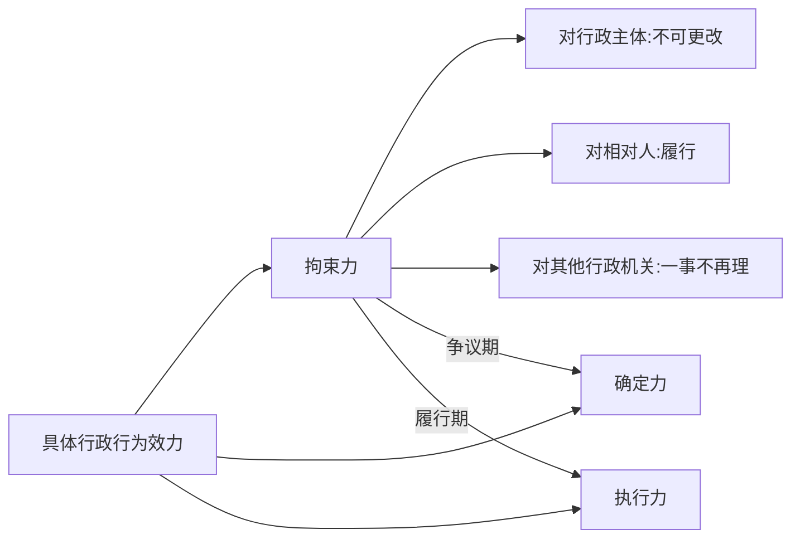

# 具体行政行为

## 最佳实践

1. 具体行政行为的特征❤️🟨🚪23主观_1, 🚪19主观_1, 🚪12主观_1, 🚪05主观_1, 🚪11主观_3
    1. 法律性: 影响当事人的权利义务关系
    2. 特定性: 针对特定人, 只适用一次
    3. 外部性: 非行政部门内部的调整
    4. 职权性: 

    ✨只答前三点即可

2. 行政机关的行为分类
    1. 具体行政行为
        1. 影响当事人的权利义务关系
        2. 对象特定, 适用一次
        3. 外部行政行为
    2. 事实行政行为: 未影响当事人的权利义务关系
        1. 行政`指导`
        2. 行政`调解`
        3. 过程性行为, 告知书不可诉, 决定书可诉
        4. 侵权行为
    3. 抽象行政行为: 对象不特定, 适用可反复
    4. 内部行政行为: 人事处理、公文来往、职权调整
    5. 刑事行为
3. 具体行政行为的效力内容🟡
    1. 拘束力 -- 争议期 --> 确定力
    2. 拘束力 -- 履行期 --> 执行力
4. 具体行政行为的效力类型🟡
    1. 无效
    2. 撤销
    3. 废止

## 行政机关的行为分类

1. 法律性（处分性）(区别于行政事实行为)
    
    具体行政行为: `影响当事人的权利义务关系`
    事实行政行为: `未影响当事人的权利义务关系`
    
    1. 行政`指导`: 县政府鼓励每家每户养猪。此为行政指导, 爱听不听, 不可诉
    2. 行政`调解`: 甲乙二人互殴，公安局居中调解，二人调不调、怎么调都是甲乙二人自主支配的结果，公安局无强制力, 不可诉
    3. `过程性行为`: 国家市场监督管理总局先送达行政处罚`告知书`，告知阿里事实理由和依据，拟罚款182亿，告知陈述申辨听证权：再送达行政处罚`决定书`，被罚款182亿，以及告知复议诉讼权等。
        1. 行政处罚`告知书`为过程性行为，未实际影响当事人的权利义务关系，不可诉
        2. 政处罚`决定书`为行政处罚，是具体行政行为，可诉
    4. `暴力侵权行为`: 城管打人, 
        1. 行政诉讼的审理对象是被诉行政行为的合法性，而暴力侵权行为必然违法，无须浪费司法资源来审查其是否合法，不可诉
        2. 可以提起`行政赔偿诉讼`解决赔偿的问题

2. 特定性(区别于抽象行政行为)
    
    对象是否`特定`, 适用是否`反复`
    
    1. 抽象行政行为不可直接诉，只能被附带审查
    2. 为通知、通告、公告，也不一定是抽象行政行为。关键看对象是否特定，能否反复适用
        🍐某区政府发布通告：凡在本通告附件所列名单中的企业两年内关闭。该通告是针对特定对象（所列名单中的企业）作出的一次性处理行为，符合特定性，是具体行政行为。

3. 外部性(区别于内部行政行为)
    
    内部行政行为包括: 人事处理、公文来往、职权调整

    1. 公文来往
        🍐某高校教师甲因对职称评级不满，向市教育局反映问题，市教育局向市政府作出《初步意见》。甲通过其他途径打听到了该《初步意见》的内容. 不能。《初步意见》还未对甲直接作出，此时是内部行政行为，不可诉。市林业局接
    2. 职权调整+公文来往
        🍐到关于甲毁林采矿的举报，遂致函当地县政府，要求调查。县政府召开专题会议形成会议纪要：由县林业局、矿产资源管理局与安监局负责调查处理。函是内部公文来往，此会议纪要属于职权调整，都不可诉。

4. 职权性(区别于刑事侦查行为)
    1. 公安局: 依据《治安管理处罚法》，维护社会治安一一行政行为, 可诉
    2. 公安局: 依据《刑事诉讼法》，侦查犯罪一一刑事侦查行为, 不可诉

    🍐妻子失踪，丈夫要求公安机关立案侦查，“立案侦查”代表属于刑事侦查行为，不可诉

## 具体行政行为的效力内容

三个力:

1. 拘束力

    1. 行政主体不得随意更改
    2. 行政相对人应当接受并实际履行行为确定的义务
    3. 其他国家机关不得以相同事实和理由再次受理和处理该同一案件
    4. 第三人也不得对该案件进行随意干预

3. 确定力
    
    具体行政行为经过一定期限和程序被最终地、实质性地确定下来，不可再争议、不得再更改的效力。

2. 执行力

    已生效的具体行政行为要求行政主体和行政相对人将其确定的权利义务内容转化为现实的法律效力。

两个期:
1. 拘束力经过争议期变为确定力
2. 拘束力经过履行期变为执行力

🍐税务机关对冰冰作出了2.4亿的罚款决定，
1. 冰冰`应当履行`，税务机关`不能朝令夕改`，`其他机关一事不再罚`，体现了`拘束力`
2. 若冰冰在6个月内未复议未诉讼，则不可以再争议该行为，体现了`确定力`
3. 若冰冰在履行期内未缴纳罚款，税务机关加处罚款，后划拨其财产，体现`执行力`

## 具体行政行为的效力类型

效力|条件|后果
--|--|--
无效|重大且明显违法 1. 主体无资格 2. 行为无依据 3. 客观不可能 4. 程序重大且明显违法|1. 可随时主张无效、随时宣告无效 2. 当事人可拒绝，不负责任 3. 造成损害可获国家赔偿。
撤销| 1. 事实不清、证据不足 2. 适用法律依据错误 3. 违反法定程序 4. 超越职权 5. 滥用职权 6. 明显不当|1. 被撤销前推定为有效: 不可拒绝, 只能先履行 2. 撤销后溯及为自始无效, 可获得国家赔偿
废止|1. 法律依据改变 2. 客观事实改变 3. 行为目的实现|1. 废止前有效 2. 废止后无效: 新来利益损害, 可获得国家补偿

1. 合法6要件:
    1. 事实清楚证据充分
    2. 适用法律正确
    3. 程序合法
    4. 无超越职权: 无权而为（比如派出所罚款600元）
    5. 无滥用职权: 有权但考虑无关因素
    6. 无明显不当
2. 同时符合六要件的，具体行政行为才合法，缺乏任意一个要件，行政行为违法。
3. 违法 -> 撤销 -> 赔偿；合法 -> 撤回 -> 补偿
4. 无效的行政行为自始无效、当然无效、绝对无效，无拘束力无确定力无执行力。

## 具体行政行为举例(了解)
1. 行政征收: 政征收是指行政机关依法向公民、法人或者其他组织强制性收取税费或私有财产的行政行为。主要方式： 
    1. 征税
    2. 行政征费
    3. 土地征收
    4. 房屋征收
2. 行政征用: 政征用是指行政机关为了公共利益需要依法强制使用公民、法人或其他组织的财产，并给予补偿的行政行为。如：🚪民法_117, 245；🚪突发事件应对法_12。
3. 行政确认: 行政确认是指行政主体依法对行政相对人的法律地位、法律关系或者有关法律事实进行甄别，给予确定、认可、证明并予以宣告的具体行政行为。
    1. 确定：颁发土地使用证：
    2. 登记：户口登记、婚姻登记：
    3. 证明：学历证明、无犯罪记录证明：
    4. 认定：企业性质的认定、产品质量认证、工伤认定：鉴证：纳税鉴证、审计鉴证、会计鉴证
4. 行政给付: 
    1. 狭义上，行政给付是指政府提供必需的生存条件、防范生活风险和社会共同生活条件的行政义务。例如，最低生活保障金，失业、疾病、养老保险；政府提供公共交通通讯，生活用水、用气、用电。
    2. 广义上，行政给付是指政府满足公民社会权和其他公法受益权行政义务的总和
        1. 城市居民最低生活保障金农村的五保户救济金、遭受自然灾害的生活救济金以及国家承担的社会保险费用。
        2. 企业科技开发的财政支持费用、对大学生自主创业的财政支持费用
5. 行政奖励: 行政奖励是指行政机关给予模范守法或为国家和社会作出成就和贡献的公民、法人或其他组织相应的物质或精神奖励，以达到表彰先进、激励后进，调动和激发相关人员积极性和创造性的制度。
    1. 决定性奖励与承诺性奖励。前者是行政机关基于自身作出的决定给予的奖励：后者是行政机关为了兑现之前作出的承诺而给予的奖励，如行政悬赏。
    2. 赋予权益的奖励与减免义务的奖励。前者如科技进步奖：后者如激励性税收优惠。
    3. 普遍性奖励与限额奖励。前者是对符合条件的所有人实施：后者只对部分人实施
6. 行政裁决: 行政裁决是指行政机关居间对特定的民事争议作出具有约束力处理的行为。
    1. 损害赔偿裁决。如，甲出售变质食品，致乙食物中毒住院治疗，食品卫生监管部门在对甲进行处罚的同时，裁决甲赔偿乙的医疗费和误工费
    2. 权属纠纷裁决。如，裁决民事主体的土地、草原、森林、滩涂、矿产等自然资源所有权、使用权的纠纷
    3. 侵权纠纷裁决。如，甲擅自使用乙的注册商标推销自己的同类商品，乙请求市场监督管理局予以制止。市场监督管理局经过调查，依法作出责令甲停止侵犯乙已注册的商标行为的裁决
注意:
1. 征收: 所有权，有的无偿有的补偿；征用: 使用权，均补偿
2. 行政确认: 从有到有；行政许可: 从无到有

🍐下列哪些行为属于具体行政行为？
A.市监局发文要求电商平台规范经营，合法经营
B.证监局对某证券公司发出警示函，指出其执业过程中存在的问题并责令采取整改措施
C.中国证监会对某公司负责人做出禁止其终身进人证券服务行业
D.防汛指挥部发布大雨蓝色预警，请市民注意出行安全

答案:BC
A.错，面向不特定对象作出的，是抽象行政行为
B.对，责令整改为行政强制措施；责令停业整顿是行政处罚
C.对，禁止进去证券行业属于行政处罚中的限制从业
D.错，注意出行属于行政指导，没有强制力，是行政事实行为

🍐甲市公安交通管理局发布交通管制的公告，决定在2021年7月20号上午8点到8点半，对辖区内某条道路实施机动车交通管制，后乙区公安分局丙交警大队根据监控对违章司机李某作出罚款200元的处罚。李某提起行政诉讼，下列说法正确的是？
A.市交通管理局和交警大队应当作为共同被告
B.对李某的处罚可以适用简易程序
C.对李某的监控材料未经审核，不得作为证据使用
D.公告是具体行政行为

答案:BC
A.错，交警大队有授权，被告为交警大队, 交通管理局公告是抽象行政行为, 不可诉
B.对，公民200元以下法人3000元以下的罚款或警告，可以适用简易程序作出处罚决定
C.对，非现场执法要经过法制和技术审核，未经审核不得作为证据使用
D.错，公告是抽象行政行为，针对不特定对象作出的可以反复适用的行为

