# 行政公开

### 公开主体

1. 谁制作谁公开；
1. 谁保存谁公开；
1. 最先获得者公开；
1. 派出机构、内设机构依法以自己名义履职的，由其公开；
5. 共同制作信息，由牵头机关公开。

## 公开是常态，不公开是例外

1. 绝对不公开

    依法确定为国家秘密的政府信息，法律、行政法规禁止公开的政府信息，以及公开后可能危及国家安全、公共安全、经济安全、社会稳定的政府信息，不予公开。

1. 相对不公开
    涉及商业秘密、个人隐私等公开会对第三方合法权益造成损害的政府信息，行政机关不得公开。但是，第三方同意公开或者行政机关认为不公开会对公共利益造成重大影响的，予以公开。

1. 可以不公开

    1. 内部信息：行政机关的内部事务信息，包括人事管理、后勤管理、内部工作流程等方面的信息，可以不予公开；
    1. 过程信息：行政机关在履行行政管理职能过程中形成的讨论记录、过程稿、磋商信函、请示报告等过程性信息以及行政执法案卷信息，可以不予公开。

## 涉密信息三步走

## 主动公开

### 三文书

1. 公开指南：包括信息的分类、编排体系、获取方式和公开工作机构的名称、办公地址、时间、联系电话、传真号码、互联网联系方式。
1. 公开目录：包括信息的索引、名称、内容概述、生成日期
1. 年度工作报告（3月31日前发布）。

### 公开方式场所和期限

方式：政府公报、政府网站或者其他互联网政务媒体、新闻发布会以及报刊、广播、电视。
场所：应当在国家档案馆、公共图书馆、政务服务场所设置政府信息查阅场所。可以根据需要设立公共查阅室、资料索取点、信息公告栏、电子信息屏。
期限：属于主动公开范围的政府信息，应当自该信息形成或者变更之日起20个工作日内及时公开，

## 依申请公开

1. 申请的形式
    1. 原则：书面形式（包括信件、数据电文形式）；
    1. 方式：书写确有困难的，可以口头提出，机关代填。

1. 申请书内容

    1. 申请人的姓名或者名称、身份证明、联系方式；
    1. 申请公开的政府信息的名称、文号或者便于行政机关查询的其他特征性描述；
    1. 申请公开的政府信息的形式要求，包括获取信息的方式、途径。

1. 材料补正

    申请内容不明确的，机关应当给予指导和释明，并在7个工作日内一次性告知补正。说明需要补正的事项和合理的补正期限。答复期限自机关收到补正的申请之日起计算。申请人无正当理由逾期不补正的，视为放弃申请，机关不再处理该申请。

1. 答复期限

    能够当场答复的，当场答复。不能当场答复的，20个工作日内予以答复：需要延长答复期限的，经机构负责人同意并告知申请人，延长的期限最长不得超过20个工作日。行政机关征求第三方和其他机关意见所需时间不计算在前述规定的期限内。

1. 申请权滥用的处理

    申请公开信息的数量、频次明显超过合理范围，机关可以要求申请人说明理由。机关认为申请理由不合理的，告知不予处理；认为申请理由合理，但是无法在法定期限内答复的，可以确定延迟答复的合理期限并告知申请人。

1. 征求其他机关意见

    申请公开的信息由两个以上机关共同制作的，牵头制作的行政机关收到申请后可以征求相关机关的意见，被征求意见机关应当自收到征求意见书之日起15个工作日内提出意见，逾期未提出意见的视为同意公开。

1. 公开的形式

    机关依申请公开信息，应当根据申请人的要求及机关保存政府信息的实际情况，确定提供信息的具体形式；按照申请人要求的形式提供信息，可能危及信息载体安全或者公开成本过高的，可以通过电子数据以及其他适当形式提供，或者安排申请人查阅、抄录相关政府信息。

1. 费用

    机关依申请提供信息，不收取费用。但是，申请人申请公开政府信息的数量、频次明显超过合理范围的，机关可以收取信息处理费。

1. 保密信息区分处理
    申请公开的信息中含有不应当公开或者不属于政府信息的内容但是能够作区分处理的，行政机关应当向申请人提供可以公开的政府信息内容，并对不予公开的内容说明理由。

1. 个人信息保护

    当事人有证据证明行政机关提供的与其自身相关的政府信息记录不准确的，可以要求行政机关更正。有权更正的行政机关审核属实的，应当予以更正并告知申请人；不属于本行政机关职能范围的，行政机关可以转送有权更正的行政机关处理并告知申请人，或者告知申请人向有权更正的行政机关提出。

1. 监督与救济

    1. 认为行政机关不履行公开职责的，可以向上一级行政机关或政府信息公开工作主管部门举报；
    1. 认为行政机关在政府信息公开中的具体行政行为侵犯其合法权益的，可以申请复议或提起行政诉讼。

某通过电子邮件的形式，向甲区政府申请公开作出强拆决定的会议纪要，甲区政府以未制作、未保存该信息为由，作出拒绝公开决定。吴某不服向法院起诉，以下说法正确的是？
A.会议纪要属于内部信息，区政府拒绝理由违法
B.若吴某能提供证据证明该会议纪要存在或由区政府制作，法院应当要求区政府公开
C.区政府应该向法院证明自已已经尽了检索义务
D.吴某应当在15天内起诉

答案:
A错误，会议纪要属于内部信息说法正确，但是在本案案情中，不知道到底有没有该会议纪要，如果真的没有制作没有保存，该拒绝理由就是合法的。如果制作了，该拒绝理由就是违法的。所以不能判断拒绝理由到底是合法还是违法。
B错误，吴某的权利是可以申请法院调取证据，法院有权要求区政府证明是否应当公开。
C正确，被诉行为是拒绝公开，行政诉讼审理的对象是被诉行政行为的合法性，被告的举证责任是证明自己不违法，也就是已经尽了检索义务。
D错误，直接起诉，应该是6个月。
