# 行政处罚

## 最佳实践

1. 行政处罚的概念: ❤️🟨🚪主观22_1, 🚪21主观(延)_3, 🚪18主观_1, 🚪16主观_4
    1. 违反行政管理秩序的行为
    2. 增加义务或减损权益的方式
    3. 予以惩戒

1. 行政处罚的听证: ❤️🟩🚪17主观_2

## 概念
`行政机关`依法对`违反行政管理秩序`的公民，法人或者其他组织，以`减损权益`或者`增加义务`的方式予以`惩戒的行为`。🚪处罚_2

🍐由于土地连续两年搁荒未使用，市自然资源局向甲作出《收回国有土地使用权决定书》。请分析收回国有土地使用权证的性质。
1. 行政处罚
2. 本案中，甲作为土地使用者违反了法律法规禁止性规定，被政府或土地行政主管部门依照法律法规的规定收回土地使用权，这种`收回`，首先是因为土地使用者发生了`法律法规禁止的违反行政管理秩序的行为`，其次法律法规规定，对这种行为必须给予`无偿收回土地使用权`的惩处，具有惩戒性。

## 分类🚪处罚_9

1. 申诫罚：警告
2. 名誉罚：通报批评（公开的警告）
3. 财产罚：
    1. 罚款(滞纳金是执行, 非处罚)
    2. 没收违法所得（总额说）、没收非法财物
4. 行为罚：
    1. 限制开展生产经营活动(可以生产，只是受到限制)
    2. 责令停产停业(定时期内不能生产)
    3. 责令关闭(不能生产)
    4. 限制从业
5. 资格罚：
    1. 暂扣许可证件
    2. 降低资质等级
    3. 吊销许可证件
6. 自由罚：行政拘留

> [!tips]
> 1. 警告必须以书面的形式作出（公凭文）
> 2. 违法所得和非法财物的区别违法所得：
>    1. 行政违法行为人通过从事违法行为而获得的财产性利益。
>    2. 非法财物：行政违法行为人为了实施违法行为而使用的资金或者设备等财物。
>    🍐渔夫违法捕鱼，渔网是非法财物，赚取的钱是违法所得。

## 行政处罚的设定、补充设定与规定
🚪处罚_10~16

1. 设定：从无到有(无违法行为，无行政处罚)

    立法文件|内容
    --|--
    法律|可以设定各类行政处罚, 限制人身自由的由法律绝对保留。
    行政法规|除限制人身自由之外的所有其他处罚。
    地方性法规|除限制人身自由、吊销营业执照之外的所有处罚，
    部门规章|警告、通报批评和一定数额的罚款，罚款限额由国务院决定：直属机构和直属事业单位的规章需经国务院授权才能设定
    地方政府规章|警告、通报批评和一定数额的罚款，罚款限额由省级人大常委会决定。

2. 补充设定：从有到全(有违法行为，无行政处罚)
    
    如果上位法就某一违法行为作出了设定，但是并没有设定相应的罚则，那么行政法规或地方性法规有权就行政处罚作出补充设定

    🍐《计量法》第14条规定：“任何单位和个人不得违反规定制造、销售和进口非法定计量单位的计量器具。”可见，该法条规定了公民、法人违反规定制造、销售和进口非法定计量单位的计量器具属于违法行为，但是并未进一步就相应的罚则作出规定。国务院的《计量法实施细则》第41条就罚则问题作出了补充性规定：“违反《中华人民共和国计量法》第十四条规定，制造、销售和进口非法定计量单位的计量器具的，责令其停止制造、销售和进口，没收计量器具和全部违法所得，可并处相当其违法所得10%至50%的罚款。”

3. 规定：从粗到细(有违法行为，有行政处罚)
    
    行政法规、地方性法规、各种行政规章都有权对上位法已经设定的行政处罚事项进行具体规定。其他规范性文件都无权对行政处罚事项作出任何具体规定
    
    下位法对上位法设定的行政处罚作具体规定的，不得超出上位法规定的给予行政处罚的行为、种类和幅度的范围。

    🍐《治安管理处罚法》规定，旅馆业的工作人员对住宿的旅客不按规定登记姓名、身份证件种类和号码的，或者明知住宿的旅客将危险物质带人旅馆，不予制止的，处200元以上500元以下罚款。如果下位法再对此作出具体规定，只能在该罚款幅度内进行，既不得降低200元下限，也不得提高500元上限，更不得因为罚款的处罚力度不够，再增设没收、拘留等其他种类的处罚。

🍐高某系A省甲县个体工商户，其持有的工商营业执照载明经营范围是`林产品加工`，经营方式是加工、收购、销售。高某向甲县工商局缴纳了松香运销管理费后，将自己加工的松香运往A省乙县出售。当高某进入乙县时，被乙县林业局执法人员拦截。乙县林业局以高某未办理运输证为由，依据A省地方性法规《林业行政处罚条例》以及授权省林业厅制定的《林产品目录》（该目录规定松香为林产品，应当办理运输证）的规定，将高某无证运输的松香认定为“非法财物”，予以没收。高某提起行政诉讼要求撤销没收决定，法院予以受理。

有关规定：
1. 《森林法》及行政法规《森林法实施条例》涉及运输证的规定如下：除国家统一调拨的木材外，从林区运出木材，必须持有运输证，否则由林业部门给予没收、罚款等处罚。
2. A省地方性法规《林业行政处罚条例》规定“对规定林产品无运输证的，予以没收”。

问题：乙县林业局作出的没收决定是否合法？为什么？不合法。
本案下位法《林业行政处罚条例》关于没收的规定超出了上位法《森林法》及《森林法实施条例》规定的行政处罚行为、种类和幅度的范围，不符合该要求。乙县林业局依据《林业行政处罚条例》作出的没收行为违法，依据违法。

## 行政处罚的实施主体

### 行政机关

1. 单独实施

2. 综合执法(许可：国批省定；处罚：国定省定)🚪处罚_18
    1. 7+X模式：城管、市场、环境、文化、交通、应急、农业。
    2. 相对集中：国务院或省级政府决定一个机关行使有关机关的处罚权，限制人身自由处罚除外

### 被授权组织🚪处罚_19
1. 依据: 法律，法规
2. 对象: 管理公共事务组织：事业、企业、社会团体
3. 名义: 被授权组织
4. 责任: 被授权组织

### 被委托的机关、组织🚪处罚_20, 21

1. 依据: 法律、法规、规章
1. 对象: (许可只能委托给行政机关)
    1. 机关
    2. 管理公共事务组织
2. 书面: 应当有委托书，内容：委托具体事项、委托权限、委托期限。
3. 公布: 双方都要向社会公布委托书。
4. 名义: 委托机关
5. 责任: 委托机关
6. 禁止: 转委托

> [!tips]
> 1. 处罚的授权实施与许可的授权实施相同
> 2. `处罚委托的对象`是`行政机关`+`管理公共事务的组织`，而`许可`只能委托给`行政机关`，不能委托给组织
> 3. `行政处罚`的相对集中实施是`国定省定`，`行政许可`的相对集中实施是`国批省定`

## 行政处罚的管辖

### 地域管辖

由违法行为发生地的行政机关管辖。违法行为发生地包括违法行为`着手地`、`经过地`、`实施地`、`被发现地`以及`违法结果`发生地。🚪处罚_22

### 级别管辖
1. 原则: 由县级以上地方政府的具有行政处罚权的职能部门管辖。🚪处罚_23
2. 管辖权下沉:🚪处罚_24
    1. 含义：为了解决`看得见的管不了，管得了的看不见`的问题，将处罚权下放给乡镇街道，
    2. 决定主体：省、自治区、直辖市
    3. 公布：行政处罚权的下放决定应当公布。

### 管辖权争议🚪处罚_25
1. 原则: 两个以上行政机关都有管辖权的案件，由最先立案的行政机关管辖
1. 指定: 对管辖发生争议的，应当协商解决，协商不成的，报请共同的上一级行政机关指定管辖；也可以直接由共同的上一级行政机关指定管辖。

### 行政处罚与刑事司法的衔接🚪处罚_27
1. 行政→刑事: 如果违法行为涉嫌犯罪的，行政机关应当及时将案件移送司法机关，依法追究刑事责任
2. 刑事→行政: 对依法不需要追究刑事责任或者免予刑事处罚，但应当给予行政处罚的，司法机关应当及时将案件移送有关行政机关

## 适用规则
3. 一事不再罚🚪处罚_29
    1. 含义: 对当事人的同一个违法行为，不得给予两次以上罚款的行政处罚：同一个违法行为违反多个法律规范应当给予罚款处罚的，按照罚款数额高的规定处罚
    2. 一事: 当事人只有一个违法行为
    3. 不再罚: 不得罚款两次以上
1. 从轻减轻🚪处罚_30, 32
    1. 已满14周岁不满18周岁的未成年人有违法行为的。
    2. 主动消除或者减轻违法行为危害后果的。
    3. 受他人胁追或者诱骗实施违法行为的
    4. 主动供述行政机关尚未掌握的违法行为的。
    5. 配合行政机关查处违法行为有立功表现的。
    6. 尚未完全丧失辨认或者控制自己行为能力的精神病人、智力残疾人有违法行为的。
    7. 法律、法规、规章规定其他应当从轻或者减轻行政处罚的。
2. 不予处罚🚪处罚_31, 33
    1. 不满14周岁的未成年人有违法行为的不予处罚，应当责令监护人加以管教。
    2. 精神病人、智力残疾人在不能辨认或者不能控制自己行为时有违法行为的，不予行政处罚，但应当责令其监护人严加看管和治疗间歇性精神病人在精神正常时有违法行为的，应当给予行政处罚。
    3. 违法行为轻微并及时改正，没有造成危害后果的，不予行政处罚
    4. `首违不罚`：体现人性关怀，首次违法且危害后果轻微并及时改正的，可以不予行政处罚。
    5. `过错推定`：当事人有证据足以证明没有主观过错的，不予行政处罚。法律、行政法规另有规定的，从其规定。

4. 处罚折抵🚪处罚_35
    1. 行政拘留应当依法折抵相应刑期
    2. 罚款应当折抵相应罚金

> [!tips]
> 1. 不予处罚
>     1. 轻微+及时改正+没有危害后果，不予处罚
>     2. 首违不罚，初次+轻微+及时改正，可以不予处罚
>     3. 过错推定，当事人有证据足以证明没有主观过错的，不予处罚
> 2. 一事不再罚
>     只有一个违法行为，不得罚款2次以上一个违法行为违反多个法律规范，均应罚款处罚的，择一重

## 追究时效🚪处罚_36

1. 功能: 稳定社会关系和督促行政机关提高执法效率
1. 一般: 2年后才发现违法行为，不再进行处罚
1. 特殊: 
    1. 涉及公民生命健康安全、金融安全且有危害后果的，上述期限延长至5年
    2. 法律作出例外规定的，例如，《治安管理处罚法》规定是6个月
2. 起算点
    1. 行为发生之日：一般情况下，从违法行为发生之口起计算。
    2. 行为终了之日：违法行为在时间上具有持续或继续状态的，从违法行为终了之日起计算
    3. 例外情形：违法行为发生后，在其危险性上具有连续性，则只要该危险性后果一直持续，行政机关就可以作出行政处罚, 🍐如盖房子(违建）超生，虽然行为已经结束，但危险性后果一直持续

> [!tips]
> 追究时效: 一般2年；生命安全金融安全+危害后果，5年; 例外规定(治安管理处罚) 6个月

## 具体程序

### 一般规定

1. 信息公示🚪处罚_39
    
    对违法行为给予行政处罚的规定必须公布；未经公布的，不得作为行政处罚的依据。
    行政处罚的实施机关、立案依据、实施程序和救济渠道等信息应当公示。

2. 查明事实🚪处罚_40
    
    此为首要前提，因为行政处罚决定应当遵循“先取证、后行为”原则，必须经过充分调查取证，查清事实真相才可以依法作出处罚决定。

3. 执法人员🚪处罚_42
    
    行政处罚应当由具有行政执法资格的执法人员实施。执法人员不得少于两人，法律另有规定的除外。执法人员应当文明执法，尊重和保护当事人合法权益

4. 回避制度🚪处罚_43
    1. 回避情形：执法人员与案件有直接利害关系或者有其他关系可能影响公正执法的，应当回避
    2. 回避申请：当事人认为执法人员与案件有直接利害关系或者有其他关系可能影响公正执法的，有权申请回避。
    3. 不停止调查：当事人提出回避申请的，行政机关应当依法审查，由行政机关负责人决定。决定作出之前，不停止调查
5. 告知听取
    1. 告知：行政机关在作出行政处罚决定之前，应当告知当事人拟作出的行政处罚内容及事实、理由、依据，并告知当事人依法享有的陈述、申辩、要求听证等权利。🚪处罚_44
    2. 听取：当事人有权进行陈述和申辩。行政机关必须充分听取当事人的意见，对当事人提出的事实、理由和证据，应当进行复核；当事人提出的事实、理由或者证据成立的，行政机关应当采纳。行政机关不得因当事人陈述、申辩而给予更重的处罚，🚪处罚_45
6. 证据规定
    1. 证据种类: 🚪处罚_46
        1. 书证
        2. 物证
        3. 视听资料
        4. 电子数据
        5. 证人证言
        6. 当事人的陈述
        7. 鉴定意见
        8. 勘验笔录
        9. 现场笔录
    2. 电子监控🚪处罚_41
        1. 双重审核: 利用电子技术监控设备收集、固定违法事实的，应当经过法制和技术审核确保电子技术监控设备符合标准、设置合理、标志明显
        2. 公布地点: 设置地点应当向社会公布
        3. 便利当事人: 应当及时告知当事人违法事实，并采取信息化手段或者其他措施，为当事人查询、陈述和申辩提供便利，

7. 全程记录🚪处罚_47
    
    应当依法以文字、音像等形式，对行政处罚的启动、调查取证、审核、决定、送达、执行等进行全过程记录，归档保存，

8. 公开与撤回
    1. 公开: 具有一定社会影响的行政处罚决定应当依法公开🚪处罚_48_1
    2. 撤回: 公开的行政处罚决定被依法变更、撤销、确认违法或者确认无效的，行政机关应当在3日内撤回行政处罚决定信息并公开说明理由🚪处罚_48_2
    3. 保密: 行政机关及其工作人员对实施行政处罚过程中知悉的国家秘密、商业秘密或者个人隐私，应当依法予以保密🚪处罚_50
9. 突发事件应对🚪处罚_49

    发生重大传染病疫情等突发事件，为了控制、减轻和消除突发事件引起的社会危害，行政机关对违反突发事件应对措施的行为，依法快速、从重处罚，

### 简易程序

1. 适用条件🚪处罚_51
    1. 违法事实确凿
    2. 有法定依据
    3. 处罚种类和幅度：
        1. 对公民罚款200元以下或警告
        2. 对法人罚款3000元以下或警告
        3. 法律另有规定的从其规定
2. 基本内容🚪处罚_52
    1. 出示证件
    2. 填写预定格式、编有号码的行政处罚决定书，载明当事人的违法行为，行政处罚的种类和依据、罚款数额、时间、地点，申请行政复议、提起行政诉讼的途径和期限以及行政机关名称，并由执法人员签名或者盖章
    3. 当场将处罚决定书交付当事人，拒绝签收的，应当在决定书上注明
    4. 报所属行政机关备案

### 普通程序
1. 立案🚪处罚_54

    符合立案标准的，行政机关应当及时立案

2. 调查取证🚪处罚_55, 56
    1. 法定人数: 调查或检查时的执法人员不得少于2人。
    2. 出示证件: 执法人员在调查或者进行检查时，应当主动出示执法证件。
    3. 当事人权利: 有权要求执法人员出示执法证件，执法人员不出示执法证件的，有权拒绝接受调查或者检查
    4. 先行登记保存
        1. 前提: 证据可能灭失或者以后难以取得
        2. 程序: 经行政机关负责人批准
        3. 期限: 应当在7日内及时作出处理决定，在此期间，当事人或者有关人员不得销毁或者转移证据
2. 法制审核🚪处罚_58
    1. 适用情形
        1. 涉及重大公共利益的
        2. 直接关系当事人或者第三人重大权益，经过听证程序的
        3. 案件情况疑难复杂、涉及多个法律关系的
    2. 初任条件: 应当通过国家统一法律职业资格考试取得法律职业资格。
    3. 是决定的前置程序: 未经法制审核或者审核未通过的，不得作出决定
3. 决定🚪处罚_57
    1. 负责人决定
        1. 确有应受行政处罚的违法行为的，根据情节轻重及具体情况，作出行政处罚决定违法行为轻微，依法可以不予行政处罚的，不予行政处罚。
        2. 违法事实不能成立的，不予行政处罚
        3. 违法行为涉嫌犯罪的，移送司法机关
        4. 对情节复杂或者重大违法行为给予行政处罚
    2. 集体讨论: 对情节复杂或者重大违法行为给予行政处罚

4. 期限🚪处罚_60

    行政机关应当自行政处罚案件立案之日起90日内作出行政处罚决定，法律、法规、规章另有规定的，从其规定

5. 送达🚪处罚_61
    
    处罚决定书未经送达的，处罚决定不成立

    1. 宣告当场交付: 行政处罚决定书应当在宣告后当场交付当事人。
    2. 不在场: 当事人不在场的，行政机关应当在7日内依照《民事诉讼法》的有关规定送达
    3. 电子送达: 当事人同意并签订确认书的，行政机关可以采用传真、电子邮件等方式，将行政处罚决定书等送达

### 听证程序

#### 含义

行政机关在作出行政处罚决定之前，依法以正式听证会的形式，由非本案调查人员主持，听取当事人的陈述、申辩并进行质证的行政程序。
免费：当事人不承担行政机关组织听证的费用

#### 适用条件🚪处罚_63
1. 行政机关拟作出下列行政处罚决定，应当告知当事人有要求听证的权利，当事人要求听证的，行政机关应当组织听证。(许可听证：既可依职权，也可依申请：处罚听证依申请)
2. 较大数额罚款：关于何为较大数额，行政处罚法并未规定，具体适用时应根据各部委或地方政府的相关规定；《治安管理处罚法》规定是2000元以上，

    🍐2022年6月1日起正式施行的《广东省行政处罚听证程序实施办法》规定，当行政机关对公民的违法行为处以5000元以上罚款（等价值违法所得或者非法财物），对法人或者其他组织的违法行为处以10万元以上罚款（等价值违法所得或者非法财物），应当告知当事人有要求举行听证的权利。

3. 没收较大数额违法所得、没收较大价值非法财物。
4. 降低资质等级、吊销许可证件。
5. 责令停产停业、责令关闭、限制从业

#### 程序🚪处罚_64

1. 申请期限: 当事人要求听证的，应当在行政机关告知后5日内提出。
2. 告知期限: 行政机关应当在举行听证的7日前，通知当事人及有关人员听证的时间、地点(许可听证期限：5207处罚听证期限：57，对于组织听证的期限，法律没有明确规定。)
3. 听证公开: 除涉及国家秘密、商业秘密或者个人隐私依法予以保密外，听证公开举行
4. 主持人回避: 听证由行政机关指定的非本案调查人员主持：当事人认为主持人与本案有直接利害关系的，有权申请回避。
5. 委托代理人: 当事人可以亲自参加听证，也可以委托1至2人代理，行政机关不得委托律师参加听证会(专业的人做专业的事, 许可听证、处罚听证以及复议程序中行政机关都不得委托律师。)
6. 放弃听证: 当事人及其代理人无正当理由拒不出席听证或者未经许可中途退出听证的，视为放弃听证权利，行政机关终止听证。
7. 申辩质证: 举行听证时，调查人员提出当事人违法的事实、证据和行政处罚建议，当事人进行申辩和质证

#### 听证笔录🚪处罚_64, 65

1. 听证笔录: 听证应当制作笔录。笔录应当交当事人或者其代理人核对无误后签字或者盖章，当事人或者其代理人拒绝签字或者盖章的，由听证主持人在笔录中注明
1. 根据笔录: 听证结束后，行政机关应当根据听证笔录，作出决定；未经听证会质证的证据，不得作为行政机关作出处罚决定的依据

### 总结
1. 程序示意图

    依职权：立案，调查。若是依申请，则第一步是申请。

    程序分类:
    1. 第一种：简易程序，当场作出。
    2. 第二种：普通程序，听取陈述、申辩，不经过听证。
    3. 第三种：包括听证程序。

2. 简易程序

    适用条件：公民--200元：企业--3000元育
    基本内容：当场作出，当场交付。拒绝签收，注明。报所属行政机关备案。

3. 普通程序调查取证：不得少于2人；出示证件；
    1. 先行登记保存：证据可能灭失或者以后难以取得。7日内作出处理决定。性质上相当于行政强制措施。
    2. 法制审核：重大公共利益；经过听证的；多个法律关系.  决定的前置程序，无审核，不得作出决定。

4. 听证程序
    1. 听证不是独立程序，也不是必经程序，只是一部分，普通案件听取陈述申辩即可。听证程序本身属于事实行为，不可诉。若是应当听证，未听证，作出行政处罚，对该处罚决定不服的，可以起诉行政处罚决定。
    2. 不需要听证：警告，通报批评，暂扣，限产，拘留。
    
        🍐国家监督管理总局，对阿里处罚，国家监督管理总局不得委托律师。在行政复议中，行政机关作为被申请人，不得委托律师。在行政诉讼中，作为被告，可以委托律师。因为行政诉讼是司法程序，行政处罚和行政复议是行政程序。“专业的人做专业的事”。

## 行政处罚的执行

### 执行原则

1. 不停止执行原则: 当事人对行政处罚决定不服申请复议或者提起诉讼的，原则上不停止行政处罚的执行。🚪处罚_73
2. 罚缴分离原则: 作出罚款决定的行政机关应当与收缴罚款的收缴机关分离，除当场收缴的罚款外，作出行政处罚决定的行政机关及其执法人员不得执行收缴罚款。🚪处罚_67
3. 没收财物的处理: 
    1. 上缴国库
    2. 不得截留、私分
    3. 不得与考核、考评挂钩

### 当场收缴

1. 适用范围
    1. 钱太少: 100元以下当场作出的罚款，可以当场收缴。（治安管理：50元以下）🚪处罚_68
    2. 无住所: 对公民当场作出200元以下罚款，而该公民是外地人，在当地没有固定住所，不当场收缴事后难以执行的，可以当场收缴。🚪处罚_68
    3. 主动提: 在边远、水上、交通不便地区，当事人到指定的银行或者通过电子支付系统缴纳罚款确有困难，经当事人主动提出，可以当场收缴。🚪处罚_69
2. 罚款收据🚪处罚_70
    
    当场收缴罚款的，必须向当事人出具国务院财政部门或者省级财政部门统一制发的罚款收据：不出具财政部门统一制发的专用票据的，当事人有权拒绝缴纳罚款。

1. 罚款上缴🚪处罚_71
    
    执法人员当场收缴的罚款，应当2日内，交至行政机关；在水上执法的，应当自抵岸之日起2日内交至行政机关；行政机关应当在2日内将罚款缴付指定的银行

## 题目

🍐交警大队民警发现王某涉嫌驾驶违法拼装车辆，当场作出扣押的决定，甲交警大队根据专门机构出具的该车辆系违法拼装的鉴定意见，对王某的车辆进行了收缴，又作出报废车辆的决定，王某不服提起行政诉讼，下列说法正确的是？

A.收缴是行政处罚
B.报废是行政处罚
C.扣押后，民警24小时回交警大队找机关负责人补办批准手续
D.如王某能够证明鉴定意见有错误，法院不采纳鉴定意见

答案: ACD
A正确，收缴是行政处罚。
B错误，报废行为是收缴行为的补充，是事实行为。
C正确，实施扣押后24小时补办批准手续，人身的则是返回机关后立即补办批准手续。
D正确。内容不完整，程序违法等均不采纳鉴定意见。

🍐王某驾驶货车超载被交警甲拦截，交警甲扣留了其驾照，交警大队对其罚款1800元，扣6分。交警大队经调查发现其上个月存在不按信号灯行驶的违法行为，于是又作出罚款200元，扣6分，然后注销了王某的驾照，下列说法不正确的是？
A.罚款200元违反了一事不再罚
B.注销驾照性质属于行政处罚，本案中的注销违法
C.扣留驾照是行政处罚
D.扣分是行政处罚

答案: ABCD

A项错误，一事不再罚的前提是一件事，超载和闯红灯是两个位法行为
B项错误，注销属于行政许可的监督管理
C项错误，扣留驾照是行政强制措施。暂扣驾照是行政处罚
D项错误，按照法考主流观点，扣分属于行政事实行为