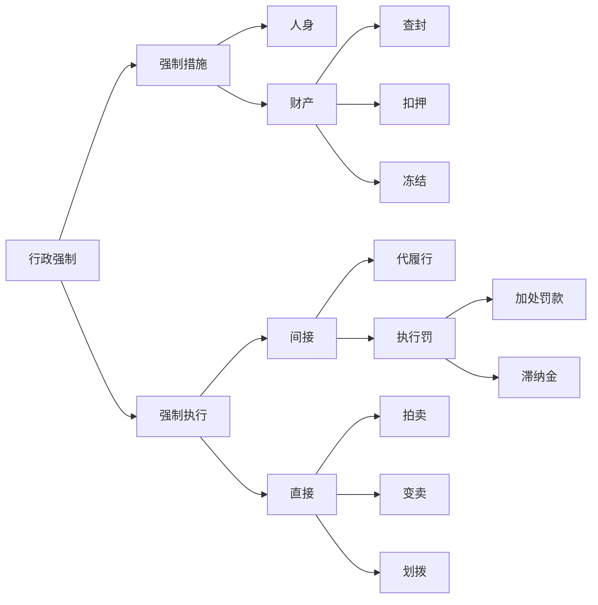

# 行政强制

## 最佳实践

1. 强制措施的概念❤️🟩🚪21主观_1, 🚪17主观_1, 🚪16主观_4
    制止违法行为 + 人身财产暂时性控制
2. 强制执行的概念❤️🟩🚪21主观_1
    不履行行政决定 + 强制履行义务的行为
3. 强制执行程序❤️🟩🚪12主观_5

## 概念

1. 强制措施🚪强制_2_2
    行政机关在行政管理过程中，为制止违法行为、防止证据损毁、避免危害发生、控制危险扩大等情形，依法对公民的`人身自由实施暂时性限制`，或者对公民、法人或者其他组织的`财物实施暂时性控制的行为`。

    1. 制止违法行为：交警发现超载，扣押车辆，扣留驾照。城管发现小商贩违法摆摊经营，扣留商贩的小车。
    2. 防止证据毁损：违法制作烟花爆竹，扣押烟花爆竹。
    3. 避免危险的发生：醉酒之后在外面，约束人身自由至酒醒。
    4. 控制危险的扩大：疫情期间，强制隔离，强制治疗。

2. 强制执行🚪强制_2_3
    行政机关或者行政机关申请人民法院对不履行行政决定的公民、法人或者其他组织，依法`强制履行义务的行为`。

    1. 行政机关自行、申请法院
    2. 间接强制、直接强制
    3. 代履行、执行罚

总结:

> [!tips]
> 1. 所有关人的行为，只有一个（行政拘留）是行政处罚，剩下的都是行政强制措施。
> 2. 查封：就地封存；
> 3. 扣押：异地保管。对使用权的暂时限
> 4. 征税、收费，逾期的话收取滞纳金。执行罚是间接强制执行，不是行政处罚

## 强制措施与强制执行的区别

项目|强制措施|强制执行
--|--|--
实施主体|1. 法律法规授权的行政机关 2. 被授权组织(法律和行政法规授权) 3. 具备资格的行政执法人员 4. 行使集中处罚权的行政机关； 5. 不得委托| 1. 行政机关   2. 法院
目的| 1. 为制止而强制 2. 为预防而强制 3. 为保障而强制|为实现前提性具体行政行为确定的义务而强制(第二次行为）
类型| 1. 限制人身自由：盘问、传唤、扣留、检查、隔离、带离现场驱散、禁闭 2. 财产：查封场所设施或财物；扣押财物；冻结存款、汇款| 1. 间接强制如代履行、执行罚 2. 直接强制如划拨拍卖、排除妨碍、恢复原状

行政机关自已强制执行，“罚执合一”。→“国公税海县”
行政机关申请法院执行，“罚执分离”。

行政强制执行是“第二次行为”，
第一个条件，前面要有已经生效的行政处罚。
第二个条件，逾期未履行，比如未缴纳罚款，之后才有强制执行。

## 行政强制的设定🚪强制_10

1. 法律: 可设定各类行政强制措施；限制人身自由、冻结存款和汇款的由法律保留。（行政强制执行只能由法律设定）
1. 行政法规: 尚未制定法律，属于国务院职权的可以设定除限制人身自由冻结存款、汇款之外的行政强制措施。
1. 地方性法规: 上位法未规定的，可对地方性事务设定查封、扣押类行政强制措施。

## 行政许可&行政处罚&行政强制措施&行政强制执行的比较

项目|行政许可|行政处罚|行政强制措施|行政强制执行
--|--|--|--|--
法律|经常性许可|所有种类，绝对保留限制人身自由|所有种类，绝对保留限制人身自由+冻结|所有执行种类法律绝对保留
行政法规|经常性+必要时国务院决定设定非经常性许可|除限制人身自由|除法律绝对保留之外|否
地方性法规|经常性许可|除限制人身自由+吊销营业执照|查封、扣押|否
规章|省规章设定1年内临时性许可|警告+通报批评+罚款（部门规章和地方政府规章皆有权）|否|否

注意: 
1. 法律绝对保留：限制大身自由，冻结存款和汇款（原因：对于企业来说，账户非常重要)。
1. 规章不得设定行政强制措施。
1. 行政强制执行只能由法律设定。🚪强制_13
1. 规章设定权，处罚、许可、强制措施，310

## 行政强制实施主体
🚪强制_17_3

项目|行政许可|行政处罚|行政强制措施|行政强制执行
--|--|--|--|--
行政机关|是|是|是|公安、税务、海关、国安、县级以上政府
被授权组织|法律、法规授权的管理公共事务的组织|同行政许可|法律、行政法规授权的管理公共事务的组织|否
受委托机关或组织|其他行政机关|其他行政机关+管理公共事务的组织|否|否
法院|否|否|否|依无行政强制执行权的行政机关申请，进行非诉执行
相对集中实施|国务院批准省级政府决定|国务院决定或省级政府决定|同行政处罚|否
统一办理|一并审批+联合办理|否|否|否

行政处罚的相对集中实施，“双定”，国务院或者省级政府决定。
行政许可只能委托其他行政机关，不得委托组织。行政许可的相对集中实施“国批省定”，国务院批准，省级政府决定。

## 委托
🚪强制_17_1

项目|行政许可|行政处罚|行政强制
--|--|--|--
对象|行政机关|行政机关+管理公共事务组织|不得委托
依据|法律, 法规, 规章|法律, 法规, 规章|不得委托
公告|是|是|不得委托
名义|委托机关|委托机关|不得委托
责任|委托机关|委托机关|不得委托
转委托|不得|不得|不得委托

授权实施总结:

行政主体的授权4：法律、行政法规、地方性法规、规章（包括行政规章和地方政府规章）
授权许可、处罚3：法律、行政法规、地方性法规
强制措施2：法律、行政法规
强制执行0：不得授权

委托实施总结：
处罚2：机关、组织→口诀：“机十组”
许可1：机关→口诀：“机”
强制0：不得委托