# 行政强制_执行

## 执行主体

1. 罚执合一：有强制执行权的机关原则上只能自己强制执行(`国公税海县具有强制执行权。罚执合一`)

    > [!tips]
    > `国公税海县`: 国安, 公安, 税务, 海关, `县以上政府`

2. 罚执分离：无强制执行权的机关，原则上只能申请法院强制执行. 无强制执行权的机关：在满足四个条件的情况下，可以自己执行：
    1. 在实施行政管理过程中采取了查封、扣押措施
    2. 作出的是金钱给付类行政处理行为，如罚款等
    3. 当事人在法定期限内未申请复议或提起诉讼，经催告仍不履行
    4. 只能以拍卖的方式实施强制执行

    🍐化工厂污染环境，被举报，海淀区生态环境局接举报，查封、扣押，经过调查，化工厂存在严重污染环境的问题，作出10万元罚款的处罚，当事人在法定期限内，不复议，不诉讼，不履行，并且，只能以拍卖的方式强制执行。

3. 有强制执行权的机关：税务和海关既可以自己执行，也可以申请法院非诉执行。

## 执行程序

### 执行一般程序

1. 原则

    文明执法：不得在夜间或者法定节假日执行，情况紧急的除外对居民生活不得采取停止供水、电、热、燃气等方式。🚪强制_43

1. 催告🚪强制_35

    1. 书面形式
    1. 催告例外：立即实施代履行、执行罚
    2. 催告书内容：履行义务的期限：履行义务的方式；涉及金钱给付的，应当有明确的金额和给付方式：当事人依法享有的陈述权和申辩权

1. 催告后申辩🚪强制_36

2. 申辩后给执行决定🚪强制_37

1. 中止、终结🚪强制_39, 40

    1. 中止执行：履行能力、第三人主张权利且确有理由、执行导致难以弥补损失；
    1. 终结执行：死亡无财、终止无财、标的灭失、决定被撤销；
    1. 中终转化：对没有明显社会危害、当事人确无能力履行、中止执行满3年未恢复执行的，不再执行。

1. 执行回转🚪强制_41

    财物类强制执行执行中或执行后，行政决定被撤销、变更或者执行错误的，应当恢复原状、退还财物或赔偿。

2. 执行协议🚪强制_42

    原则：执行协议不得损害公共利益和他人合法权益。
    内容：执行协议可以约定分阶段履行；当事人采取补救措施的，可以减免加处的罚款或者滞纳金。
    恢复：当事人不履行执行协议的，行政机关应当恢复强制执行。

3. 文明执法🚪强制_43
4. 建筑物设施拆除🚪强制_44

### 有权自己干执行程序

🚪强制_12

1. 金钱给付🚪强制_45~49

    金钱给付义务的强制执行：15日（自愿履行期）十30日（每日3%，不催告）十催告履行期。在诉讼期间，3%的加处罚款不予计算

2. 代履行🚪强制_50~52

    1. 范围：非人身性义务及非金钱给付义务
    2. 主体：行政机关或委托的第三人
    3. 程序：机关与第三人签订委托书 -> 向当事人送达代履行决定书 -> 3日前催告当事人履行 -> 机关或第三人代为履行义务 -> 派员到场监督 -> 制作法律文书并签名盖章：
    4. 费用：代履行的费用按照成本合理确定，原则上由当事人承担。但是，法律另有规定的除外；
    5. 立即实施代履行：清除道路、河道、航道或者公共场所的遗洒物等

### 没权找法院执行程序
🚪强制_53~60

1. 6个月+3个月
2. 当事人在法定期限内三不主义（不复议、不诉讼、不履行），行政机关在3个月内申请法院强制执行
3. 行政机关批准延期、分期缴纳罚款的，申请法院强制执行的期限，自暂缓或者分期缴纳罚款期限结束之日起计算

1. 法院非诉执行程序

    1. 生态环境局作出罚款20万，若没有查封扣押冻结，只能申请法院执行，不是诉讼。是行政机关申请，当事人是被申请人，所以叫做非诉执行。
    2. 行政裁决权利人申请期间，是平等的民事主体之间发生争议，但是没有提起民事诉讼，根据法律的直接授权，相关行政机关可以进行裁决。

    🍐甲村和乙村对于厂房的所有权争执不下，找到县房管局裁决，认为该厂房属于甲村，要求乙村腾退厂房。第一个6个月是给乙村的，有权在60日申请复议，6个月提起诉讼。3个月是给县房管局的，有权在乙村三不之后申请法院强制执行。若3个月内，县房管局不申请法院强制执行，届满之后的6个月，权利人甲村可以申请法院强制执行。（6个月十3个月十6个月）

## 文明执法🚪强制_43, 44

## 强制拆除
文书|程序|行为定性
--|--|--
《告知书》|行政机关先作出《限期拆除违法建筑告知书》限当事人在指定期限内自行拆除违法建筑。|过程性行为
《决定书》|在告知书中应当告知当事人事实、理由和依据以及陈述申辩权，行政机关在听取当事人陈述申辩之后，有权作出《限期拆除违法建筑决定书》，限当事人在指定期限内自行拆除违法建筑在该决定书中应当告知当事人申请行政复议权及诉权。|行政处罚决定
《通知书》|如果当事人在法定的期限内不复议、不诉讼，也不履行，行政机关向其作出《责令限期拆除违法建筑通知书》，催告当事人在指定期限内自行拆除违法建筑，并告知其陈述申辩权|催告
《强制拆除决定书》|如果当事人逾期不自行拆除的，行政机关应当作出强制拆除决定书，决定于某一日期对当事人依法强制拆除涉案违法建筑，并告知当事人有申请复议和提起诉讼的权利，|行政强制执行

🍐某市交通管理部门现场发现方某驾驶车辆在二平台接单，经查方某没有办理《平台接单许可证》，遂对方某车辆进行扣押，并停放于一收费停车场。下列说法正确的有？
A.扣押应由两名执法人员实施
B.应现场制作扣押清单
C.如经查不需要扣押的应制作解除扣押的决定书
D.停车费用应由方某承担
答案:ABC

A正确, 一人为私，两人为公。
B正确, 
C正确, 解除扣押要有决定书。
D错误, 停车全免费。

🍐下列哪些行为属于行政强制措施？
A.李某酒后驾车，公安机关决定暂扣其机动车驾驶证6个月
B.公安局发现吴某醉酒影响公共秩序，将其带离现场并约束至酒醒
C.区市场监督管理局发现张某销售未经检验检疫的猪肉，暂扣尚未出售的猪肉
D.区税务局认定某公司涉嫌转移财产逃税，扣押其相当于应纳税款的商品

答案: BCD
A错误，暂扣许可证件，是行政处罚。
B正确，喝酒行为不违法，约束至酒醒是防止危险的发生。
C正确，临时性，影响使用权，不是所有权，不具有惩戒性，属于强制措施。
D正确，为了预防、避免，属于强制措施。

🍐某水果经营小商贩李某因占道经营，区城管局于9月8日扣押了李某的物品，并于9月10日向李某交付扣押决定书和清单，10月12日作出没收扣押商品的决定并予以销毁。则下列关于本案的说法正确的是？
A.区城管局未当场交付扣押决定书和清单的行为违法
B.扣押应当由法律、法规规定的行政机关实施
C.销毁扣押物品的行为是行政强制措施
D.没收扣押财产的行为是行政处罚

答案: ABD
A正确，应当当场交付。
B正确，法律、法规规定的机关实施。
C错误，前面有一个没收行为，收归国有，不再是当事人的，不再影响所有权，销毁是没收行为的补充，没有独立性，是事实行为，告没收、扣押。
D正确。

🍐某区市监局查处大成奶茶公司外包装标签违法，没收了所有外包装和相关的生产设备，并对大成公司进行了罚款。大成公司不服，向法院提起行政诉讼，区市监局向法院提供了现场笔录，外包装和询问笔录等证据。则以下说法正确的是？
A.现场笔录应加盖市监局印章
B.区市监局应在法庭辩论终结前提供上述证据材料
C.询问笔录应加盖大成公司的印章
D.大成公司若对现场笔录的合法性或者真实性有异议，可以要求执法人员出庭说明

答案: D
A错误，现场笔录不需要。
B错误，被告提交证据的时间是收到起诉状副本的15日内。特殊情况延期的，向法院申请，若批准可以延期。
C错误，询问笔录是被询问人签名，不需要公司盖章。
D正确。