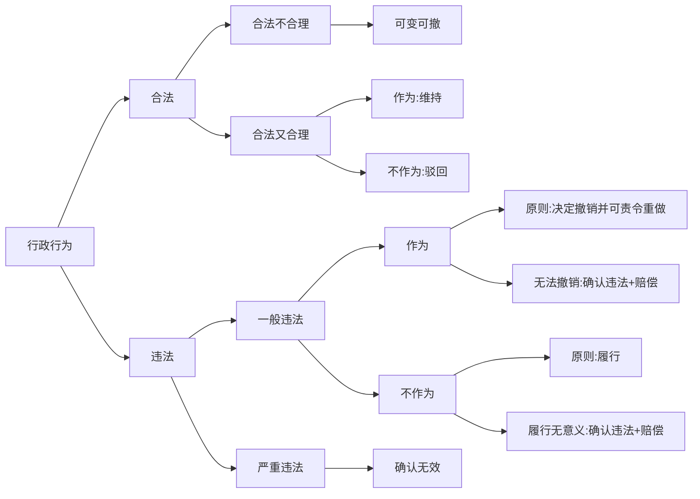

# 行政复议决定

## 最佳实践

1. 复议决定程序🚪复议_61
2. 复议审理期限🚪复议_62
3. 复议决定类型❤️🟩🚪21主观_6
    1. 变更决定(不合理)🚪复议_63
    2. 撤销决定(违法)🚪复议_64
    3. 确认违法决定(撤销无意义)🚪复议_65
    4. 履行决定(不作为)🚪复议_66
    5. 确认无效决定(重大违法)🚪复议_67
    6. 维持决定(没问题)🚪复议_68
    7. 驳回复议请求决定🚪复议_69
    8. 行政协议的复议决定🚪复议_71
    9. 赔偿决定🚪复议_72
4. 行政复议的调解🚪复议_73
5. 行政复议的和解🚪复议_74
6. 行政复议决定执行
    1. 行政复议决定的生效🚪复议_75
    2. 行政复议意见书🚪复议_76
    3. 被申请人不履行🚪复议_77
    4. 申请人、第三人不履行🚪复议_78
7. 行政复议的公开🚪复议_79_1
8. 复议决定的抄告🚪复议_79_2

## 决定程序🚪复议_61

1. 行政复议机关依照《行政复议法》审理行政复议案件，由行政复议机构对行政行为进行审查，提出意见，经行政复议机关的负责人同意或者集体讨论通过后，以行政复议机关的名义作出行政复议决定
1. 经过听证的行政复议案件，行政复议机关应当根据听证笔录、审查认定的事实和证据，作出行政复议决定
1. 提请行政复议委员会提出咨询意见的行政复议案件，行政复议机关应当将咨询意见作为作出行政复议决定的重要参考依据。

## 复议审理期限🚪复议_62
1. 普通程序: 60+30
2. 建议程序: 30

## 决定类型

### 变更决定🚪复议_63
行政行为有下列情形之一的，行政复议机关决定变更该行政行为：
1. 事实清楚，证据确凿，适用依据正确，程序合法，但是内容不适当；
2. 事实清楚，证据确凿，程序合法，但是未正确适用依据；
3. 事实不清、证据不足，经行政复议机关查清事实和证据行政复议机关不得作出对申请人更为不利的变更决定，但是第三人提出相反请求的除外。

### 撤销决定🚪复议_64
行政行为有下列情形之一的，行政复议机关决定撤销或者部分撤销该行政行为，并可以责令被申请人在一定期限内重新作出行政行为：
1. 主要事实不清、证据不足；
2. 违反法定程序；
3. 适用的依据不合法；
4. 超越职权或者滥用职权。

行政复议机关责令被申请人重新作出行政行为的，被申请人不得以同一事实和理由作出与被申请行政复议的行政行为相同或者基本相同的行政行为，但是行政复议机关以违反法定程序为由决定撤销或者部分撤销的除外。

若被申请人依法应当履行法定职责但却不履行的，应当决定其在一定期限内履行法定职责。当然，责令被申请人履行法定职责的前提，是要先确定被申请人存在履行职责却不履行且确属违法的情形，并认定该不作为违法，然后再责令其履行法定职责

### 确认违法决定🚪复议_65

行政行为有下列情形之一的，行政复议机关不撤销该行政行为，但是确认该行政行为违法：
1. 依法应予撤销，但是撤销会给国家利益、社会公共利益造成重大损害；
2. 程序轻微违法，但是对申请人权利不产生实际影响

行政行为有下列情形之一，不需要撤销或者责令履行的，行政复议机关确认该行政行为违法：

1. 行政行为违法，但是不具有可撤销内容；
2. 被申请人改变原违法行政行为，申请人仍要求撤销或者确认该行政行为违法；
3. 被申请人不履行或者拖延履行法定职责，责令履行没有意义。

### 履行决定🚪复议_66

被申请人不履行法定职责的，行政复议机关决定被申请人在一定期限内履行。

### 确认无效决定🚪复议_67

行政行为有实施主体不具有行政主体资格或者没有依据等重大且明显违法情形，申请人申请确认行政行为无效的，行政复议机关确认该行政行为无效。

### 维持决定🚪复议_68

如果行政复议机关经审理认为行政行为认定事实清楚，证据确凿，适用依据正确，程序合法，内容适当的，应当决定维持行政行为。

### 驳回复议请求决定🚪复议_69

行政复议机关受理申请人认为被申请人不履行法定职责的行政复议申请后，发现被申请人没有相应法定职责或者在受理前已经履行法定职责的，决定驳回申请人的行政复议请求。此属于复议机关经过对原行政行为进行审理，认为原行为（主要是不作为）合法，但是因为不适合作出维持决定，于是应当驳回申请人的复议请求。此为“审后再驳”，视为对原行为的复议维持

### 行政协议的复议决定🚪复议_71

被申请人不依法订立、不依法履行、未按照约定履行或者违法变更、解除行政协议的，行政复议机关决定被申请人承担依法订立、继续履行、采取补救措施或者赔偿损失等责任，

被申请人变更、解除行政协议合法，但是未依法给予补偿或者补偿不合理的，行政复议机关决定被申请人依法给予合理补偿。

### 赔偿决定🚪复议_72

1. 申请人提出行政赔偿请求的

    申请人在申请行政复议时一并提出行政赔偿请求，行政复议机关对依法应当不予赔偿的，在作出行政复议决定时，应当同时决定驳回行政赔偿请求；对依法应当给予赔偿的，在决定撤销或者部分撤销、变更行政行为或者确认行政行为违法、无效时，应当同时决定被申请人依法给予赔偿；确认行政行为违法的，还可以同时责令被申请人采取补救措施

2. 申请人没有提出行政赔偿请求的

    申请人在申请行政复议时没有提出行政赔偿请求的，行政复议机关在依法决定撤销或者部分撤销、变更罚款，撤销或者部分撤销违法集资、没收财物、征收征用、摊派费用以及对财产的查封、扣押、冻结等行政行为时，应当同时责令被申请人返还财产，解除对财产的查封、扣押、冻结措施，或者赔偿相应的价款

## 行政复议的调解🚪复议_73

## 行政复议的和解🚪复议_74

## 行政复议决定执行

1. 行政复议决定的生效🚪复议_75

    依法送达行政复议决定书。行政复议机关作出行政复议决定，应当制作行政复议决定书，并加盖印章。行政复议决定书一经送达，即发生法律效力。

1. 行政复议意见书🚪复议_76
    1. 制作机关：行政复议机关。
    2. 制作条件：在办理行政复议案件过程中，发现被申请人或者其他下级行政机关的有关行政行为违法或者不当的，复议机关可以向其制发行政复议意见书，
    3. 后续处理：有关机关应当自收到行政复议意见书之日起60日内，将纠正相关违法或者不当行政行为的情况报送行政复议机关

1. 被申请人不履行🚪复议_77

    被申请人应当履行行政复议决定书、调解书、意见书。
    
    被申请人不履行或者无正当理由拖延履行行政复议决定书、调解书、意见书的，行政复议机关或者有关上级行政机关应当责令其限期履行，并可以约谈被申请人的有关负责人或者予以通报批评，

1. 申请人、第三人不履行🚪复议_78

    申请人、第三人逾期不起诉又不履行行政复议决定书、调解书的，或者不履行最终裁决的行政复议决定的，按照下列规定分别处理：
    1. 维持行政行为的行政复议决定书，由作出行政行为的行政机关依法强制执行，或者申请人民法院强制执行；
    2. 变更行政行为的行政复议决定书，由行政复议机关依法强制执行，或者申请人民法院强制执行；
    3. 行政复议调解书，由行政复议机关依法强制执行，或者申请人民法院强制执行。

## 行政复议的公开🚪复议_79_1

行政复议机关根据被申请行政复议的行政行为的公开情况，按照国家有关规定将行政复议决定书向社会公开，

## 复议决定的抄告🚪复议_79_2

县级以上地方各级政府办理以本级人民政府工作部门为被申请人的行政复议案件，应当将发生法律效力的行政复议决定书、意见书同时抄告被申请人的上一级主管部门。

## 法律责任

    1. 被申请人违反规定，不提出书面答复或者不提交作出行政行为的证据、依据和其他有关材料，或者阻挠、变相阻挠公民、法人或者其他组织依法申请行政复议的，对负有责任的领导人员和直接责任人员依法给予警告、记过、记大过的处分；进行报复陷害的，依法给予降级、撤职、开除的处分；构成犯罪的，依法追究刑事责任。🚪复议_80, 81

    2. 被申请人不履行或者无正当理由拖延履行行政复议决定书、调解书、意见书的，对负有责任的领导人员和直接责任人员依法给予警告、记过、记大过的处分；经责令履行仍拒不履行的，依法给予降级、撤职、开除的处分，🚪复议_82, 83

1. 不予受理: 驳回是维持
🍐甲去工商局领结婚证，区工商局不予受理。甲不服，去区政府申请行政复议，受理之后，审理认为由于该职权主体不是工商局，应该是民政局，所以不作为合法。作出复议决定，驳回甲的复议申请，视为维持。

2. 不合理: 变更
🍐区市场监督管理局对甲商店罚款20万，甲商店认为罚款20万过重，向市市场监督管理局申请复议，改为10万。属于合法不合理，可以变更。

3. 不作为+可履行: 履行
🍐乙过了法考申请法律职业资格证书，但是行政机关在法定期间内未颁发，属于不作为，乙申请行政复议，复议机关审理认为应该颁发，作出履行决定。

4. 不作为+不可履行: 确认违法+赔偿
🍐甲带着儿子去卖瓜，一群流氓打了他的儿子抢了他的瓜。甲报警，警察不出警。甲申请复议，此时履行已经无意义（人已经被打，瓜已经被抢），作出确认违法决定。

🍐甲公司未申报上年度营业所得税，A市税务局责令其补缴2万元税款，并罚款1万元，甲公司不服，申请行政复议，下列说法正确的是？
A.申公司应当向市政府申请行政复议
B.甲公司可以直接提起行政诉讼
C.该公司未按时补缴，A市税务局可以书面通知银行划拨其存款
D.复议的申请期限为60日

答案: CD
A项错误，税务局是被申请人，复议机关是省税务局。
B项错误，分情况讨论，对补缴税款不服，复议前置；对补缴税款和罚款均不服，复议前置：对罚款不服，不需要复议前置。
C项正确。税务局有强制执行权。
D项正确。复议申请期限60日。

🍐A船舶公司向甲区政府申请筹建和经营渡口，甲区政府向当地B海事管理机构征求意见，B海事管理机构复函认定A船舶公司目前不具备筹建和经营渡口的条件，甲区政府经过勘验、调查、取证后作出了不予许可的决定，A船舶公司不服决定申请复议，下列说法正确的是？

A.专家评估的时间计人行政许可期限
B.复议决定一经送达即发生效力
C.A船舶公司可以对复函提起诉讼
D.复议机关应列B海事管理机构为第三人

答案:B
A项错误，不计算在内。
B项正确。
C项错误，复函没有对外部作出，不具有外部性，不是具体行政行为。
D项错误，B海事管理机构与本案没有利害关系。

市人社局将田某的养老保险关系转人社会保险关系，田某不服，认为自已应按事业单位保险缴纳，于是向市政府申请行政复议。市政府作出维持的复议决定。田某不服，向法院提起行政诉讼，在审理过程中法院以该案不属于行政案件受案范围为由，作出驳回起诉的裁定。则下列说法正确的是？
A.田某应当在收到复议决定书之日起60日内向法院提起诉讼
B.市政府对市人社局作出的行政行为的合法性不承担举证责任
C.本案应由中级法院管辖
D.法院应一并裁定驳回针对市人社局行政行为和市政府复议决定的起诉

A项错误，15日。
B项错误，复议维持共同告，原行为的举证责任由原机关和复议机关共同承担。
C项错误，复议维持共同告，由原机关确定级别管辖，基层法院管辖。
D项正确。原行为和复议决定一并驳回。