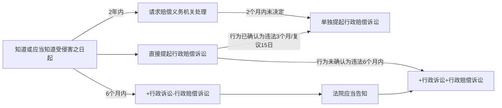

# 国家赔偿法

## 国家赔偿责任的构成要件
1. 主体要件: 行政+司法

    行政机关、被授权组织、受委托组织及其工作人员；行使侦查、检察、审判职权的机关以及看守所、监狱管理机关及其工作人员。

1. 行为要件: 职务行为
1. 结果要件: 合法权益+侵犯人身权财产权+直接损失天（人身权被侵犯，才会有精神损害)

1. 因果要件: 相关

🍐案例:
1. 警察执法过程中将甲打伤，甲能否提起民事诉讼，让警察承担赔偿责任？

    不可以提起民事诉讼。因为警察在执法过程中，不再具有个人身份，其身份已经被背后的行政机关所吸收，不是民事法律关系，不能提起民事诉讼。

2. 警察执法过程中，被甲打伤，警察能否提起民事诉讼，让甲承担赔偿责任？
    不可以提起民事诉讼，理由同上。

3. 公安局局长开车去岳母家路上与甲的车辆发生轻微刷蹭，公安局局长拿出手枪将甲打死。个人行为国家不赔；由个人赔，刑事附带民事解决。

2. 张某开了美容院，被市场监督管理局认定违法作出查封。查封过程中导致门窗设备等破坏，张某心理素质差生病住院花费5000元，查封期间2个月未营业。门窗设备的修复费用，要赔；导致张某生病住院花费的医疗费5000元，不赔：停业2个月少赚50万，预期收益不赔：停业2个月期间必要的经常性费用开支，比如租金、折旧费、留守职工工资、保管费、仓储费、税费等，要赔。

## 行政赔偿

### 行政赔偿范围🚪赔偿法_3~5

1. 人身权🚪赔偿法_3

    1. 违法拘留或者违法采取限制公民人身自由的行政强制措施的；
    2. 非法拘禁或者以其他方法非法剥夺公民人身自由的；
    3. 以殴打、虐待等行为或者唆使、放纵他人以殴打、虐待等行为造成公民身体伤害或者死亡的；
    4. 违法使用武器、警械造成公民身体伤害或者死亡的；
    5. 造成公民身体伤害或者死亡的其他违法行为。

1. 财产权🚪赔偿法_4

    1. 违法实施罚款、吊销许可证和执照、责令停产停业、没收财物等行政处罚的；
    2. 违法对财产采取查封、扣押、冻结等行政强制措施的；
    3. 违法征收、征用财产的；
    4. 造成财产损害的其他违法行为。

1. 其他违法行为

    1. 不履行法定职责行为；
    2. 行政机关及其工作人员在履行行政职责过程中作出的不产生法律效果，但事实上损害公民、法人或者其他组织人身权、财产权等合法权益的行为；

4. 不承担赔偿责任🚪赔偿法_5

    1. 与行使职权无关的个人行为
    2. 受害人自己致害
    3. 第三人致害
    4. 不可抗力致害

### 行政赔偿请求人🚪赔偿法_6

1. 受害的公民、法人或其他组织
2. 公民死亡的，其继承人和其他有扶养关系的亲属有权请求
3. 法人或组织终止的，其权利承受人有权请求

### 赔偿义务机关🚪赔偿法_7~8

1. 派出机构: 设立该派出机构的行政机关为赔偿义务机关。如公安派出所侵权，由公安局赔偿
1. 法律、法规授权的组织: 被授权组织
1. 行政机关委托的组织或个人: 委托机关
1. 实施侵权的行政机关被撤销的: 继续行使被撒销行政机关职能的行政机关或没有继续行使其职权的行政机关的，撤销该赔偿义务机关的行政机关为赔偿义务机关。
2. 非诉执行案件: 执行的根据错误的，申请强制执行的行政机关为赔偿义务机关

3. 复议机关加重损害的: 最初造成侵害的行政机关为赔偿义务机关，但复议决定加重损害的，复议机关对加重的部分进行赔偿（按份责任分开赔）。

### 赔偿提出🚪赔偿法_9

1. 赔偿请求人要求赔偿，应当先向赔偿义务机关提出，
2. 也可以在申请行政复议或者提起行政诉讼时一并提出。

### 行政赔偿诉讼参加人

公民、法人或者其他组织一并提起行政赔偿诉讼中的当事人地位，按照其在行政诉讼中的地位确定，行政诉讼与行政赔偿诉讼当事人不一致的除外。

1. 原告

    资格转移:

    公民死亡：（1）其继承人和其他有扶养关系的人；（2）支付受害公民医疗费、丧葬费等合理费用的人
    法人或者其他组织分立、合并、终止，承受其权利的法人或者其他组织。

2. 被告

    1. 共同侵权
        共同侵权行政机关为共同被告
        漏加转：赔偿请求人坚持对其中一个或者几个侵权机关提起行政赔偿诉讼，以被起诉的机关为被告，未被起诉的机关追加为第三人。

    1. 复议加重
        复议决定加重损害的，复议机关与原行政行为机关为共同被告
        漏加转：赔偿请求人坚持对作出原行政行为机关或者复议机关提起行政赔偿诉讼，以被起诉的机关为被告，未被起诉的机关追加为第三人。
    
    1. 强制执行
        申请人民法院强制执行其行政行为，因据以强制执行的行政行为违法而发生行政赔偿诉讼的，申请强制执行的行政机关为被告

### 举证责任

1. 原告: 谁主张谁举证：对行政行为造成的损害提供证据

2. 被告: 
    举证责任倒置：
    1. 原告因被告的原因导致无法举证的，由被告承担举证责任；
    2. 原告主张其被限制人身自由期间受到身体伤害，被告否认相关损害事实或者损害与违法行政行为存在因果关系的，被告应当提供相应的证据证明

### 行政赔偿诉讼程序

#### 一并提起赔偿诉讼

1. 释明义务

    原告提起行政诉讼时未一并提起行政赔偿诉讼，人民法院审查认为可能存在行政赔偿的，应当告知原告可以一并提起行政赔偿诉讼。

1. 时间

    法定：第一审庭审终结前提起，符合起诉条件的，法院应当受理酌定：第一审庭审终结后、宣判前提起，是否准许由法院决定

1. 起诉期限

    公民、法人或者其他组织提起行政诉讼时一并请求行政赔偿的，适用行政诉讼法有关起诉期限的规定。

1. 从属性
    一并提起行政赔偿诉讼，法院经审查认为行政诉讼不符合起诉条件的，对一并提起的行政赔偿诉讼，裁定不予立案；已经立案的，裁定驳回起诉

#### 复议决定中的赔偿
1. 起诉期限: 复议决定书送达之日起15日
2. 知一半: 最长保护期为1年

#### 被确认为违法

1. 行为错
    行政行为被有权机关依照法定程序撤销、变更、确认违法或无效

2. 人错
    实施行政行为的行政机关工作人员因该行为被生效法律文书或监察机关政务处分确认为渎职、滥用职权的

### 行政赔偿责任划分 

1. 共同侵权
    两个以上行政机关共同实施违法行政行为，或者行政机关及其工作人员与第三人恶意串通作出的违法行政行为，造成合法权益损害，应当承担连带赔偿责任。
    一方承担连带赔偿责任后，对于超出其应当承担部分，可以向其他连带责任人追偿。

2. 分别侵权
    两个以上行政机关分别实施违法行政行为造成同一损害，每个行政机关的违法行为都足以造成全部损害的，各个行政机关承担连带赔偿责任
    两个以上行政机关分别实施违法行政行为造成同一损害的，法院应当根据其违法行政行为在损害发生和结果中的作用大小，确定各自承担相应的行政赔偿责任；难以确定责任大小的平均承担责任。
3. 第三人致害
    由于第三人行为造成公民、法人或者其他组织损害的，应当由第三人依法承担侵权赔偿责任；第三人赔偿不足、无力承担赔偿责任或者下落不明，行政机关又未尽保护、监管、救助等法定义务的，法院应当根据行政机关未尽法定义务在损害发生和结果中的作用大小，确定其承担相应的行政赔偿责任。
4. 不可抗力等致害
    由于不可抗力等客观原因造成公民、法人或者其他组织损害，行政机关不依法履行、拖延履行法定义务导致未能及时止损或者损害扩大的，人民法院应当根据行政机关不依法履行、拖延履行法定义务行为在损害发生和结果中的作用大小，确定其承担相应的行政赔偿责任

### 行政赔偿诉讼判决
#### 驳回原告诉讼请求
1. 原告主张的损害没有事实根据
2. 原告主张的损害与违法行政行为没有因果关系
3. 原告的损失已经通过行政补偿等其他途径获得充分救济
4. 原告请求行政赔偿的理由不能成立的其他情形

#### 精神损害

消除影响、恢复名誉、赔礼道，履行方式可以双方协商，协商不成的，法院应当责令被告以适当的方式履行

造成严重后果的，应当判决支付相应的精神损害抚慰金造成严重后果：

（1）受害人被非法限制人身自由超过6个月：
（2）受害人经鉴定为轻伤以上或者残疾；
（3)受害人经诊断、鉴定为精神障碍或者精神残疾，且与违法行政行为存在关联；
（4）受害人名誉、荣誉、家庭、职业、教育等方面遭受严重损害，且与违法行政行为存在关联

后果特别严重：（1）受害人被限制人身自由10年以上；（2）受害人死亡；（3）受害人经鉴定为重伤或者残疾一至四级，且生活不能自理；（4）受害人经诊断、鉴定为严重精神障碍或者精神残疾一至二级，生活不能自理，且与违法行政行为存在关联

#### 财产损害
1）限期返还财产、恢复原状；无法返还财产、恢复原状的，判决被告限期支付赔偿金和相应的利息损失；

2）法院审理行政赔偿案件，可以对行政机关赔偿的方式、项目、标准等予以明确，赔偿内容确定的，应当作出具有赔偿金额等给付内容的判决；行政赔偿决定对赔偿数额的确定确有错误的，法院判决予以变更；

3）违法行政行为造成公民、法人或者其他组织财产损害，不能返还财产或者恢复原状的，按照损害发生时该财产的市场价格计算损失；市场价格无法确定，或者该价格不足以弥补公民、法人或者其他组织损失的，可以采用其他合理方式计算。

1. 征收征用

    违法征收征用土地、房屋，法院判决给予被征收人的行政赔偿，不得少于被征收人依法应当获得的安置补偿权益

2. 停产停业期间必要的经常性开支
   
    （1）必要留守职工的工资；(2)必须缴纳的税款、社会保险费；(3)应当缴纳的水电费、保管费、仓储费、承包费；（4）合理的房屋场地租金、设备租金、设备折旧费；（5）维系停产停业期间运营所需的其他基本开支。

3. 直接损失

    1)存款利息、贷款利息、现金利息；（2）机动车停运期间的营运损失；(3)通过行政补偿程序依法应当获得的奖励、补贴等；（4)对财产造成的其他实际损失

## 司法赔偿

### 归责原则

违法归责原则: 刑事拘留

1. 违反刑诉法规定的条件采取拘留措施的；
2. 违反刑诉法规定的程序采取拘留措施的；
3. 依照刑诉法规定的条件和程序对公民采取拘留措施，但是拘留时间超过刑诉法规定的时限；
4. 违法刑事拘留的人身自由赔偿金自拘留之日起计算

结果归责原则

1. 对公民采取逮捕措施后，决定撤销案件、不起诉或者判决宣告无罪终止追究刑事责任的；
2. 依照审判监督程序再审改判无罪，原判刑罚（限制或剥夺人身权的刑罚）已经执行的；
3. 依照审判监督程序再审改判无罪，原判罚金、没收财产已经执行的。

### 刑事司法赔偿范围

1. 侵犯人身权:
    1. 错误拘留：违法拘留或依法但超时拘留后，决定撤销案件、不起诉或者判决宣告无罪终止追究刑事责任的。
    2. 错误逮捕：对公民采取逮捕措施后，决定撤销案件、不起诉或者判决宣告无罪终止追究刑事责任的
    3. 错误判决：依照审判监督程序再审改判无罪，原判刑罚已经执行的。数罪并罚的案件经再审改判部分罪名不成立，监禁期限超出再审判决确定的刑期，公民对超期监禁申请国家赔偿的，应当决定予以赔偿。
    4. 违法使用武器警械：违法使用武器、警械造成公民身体伤害或者死亡的

2. 侵犯财产权
    1. 违法对财产采取查封、扣押、冻结、追缴等措施的。
    2. 依照审判监督程序再审改判无罪，原判罚金、没收财产已经执行的。

3. 不予赔偿的情形：

    1. 公民因自己的原因（如虚伪陈述、伪造证据等）而致害的。
    2. 行使侦查、检察、审判职权的机关以及看守所、监狱管理机关的工作人员与行使职权无关的个人行为。
    3. 错拘在法定时限内不赔。
    4. 依法不负刑事责任、不追究刑事责任的人被羁押的。一有罪之人（不负不追究）：赔后不赔前。
    5. 判处管制、有期徒刑缓刑、假释、减刑、保外就医、剥夺政治权利等依法改判无罪的，但事前被羁押的除外一无罪之人（无实刑）：赔前不赔后。

总结:

2. 有罪之人不负不追究刑事责任: 赔后不赔前
3. 有罪之人无实刑: 前后都不赔
4. 无罪之人无实刑: 赔前不赔后
5. 无罪之人有实刑: 前后都要赔

### 司法赔偿的义务机关：后置原则

案件类型|赔偿义务机关
--|--
违法拘留|决定拘留的机关（公安机关、检察院）
错误逮捕|决定逮捕的机关（检察院、法院）（赔偿后置）
一审判决有罪（判决未生效）|一审法院
生效判决错误(再审改判无罪)|作出原生效判决的法院（一审判有罪，二审维持原判的，二审法院赔偿）

> [!tips]
> 一审判决有罪（判决未生效）的情形:
> 1. 一审判有罪，二审改判无罪
> 2. 一审判有罪，二审发回重审，一审改判无罪，
> 3. 一审判有罪，二审发回重审后，检察院撤诉
> 4. 一审判有罪，二审发回重审，一审退回检察院补充侦查，检察院不起诉或撤销案件。

### 司法赔偿的程序(赔偿义务机关处理前置)

#### 申请

1. 赔偿请求人
    1. 受害的公民死亡，其继承人和其他有扶养关系的亲属有权申请国家赔偿
    2. 申请人不是受害人本人需证明关系
    3. 同一顺序继承人有数人时，其中一人或者部分人作为赔偿请求人申请国家赔偿的，申请效力及于全体。赔偿请求人为数人时，其中一人或者部分赔偿请求人非经全体同意，申请撤回或者放弃赔偿请求，效力不及于未明确表示撤回申请或者放弃赔偿请求的其他赔偿请求人。

2. 申请材料
    1. 申请书事项：受害人自然情况；具体的要求、事实根据和理由；日期。
    2. 当面递交申请书的，赔偿义务机关应当当场出具加盖专用印章并注明收讫日期的书面凭证
    3. 申请材料不齐全的，赔偿义务机关应当当场或者在5日内一次性告知需要补正的全部内容

#### 受理

1. 作出赔偿决定，应当充分听取赔偿请求人的意见，并可以与赔偿请求人就赔偿方式、赔偿项目和赔偿数额进行协商，
2. 决定赔偿的，应当制作赔偿决定书，并自作出决定之日起10日内送达赔偿请求人。
3. 赔偿义务机关决定不予赔偿的，应当自作出决定之日起10日内书面通知赔偿请求人，并说明不予赔偿的理由。

赔偿义务机关在规定期限内未作出是否赔偿的决定，对赔偿的方式、项目、数额有异议的，或者赔偿义务机关作出不予赔偿决定的，赔偿请求人可以自期限届满之日起30日内向赔偿义务机关的上一级机关申请复议；赔偿请求人不服复议决定的，可以在收到复议决定之日起30日内向复议机关所在地的同级法院赔委会申请作出赔偿决定

【若赔偿义务机关是人民法院的】赔偿义务机关在规定期限内未作出赔偿的决定，对赔偿的方式、项目、数额有异议的，或者赔偿义务机关作出不予赔偿决定的，赔偿请求人可以向其上一级人民法院赔委会申请作出赔偿决定

#### 法院赔委会

1. 组成

    中院以上法院设赔委会，由本院3人以上审判员组成，组成人数为单数，实行少数服从多数原则

1. 申请书

    赔偿请求人向赔委会申请作出赔偿决定，应当递交赔偿申请书一式四份

1. 委托代理人

    赔偿请求人可以委托1至2人作为代理人。赔偿义务机关、复议机关可以委托本机关工作人员1至2人作为代理人。

1. 举证

    1. 法院赔偿委员会处理赔偿请求，赔偿请求人和赔偿义务机关对自己提出的主张，应当提供证据
    2. 被羁押人在羁押期间死亡或者丧失行为能力的，赔偿义务机关的行为与被羁押人的死亡或者丧失行为能力是否存在因果关系，赔偿义务机关应当提供证据

1. 审理

    1. 赔偿委员会审理案件依法不公开进行
    2. 书面审，必要时，可调查情况、收集证据。损害事实及因果关系有争议的，可听取陈述和申辩，并可质证。

2. 作出决定

    自收到赔偿申请之日起3个月内制作赔偿委员会决定书。经本院院长批准，可以延长3个月。决定书由赔偿委员会主任审核签发，加盖人民法院院印

1. 决定错误的纠正

    1.赔偿请求人或者赔偿义务机关对赔偿委员会作出的决定，认为确有错误的，可以向上一级法院赔偿委员会提出申诉
    2.生效后，经本院院长决定或者上级法院指令，赔委会应当在2个月内重新审查并依法作出决定，上一级法院赔委会也可以直接审查并作出决定，
    3.最高检对各级法院赔委会作出的决定，上级检察院对下级法院赔委会作出的决定，发现违反《国家赔偿法》规定的，应当向同级法院赔委会提出意见，同级法院赔委会应当在2个月内重新审查并依法作出决定。

### 国家赔偿的方式与计算标准

#### 侵犯人身权

1. 侵犯人身自由权

    支付误工费，每日赔偿金按照国家上年度职工日平均工资计算。
    上年度，是指赔偿义务机关作出赔偿决定时的上一年度；复议机关或者法院赔偿委员会改变原赔偿决定，按照新作出决定时的上一年度国家职工平均工资标准计算人身自由赔偿金
    注意：作出赔偿决定、复议决定时国家上一年度职工平均工资尚未公布的，以已经公布的最近年度职工平均工资为准。

2. 侵犯生命健康权
    1. 身体伤害
        1. 支付医疗费、护理费、误工费，误工费每日赔偿金按国家上年度职工日平均工资计算，最高额为年平均工资的5倍；
        2. 护理期限应当计算至公民恢复生活自理能力时止。公民因残疾不能恢复生活自理能力的，可以根据其年龄、健康状况等因素确定合理的护理期限，一般不超过20年。

    2. 部分或全部劳动能力丧失

        1. 支付医疗费、护理费、残疾生活辅助具费、康复费等因残疾而增加的必要支出和继续治疗所必需的费用，以及残疾赔偿金；残疾赔偿金根据丧失劳动能力的程度，按照国家规定的伤残等级确定，最高不超过国家上年度职工年平均工资的20倍；
        2. 造成全部丧失劳动能力的，对其扶养的无劳动能力的人，还应当支付生活费；
        3. 医疗费赔偿根据医疗机构出具的医药费、治疗费、住院费等收款凭证，结合病历和诊断证明等相关证据确定。赔偿义务机关对治疗的必要性和合理性提出异议的，应当承担举证责任；
        4. 护理费赔偿参照当地护工从事同等级别护理的劳务报酬标准计算，原则上按照一名护理人员的标准计算护理费；但医疗机构或者司法鉴定人有明确意见的，可以参照确定护理人数并赔偿相应的护理费

    3. 死亡

        1. 支付死亡赔偿金加丧葬费，总额为国家上年度职工年平均工资的20倍，对其生前扶养的无劳动能力人支付生活费；
        2. 对其扶养的无劳动能力人的生活费发放标准，参照作出赔偿决定时被扶养人住所地所属省级人民政府确定的最低生活保障标准执行。被扶养的人是未成年人的，生活费给付至18周岁止；其他无劳动能力的人，生活费给付至死亡时止；
        3. 能够确定扶养年限的，生活费可协商确定并一次性支付。不能确定扶养年限的，可按照20年上限确定扶养年限并一次性支付生活费，被扶养人超过60周岁的，年龄每增加一岁，扶养年限减少一年；被扶养人年龄超过确定扶养年限的，被扶养人可逐年领取生活费至死亡时止

#### 侵害财产权

1. 赔偿方式与计算标准

    1. 处罚款、罚金、追缴、没收财产或者违法征收、征用财产的，返还财产；
    2. 查封、扣押、冻结财产的，解除对财产的查封、扣押冻结，造成财产损坏或者灭失的，能够恢复原状的恢复原状，不能恢复原状的，按照损害程度给付相应的赔偿金；
    3. 已经拍卖或者变卖的，给付拍卖或者变卖所得的价款；变卖的价款明显低于财产价值的，应当支付相应的赔偿金；
    4. 吊销许可证和执照、责令停产停业或查封的，赔偿停产停业期间必要的经常性费用开支（如留守职工工资、必须缴纳的税费、水电费、房屋场地租金、设备租金、设备折旧费等必要的经常性费用）；
    5. 返还执行的罚款或者罚金、追缴或者没收的金钱，解除冻结的汇款的，应当支付银行同期存款利息，利率参照赔偿义务机关作出赔偿决定时中国人民银行公布的人民币整存整取定期存款一年期基准利率确定，不计算复利。

2. 赔偿金支付
    
    先申请再申请：赔偿请求人向赔偿义务机关提出支付申请一机关自收到申请之日起7日内，向财政部门提出支付申请一财政部门15日内向赔偿请求人支付赔偿金

#### 精神损害赔偿责任

1. 适用范围

    1.公民以人身权受到侵犯为由提出国家赔偿申请，请求精神损害赔偿的，适用《最高人民法院关于审理国家赔偿案件确定精神损害赔偿责任适用法律若干问题的解释》（在本表中以下简称本解释）。
    2.法人或者非法人组织请求精神损害赔偿的，人民法院不予受理。

1. 释明义务及后果

    1.公民以人身权受到侵犯为由提出国家赔偿申请，未请求精神损害赔偿，或者未同时请求消除影响、恢复名誉、赔礼道漱以及精神损害抚慰金的，人民法院应当向其释明。2.经释明后不变更请求，案件审结后又基于同一侵权事实另行提出申请的，人民法院不予受理

1. 是否存在精神损害

    1. 存在
    
        赔偿义务机关有《国家赔偿法》第3条第17条规定情形之一，依法应当承担国家赔偿责任的，可以同时认定该侵权行为致人精神损害。
    
    2. 不存在

        但是赔偿义务机关有证据证明该公民不存在精神损害，或者认定精神损害违背公序良俗的除外。

2. 存在精神损害，如何处理

    1.侵权行为致人精神损害，应当为受害人消除影响、恢复名誉或者赔礼道歉。
    2.侵权行为致人精神损害并造成严重后果，应当在支付精神损害抚慰金的同时，视案件具体情形，为受害人消除影响、恢复名誉或者赔礼道歉。
    3.受害人对损害事实和后果的发生或者扩大有过错的，可以根据其过错程度减少或者不予支付精神损害抚慰金。

3. 消除影响恢复名誉与赔礼道歉

    1. 适用方式
    
        消除影响、恢复名誉与赔礼道，可以单独适用，也可以合并适用，并应当与侵权行为的具体方式和造成的影响范围相当
    
    2. 协商制度

        1.人民法院可以根据案件具体情况，组织赔偿请求人与赔偿义务机关就消除影响恢复名誉或者赔礼道歉的具体方式进行协商。
        2.协商不成作出决定的，应当采用下列方式：（1）在受害人住所地或者所在单位发布相关信息；（2）在侵权行为直接影响范围内的媒体上予以报道；（3）赔偿义务机关有关负责人向赔偿请求人赔礼道歉。

    3. 消除影响、恢复名誉与赔礼道歉
        载人决定书:

        1. 决定为受害人消除影响、恢复名誉或者赔礼道歉的，应当载人决定主文。
        2. 赔偿义务机关在决定作出前已为受害人消除影响、恢复名誉或者赔礼道歉，或者原侵权案件的纠正被媒体广泛报道，客观上已经起到消除影响、恢复名誉作用，且符合本解释规定的，可以在决定书中予以说明。
        3. 决定中载明的支付精神损害抚慰金及其他责任承担方式，赔偿义务机关应当履行

    4. 造成严重后果

        1. 情形
        
            1.无罪或者终止追究刑事责任的人被羁押6个月以上。
            2.受害人经鉴定为轻伤以上或者残疾
            3.受害人经诊断、鉴定为精神障碍或者精神残疾，且与侵权行为存在关联。
            4.受害人名誉、荣誉、家庭、职业、教育等方面遭受严重损害，且与侵权行为存在关联。
        
        2. 赔偿计算
            
            致人精神损害，造成严重后果的，精神损害抚慰金一般应当在《国家赔偿法》第33条、第34条规定的人身自由赔偿金、生命健康赔偿金总额的50%以下（包括本数）酌定。

        3. 后果特别严重

            1. 情形
                1. 受害人无罪被羁押10年以上。
                2. 受害人死亡。
                3. 受害人经鉴定为重伤或者残疾一至四级且生活不能自理
                4. 受害人经诊断、鉴定为严重精神障碍或者精神残疾一至二级，生活不能自理，且与侵权行为存在关联的
            
            2. 赔偿计算
                后果特别严重，或者虽然不符合上述情形但是确有证据证明前述标准不足以抚慰的，可以在50%以上酌定。
        4. 精神损害抚慰金的数额

            1. 考量因素

                精神损害抚慰金的具体数额，应当在兼顾社会发展整体水平的同时，参考下列因素合理确定：
                1.精神受到损害以及造成严重后果的情况
                2.侵权行为的目的、手段方式等具体情节
                3.侵权机关及其工作人员的违法、过错程度、原因力比例；
                4.原错判罪名、刑罚轻重、羁押时间；
                5.受害人的职业、影响范围；
                6.纠错的事由以及过程；7.其他应当考虑的因素

            2. 数额

                1.精神损害抚慰金的数额一般不少于1000元；数额在1000元以上的，以千为计数单位；
                2.赔偿请求人请求的精神损害抚慰金少于1000元，且其请求事由符合本解释规定的造成严重后果情形，经释明不予变更的，按照其请求数额支付

        1. 备注

            1. 人民法院审理《国家赔偿法》第38条所涉侵犯公民人身权的国家赔偿案件，以及作为赔偿义务机关审查处理国家赔偿案件，涉及精神损害赔偿的，参照本解释规定；
            2. 本解释自2021年4月1日起施行。本解释施行前的其他有关规定与本解释不一致的，以本解释为准

