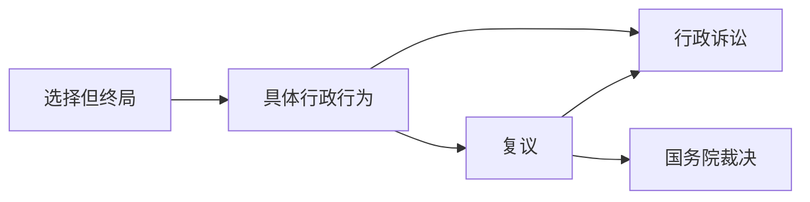

# 行政复议与诉讼

## 最佳实践

1. 自由选择🚪政诉_44❤️🟨🚪19主观_4
2. 复议前置🚪政诉解释_56 
    1. 不作为要复议前置. ❤️🟨🚪21主观_3
    2. 不公开复议前置
3. 复议诉讼冲突🚪政诉解释_57, 58
    1. 既复议又诉讼, 先立案管辖
    2. 复议前置撤回复议, 不能诉讼

## 行政复议与行政诉讼的异同
1. 相同

    1. 目的都是为了解决行政争议，都要对行政行为的合法性进行审查
    2. 审理依据都是行政法律法规
    3. 作出的都是对当事人有约束力的决定和裁判

2. 不同:

    行政复议是行政，行政诉讼是司法。

1. 总结
    
    -|行政复议|行政诉讼
    --|--|--
    广度|具体+附带审查规范性文件|具体（复议终局除外）+附带审查规范性文件
    深度|合法+合理|原则合法去+附条件合理
    程序|一次复议（省部级行为二次复议）|二审终审
    效率|简便、免费|复杂、成本高

## 行政复议与行政诉讼的衔接关系

### 自由选择🚪政诉_44

自由选择关系，是指除非法律、法规规定必须先申请行政复议，当事人可以自由选择申请行政复议还是提起行政诉讼。🚪政诉_44

### 复议前置🚪政诉解释_56

法律、法规规定应当首先向行政复议机关申请行政复议，对行政复议决定不服再向法院提起行政诉讼的，行政复议机关不予受理或者受理后超过行政复议期限不作答复的，公民、法人或者其他组织可以自收到不予受理决定书之日起或者行政复议期满之日起15日内，依法向法院起诉🚪政诉解释_56

1. 情形

    1. 认为行政机关存在🚪复议_11规定的`未履行法定职责`情形
    2. 申请政府信息公开，行政机关`不予公开`。此也为行政机关的不作为，同样应当复议前置
    3. 对行政机关`当场作出的行政处罚决定不服的`
    4. 对行政机关作出的侵犯其已经依法取得的`自然资源`的所有权或者使用权的决定不服
        1. 自然资源的权属争议案件复议前置的必要性
        2. 行政行为条件：该行政行为必须是确权决定
        3. 权益条件：当事人认为行政机关的行政行为侵犯自己已经依法取得的自然资源所有权或使用权需要注意的是，此处当事人的“认为”包括两项内容，一是认为被诉行政行为违法；二是认为自已已经依法取得了该自然资源所有权或使用权，而不是必须持有手续完备的所有权或者使用权证、法院判决文书。
    5. 法律、行政法规规定应当先向行政复议机关申请行政复议的其他情形
        1. 《税收征收管理法》中关于`纳税争议`的规定，具体可以表述为涉及税收款额的“交不交、谁来交、交多少、怎么交”时，需要复议前置。税务机关作出的其他行政行为则适用复议和诉讼自由选择的方式。
        2. 禁止或限制经营者集中的行为。根据《反垄断法》规定，不服反垄断执法机构禁止或限制`经营者集中`的行为，需要先经复议后才能诉讼。

### 相对复议终局

当事人不服省部级行政机关作出的行政行为时，既可以直接起诉，也可以向原机关申请行政复议。如果当事人选择行政复议并对复议决定不服的，仍然是既可以向法院起诉，也可以申请国务院作出最终裁决。

### 绝对复议终局

当事人对行政行为不服，必须先申请行政复议，复议决定具备终局效力，不得再提起行政诉讼，

出人境管理最终复议决定。《出境人境管理法》第64条第1款规定：“`外国人`对依照本法规定对其实施的继续盘问、拘留审查、限制活动范围、遣送出境措施不服的，可以依法申请行政复议，该行政复议决定为最终决定。”

### 行政决定终局
当事人对这类行政行为不服的，不得申请行政复议，也不得提起行政诉讼。

1. 签证、外国人停留居留权。《出境人境管理法》第36条规定：“公安机关出入境管理机构作出的不予办理普通签证延期、换发补发，不予办理外国人停留居留证件、不予延长居留期限的决定为最终决定。”

2. 对外国人处限期出境的处罚决定不得复议诉讼。《出境人境管理法》第81条第1、2款规定：“外国人从事与停留居留事由不相符的活动，或者有其他违反中国法律、法规规定，不适宜在中国境内继续停留居留情形的，可以处限期出境。外国人违反本法规定，情节严重，尚不构成犯罪的，公安部可以处驱逐出境。公安部的处罚决定为最终决定。”

### 连接

## 复议诉讼冲突🚪政诉解释_57, 58

1. 行政复议已经被依法受理的，当事人在法定复议期限以内不得提起诉讼；行政诉讼已经被依法受理的，则不得再申请行政复议。
2. 复议和诉讼管辖竞合的处理：当事人`脚踩两只船`，就同一行政行为，同时既申请行政复议，又提起行政诉讼的，应当由最先立案的一方管辖。如果复议机关和法院同时立案的，则应当由当事人在复议和诉讼中作出选择。🚪政诉解释_57
3. 行政复议机关受理之后作出复议决定之前，当事人依法申请撤回行政复议申请获得准许的，仍然有权提起行政诉讼。但是，如果属于复议前置，则当事人在撤回复议申请后，不得提起行政诉讼🚪政诉解释_58

## 案例
### 复议前置

1. 自然资源的确权行为

    复议前置的原因：法院案件量大：案件更专业；促进社会和谐。

    🍐县政府向甲颁发集体土地使用权证，甲认为土地面积太小，不需要复议前置。`不属于土地确权争议`。
    🍐县政府向甲颁发集体土地使用权证，甲的邻居乙认为该土地使用权证和自己的土地面积有所重合，需要复议前置。属于土地确权争议。
    🍐甲向乡政府申请宅基地使用权证，乡政府向县政府审批，甲收到批件认为面积太小。甲可以申请复议，也可以提起行政诉讼，不需要复议前置。
    🍐甲拥有两块林地使用权证，乙不服，向乡政府申请，乡政府又给乙颁发了重合地块的林地使用权证。甲不服，应该复议前置，认为该行为侵犯了自己已有的自然资源使用权。

2. 纳税争议：交不交、交多少、谁来交。
    🍐“薇娅案”包括三个行为：责令补缴税款要复议前置；罚款不需要复议前置；收取滞纳金不需要复议前置。

3. `禁止或限制经营者集中`的行为需要复议前置，但是经营者集中`涉及的罚款`等行政处罚`不需要复议前置`

### 复议终局
1. 自然资源的复议终局。`行政区划`是行政专属主管权，不能诉讼。

🍐区政府依据国务院行政区划决定，给甲颁发了集体土地使用权证，乙认为该行为与他之前取得的集体土地使用权证有重合，不服，复议前置。复议机关是省政府(国务院行政区规定必须找省政府)，乙是申请人，区政府是被申请人，甲是第三人。甲若对复议决定不服，不能再起诉，复议终局。

2. 出入境管理。体现国家主权，不能复议、不能诉讼，行政终局。
    1. 依据《出入境管理法》作出的继续盘问、拘留审查，可以复议，不得再起诉，复议终局。
    2. 依据《治安管理处罚法》作出的拘留，可以复议，可以诉讼。

## 案例

🍐广东省海丰县海丽国际高尔夫球场有限公司（以下简称海丽公司）与海丰县人民政府（以下简称海丰县政府）签订合同约定“征地范围南边的临海沙滩及向外延伸一公里海面给予乙方作为该项目建设旅游的配套设施”。海丽公司在海丰县后门镇红源管区海丽国际高尔夫球场五星级酒店以南海域进行涉案弧形护堤的建设。2019年3月9日，案涉弧形护堤部分形成。2020年3月19日，海监部门在执法检查中发现该公司未取得海域使用权证擅自建设案涉弧形护堤，涉嫌违反《中华人民共和国海域使用管理法》（以下简称《海域法》）第3条的规定。经逐级上报，国家海洋局（1）立案审查。2021年3月，南海勘察中心受海监部门委托作出《汕尾市海丰县海丽国际高尔夫球场海岸线弧形护堤工程海域使用填海面积测量技术报告》，指出案涉弧形护堤填海形成非透水构筑物（堤坝），面积为0.1228公顷。

2021年6月2日，国家海洋局作出《行政处罚听证告知书》，告知海丽公司拟对其作出的处罚及事实和法律依据，经组织召开听证会，同年12月14日作出第12号行政处罚决定：认定海丽公司在未经有权机关批准的情况下，自2019年3月中旬进行案涉弧形护堤工程建设，以在海中直接堆筑碎石的方式进行填海活动，至2021年3月技术单位测量之日，填成弧形护堤面积为0.1228公顷。据此，依据《海域法》的有关规定和《财政部、国家海洋局关于加强海域使用金征收管理的通知》，责令该公司退还非法占用的海域，恢复海域原状，并处非法占用海域期间内该海域面积应缴纳的海域使用金15倍的罚款共计人民币82.89万元。该公司不服，申请行政复议。复议机关于2022年5月30日作出行政复议第12号处罚决定认为：关于海丽公司自2021年3月中旬进行案涉弧形护堤建设的认定与海监部门航空照片显示案涉弧形护堤2019年已存在的情况不一致，系认定事实不清，决定撤销第12号处罚决定。其后，国家海洋局经履行听证告知、举行听证会等程序，于2022年7月25日作出海监七处罚（2022）003号行政处罚决定书，指出证据显示2019年3月9日案涉弧形护堤已部分形成，至2021年3月17日海监机构委托技术单位进行现场测量之日，该弧形护堤非法占用海域的面积为0.1228公顷；处罚依据与具体内容与上述12号处罚决定相同。海丽公司对罚款不服，提起行政诉讼，请求法院撤销海监七处罚（2022）003号行政处罚决定书。

问题

1. 本案的复议机关是谁？海丽公司如果不服复议决定，应当如何获得救济？

    1. 本案的被申请人是国家海洋局，适用自我管辖，复议机关是国家海洋局。
    2. 海丽公司如果不服复议改变的复议决定：
        1. 海丽公司可以提起行政诉讼，被告是复议机关国家海洋局。
        2. 海丽公司可以申请国务院作出最终裁决。

2. 国家海洋局作出的“责令该公司退还非法占用的海域，恢复海域原状。”是何种类型行为？请说明理由。

    政强制措施。
    理由在于，根据法律规定，行政强制措施是指行政机关在行政管理过程中，为了制止违法行为，防止证据毁损，避免危险发生，控制危害扩大等情形，依法对公民的人身自由实施暂时性限制，或者对公民、法人或者其他组织的财产实施暂时性控制的行为。
    本案中，海丽公司在未取得海域许可证的前提下，因施工建设非法占用海域，国家海洋局作为主管机关，为了制止违法行为，避免危害后果进一步扩大，责令退还、恢复原状，此行为没有惩罚性，故属于行政强制措施。

3. 如何确定本案的管辖法院？
    从级别管辖看，本案的被告是国家海洋局，以国家海洋局确定案件的级别管辖，由中院管辖。
    从地域管辖看，当事人不服的行为是罚款，被诉行政行为是罚款，适用一般地域管辖，原告就被告，由被告所在地法院管辖。
    综上所述，本案由国家海洋局所在地中院管辖。

4. 海丽公司与海丰县政府签订的合同是何种行为？如果因海丰县政府未履行审批手续导致海丽公司无法取得海域使用权，发生合同违约纠纷，海丽公司提起诉讼，应当如何确定诉讼期限、管辖法院、法律适用、判决类型？

    (1)海丽公司与海丰县政府签订的合同是行政协议。
    （2）适用3年的诉讼时效。理由在于，根据法律规定，公民、法人或者其他组织对行政机关不依法履行、未按照约定履行行政协议提起诉讼的，诉讼时效参照民事法律规范确定。本案涉及合同违约纠纷，因此适用3年的诉讼时效。
    （3）管辖, 从级别管辖看，本案海丰县政府为被告，以海丰县政府确定级别管辖，由中院管辖。从地域管辖看，本案被诉行政行为涉及海域使用权，涉及不动产物权变动，由不动产所在地的法院管辖。
    综上所述，对本案有管辖权的法院是海域所在地的中院。
    （4）法律适用：《行政诉讼法》、民事法律规范。
    （5）被告未依法履行、未按照约定履行行政协议，人民法院结合原告诉讼请求，判决被告继续履行，并明确继续履行的具体内容；被告无法履行或者继续履行无实际意义的，人民法院可以判决被告采取相应的补救措施；给原告造成损失的，判决被告予以赔偿。

5. 海丽公司起诉时，是否有权对《财政部、国家海洋局关于加强海域使用金征收管理的通知》请求法院一并审理？法院如果审理认为该通知不合法，应当如何处理？

    1）有权请求法院一并审理。

    理由在于，依据法律规定，原告在就具体行政行为提起诉讼时，可以一并提出附带审查该具体行政行为作出时依据的规范性文件。
    本案中，国家海洋局作出行政处罚决定的依据是《财政部、国家海洋局关于加强海域使用金征收管理的通知》，且该通知属于规章以下的规范性文件。

    （2）法院如果审理认为该通知不合法，①法院不能将此文件作为认定行政行为合法的依据，并且在裁判文书中载明；②法院应当向文件的制定机关提出处理建议，可以抄送国务院、监察机关、备案机关；③可以在生效裁判的3个月内提出司法建议，接到司法建议应当在60日内作出书面答复；④向上一级法院备案，并层报最高院备案。

6. 本案如果海丽公司不服一审判决而上诉，二审法院的审理对象是什么？

    二审法院应当全面审查，对被诉行政行为和一审裁判进行全面审理和全面判决。本案中，二审法院审理对象是一审法院中被诉的行政行为即003号处罚决定中的罚款和被上诉的一审法院的裁判的合法性。

