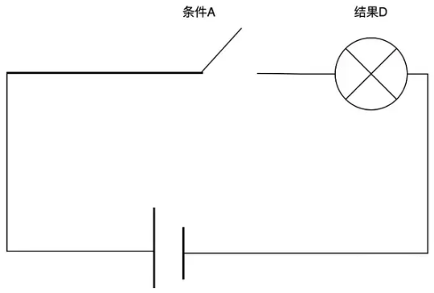

# 充分与必要条件

## 充分与必要条件

### 充分不必要条件

如果条件A是结论D的充分条件：A与其他条件是并连关系，即A、B、C中任意一个存在都可以使得D成立。

- 如果条件A存在，D肯定成立，即$A \Rightarrow D$
- 如果D不成立，则说明所有可能的条件A、B、C都不存在。因此A肯定也不存在，即$\neg B \Rightarrow \neg A$
- 如果条件A不存在，而条件C、D可能存在，也可以使得B成立，即$\neg A \nRightarrow \neg B$

### 必要不充分条件

条件A是结论D的必要条件：A与其他条件是串联关系，即条件A必须存在，且条件B、C也全部存在才可能导致B结论。

- 如果D成立了，说明所有条件都存在，肯定存在条件A。即$A \Leftarrow D$。
- 如果条件A不存在，串联少了一个条件，D也肯定不能成立，即$\neg A \Rightarrow \neg D$
- 如果D不成立，可能是C，D不成立在但A成立，即$\neg A \nLeftarrow \neg D$

### 充要条件

如果满足条件A能够推理出结果D成立，反之如果结果D成立能够推理出满足条件A即$A \iff D$。

## 条件的强度

当在执行制度规则时, 可以使用上述的条件论证关系, 比如`动产善意取得`的构件包含:

- 为`占有委托物`(非占有脱离物, 非货币)
- `无权处分`但有权利外观
- 受让人善意
- 以合理的价格转让
- 已经向受让人完成动产之交付

这五个条件是善意取得的`必要`条件, `只有`五个条件同时满足就可以100%推导出`动产善意取得`的结论

但是, 在一些生活事件的推断上, 推导就是就不是100%, 比如`变富有`的构件, 包含:

- `勤劳`
- `聪明`
- `运气`

这三个条件是`变富有`的`充分`条件, 但并非100%, 因为勤劳`不一定`能致富, 但是勤劳有`一定概率`致富, 比如这里可以设计为:

- `勤劳`50%概率致富
- `聪明`70%概率致富
- `运气`30%概率致富

那么一个具有`勤劳`, `聪明`, `运气`三个品质的人的致富概率就是$1-(1-0.5)*(1-0.7)*(1-0.3)=0.895$

## 和流程图的关系

流程图的串并联可以使用充分必要条件来解释:

上图中

- `绞肉`和`切菜`是`搅拌`的必要条件, 均满足才能进行搅拌.
- `筷子搅拌`和`勺子搅拌`是`搅拌`的充分条件, 任选其一即可.

## 和论证的关系

充分和必要条件里的`条件`就是论证的`前提`. 二者可以通用, `前提`的范围从词义的感觉上来说会更大一些.

## 参考

- Being Logical - A Guide to Good Thinking. D.Q.McInerny
- 简单的逻辑学. D.Q.麦克伦尼
- <https://www.zhihu.com/question/30469121>
