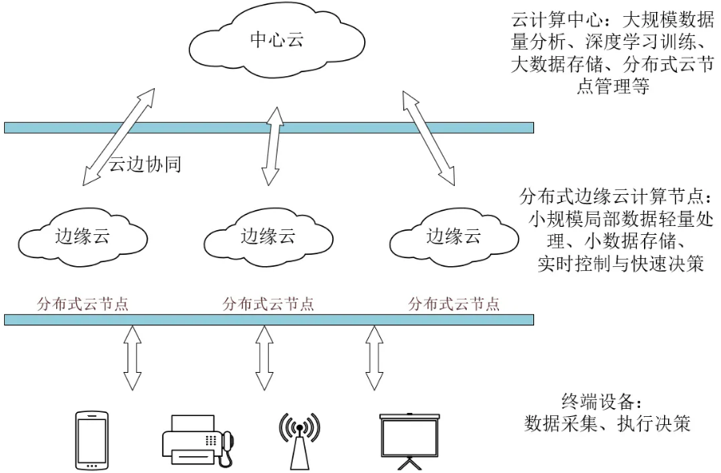

# 机器人技术概述

## 机器人的概念

Robot一词最早出现在1920年捷克作家卡雷尔·卡佩克(KarelCapek)所写的剧本中，剧中的人造劳动者取名为Robot,捷克语的意思是“苦力”“奴隶＂。英语的Robot一词就是由此而来的，以后世界各国都用Robot作为机器人的代名词。

## 机器人的定义和发展历程

机器人的发展过程可以简单地分为3个阶段：

1. 第一代机器人：示教再现型机器人。1947年，为了搬运和处理核燃料，美国橡树岭国家实验室研发了世界上第一台遥控的机器人。1962年美国又研制成功PUMA通用示教再现型机器人，这种机器人通过一个计算机，来控制一个多自由度的机械，通过示教存储程序和信息，工作时把信息读取出来，然后发出指令，这样的机器人可以重复地根据人当时示教的结果，再现出这种动作。比方说汽车的点焊机器人，它只要把这个点焊的过程学会以后，它总是重复这样一种工作。

2. 第二代机器人：感觉型机器人。示教再现型机器人对于外界的环境没有感知，这个操作力的大小，这个工件存在不存在，焊接的好与坏，它并不知道，因此，在20世纪70年代后期，人们开始研究第二代机器人，叫感觉型机器人，这种机器人拥有类似人在某种功能的感觉，如力觉、触觉、滑觉、视觉、听觉等，它能够通过感觉来感受和识别工件的形状、大小、颜色。

3. 第三代机器人：智能型机器人。20世纪90年代以来发明的机器人。这种机器人带有多种传感器，可以进行复杂的逻辑推理、判断及决策，在变化的内部状态与外部环境中，自主决定自身的行为。

4. 如今，随着电子技术和计算机技术的飞速发展，机器人技术已经准备进入4.0时代。所谓机器人4.0时代，就是把云端大脑分布在各个地方，充分利用边缘计算的优势，提供高性价比的服务，把要完成任务的记忆场景的知识和常识很好地组合起来，实现规模化部署。特别强调机器人除了具有感知能力实现智能协作，还应该具有一定的理解和决策能力，进行更加自主的服务。

## 机器人4.0的核心技术

机器人4.0主要有以下几个核心技术：包括云－边－端的无缝协同计算、持续学习与协同学习、知识图谱、场景自适应和数据安全。

### 云－边－端的无缝协同计算

由于目前网络带宽和延迟的制约，当前机器人主要采用以机器人本身进行运算为主，云端处理非实时、大计算量的任务为辅的系统架构。机器人的主要任务也可以简单地划分为感知，推理和执行三个步骤。随着5G时代的来临和边缘计算的部署，机器人到基站的延迟会大大降低。同时，边缘服务器可以在网络的边缘来处理机器人的数据，大大减少云端处理数据的压力，形成一个高效的数据处理架构。云－边－端一体的机器人系统是面向大规模机器人的服务平台，信息处理和生成主要在云－边－端上分布处理完成。通常情况下，云侧可以提供高性能的计算和知识存储，边缘侧用来进一步处理数据并实现协同和共享。机器人端只用完成实时操作的功能。由于目前对于机器人的需求日益增加，机器人4.0系统还要实现动态的任务迁移机制，可以合理地将任务迁移到云－边－端，实现云－边－端的协同计算。

### 持续学习与协同学习

持续学习与协同学习在机器人4.0时代也十分重要。在之前的机器人学习过程中，我们主要采用的方法是基于大量数据进行的监督学习方法。但是在机器人4.0时代，我们需要加上持续学习与协同学习的能力，使我们的机器人可以适应更加复杂的环境。具体来说，我们希望机器人可以通过少量数据来建立基本的识别能力，然后可以自主地去找到更多的相关数据并进行自动标注。然后用这些自主得到的数据来对自己已有的模型进行重新训练来提高性能。随着这个过程的不断推移，我们可以把机器人的性能逐步提高。但是在实际的应用中，由于接触数据不一定会非常广泛，我们机器人学习的速度可能会受到很大的限制。所以我们同时也要采用大数据和云端的处理能力，让各种机器人之间的数据进行共享，保证机器人持续学习与协同学习的能力。进一步提高机器人学习的速度与精度。

### 知识图谱

目前在互联网和语音助手已经有了十分广泛的应用。但是不同于通常的百科类知识图谱，机器人应用的知识图谱应该具有一些不同的需求：

- 需要更加动态和个性化的知识。机器人在与人交互的同时，往往需要根据当前的环境来深入理解，从而提供更好的服务。因此，机器人必须具有记录不同时间不同环境发生的事件以及对应的信息，这些都是知识图谱不能提供的，必须从环境中获取。如果可以收集这些环境信息，机器人就可以提供更加个性化的服务。

- 知识图谱需要和机器人的感知与决策能力相结合，帮助机器人实现更高级的持续学习能力。从人工智能的发展来看，单一的算法并不能完全解决现有的AI问题，未来的发展一定是设计多种方法结合的AI系统。不同于以往的知识图谱独立运作的做法，知识图谱以后必须和感知决策更深入、有机的结合。具体来说，知识图谱可以从感知中获取信息，通过基础的感知加上场景理解，将获得的知识存入图谱，然后使用这部分信息可以进一步进行模式的挖掘(比如时间空间相关的模式)来获得更深层次的信息。知识图谱的知识也可以作为环境上下文信息提供给感知算法进行学习，从而实现自适应的感知算法。

由于云－边－端融合的需要，知识图谱分别存在千机器人侧，云侧和边缘侧。由于协同学习与实时处理的需求，知识以及其他相关信息(数据或者模型)也可以通过云侧、边缘侧进行分享。在未来的5G网络下，延迟已经不存在问题，我们更应该考虑充分利用边缘端和机器人端的计算能力，达到资源的最优利用。

### 场景自适应

主要通过对当前场景进行三维语义理解的基础上，主动观察场景内人和物之间的变化，预测可能发生的事件，从而影响之后的行动模式。这个技术的关键问题在于场景预测能力。场景预测就是机器人通过对场景内的各种人和物进行细致的观察，结合相关的知识和模型进行分析，并预测之后事件即将发生的时间，改变自己的行为模式。这部分的研究目前还属于比较初级的阶段，但是相信以后在持续学习、知识图谱等技术充分结合的基础上，这个方向未来会有更大的突破。使机器人实现感知－认知－行动，变得更加智能化和人性化。同时，云端融合在这里也会起到非常重要的作用，主要是在知识的共享方面，有可能单个机器人很难去根据当前场景来预测即将发生的情况，但是通过云－边－端融合，只要有一个机器人见过这种情况的发生，它就会将当时的数据保存到云端，进而分享给所有的机器人，其他机器人就可以来预测未来可能发生的这些危险情况。除了通过实际的物理世界进行观察以外，在云端通过大规模的模拟来预演可能发生的清况，可能也是另外一个获得更多的事件模式的有效方法。

### 数据安全

由于机器人配备了各种各样的传感器，在工作的过程中，会收集到很多信息，包括视觉数据、位置数据、语音数据等，这些重要的数据都需要得到保护。在机器人处于云－边－端融合的环境下，网络有可能会受到攻击，保护用户的数据安全变得尤其重要。云－边－端融合的机器人系统需要完整的数据安全保障机制，既要保证端到端的安全传输，也要保障服务器端的安全存储。只有确保了数据的输入输出都是安全的情况下，才能保证机器人的物理安全逻辑得到正确执行。除了保证原始的隐私数据外，通过用户数据推理得出的个性化数据包含了用户的隐私信息，同样也需要得到安全的保障。在云－边－端融合的环境下，机器人侧，云侧，边缘侧的数据安全需求也是不同的。因此需要不同的安全保障机制。在机器人本体方面需要重要的隐私数据的物理安全以及安全相关应用的代码安全。云侧和边缘侧需要对用户本身的数据以及推理得到的用户数据中的隐私信息做好保护，只有被授权的用户才有访问权。尽量避免敏感数据上传到云端，存储在云端的数据需要提供安全存储鉴别机制。

## 机器人的分类

如果按照要求的控制方式分类，机器人可分为操作机器人、程序机器人、示教再现机器人、智能机器人和综合机器人。

1. 操作机器人

    操作机器人的典型代表是在核电站处理放射性物质时远距离进行操作的机器人。在这种机器人中，具有人手操纵功能的部分称为主动机械手，进行类似千动作的部分称为从动机械手。其中从动机械手要大些，是用经过放大的力进行作业的机器人；主动机械手要小些。还有既可以用显微镜进行观察，又可以进行精密作业的机器人。

2. 程序机器人

    程序机器人可以按预先给定的程序、条件、位置进行作业。

3. 示教再现机器人

    示教再现机器人与盒式磁带的录放相似，机器人可以将所教的操作过程自动地记录在磁盘、磁带等存储器中，当需要再现操作时，可重复所教过的动作过程。示教方法有直接示教与遥控示教两种。

4. 智能机器人

    智能机器人既可以进行预先设定的动作，还可以按照工作环境的改变而变换动作。

5. 综合机器人

    综合机器人是由操纵机器人、示教再现机器人、智能机器人组合而成的机器人，如火星机器人。

如果按照应用行业来分，机器人可分为工业机器人、服务机器人和特殊领域机器人。

1. 工业机器人

    工业机器人包括搬运、焊接、装配、喷漆、检查等机器人，主要应用于现代化的工厂和柔性加工系统中。

2. 服务机器人

    比如娱乐机器人包括弹奏乐器的机器人、舞蹈机器人、玩具机器人等(具有某种程度的通用性)，也包括根据环境而改变动作的机器人。

3. 特殊领域机器人

    主要包括建筑、农业等机器人，主要应用千人们难以进入的核电站、海底、宇宙空间等场合。
