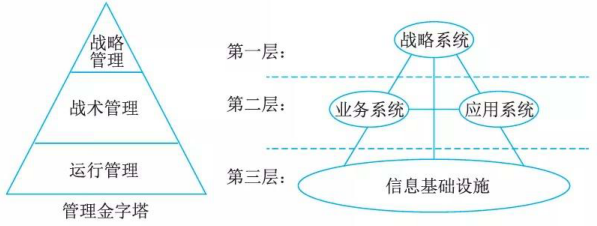

# 信息系统架构

## 最佳实践

### 考察问

- ❤️架构定义一个`()`和一组`()`。
    - 词汇表中包含一些`()`和`()`类型，
    - 约束指出系统是如何将这些构件和连接件`()`起来的。
- 信息系统架构分类
    - 物理结构
        - `()`式结构
        - `()`式结构
    - 逻辑结构
        - `()`综合
        - `()`综合
        - `()`综合
- 💛企业信息系统的总体框架✨只记第一层和第三层
    1. 战略管理: `()`系统
    2. 战术管理: `()`系统和`()`系统
    3. 运行管理: `()`

### 考察点

- 架构定义一个`词汇表`和一组`约束`。
    - 词汇表中包含一些`构件`和`连接件`类型，
    - 约束指出系统是如何将这些构件和连接件`组合`起来的。
- 信息系统架构分类
    - 物理结构
        - `集中`式结构
        - `分布`式结构
    - 逻辑结构
        - `横向`综合
        - `纵向`综合
        - `纵横`综合
- 企业信息系统的总体框架✨只记第一层和第三层
    1. 战略管理: `战略`系统
    2. 战术管理: `业务`系统和`应用`系统
    3. 运行管理: `信息基础设施`

## 架构风格

信息系统架构风格是描述某一特定应用领域中系统组织方式的惯用模式。架构风格定义了一个系统家族，即一个架构定义一个`词汇表`和一组`约束`。词汇表中包含一些`构件`和`连接件`类型，而这组约束指出系统是如何将这些构件和连接件`组合`起来的。

信息系统架构风格通常也遵循通用的架构风格，Garlan和Shaw给出的通用架构风格包括：

1. 数据流风格：批处理序列；管道／过滤器。
2. 调用／返回风格：主程序／子程序；面向对象风格；层次结构。
3. 独立构件风格：进程通信；事件系统。
4. 虚拟机风格：解释器；基于规则的系统。
5. 仓库风格：数据库系统；超文本系统；黑板系统。

## 信息系统架构分类

信息系统架构可分为物理结构与逻辑结构两种，物理结构是指不考虑系统各部分的实际工作与功能结构，只抽象地考察其硬件系统的空间分布情况。逻辑结构是指信息系统各种功能子系统的综合体。

1. 信息系统物理结构

    按照信息系统硬件在空间上的拓扑结构，其物理结构一般分为集中式与分布式两大类。

    l. 集中式结构

        集中式结构是指物理资源在空间上集中配置。早期的单机系统是最典型的集中式结构，它将软件、数据与主要外部设备集中在一套计算机系统之中。由分布在不同地点的多个用户通过终端共享资源组成的多用户系统，也属于集中式结构。

        集中式结构的优点是资源集中，便于管理，资源利用率较高。但是随着系统规模的扩大，以及系统的日趋复杂，集中式结构的维护与管理越来越困难，也不利于用户发挥在信息系统建设过程中的积极性与主动性。此外，资源过千集中会造成系统的脆弱，一旦主机出现故障，就会使整个系统瘫痪。在信息系统建设中，一般很少使用集中式结构。

    2. 分布式结构

        分布式系统是指通过计算机网络把不同地点的计算机硬件、软件、数据等资源联系在一起，实现不同地点的资源共享。各地的计算机系统既可以在网络系统的统一管理下工作，也可以脱离网络环境利用本地资源独立运作。

        分布式结构的主要特征是：可以根据应用需求来配置资源，提高信息系统对用户需求与外部环境变化的应变能力，系统扩展方便，安全性好，某个结点所出现的故障不会导致整个系统停止运作。然而由于资源分散，且又分属于各个子系统，系统管理的标准不易统一，协调困难，不利千对整个资源的规划与管理。

        分布式结构又可分为一般分布式与客户机／服务器模式。

        一般分布式系统中的服务器只提供软件与数据的文件服务，各计算机系统根据规定的权限存取服务器上的数据文件与程序文件。

        客户机／服务器结构中，网络上的计算机分为客户机与服务器两大类。服务器包括文件服务器、数据库服务器、打印服务器等；网络结点上的其他计算机系统则称为客户机。用户通过客户机向服务器提出服务请求，服务器根据请求向用户提供经过加工的信息。

2. 信息系统的逻辑结构

    对于一个工厂的管理信息系统，从管理职能角度划分，包括供应、生产、销售、人事、财务等主要功能的信息管理子系统。一个完整的信息系统支持组织的各种功能子系统，使得每个子系统可以完成事务处理、操作管理、管理控制与战略规划等各个层次的功能。在每个子系统中可以有自己的专用文件，同时可以共用系统数据库中的数据，通过接口文件实现子系统之间的联系。与之相类似，每个子系统有各自的专用程序，也可以调用服务于各种功能的公共程序，以及系统模型库中的模型。

    信息系统结构的综合：

    从不同的侧面，人们可对信息系统进行不同的分解。在信息系统研制的过程中，最常见的方法是将信息系统按职能划分成一个个职能子系统，然后逐个研制和开发。显然，即使每个子系统的性能均很好，并不能确保每个系统的优良性能，切不可忽视对整个系统的全盘考虑，尤其是对各个子系统之间的相互关系应做充分的考虑。因此，在信息系统开发中，强调各子系统之间的协调一致性和整体性。要达到这个目的，就必须在构造信息系统时注意对各种子系统进行统一规划，并对各子系统进行综合。

    l. 横向综合
        将同一管理层次的各种职能综合在一起，例如，将运行控制层的人事和工资子系统综合在一起，使基层业务处理一体化。
    2. 纵向综合
        把某种职能的各个管理层次的业务组织在一起，这种综合沟通了上下级之间的联系，如工厂的会计系统和公司的会计系统综合在一起，它们都有共同之处，能形成一体化的处理过程。
    3. 纵横综合
        主要是从信息模型和处理模型两个方面来进行综合，做到信息集中共享，程序尽量模块化，注意提取通用部分，建立系统公用数据库和统一的信息处理系统。

## 信息系统架构的一般原理

一个事物对环境的变化具有适应能力，意味着该事物能根据环境变化进行适当的改变，这种改变可能是局部的、表面的，也可能是全局的、本质性的。事物改变自己的程度与环境的变化程度，以及环境变化对事物产生的压力程度有关。事物之所以具有适应能力，是因为该事物中存在着一些基本部分，无论外界环境怎样变化，这些基本部分始终不变，另外还存在一些可随环境变化而变化的部分。对于不同的事物，不变的部分和变化的部分所占的比例是不同的。

因此，这里认为架构包含两个基本部分：组成成分和组成成分之间的关系。在外界环境方式变化时架构中组成成分和关系有些可能是不变的，有些则可能要产生很大的变化。在信息系统中，析出相对稳定的组成成分与关系，并在相对稳定部分的支待下，对相对变化较多的部分进行重新组织，以满足变化的要求，就能够使得信息系统对环境的变化具有一定的适应能力，即具有一定的柔性．这就是信息系统架构的基本原理。

## 信息系统常用4种架构挟型

[text](2_1信息系统常用4种架构模型🟡🟨💚.md)

## 企业信息系统的总体框架

要在企业中建立一个有效集成的ISA, 必须考虑企业中的四个方面：战略系统、业务系统、应用系统和信息基础设施。信息系统体系结构的总体参考框架如图所示。

信息系统体系结构总体参考框架由四个部分组成，即`战略`系统、`业务`系统、`应用`系统和`信息基础设施`。这四个部分相互关联，并构成与管理金字塔相一致的层次。

- 战略系统处在第一层，其功能与`战略`管理层次的功能相似，一方面向业务系统提出重组的要求。另一方面向应用系统提出集成的要求。
- 业务系统和应用系统同在第二层，属于`战术`管理层，业务系统在业务处理流程的优化上对企业进行管理控制和业务控制，应用系统则为这种控制提供计算机实现的手段，并提高企业的运行效率。
- 信息基础设施处在第三层，是企业实现信息化的基础部分，相当于`运行管理`层，它在为应用系统和战略系统提供数据上支持的同时，也为企业的业务系统实现重组提供一个有效的、灵活响应的技术上和管理上的支持平台。

### 战略系统

战略系统是指企业中与战略制定、高层决策有关的管理活动和计算机辅助系统。

在ISA中战略系统由两个部分组成，其一是为以计算机为基础的高层决策支持系统，其二是企业的战略规划体系。在ISA中设立战略系统有两重含义：一是它表示信息系统对企业高层管理者的决策支持能力；二是它表示企业战略规划对信息系统建设的影响和要求。

通常企业战略规划分成长期规划和短期规划两种，长期规划相对来说，比较稳定，如：调整产品结构；短期规划一般是根据长期规划的目的而制定，相对来说，容易根据环境、企业运作情况而改变，如：决定新产品的类型。

### 业务系统

业务系统是指企业中完成一定业务功能的各部分(物质、能量、信息和人)组成的系统。企业中有许多业务系统，如：生产系统、销售系统、采购系统、人事系统、会计系统等，每个业务系统由一些业务过程来完成该业务系统的功能，例如：会计系统，包括应付账款、应收账款、开发票、审计等业务过程。业务过程可以分解成一系列逻辑上相互依赖的业务活动，业务活动的完成有先后次序，每个业务活动都有执行的角色，并处理相关数据。

企业业务过程重组是以业务流程为中心，打破企业的职能部门分工，对现有的业务过程进行改进或重新组织，以求在生产效率、成本、质量、交货期等方面取得明显改善，提高企业的市场竞争力。据估计，企业业务过程重组可使企业的经济效率提高 70%~80% 。

业务系统作为一个组成成分在ISA中的作用是：对企业现有业务系统、业务过程和业务活动进行建模，并在企业战略的指导下，采用业务流程重组 (Business Process Reengineering, BPR) 的原理和方法进行业务过程优化重组，并对重组后的业务领域、业务过程和业务活动进行建模，从而确定出相对稳定的数据，以此相对稳定的数据为基础，进行企业应用系统的开发和信息基础设施的建设。

### 应用系统

应用系统即应用软件系统，指信息系统中的应用软件部分。软件按其与计算机硬件和用户的关系，可以分为系统软件、支持性软件和应用软件，它们具有层次性关系。

对于企业信息系统中的应用软件(应用系统)，一般按完成的功能可包含：事务处理系统TPS、管理信息系统MIS 、决策支持系统DSS 、专家系统ES 、办公自动化系统OAS 、计算机辅助设计／计算机辅助工艺设计／计算机辅助制造CAD/CAPP/CAM、制造资源计划系统MRP II等。对于其中的MIS、MRP II又可按所处理的业务，再细分为子系统生产控制子系统、销售管理子系统、采购管理子系统、库存管理子系统、运输管理子系统、财务管理子系统、人事管理子系统、设备管理子系统等。

无论哪个层次上的应用系统，从架构的角度来看，都包含两个基本组成部分：内部功能实现部分和外部界面部分。

这两个基本部分由更为具体的组成成分及组成成分之间的关系构成。界面部分是应用系统中相对变化较多的部分，主要由用户对界面形式要求的变化引起，功能实现部分中，相对来说，处理的数据变化较小，而程序的算法和控制结构的变化较多，主要由用户对应用系统功能需求的变化和对界面形式要求的变化引起。

### 企业信息基础设施

企业信息基础设施 (Enterprises Information Infrastructure, Ell) 是指根据企业当前业务和可预见的发展趋势，及对信息采集、处理、存储和流通的要求，构筑由信息设备、通信网络、数据库、系统软件和支待性软件等组成的环境。这里可以将企业信息基础设施分成三部分：技术基础设施、信息资源设施和管理基础设施。

1. 技术基础设施由计算机、网络、系统软件、支待性软件、数据交换协议等组成；
2. 信息资源设施由数据与信息本身、数据交换的形式与标准、信息处理方法等组成；
3. 管理基础设施指企业中信息系统部门的组织结构、信息资源设施管理人员的分工、企业信息基础设施的管理方法与规章制度等。

技术基础设施由千技术的发展和企业系统需求的变化，在信息系统的设计、开发和维护中，面临的变化因素较多，并且由千实现技术的多样性，完成同一功能有多种实现方式。信息资源设施在系统建设中的相对变化较小，无论企业完成何种功能，业务流程如何变化，都要对数据和信息进行处理，它们中的大部分不随业务改变而改变。企业为了适应环境的变化和满足竞争的需要，尤其在我国向市场经济转轨的阶段，我国经济政策的出台或改变，将在很大程度上造成企业规章制度、管理方法、人员分工以及组织结构的改变，因此，管理基础设施相对变化较多。
