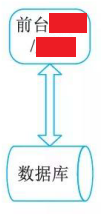
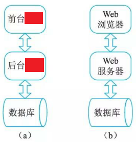
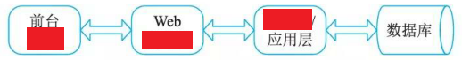
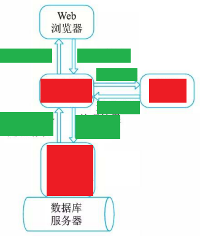
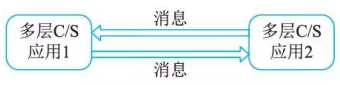
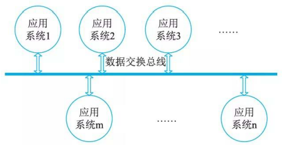
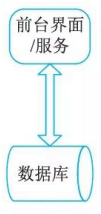
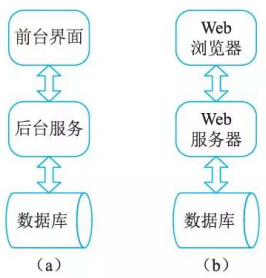
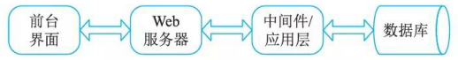
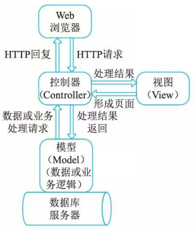

# 信息系统常用4种架构模型

## 最佳实践

### 考察问

- 信息系统常用4种架构模型
    - 单机应用模式(Standalone)
    - 客户机／服务器(Client/Server)模式
        - 两层C/S

            

        - 三层C/S与B/S结构

            
        - 多层C/S结构

            
        - MVC

            

    - 面向服务架构(SOA)模式

        

    - 企业数据交换总线

        

### 考察点

- 信息系统常用4种架构模型
    - 单机应用模式(Standalone)
    - 客户机／服务器(Client/Server)模式
        - 两层C/S

            

        - 三层C/S与B/S结构

            
        - 多层C/S结构

            
        - MVC

            

    - 面向服务架构(SOA)模式

        

    - 企业数据交换总线

        

## 信息系统常用4种架构模型

主要包括：单机应用系统、两层／多层C/S、MVC结构、面向服务的SOA与多服务集合和数据交换总线等。

## 单机应用模式(Standalone)

这种复杂的单机系统也有很多，它们大多都是专业领域的产品，如CAD/CAM领域的CATIA、Pro/Engineer, Autodesk的AutoCAD, 还有熟悉的Photoshop、CorelDraw, 等等。

## 客户机／服务器(Client/Server)模式

客户机／服务器模式是信息系统中最常见的一种。C/S概念可理解为基于TCP/IP协议的进程间通信IPC编程的“发送”与“反射”程序结构，即Client方向Server方发送一个TCP或UDP包，然后 Server方根据接收到的请求向Client方回送TCP或UDP数据包，目前 C/S 架构非常流行下面介绍四种常见的客户机／服务器的架构。

### 两层C/S

两层C/S, 其实质就是IPC客户端／服务器结构的应用系统体现。两层C/S结构通俗地说就是人们常说的＂胖客户端“模式。在实际的系统设计中，该类结构主要是指前台客户端＋后台数据库管理系统，如图所示。

在两层C/S结构中，图前台界面＋后台数据库服务的模式最为典型，传统的很多数据库前端开发工具(如Power Builder 、Delphi、VB)等都是用来专门制作这种结构的软件工具。两层C/S结构实际上就是将前台界面与相关的业务逻辑处理服务的内容集成在一个可运行单元中了。

### 三层C/S与B/S结构

三层C/S结构如图a所示，其前台界面送往后台的请求中，除了数据库存取操作以外，还有很多其他业务逻辑需要处理。三层C/S的前台界面与后台服务之间必须通过一种协议(自开发或采用标准协议)来通信(包括请求、回复、远程函数调用等)，通常包括以下7种：

- 基于TCP/IP协议，直接在底层Socket API基础上自行开发。这样做一般只适合需求与功能简单的小型系统。
- 首先建立自定义的消息机制(封装TCP/IP与Socket编程)，然后前台与后台之间的通信通过该消息机制来实现。消息机制可以基于XML, 也可以基于字节流(Stream) 定义。虽然是属于自定义通信，但是，它可以基于此构建大型分布式系统。
- 基于RPC编程。
- 基于CORBA/IIOP协议。
- 基于Java RMI。
- 基于J2EE JMS。
- 基于HTTP协议。比如浏览器与Web服务器之间的信息交换。这里需要指出的是HTTP不是面向对象的结构，面向对象的应用数据会被首先平面化后进行传输。

目前最典型的基于三层C/S结构的应用模式便是我们最熟悉、较流行的BS (Brower/Server ，浏览器／服务器)模式，前台界面如图b所示。

图b的BS 结构中， Web浏览器是一个用于文档检索和显示的客户应用程序，并通过超文本传输协议HTTP(Hyper Text Transfer Protocol)与Web服务器相连。该模式下，通用的、低成本的浏览器节省了两层结构的C/S模式客户端软件的开发和维护费用。这些浏览器大家都很熟悉，包括 MSInternet Explorer、Mozilla FireFox、NetScape等。

### 多层C/S结构

多层C/S结构一般是指三层以上的结构，在实践中主要是三层与四层，四层即前台界面(如浏览器)、Web服务器、中间件(或应用服务器)及数据库服务器，典型的客户机／服务器
软件结构如图所示。

多层客户机／服务器模式主要用千较有规模的企业信息系统建设，其中中间件一层主要完成以下几个方面的工作：

- 提高系统可伸缩性，增加并发性能。在大量并发访问发生的情况下， Web服务器可处理的并发请求数可以在中间件一层得到更进一步的扩展，从而提高系统整体并发连接数。
- 中间件／应用层这一层专门完成请求转发或一些与应用逻辑相关的处理，具有这种作用的中间件一般可以作为请求代理，也可作为应用服务器。中间件的这种作用在J2EE 的多层结构中比较常用，如BEA WebLogic、IBM WebSphere等提供的EJB容器，就是专门用以处理复杂企业逻辑的中间件技术组成部分。
- 增加数据安全性。在网络结构设计中，Web服务器一般都采用开放式结构，即直接可以被前端用户访问，如果是一些在公网上提供服务的应用，则Web服务器一般都可以被所有能访问与联网的用户直接访问。因此，如果在软件结构设计上从Web服务器就可以直接访问企业数据库是不安全的。因此，中间件的存在，可以隔离Web服务器对企业数据库的访问请求：Web服务器将请求先发给中间件，然后由中间件完成数据库访问处理后返回。

### MVC

MVC(Model-View-Controller) 的概念在目前信息系统设计中非常流行，严格来讲，MVC实际上是上述多层C/S结构的一种常用的标准化模式，或者可以说是从另一个角度去抽象这种多层C/S结构。

在J2EE架构中，View表示层指浏览器层，用于图形化展示请求结果；Controller控制器指Web 服务器层，Model模型层指应用逻辑实现及数据持久化的部分。目前流行的J2EE开发框架，如JSF、Struts、Spring、Hibernate等及它们之间的组合，如Struts+Spring+Hibernate  (SSH) 、JSP+Spring+Hibernate等都是面向MVC架构的。另外，PHP、Perl、MFC等语言都有 MVC的实现模式。

MVC主要是要求表示层(视图)与数据层(模型)的代码分开，而控制器则可以用千连接不同的模型和视图来完成用户的需求。从分层体系的角度来讲，MVC的层次结构如图所示，控制器与视图通常处于Web服务器一层，而根据“模型”有没有将业务逻辑处理分离成单独服务处理，MVC可以分为三层或四层体系。

### 面向服务架构(SOA)模式

上面所论述的客户机／服务器模式，无论多少层的C/S软件结构，对外来讲，都只是一个单结点应用(无论它由多个不同层的“服务”相互配合来完成其功能)，具体表现为一个门户网站、一个应用系统等。而多个单点应用相互通信的多服务结构也是一种信息系统常用的架构模式。

1. 面向服务架构

    如果两个多层C/S结构的应用系统之间需要相互进行通信，那么，就产生了面向服务架构，称为Service Oriented Architecture, 简称 SOA

    

    在SOA的概念中，将由多层服务组成的一个结点应用看作是一个单一的服务。在SOA的定义里，对“服务”的概念进行的广义化，即它不是指计算机层面的一个Daemon, 而是指向提供一组整体功能的独立应用系统。所谓独立应用系统是指：无论该应用系统由多少层服务组成，去掉任何一层，它都将不能正常工作，对外可以是一个提供完整功能的独立应用。这个特征便可以将面向服务架构与多层单服务体系完全区分开来。

    两个应用之间一般通过消息来进行通信，可以互相调用对方的内部服务、模块或数据交换和驱动交易等。在实践中，通常借助中间件来实现 SOA 的需求，如消息中间件、交易中间件等。面向服务架构在实践中，又可以具体分为异构系统集成、同构系统聚合、联邦体系结构等。

2. Web Service

    面向服务架构体现在Web应用之间，就成为了 Web Service, 即两个互联网应用之间可以相互向对方开放一些内部“服务”(这种服务可以理解为功能模块、函数、过程等)。

3. 面向服务架构的本质

    面向服务架构的本质是消息机制或远程过程调用(RPC)。虽然其具体的实现底层并不一定是采用RPC编程技术，但两个应用之间的相互配合确实是通过某种预定义的协议来调用对方的“过程”实现的，这与前节所讲多层架构的单点应用系统中，两个处于不同层的运行实例相互之间通信的协议类型基本是相同的。

## 企业数据交换总线

即企业数据交换总线，即不同的企业应用之间进行信息交换的公共通道，如图所示。

关于数据总线本身，其实质应该是一个称之为连接器的软件系统(Connector), 它可以基于中间件(如：消息中间件或交易中间件)构建，也可以基于CORBA/IIOP协议开发，主要功能是按照预定义的配置或消息头定义，进行数据(data)、请求(request)或回复(response)的接收与分发。

从理论上来讲，企业数据交换总线可以同时具有实时交易与大数据量传输的功能，但在实践中，成熟的企业数据交换总线主要是为实时交易而设计的，而对可靠的大数据量级传输需求往往要单独设计。如果采用CORBA为通信协议，交换总线就是对象请求代理(ORB), 也被称之为“代理 (Agent)体系”。另外，在交换总线上挂接的软件系统，有些也可以实现代理的功能，各代理之间可以以并行或串行的方式进行工作，通过挂接在同一交换总线上的控制器来协调各代理之间的活动。
