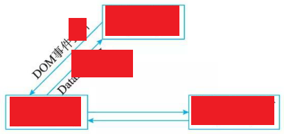
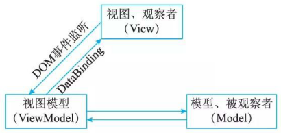
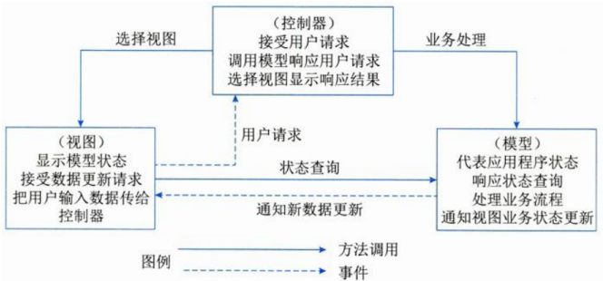
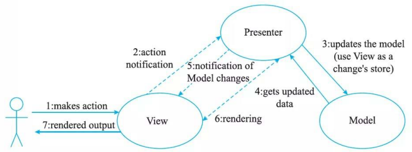
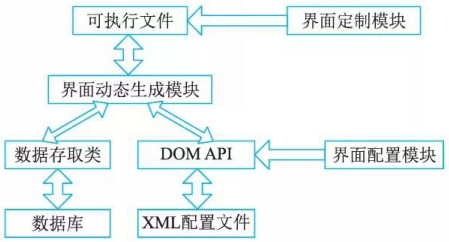

# 表现层框架设计


## 最佳实践


### 考察问

1. MVC中的视图`()`和数据直接通信, MVP中的则`()`
2. MVVM设计模式

    


### 考察点

1. MVC中的视图`可以`和数据直接通信, MVP中的则`不可`
2. MVVM设计模式

    


## 表现层设计橾式

###  MVC 模式

MVC强制性地把一个应用的输入、处理、输出流程按照视图、控制、模型的方式进行分离，形成了控制器、模型、视图三个核心模块。


1. 控制器(Controller)：接受用户的输入并调用模型和视图去完成用户的需求。该部分是用户界面与 Model 的接口。一方面它解释来自于视图的输入，将其解释成为系统能够理解的对象，同时它也识别用户动作，并将其解释为对模型特定方法的调用；另一方面，它处理来自于模型的事件和模型逻辑执行的结果，调用适当的视图为用户提供反馈。
2. 模型 (Model): 应用程序的主体部分。模型表示业务数据和业务逻辑。一个模型能为多个视图提供数据。由千同一个模型可以被多个视图重用，所以提高了应用的可重用性。
3. 视图 (View): 用户看到并与之交互的界面。视图向用户显示相关的数据，并能接收用户输入的数据，但是它并不进行任何实际的业务处理。视图可以向模型查询业务状态，但不能改变模型。视图还能接受模型发出的数据更新事件，从而对用户界面进行同步更新。


首先，控制器接收用户的请求，并决定应该调用哪个模型来处理；然后，模型根据用户请求进行相应的业务逻辑处理，并返回数据；最后，控制器调用相应的视图来格式化模型返回的数据，并通过视图呈现给用户。



使用 MVC 模式来设计表现层，可以有以下的优点。

1. 允许多种用户界面的扩展。在MVC模式中，视图与模型没有必然的联系，都是通过控制器发生关系，这样如果要增加新类型的用户界面，只需要改动相应的视图和控制器即可，而模型则无须发生改动。
2. 易千维护。控制器和视图可以随着模型的扩展而进行相应的扩展，只要保待一种公共的接口，控制器和视图的旧版本也可以继续使用。
3. 功能强大的用户界面。用户界面与模型方法调用组合起来，使程序的使用更清晰，可将友好的界面发布给用户。


### MVP 模式

MVP(Model-View-Presenter) 模式提供数据，View负责显示，Controller/Presenter 负责逻辑的处理。 MVP是从经典的模式MVC演变而来，它们的基本思想有相通的地方：Controller/Presenter负责逻辑的处理，Model提供数据，View负责显示。当然MVP与MVC也有一些显著的区别，MVC模式中元素之间“混乱”的交互主要体现在允许View和Model直接进行“交流”，这在MVP模式中是不允许的。在MVP中View并不直接使用Model,它们之间的通信是通过Presenter(MVC中的 Controller)来进行的，所有的交互都发生在Presenter内部，而在MVC中View会直接从Model 中读取数据而不是通过Controller 。

MVP不仅仅避免了View和Model之间的耦合，还进一步降低了Presenter对View的依赖。Presenter依赖的是一个抽象化的View, 即View实现的接口IView, 这带来的最直接的好处，就是使定义在Presenter中的UI处理逻辑变得易于测试。由于Presenter对View的依赖行为定义在接口IView中，只需要一个实现了这个接口的View就能对Presenter进行测试。MVP的结构如图所示。



使用 MVP模式来设计表现层，可以有以下的优点。

- 模型与视图完全分离，可以修改视图而不影响模型。
- 可以更高效地使用模型，因为所有的交互都发生在一个地方一Presenter内部。
- 可以将一个Presenter用千多个视图，而不需要改变Presenter的逻辑。这个特性非常的有用，因为视图的变化总是比模型的变化频繁。
- 如果把逻辑放在Presenter中，就可以脱离用户接口来测试这些逻辑(单元测试)。

###  MVVM 模式

MVVM模式正是为解决MVP中UI种类变多，接口也会不断增加的问题而提出的。

MVVM模式全称是模型－视图－视图模型(Model-View-ViewModel),它和MVC、MVP类似，主要目的都是为了实现视图和模型的分离，不同的是MVVM中，View与Model的交互通过ViewModel来实现。 ViewModel是MVVM的核心，它通过DataBinding实现View与Model之间的双向绑定，其内容包括数据状态处理、数据绑定及数据转换。例如，View中某处的状态和Model中某部分数据绑定在一起，这部分数据一旦变更将会反映到View层。而这个机制通过ViewModel来实现。

ViewModel, 即视图模型，是一个专门用于数据转换的控制器，它可以把对象信息转换为视图信息，将命令从视图携带到对象。它通过View发布对象的公共数据，同时向视图提供数据和方法。 View和ViewModel之间使用DataBinding及其事件进行通信。View的用户接口事件仍然由View 自身处理，并把相关事件映射到ViewModel, 以实现View中的对象与视图模型内容的同步，且可通过双向数据绑定进行更新。因此，程序员只需编写包含声明绑定的视图模板，以及Vi ewModel中的数据变更逻辑，就能使View获得响应式的更新。MVVM 流程设计如图所示。


在MVVM模式下View和Model不能直接通信，两者的通信只能通过ViewModel来实现。View Model通常要实现一个观察者，当数据发生变化，ViewModel能够监听到数据的变化，然后通知对应的视图做自动更新；而当用户操作视图，ViewModel也能监听到视图的变化，再通知数据做改动，从而形成数据的双向绑定。这使得 MVVM~更适用于数据驱动的场景，尤其是数据操作特别频繁的场景。


## 使用XML设计表现层，统一Web Form与Windows Form的外观

XML(可扩展标记语言)与HTML类似，是一种标记语言。与主要用于控制数据的显示和外观的 HTML标记不同，XML标记用于定义数据本身的结构和数据类型。 


由于Web应用程序对特定浏览器的局限以及性能问题，基于窗体表现形式的胖客户端应用程序又开始有了卷土重来的趋势。这两种应用程序各有优势，在未来很长一段时间这两种技术架构都会并存。因此，许多开发厂商在开发新产品时提出了既要支持胖客户端的表现形式，又要支持Web的表现形式。于是，有人提出将GUI用一个标准的形式描述，对于不同的表现形式，提供特定形式的转换器，根据GUI的描述转换成相应的表现形式。这就要求描述语言有非常好的通用性和扩展性， XML恰恰是这种描述语言理想的载体。

对于大多数应用系统，GUI主要是由GUI控件组成。控件可以看成是一个数据对象，其包含位置信息、类型和绑定的事件等。这些信息在XML中都可以作为数据结点保存下来，每一个控件都可以被描述成一个XML结点，而控件的那些相关属性都可以描述成这个XML结点的Attribute。由于XML本身就是一种树形结构描述语言，所以可以很好地支持控件之间的层次结构。同时，XML标记由架构或文档的作者定义，并且是无限制的，所以架构开发人员可以随意约定控件的属性，例如可以约定type="button”是一个按钮，type="panel“是一个控件容器，type="Constraint”是位置等。这样，整个 GUI 就可以完整而且简单地通过 XML 来描述。例如：

```xml
<component  type="panel"  constraint="  16,  22,  78,  200"  /> 
<component  type="button"  isvisible=" false" constraint ="l7,  222,  78,  20"/> </component> 
```

这么一段XML很清晰地表示一个控件容器位置是(16, 22, 78, 200), 包含了一个不可视按钮。用上述的XML形式将GUI按照数据描述的形式保存下来代替原先特有的表现形式所需要的GUI描述载体。然后，对于特定的表现技术，实现不同的解析器解析XML配置文件。根据XML中的标签，按照特有的表现技术实例化的GUI控件实例对象。例如，解析器遇到button, JFC解析器会给予JLabel对象，XSLT解析器会给予 `<button id=…>`这样一个HTML字符串，再调用特定表现技术的API将实例化出来的组件对象添加到GUI上显示。

## 表现层中UIP设计思想

UIP提供了一个扩展的框架，用于简化用户界面与商业逻辑代码的分离的方法，可以用它来写复杂的用户界面导航和工作流处理，并且它能够复用在不同的场景、并可以随着应用的增加而进行扩展。

使用UIP框架的应用程序把表现层分为了以下几层。

- User Interface Components：这个组件就是原来的表现层，用户看到的和进行交互都是这个组件，它负责获取用户的数据并且返回结果。
- User Interface Process Components：这个组件用于协调用户界面的各部分，使其配合后台的活动，例如导航和工作流控制，以及状态和视图的管理。用户看不到这一组件，但是这些组件为User Interface Components提供了重要的支持功能。

UIP的组件主要负责的功能是：管理经过User Interface Components的信息流；管理UIP中各个事件之间的事务；修改用户过程的流程以响应异常；将概念上的用户交互流程从实现或者涉及的设备上分离出来；保持内部的事务关联状态，通常是持有一个或者多个的与用户交互的事务实体。

因此，这些组件也能从UI组件收集数据，执行服务器的成组的升级或是跟踪UIP中的任务过程的管理。 


## 表现层动态生成设计思想

基于XML的界面管理技术可实现灵活的界面配置、界面动态生成和界面定制。其思路是用XML生成配置文件及界面所需的元数据，按不同需求生成界面元素及软件界面。

基于XML界面管理技术，包括界面配置、界面动态生成和界面定制三部分，如图所示。




界面配置是对用户界面的静态定义，通过读取配置文件的初始值对界面配置。由界面配置对软件功能进行裁剪、重组和扩充，以实现特殊需求。

界面定制是对用户界面的动态修改过程，在软件运行过程中，用户可按需求和使用习惯，对界面元素(如菜单、工具栏、键盘命令)的属性(如文字、图标、大小和位置等)进行修改。软件运行结束，界面定制的结果被保存。

系统通过DOMAPI读取XML配置文件的表示层信息(如初始界面大小、位置等)，通过数据存取类读取数据库中的数据层信息，运行时由界面元素动态生成界面。界面配置和定制模块在软件运行前后修改配置文件、更改界面内容。


