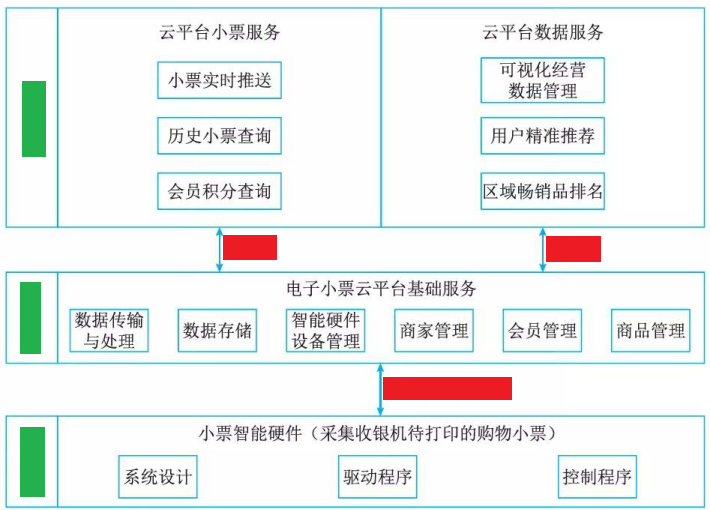
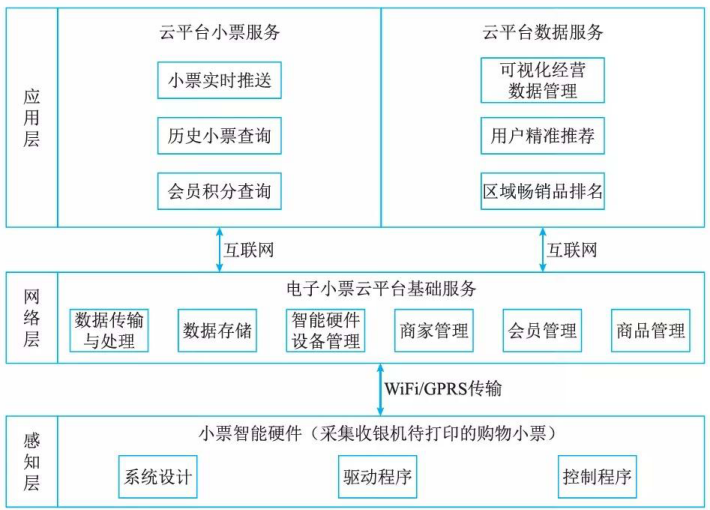
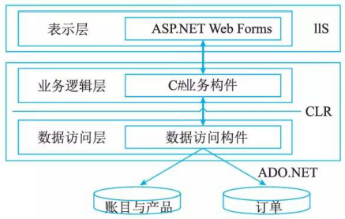
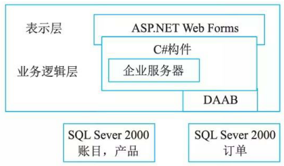
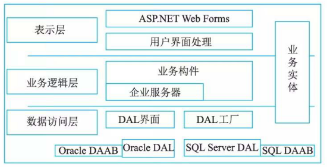
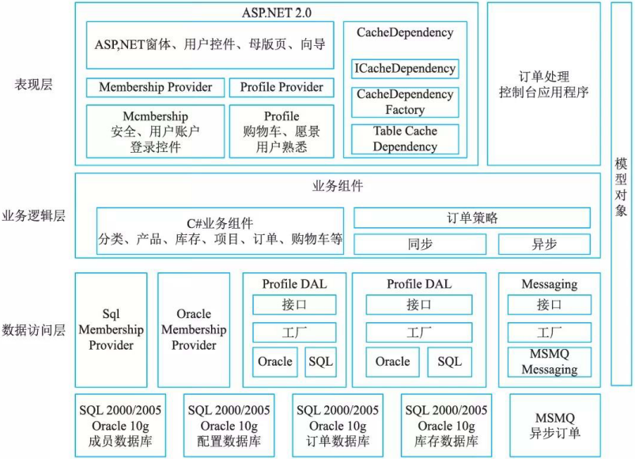
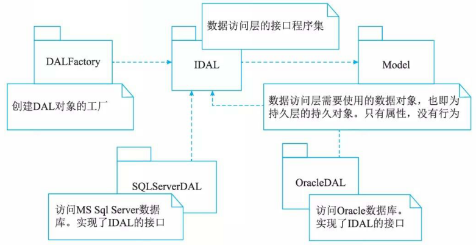
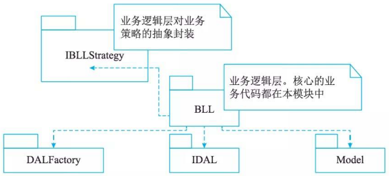
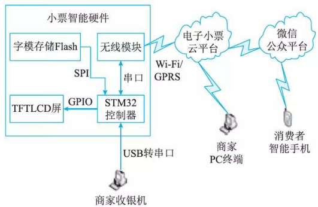

# 层次式架构案例分析

## 最佳实践

### 考察问

### 考察点

## 电子商务网站(网上商店PetShop)

PetShop的表示层是用ASP.Net设计的，也就是说，它应是一个BS系统。在．Net中，标准的BS分层式结构如图所示。

随着PetShop版本的更新，其分层式结构也在不断完善，例如PetShop 2.0, 就没有采用标准的三层式结构，如图 所示。

从图中可以看到，并没有明显的数据访问层设计。这样的设计虽然提高了数据访问的性能，但也同时导致了业务逻辑层与数据访问的职责混乱。一旦要求支持的数据库发生变化，或者需要修改数据访问的逻辑，由千没有清晰的分层，会导致项目做大的修改。而随着硬件系统性能的提高，以及充分利用缓存、异步处理等机制，分层式结构所带来的性能影响几乎可以忽略不计。

PetShop 3.0纠正了此前层次不明的问题，将数据访问逻辑作为单独的一层独立出来。PetShop 3.0的体系架构如图所示。

PetShop 4.0基本上延续了3.0的结构，但在性能上作了一定的改进，引入了缓存和异步处理机制，同时又充分利用了ASP.Net 2.0的新功能MemberShip。因此，PetShop4.0的系统架构如图所示。

比较3.0和4.0的系统架构图，其核心的内容并没有发生变化。在数据访问层(DAL)中，仍然采用DAL Interface抽象出数据访问逻辑，并以DAL Factory作为数据访问层对象的工厂模块。对于DAL Interface而言，分别有支持 MS-SQL的SQL Server DAL和支持Oracle的OracleDAL具体实现，而Model模块则包含了数据实体对象，其详细的模块结构如图所示。

可以看到，在数据访问层中，完全采用了“面向接口编程”思想。抽象出来的IDAL模块，脱离了与具体数据库的依赖，从而使得整个数据访问层有利于数据库迁移。DALFactory模块专门管理DAL对象的创建，便于业务逻辑层访问。SQLServerDAL和OracleDAL模块均实现IDAL模块的接口，其中包含的逻辑就是对数据库的Select、Insert、 Update和Delete操作。因为数据库类型的不同，对数据库的操作也有所不同，代码也会因此有所区别。

此外，抽象出来的IDAL模块，除了解除了向下的依赖之外，对于其上的业务逻辑层同样仅存在弱依赖关系，如图所示。

图中，BLL是业务逻辑层的核心模块，它包含了整个系统的核心业务。在业务逻辑层中，不能直接访问数据库，而必须通过数据访问层。注意，图中对数据访问业务的调用，是通过接口模块IDAL来完成的。既然与具体的数据访问逻辑无关，则层与层之间的关系就是松散耦合的。如果此时需要修改数据访问层的具体实现，只要不涉及IDAL的接口定义，那么业务逻辑层就不会受到任何影响。毕竟，具体实现的SQLServerDAL和OracalDAL根本就与业务逻辑层没有半点关系。

因为在PetShop 4.0中引入了异步处理机制，插入订单的策略可以分为同步和异步，两者的插入策略明显不同。但对于调用者而言，插入订单的接口是完全一样的，所以PetShop 4.0中设计了IBLLStrategy模块。虽然在 IBLLStrategy模块中，仅仅是简单的IOrderStategy,但同时也给出了一个范例和信息，那就是在业务逻辑的处理中，如果存在业务操作的多样化或者是今后可能的变化，均应利用抽象的原理、或者使用接口、或者使用抽象类，从而脱离对具体业务的依赖。不过在Pet Shop中，由千业务逻辑相对简单，这种思想体现得不够明显。也正因为此，Pet Shop将核心的业务逻辑都放到了一个模块BLL中，并没有将具体的实现和抽象严格地按照模块分开。所以表示层和业务逻辑层之间的调用关系，其耦合度相对较高。

## 基于物联网架构的电子小票服务系统

### 电子小票物联网架构

采用感知层、网络层和应用层的3层物联网体系架构模型，电子小票物联网的架构见图。

感知层的小票智能硬件能够取代传统的小票打印机，在不改变商家原有收银系统的前提下，采集收银机待打印的购物小票信息，通过Wi-Fi/GPRS传输将其存储到电子小票云平台。

网络层支持感知层电子小票信息的传输、处理和存储，并为顾客和线下商家的应用提供服务支撑，实现的功能为：数据传输与处理、数据存储、智能硬件设备管理、商家管理、会员管理和商品管理等。

应用层是电子小票服务系统与顾客、商家的接口，包括云平台小票服务和数据服务：云平台小票服务基于微信公众平台向顾客提供电子小票实时推送、历史小票查询和会员积分查询等服务；云平台数据服务向线下零售商家提供可视化经营数据管理、用户精准推荐和区域畅销品排名等服务。

### 电子小票服务系统架构

电子小票服务系统由小票智能硬件、商家收银机、电子小票云平台、微信公众平台、消费者智能手机和商家PC终端构成, 如图。

- 小票智能硬件包括STM32控制器、薄膜晶体管液晶显示屏(Thin Film Transistor Liquid Crystal Display, TFTLCD)、字模存储Flash和无线模块。商家收银机不需要改变原有的收银系统，只需要安装小票智能硬件的驱动程序便可以将小票智能硬件当作一台打印机。小票智能硬件首先接收待打印的购物小票数据和打印命令，经过数据完整性判断后通过串行外设接口(Serial Peripheral Interface, SPI) 总线读取数据的字模信息，然后用通用输入／输出接口(General Purpose Input/Output, GPIO)模拟8080总线将数据在TFTLCD屏中显示；
- 同时将购物小票数据通过无线模块(Wi-Fi/GPRS)上传至电子小票云平台。
- 云平台通过微信公众平台将电子小票实时推送到消费者微信应用中。

