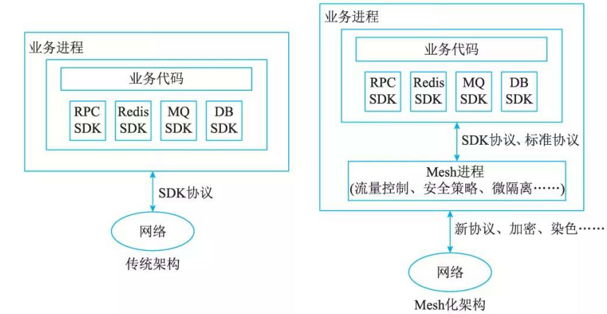
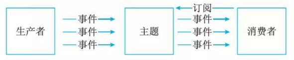

# 2云原生架构内涵

## 最佳实践

### 考察问

- 论文: 论云原生架构及其应用

- ❤️定义: ✨将云应用中的`()`业务代码部分进行最大化的剥离，从而让`()`(IaaS和PaaS)接管应用中原有的大量`()`业务特性(如弹性、韧性、安全、可观测性、灰度等).

- ❤️云原生架构原则✨`()`
    - `()`原则: 韧性代表了当软件所依赖的`()`件组件出现各种`()`时，软件表现出来的`()`能力. 核心目标是提升软件的`()`。从架构设计上，韧性包括服务异步化能力、重试／限流／降级／熔断、主从模式、集群模式等。
    - `()`原则: 技术和业务的演进速度非常快，很少有一开始就清晰定义了架构并在整个软件生命周期里面都适用，相反往往还需要对架构进行一定范围内的`()`. 除了增量迭代、目标选取等因素外，还需要考虑组织(例如架构控制委员会)层面的架构治理和风险控制，特别是在业务高速迭代情况下的架构、业务、实现平衡关系。
    - `()`原则: 通过服务化架构把`()`的模块分离出来，分别进行业务迭代，避免迭代频繁模块被慢速模块拖慢，从而加快整体的进度和稳定性。同时服务化架构以`()`，服务内部的功能高度内聚，模块间通过公共功能模块的提取`()`。
    - `()`原则: 系统的部署规模可以随着业务量的变化而自动伸缩，无须根据事先的容量规划准备固定的硬件和软件资源。好的弹性能力不仅缩短了从采购到上线的时间，降低了企业的IT成本，更关键的是当业务规模面临海量突发性扩张的时候，不再因为平时软硬件资源储备不足而说不，保障了企业收益。
    - `()`原则: 大量自动化交付工具在CI/CD流水线中的实践，一方面标准化企业内部的软件交付过程，另一方面在标准化的基础上进行自动化，通过配置数据自描述和面向终态的交付过程，让自动化工具理解交付目标和环境差异，实现整个软件交付和运维的自动化。
    - `()`原则: 在云这样的分布式系统中，主动通过日志、链路跟踪和度量等手段，使得一次点击背后的多次服务调用的耗时、返回值和参数都清晰可见，甚至可以下钻到每次三方软件调用、SQL请求、节点拓扑、网络响应等
    - `()`原则: 默认情况下不应该信任网络内部和外部的任何人／设备／系统，需要基于认证和授权重构访问控制的信任基础. 零信任第一个核心问题就是身份(Identity),赋予不同的实体不同的身份，解决是谁在什么环境下访问某个具体的资源的问题。

- 组成:  
    1. `()`模式：每个接口可以部署不同数量的实例，单独扩缩容，从而使得整体的部署更经济。
    2. `()`模式: 但并非真的没有服务器，而是将服务器的运维管理等工作交给云厂商。
    3. `()`: 一个大操作由多个分布在不同服务器、属于不同应用的小操作组成，需保证这些小操作要么全部成功，要么全部失败 ，以此保障数据库的数据一致性和原子性。比如比如用户信息和订单信息分别存于两个 MySQL 实例，删除用户信息时需同时删其订单信息，因操作涉及不同数据库实例，会产生分布式事务。

### 考察点

- 论文: 论云原生架构及其应用
- 定义: ✨将云应用中的`非功能`业务代码部分进行最大化的剥离，从而让`云设施`(IaaS和PaaS)接管应用中原有的大量`非功能`业务特性(如弹性、韧性、安全、可观测性、灰度等).

- 云原生架构原则✨`自观人演服弹零信任`
    - `韧性`原则: 韧性代表了当软件所依赖的`软硬`件组件出现各种`异常`时，软件表现出来的`抵御`能力. 核心目标是提升软件的`平均无故障时间`。从架构设计上，韧性包括服务异步化能力、重试／限流／降级／熔断、主从模式、集群模式等。
    - `演进`原则: 技术和业务的演进速度非常快，很少有一开始就清晰定义了架构并在整个软件生命周期里面都适用，相反往往还需要对架构进行一定范围内的`重构`. 除了增量迭代、目标选取等因素外，还需要考虑组织(例如架构控制委员会)层面的架构治理和风险控制，特别是在业务高速迭代情况下的架构、业务、实现平衡关系。
    - `服务化`原则: 通过服务化架构把`不同生命周期`的模块分离出来，分别进行业务迭代，避免迭代频繁模块被慢速模块拖慢，从而加快整体的进度和稳定性。同时服务化架构以`面向接口编程`，服务内部的功能高度内聚，模块间通过公共功能模块的提取`增加软件的复用程度`。
    - `弹性`原则: 系统的部署规模可以随着业务量的变化而自动伸缩，无须根据事先的容量规划准备固定的硬件和软件资源。好的弹性能力不仅缩短了从采购到上线的时间，降低了企业的IT成本，更关键的是当业务规模面临海量突发性扩张的时候，不再因为平时软硬件资源储备不足而说不，保障了企业收益。
    - `自动化`原则: 大量自动化交付工具在CI/CD流水线中的实践，一方面标准化企业内部的软件交付过程，另一方面在标准化的基础上进行自动化，通过配置数据自描述和面向终态的交付过程，让自动化工具理解交付目标和环境差异，实现整个软件交付和运维的自动化。
    - `可观测`原则: 在云这样的分布式系统中，主动通过日志、链路跟踪和度量等手段，使得一次点击背后的多次服务调用的耗时、返回值和参数都清晰可见，甚至可以下钻到每次三方软件调用、SQL请求、节点拓扑、网络响应等
    - `零信任`原则: 默认情况下不应该信任网络内部和外部的任何人／设备／系统，需要基于认证和授权重构访问控制的信任基础. 零信任第一个核心问题就是身份(Identity),赋予不同的实体不同的身份，解决是谁在什么环境下访问某个具体的资源的问题。

- 组成:
    1. `微服务`模式：每个接口可以部署不同数量的实例，单独扩缩容，从而使得整体的部署更经济。
    2. `无服务`模式: 但并非真的没有服务器，而是将服务器的运维管理等工作交给云厂商。
    3. `分布式事务`: 一个大操作由多个分布在不同服务器、属于不同应用的小操作组成，需保证这些小操作要么全部成功，要么全部失败 ，以此保障数据库的数据一致性和原子性。比如比如用户信息和订单信息分别存于两个 MySQL 实例，删除用户信息时需同时删其订单信息，因操作涉及不同数据库实例，会产生分布式事务。

## 云原生架构定义

从技术的角度，云原生架构是基于云原生技术的一组架构原则和设计模式的集合，旨在将云应用中的`非业务代码`部分进行最大化的剥离，从而让云设施接管应用中原有的大量`非功能特性`(如弹性、韧性、安全、可观测性、灰度等)，使业务不再有非功能性业务中断困扰的同时，具备轻量、敏捷、高度自动化的特点。由于云原生是面向“云”而设计的应用，因此，技术部分依赖于传统云计算的3层概念，即基础设施即服务(IaaS)、平台即服务(PaaS)和软件即服务(SaaS) 。

云原生的代码通常包括三部分：业务代码、三方软件、处理非功能特性的代码。

- `业务代码`指实现业务逻辑的代码；
- `三方软件`是业务代码中依赖的所有三方库，包括业务库和基础库；
- `处理非功能性的代码`指实现高可用、安全、可观测性等非功能性能力的代码。

三部分中只有业务代码是核心，是对业务真正带来价值的，另外两个部分都只算附属物，但是，随着软件规模的增大、业务模块规模变大、部署环境增多、分布式复杂性增强，使得今天的软件构建变得越来越复杂，对开发人员的技能要求也越来越高。云原生架构相比较传统架构进了一大步，从业务代码中剥离大量非功能性特性(不会是所有，比如`易用性`还不能剥离)到IaaS和PaaS中，从而减少业务代码开发人员的技术关注范围，通过云厂商的专业性提升应用的非功能性能力。

### 代码结构发生巨大变化

云原生架构产生的最大影响就是让开发人员的编程模型发生了巨大变化。今天大部分的编程语言中，都有文件、网络、线程等元素，这些元素为充分利用单机资源带来好处的同时，也提升了分布式编程的复杂性；因此大量框架、产品涌现，来解决分布式环境中的网络调用问题、高可用问题、CPU争用问题、分布式存储问题，等等。

在云的环境中，“如何获取存储“变成了若干服务，包括对象存储服务、块存储服务和没有随机访问的文件存储服务。云不仅改变了开发人员获得这些存储能力的界面，还在于云产品解决了分布式场景中的各种挑战，包括高可用挑战、自动扩缩容挑战、安全挑战、运维升级挑战等，应用的开发人员不用在其代码中处理节点宅机前如何把本地保存的内容同步到远端的问题，也不用处理当业务峰值到来时如何对存储节点进行扩容的问题，而应用的运维人员不用在发现zeroday安全问题时紧急对三方存储软件进行升级。

云把三方软硬件的能力升级成了服务，开发人员的开发复杂度和运维人员的运维工作量都得到极大降低。显然，如果这样的云服务用得越多，那么开发和运维人员的负担就越少，企业在非核心业务实现上从必须的负担变成了可控支出。在一些开发能力强的公司中，对这些三方软硬件能力的处理往往是交给应用框架(或者说公司内自己的中间件)来做的；在云的时代云厂商提供了更具SLA的服务，使得所有软件公司都可以由此获益。

这些使得业务代码的开发人员技能栈中，不再需要掌握文件及其分布式处理技术，不再需要掌握各种复杂的网络技术，简化让业务开发变得更敏捷、更快速。

### 非功能性特性大量委托

任何应用都提供两类特性，功能性特性和非功能性特性。功能性特性是真正为业务带来价值的代码，比如建立客户资料、处理订单、支付等；即使是一些通用的业务功能特性，比如组织管理、业务字典管理、搜索等也是紧贴业务需求的。非功能性特性是没有给业务带来直接业务价值，但通常又是必不可少的特性，比如高可用能力、容灾能力、安全特性、可运维性、易用性、可测试性、灰度发布能力等。

虚拟机：当虚拟机检测到底层硬件发生异常时，自动帮助应用做热迁移，迁移后的应用不需重新启动而仍然具备对外服务的能力，应用对整个迁移过程都不会有任何感知。

容器：有时应用所在的物理机是正常的，只是应用自身的问题(比如bug、资源耗尽等)而无法正常对外提供服务。容器通过监控检查探测到进程状态异常，从而实施异常节点的下线、新节点上线和生产流量的切换等操作，整个过程自动完成而无需运维人员干预。

云服务：如果应用把“有状态”部分都交给了云服务(如缓存、数据库、对象存储等)，加上全局对象的待有小型化或具备从磁盘快速重建能力，由于云服务本身是具备极强的高可用能力，那么应用本身会变成更薄的“无状态”应用，高可用故障带来的业务中断会降至分钟级；如果应用是N-M的对等架构模式，那么结合负载均衡产品可获得很强的高可用能力。

### 高度自动化的软件交付

软件交付的困难在于开发环境到生产环境的差异(公司环境到客户环境之间的差异)以及软件交付和运维人员的技能差异，填补这些差异的是一大堆安装手册、运维手册和培训文档。容器以一种标准的方式对软件打包，容器及相关技术则帮助屏蔽不同环境之间的差异，进而基于容器做标准化的软件交付。

基于云原生的自动化软件交付相比较当前的人工软件交付是一个巨大的进步。以微服务为例，应用微服务化以后，往往被部署到成于上万个结点上，如果系统不具备高度的自动化能力，任何一次新业务的上线，都会带来极大的工作量挑战，严重时还会导致业务变更超过上线窗口而不可用。

## 云原生架构原则

### `服务化`原则

当代码规模超出小团队的合作范围时，就有必要进行服务化拆分了，包括拆分为微服务架构、小服务 (MiniService)架构，通过服务化架构把不同生命周期的模块分离出来，分别进行业务迭代，避免迭代频繁模块被慢速模块拖慢，从而加快整体的进度和稳定性。同时服务化架构以面向接口编程，服务内部的功能高度内聚，模块间通过公共功能模块的提取增加软件的复用程度。

分布式环境下的限流降级、熔断隔仓、灰度、反压、零信任安全等，本质上都是基于服务流量(而非网络流量)的控制策略，所以云原生架构强调使用服务化的目的还在于从架构层面抽象化业务模块之间的关系，标准化服务流量的传输，从而帮助业务模块进行基于服务流量的策略控制和治理，不管这些服务是基于什么语言开发的。

### `弹性`原则

大部分系统部署上线需要根据业务量的估算，准备一定规模的机器，从提出采购申请，到供应商洽谈、机器部署上电、软件部署、性能压测，往往需要好几个月甚至一年的周期；而这期间如果业务发生变化了，重新调整也非常困难。弹性则是指系统的部署规模可以随着业务量的变化而自动伸缩，无须根据事先的容量规划准备固定的硬件和软件资源。好的弹性能力不仅缩短了从采购到上线的时间，让企业不用操心额外软硬件资源的成本支出(闲置成本)，降低了企业的IT成本，更关键的是当业务规模面临海量突发性扩张的时候，不再因为平时软硬件资源储备不足而说不，保障了企业收益。

### `可观测`原则

大部分企业的软件规模都在不断增长，原来单机可以对应用做完所有调试，但在分布式环境下需要对多个主机上的信息做关联，才可能回答清楚服务为什么宅机，哪些服务违反了其定义的SLO(Service Level Objective, 服务等级目标)，目前的故障影响哪些用户，最近这次变更对哪些服务指标带来了影响等问题，这些都要求系统具备更强的可观测能力。可观测性与监控、业务探活、APM等系统提供的能力不同，前者是在云这样的分布式系统中，主动通过日志、链路跟踪和度量等手段，使得一次点击背后的多次服务调用的耗时、返回值和参数都清晰可见，甚至可以下钻到每次三方软件调用、SQL请求、节点拓扑、网络响应等，这样的能力可以使运维、开发和业务人员实时掌握软件运行情况，并结合多个维度的数据指标，获得前所未有的关联分析能力，不断对业务健康度和用户体验进行数字化衡量和持续优化。

### `韧性`原则

当业务上线后，最不能接受的就是业务不可用，让用户无法正常使用软件，影响体验和收入。韧性代表了当软件所依赖的软硬件组件出现各种异常时，软件表现出来的抵御能力，这些异常通常包括硬件故障、硬件资源瓶颈(如CPU/网卡带宽耗尽)、业务流量超出软件设计能力、影响机房工作的故障和灾难、软件bug、黑客攻击等对业务不可用带来致命影响的因素。

韧性从多个维度诠释了软件持续提供业务服务的能力，核心目标是提升软件的`平均无故障时间(Mean Time Between Failure, MTBF)`。从架构设计上，韧性包括服务异步化能力、重试／限流／降级／熔断／反压、主从模式、集群模式、AZ内的高可用、单元化、跨region容灾、异地多活容灾等。

### 所有过程`自动化`原则

技术往往是把“双刃剑”，容器、微服务、DevOps、大量第三方组件的使用，在降低分布式复杂性和提升迭代速度的同时，因为整体增大了软件技术栈的复杂度和组件规模，所以不可避免地带来了软件交付的复杂性，如果这里控制不当，应用就无法体会到云原生技术的优势。通过IaC(Infrastructure as Code)、GitOps、OAM(Open Application Model)、KubemetesOperator和大量自动化交付工具在CI/CD流水线中的实践，一方面标准化企业内部的软件交付过程，另一方面在标准化的基础上进行自动化，通过配置数据自描述和面向终态的交付过程，让自动化工具理解交付目标和环境差异，实现整个软件交付和运维的自动化。

### `零信任`原则

零信任安全针对传统边界安全架构思想进行了重新评估和审视，并对安全架构思路给出了新建议。其核心思想是，默认情况下不应该信任网络内部和外部的任何人／设备／系统，需要基于认证和授权重构访问控制的信任基础，诸如IP地址、主机、地理位置、所处网络等均不能作为可信的凭证。零信任对访问控制进行了范式上的颠覆，引导安全体系架构从“网络中心化”走向“身份中心化”，其本质诉求是以身份为中心进行访问控制。

零信任第一个核心问题就是身份(Identity),赋予不同的实体不同的身份，解决是谁在什么环境下访问某个具体的资源的问题。在研发、测试和运维微服务场景下，身份及其相关策略不仅是安全的基础，更是众多(资源、服务、环境)隔离机制的基础；在员工访问企业内部应用的场景下，身份及其相关策略提供了即时的接入服务。

### 架构持续`演进`原则

今天技术和业务的演进速度非常快，很少有一开始就清晰定义了架构并在整个软件生命周期里面都适用，相反往往还需要对架构进行一定范围内的重构，因此云原生架构本身也必须是一个具备待续演进能力的架构，而不是一个封闭式架构。除了增量迭代、目标选取等因素外，还需要考虑组织(例如架构控制委员会)层面的架构治理和风险控制，特别是在业务高速迭代情况下的架构、业务、实现平衡关系。云原生架构对于新建应用而言的架构控制策略相对容易选择(通常是选择弹性、敏捷、成本的维度)，但对于存量应用向云原生架构迁移，则需要从架构上考虑遗留应用的迁出成本／风险和到云上的迁入成本／风险，以及技术上通过微服务／应用网关、应用集成、适配器、服务网格、数据迁移、在线灰度等应用和流量进行细颗粒度控制。

## 主要架构模式

### 服务化架构模式

服务化架构是云时代构建云原生应用的标准架构模式，要求以应用模块为颗粒度划分一个软件，以接口契约(例如IDL)定义彼此业务关系，以标准协议(HTTP、gRPC等)确保彼此的互联互通，结合DDD(领域模型驱动)、TDD(测试驱动开发)、容器化部署提升每个接口的代码质量和迭代速度。服务化架构的典型模式是微服务和小服务模式，其中小服务可以看作是一组关系非常密切的服务的组合，这组服务会共享数据，小服务模式通常适用于非常大型的软件系统，避免接口的颗粒度太细而导致过多的调用损耗(特别是服务间调用和数据一致性处理)和治理复杂度。

通过服务化架构，把代码模块关系和部署关系进行分离，每个接口可以部署不同数量的实例，单独扩缩容，从而使得整体的部署更经济。此外，由千在进程级实现了模块的分离，每个接口都可以单独升级，从而提升了整体的迭代效率。但也需要注意，服务拆分导致要维护的模块数量增多，如果缺乏服务的自动化能力和治理能力，会让模块管理和组织技能不匹配，反而导致开发和运维效率的降低。

### Mesh化架构模式

Mesh化架构是把中间件框架(如RPC、缓存、异步消息等)从业务进程中分离，让中间件SDK与业务代码进一步解耦，从而使得中间件升级对业务进程没有影响，甚至迁移到另外一个平台的中间件也对业务透明。分离后在业务进程中只保留很“薄＂的Client部分，Client通常很少变化，只负责与Mesh进程通信，原来需要在SDK中处理的流量控制、安全等逻辑由Mesh进程完成。整个架构如图所示。

实施Mesh化架构后，大量分布式架构模式(熔断、限流、降级、重试、反压、隔仓……)都由Mesh进程完成，即使在业务代码的制品中并没有使用这些三方软件包；同时获得更好的安全性(比如零信任架构能力)、按流量进行动态环境隔离、基于流量做冒烟／回归测试等。

### Serverless模式

Serverless将“部署“这个动作从运维中“收走”，使开发者不用关心应用运行地点、操作系统、网络配置、CPU性能等，从架构抽象上看，当业务流量到来／业务事件发生时，云会启动或调度一个已启动的业务进程进行处理，处理完成后云自动会关闭／调度业务进程，等待下一次触发，也就是把应用的整个运行都委托给云。

Serverless并非适用任何类型的应用，因此架构决策者需要关心应用类型是否适合于Serverless运算。如果应用是有状态的，由于Serverless的调度不会帮助应用做状态同步，因此云在进行调度时可能导致上下文丢失；如果应用是长时间后台运行的密集型计算任务，会无法发挥Serverless的优势；如果应用涉及频繁的外部I/O (网络或者存储，以及服务间调用)，也因为繁重的I/O负担、时延大而不适合。事件驱动架构图如图所示。Serverless非常适合于事件驱动的数据计算任务、计算时间短的请求／响应应用、没有复杂相互调用的长周期任务。

### 存储计算分离模式

分布式环境中的CAP困难主要是针对有状态应用，因为无状态应用不存在C(一致性)这个维度，因此可以获得很好的A(可用性)和P(分区容错性)，因而获得更好的弹性。在云环境中，推荐把各类暂态数据(如 session) 、结构化和非结构化待久数据都采用云服务来保存，从而实现存储计算分离。但仍然有一些状态如果保存到远端缓存，会造成交易性能的明显下降，比如交易会话数据太大、需要不断根据上下文重新获取等，这时可以考虑通过采用时间日志＋快照(或检查点)的方式，实现重启后快速增量恢复服务，减少不可用对业务的影响时长。

### 分布式事务模式

微服务模式提倡每个服务使用私有的数据源，而不是像单体这样共享数据源，但往往大颗粒度的业务需要访问多个微服务，必然带来分布式事务问题，否则数据就会出现不一致。架构师需要根据不同的场景选择合适的分布式事务模式。

- 传统采用XA模式，虽然具备很强的一致性，但是性能差。
- 基于消息的最终一致性(BASE)通常有很高的性能，但是通用性有限。
- TCC模式完全由应用层来控制事务，事务隔离性可控，也可以做到比较高效；但是对业务的侵入性非常强，设计开发维护等成本很高。
- SAGA模式与TCC模式的优缺点类似但没有try这个阶段，而是每个正向事务都对应一个补偿事务，也是开发维护成本高。
- 开源项目SEATA的AT模式非常高性能且无代码开发工作量，且可以自动执行回滚操作，同时也存在一些使用场景限制。

### 可观测架构

可观测架构包括Logging、Tracing、Metrics三个方面，其中Logging提供多个级别(verbose/debug/warning/error/fatal)的详细信息跟踪，由应用开发者主动提供；Tracing提供一个请求从前端到后端的完整调用链路跟踪，对于分布式场景尤其有用；Metrics则提供对系统量化的多维度度量。

架构决策者需要选择合适的、支持可观测的开源框架(比如Open Tracing、Open Telemetry等)，并规范上下文的可观测数据规范(例如方法名、用户信息、地理位置、请求参数等)，规划这些可观测数据在哪些服务和技术组件中传播，利用日志和tracing信息中的spanid/traceid,确保进行分布式链路分析时有足够的信息进行快速关联分析。

由于建立可观测性的主要目标是对服务SLO (Service Level Objective) 进行度量，从而优化 SLA, 因此架构设计上需要为各个组件定义清晰的SLO, 包括并发度、耗时、可用时长、容量等。

### 事件驱动架构

事件驱动架构(EDA, Event Driven Architecture)本质上是一种应用／组件间的集成架构模式。
事件和传统的消息不同事件具有schema, 所以可以校验event的有效性，同时EDA具备QoS保障机制，也能够对事件处理失败进行响应。事件驱动架构不仅用于(微)服务解耦，还可应用于下面的场景中。

- 增强服务韧性：由于服务间是异步集成的，也就是下游的任何处理失败甚至宅机都不会被上游感知，自然也就不会对上游带来影响。
- CQRS(Command Query Responsibility Segregation): 把对服务状态有影响的命令用事件来发起，而对服务状态没有影响的查询才使用同步调用的API接口；结合EDA中的EventSourcing机制可以用于维护数据变更的一致性，当需要重新构建服务状态时，把EDA中的事件重新”播放”一遍即可。
- 数据变化通知：在服务架构下，往往一个服务中的数据发生变化，另外的服务会感兴趣，比如用户订单完成后，积分服务、信用服务等都需要得到事件通知并更新用户积分和信用等级。
- 构建开放式接口：在EDA下，事件的提供者并不用关心有哪些订阅者，不像服务调用的场景-数据的产生者需要知道数据的消费者在哪里并调用它，因此保持了接口的开放性。
- 事件流处理：应用千大量事件流(而非离散事件)的数据分析场景，典型应用是基于Kafka的日志处理。

基于事件触发的响应：在IoT时代大量传感器产生的数据，不会像人机交互一样需要等待处理结果的返回，天然适合用EDA来构建数据处理应用。

## 典型的云原生架构反摸式

技术往往像一把双刃剑，企业做云原生架构演进的时候，会充分考虑根据不同的场景选择不同的技术，下面是一些典型云原生架构反模式。

### 庞大的单体应用

庞大单体应用的最大问题在千缺乏依赖隔离，包括代码耦合带来的责任不清、模块间接口缺乏治理而带来变更影响扩散、不同模块间的开发进度和发布时间要求难以协调、一个子模块不稳定导致整个应用都变慢、扩容时只能整体扩容而不能对达到瓶颈的模块单独扩容等。因此当业务模块可能存在多人开发的时候，就需要考虑通过服务化进行一定的拆分，梳理聚合根，通过业务关系确定主要的服务模块以及这些模块的边界、清晰定义模块之间的接口，并让组织关系和架构关系匹配。

### 单体应用“硬拆”为微服务

服务的拆分需要适度，过分服务化拆分反而会导致新架构与组织能力的不匹配，让架构升级得不到技术红利，典型的例子包括：

- 小规模软件的服务拆分：软件规模不大，团队人数也少，但是为了微服务化，强行把耦合度高、代码量少的模块进行服务化拆分，一次性的发布需要拆分为多个模块分开发布和维护。
- 数据依赖：服务虽然拆分为多个，但是这些服务的数据是紧密耦合的，千是让这些服务共享数据库，导致数据的变化往往被扇出到多个服务中，造成服务间数据依赖。
- 性能降低：当耦合性很强的模块被拆分为多个微服务后，原来的本地调用变成了分布式调用，从而让响应时间变大了上千倍，导致整个服务链路性能急剧下降。

### 缺乏自动化能力的微服务

软件架构中非常重要的一个维度就是处理软件复杂度问题，一旦问题规模提升了很多，那就必须重新考虑与之适应的新方案。在很多软件组织中，开发、测试和运维的工作单位都是以进程为单位，比如把整个用户管理作为一个单独的模块进行打包、发布和运行；而进行了微服务拆分后，这个用户管理模块可能被分为用户信息管理、基本信息管理、积分管理、订单管理等多个模块，由千仍然是每个模块分别打包、发布和运行，开发、测试和运维人员的人均负责模块数就会直线上升，造成了人均工作量增大，也就增加了软件的开发成本。
