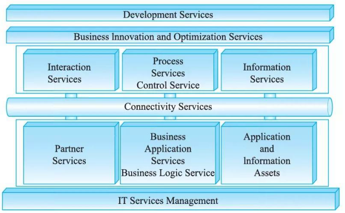
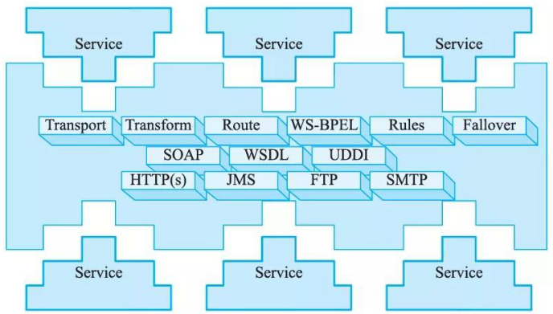

# SOA 的参考架构

## 最佳实践

## 题目总结

- (✨2018下)某银行拟将以分行为主体的银行信息系统，全面整合为由总行统一管理维护的银行信息系统，实现统一的用户账户管理、转账汇款、自助缴费、理财投资、贷款管理、网上支付、财务报表分析等业务功能。但是，由于原有以分行为主体的银行信息系统中，多个业务系统采用异构平台、数据库和中间件，使用的报文交换标准和通信协议也不尽相同，使用传统的EAI解决方案根本无法实现新的业务模式下异构系统间灵活的交互和集成。因此，为了以最小的系统改进整合现有的基于不同技术实现的银行业务系统，该银行拟采用基于 ESB 的面向服务架构(SOA)集成方案实现业务整合。

    - 1.(7分)请分别用 200 字以内的文字说明什么是面向服务架构(SOA)以及ESB在SOA中的作用与特点。(2018下)

        面向服务的体系架构(SOA)是一种粗粒度、松耦合服务架构，服务之间通过简单、精确定义接口进行通信。它可以根据需求通过网络对松散耦合的粗粒度应用组件进行分布式部署、组合和使用。SOA能帮助企业系统架构设计者以更迅速、更可靠、更高重用性设计整个业务系统架构，基于SOA的系统能够更加从容地面对业务的急剧变化。

        企业服务总线(ESB)是由中间件技术实现的全面支持面向服务架构的基础软件平台，支持异构环境中的服务以及基于消息和事件驱动模式的交互，并且具有适当的服务质量和可管理性。 

    - 2.(12分)基于该信息系统整合的实际需求，项目组完成了基于 SOA 的银行信息系统架构设计方案。该系统架构图如图 5 - 1 所示。请从(a)~(j)中选择相应内容填入图的(1)~(6)，补充完善架构设计图。(2018下)

        (a)数据层
        (b)界面层
        (c)业务层
        (d)bind
        (e)企业服务总线ESB
        (f)XML
        (g)安全验证和质量管理
        (h)publish
        (i)UDDI
        (j)组件层
        (k)BPEI

        

    - 3.(6分)针对银行信息系统的数据交互安全性需求，列举3种可实现信息系统安全保障的措施。 

        XML加密模块、WS-Security、防火墙系统、安全检测、网络扫描

### 考察点

- 以服务为中心的企业集成采用`()`(Separation of Concern)的方法规划企业集成中的各种架构元素

### 考察问

- 以服务为中心的企业集成采用`关注点分离`(Separation of Concern)的方法规划企业集成中的各种架构元素

## SOA的参考架构

以服务为中心的企业集成采用`关注点分离`(Separation of Concern)的方法规划企业集成中的各种架构元素，同时从服务视角规划每种架构元素提供的服务，以及服务如何被组合在一起完成某种类型的集成。这里架构元素提供的服务既包括狭义的服务(CWSDL描述)，也包括广义的服务(某种能力)。从服务为中心的视角来看，企业集成的架构可划分为6大类。

- 业务逻辑服务(Business Logic Service):包括用于实现业务逻辑的服务和执行业务逻辑的能力，其中包括业务应用服务(Business Application Service) 、业务伙伴服务 (PartnerService) 以及应用和信息资产 (Application and Information asset)。
- 控制服务(Control Service): 包括实现人(People) 、流程(Process) 和信息(Infor­mation) 集成的服务，以及执行这些集成逻辑的能力。
- 连接服务(Connectivity Service):通过提供企业服务总线提供分布在各种架构元素中服务间的连接性。
- 业务创新和优化服务(Business Innovation and Optimization Service):用于监控业务系统运行时服务的业务性能，并通过及时了解到的业务性能和变化，采取措施适应变化的市场。
- 开发服务(Development Service):贯彻整个软件开发生命周期的开发平台，从需求分析，到建模、设计、开发、测试和维护等全面的工具支待。
- IT服务管理 (IT Service Management) :支待业务系统运行的各种基础设施管理能力或服务，如安全服务、目录服务、系统管理和资源虚拟化。

## 连接服务: 企业服务总线

企业服务总线(Enterprise Service Bus, ESB) 是过去消息中间件的发展，采用了“总线”这样一种模式来管理和简化应用之间的集成拓扑结构，以广为接受的开放标准为基础来支持应用之间在消息、事件和服务的级别上动态地互联互通。

ESB的基本特征和能力包括：描述服务的元数据和服务注册管理；在服务请求者和提供者之间传递数据，以及对这些数据进行转换的能力，并支持由实践中总结出来的一些模式如同步模式、异步模式等；发现、路由、匹配和选择的能力，以支持服务之间的动态交互，解耦服务请求者和服务提供者。高级一些的能力，包括对安全的支持、服务质量保证、可管理性和负载平衡等。

ESB所提供的基于标准的连接服务，将应用中实现的功能或者数据资源转化为服务请求者能以标准的方式来访问的服务；当请求者来请求一个服务时，ESB中这种中介转换过程可能简单到什么也没有，也可能需要很复杂的中介服务支待，包括动态地查找、选择一个服务，消息的传递、路由和转换、协议的转换。这种中介过程，是ESB借助于服务注册管理以及问题域相关的知识(如业务方面的一些规则等)自动进行的，不需要服务请求者和提供者介入，从而实现了解耦服务请求者和提供者的技术基础，使得服务请求者不需要关心服务提供者的位置和具体实现技术，双方在保待接口不变的情况下，各自可以独立地演变。

所以，ESB采用总线结构模式简化了应用之间的集成拓扑，通过源自实践的模式，提供了基于标准的通用连接服务，使得服务请求者和服务提供者之间可以以松散耦合、动态的方式交互，从而在不同层次上使得SOA解决方案是一个松散耦合、灵活的架构。

一个典型的企业服务总线如图所示。需要注意的是，ESB是一种架构模式，不能简单地等同于特定的技术或者产品，但实现ESB确实需要各种产品在运行时和工具方面的支持。IBM有很好的产品支持，运行时支待包括 WebSphere ESB 和 WebSphere Message Broker; 而工具方面 IBM 则有 WebSphere Integration  Developer, 支持用户以图形界面的方式来完成相关的开发任务，如发布服务，使用各种模式、转换消息和定义路由等。

## 业务逻辑服务

### 整合已有应用_应用和信息访问服务

以服务为中心的企业集成通过应用和信息访问服务(Application and Information Access Service)来实现`对已有应用和信息的集成`。它通过各种适配器技术将已有系统中的业务逻辑和业务数据包装成企业服务总线支持的协议和数据格式。通过企业服务总线，这些被包装起来的业务逻辑和数据就可以方便地参与上层的业务流程，从而已有应用系统的能力可以得以继续发挥。这里的已有应用包括遗留应用、预包装的应用和各种企业数据存储。在参考架构中，主要有两类访问服务。

- 可接入服务(On-Ramp Service): 通过各种消息通信模式(单向、请求／应答和轮询)将业务逻辑和业务数据包装成企业服务总线可以访问的功能。
- 事件发现服务 (Event Detect Service): 提供事件通知服务将已有应用和数据中的变化通过事件框架发布到企业服务总线上。

### 整合新开发的应用_业务应用服务

同已有应用和数据类似，新开发的应用也作为重要的业务逻辑成为企业集成的目标。以服务为中心的企业集成通过业务应用服务(Business Application Service) 实现新应用集成。一方面，业务应用服务帮助程序员开发可重用、可维护和灵活的业务逻辑组件；另一方面，它也提供运行时的集成对业务逻辑组件的自治管理。在参考架构中，有三类业务应用服务。

- 组件服务(Component Service):为可重用的组件提供应用的运行时容器管理服务，如对象持久化、组件安全管理和事务管理等。
- 核心服务( Core Service):提供运行时的服务，包括内存管理、对象实例化和对象池、性能管理和负载均衡、可用性管理等。
- 接口服务(Interface Service):提供和其他企业系统集成的接口，如其他企业应用，数据库、消息系统和管理框架。

### 整合客户和业务伙伴(B2C/B2B)_伙伴服务

以服务为中心的企业集成通过伙伴服务提供与企业外部的B2B的集成能力。因为业务伙伴系统的异构性，伙伴服务需要支持多种传输协议和数据格式。在参考架构中，提供如下服务。

- 社区服务 (Community Service):用千管理和企业贸易的业务伙伴，支持以交易中心(Trade Hub) 为主的集中式管理和以伙伴为中心的自我管理
- 文档服务 (Document Service):用千支待和业务伙伴交换的文档格式，以及交互的流程和状态管理，支持主流的 RosettaNet、EDI和AS1/AS2 等
- 协议服务 (Protocol Servi ce): 为文档的交互提供传输层的支持，包括认证和路由等

## 控制服务

### 数据整合_信息服务

企业数据的分布性和异构性是应用系统方便访问企业数据和在企业数据之上提供增值服务的主要障碍。数据集成和聚合技术在这种背景下诞生，用千提供对分布式数据和异构数据的透明访问。

以服务为中心的企业集成通过信息服务提供集成数据的能力，目前主要包括如下集中信息服务。

- 联邦服务(Federation Service):提供将各种类型的数据聚合的能力，它既支持关系型数据，也支持像 XML 数据、文本数据和内容数据等非关系型数据。同时，所有的数据仍然按照自己本身的方式管理。
- 复制服务(Replication Service): 提供远程数据的本地访问能力，它通过自动的实时复制和数据转换，在本地维护一个数据源的副本。本地数据和数据源在技术实现上可以是独立的。
- 转换服务(Trans formation Service):用于数据源格式到目标格式的转换，可以是批量的或者是基千记录的。
- 搜索服务(Search Service):提供对企业数据的查询和检索服务，既支持数据库等结构化数据，也支持像 PDF 等非结构化数据。

### 流程整合_流程服务

企业部门内部的IT系统通过将业务活动自动化来提高业务活动的效率。但是这些部门的业务活动并不是独立的，而是和其他部门的活动彼此关联的。毋庸置疑，将彼此关联的业务活动组成自动化流程可以进一步提高业务活动的效率。业务流程集成正是在这一背景下诞生的。

以服务为中心的企业集成通过流程服务来完成业务流程集成。在业务流程集成中，粒度的业务逻辑被组合成业务流程，流程服务提供自动执行这些业务流程的能力。在参考架构中，流程服务包括如下内容。

- 编排服务(Choreography Service):通过预定义的流程逻辑控制流程中业务活动的执行，并帮助业务流程从错误中恢复。
- 事务服务(Transaction Service):用千保证流程执行中的事务特性 (ACID)。对千短流程，通常采用传统的两阶段提交技术；对于长流程，一般采用补偿的方法。
- 人工服务(Staff Service): 用于将人工的活动集成到流程中。一方面，它通过关联的交互服务使得人工可以参与到流程执行中；另一方面，它需要管理由于人工参与带来的管理任务，如任务分派、授权和监管等。

### 用户访问整合_交互服务

将适当的信息、在适当的时间、传递给合适的人一直是信息技术追求的目标。用户访问集成是实现这一目标的重要一环，它负责将信息系统中的信息传递给客户，不管它在哪里，以什么样的设备接入。

以服务为中心的企业集成，通过交互服务来实现用户访问集成。参考架构中的交互服务包括如下类型。

- 交付服务(Deli very Servi ce):提供运行时的交互框架，它通过各种技术支持同样的交互逻辑可以在多种方式(图形界面、语音和普及计算消息)和设备(桌面、PDA和无线终端等)上运行，例如通过页面聚合和标签翻译使得同一个Portlet可以在桌面浏览器和PDA浏览器上展现。
- 体验服务(Experi ence Service):通过用户为中心的服务增强用户体验，其中的技术包括个性化、协作和单点登录等。
- 资源服务(Resource Service):提供运行时交互组件的管理，如安全配置、界面皮肤等。

## 开发服务

企业集成涉及面很广，不仅需要开发新的应用并使其成为可以被用千企业集成的功能组件，而且需要将被包装的已有的应用和数据用于集成；不仅有企业内部的集成，而且需要和企业外部的系统集成；不仅有交互集成和数据集成，还有功能和应用集成。考虑到这其中的每部分在技术上都会涉及各种平台和中间件，企业集成的技术复杂性是普通应用开发不可比拟的。这种技术复杂性需要更强有力的开发工具支持。企业集成的开发工具需要有标准的工具框架，这些工具能够以即插即用方式支持来自多家厂商的开发工具。同时，企业集成的开发工具需要支待整个软件开发周期，以提高开发过程中各种角色的生产力。

在以服务为中心的企业集成中，除了需要支持整个软件开发周期和标准的工具框架以外，开发服务需要提供和服务开发相关的技术。

- 用于支持以服务为中心的企业集成方法学和建模，如SODA和IBM的SOMA (Service Oriented Modeling and Architecture)
- 用于服务为中心的编程模型，如WSDL、BPEL4WS、SCA和SDO等

开发环境和工具中为不同开发者的角色提供的功能被称为开发服务。根据开发过程中开发者角色和职责的不同，有如下 4 类服务。

- 建模服务 (Model Service): 用于构建可视化的业务流程模型
- 设计服务 (Design Service)  :根据业务模型，进一步分解为服务组件，设计服务用千设计和开发这些服务组件
- 实现服务( Implementation Service): 用于将设计和开发的服务组件部署到生产环境中
- 测试服务 (Test Service): 支持服务组件的单元测试和系统的集成测试

## 业务创新和优化

一方面，以服务为中心的企业集成通过各种集成提高信息流转速度，从而提高生产效率；另一方面，以服务为中心的企业集成也为业务创新和优化提供了支持平台－~业务创新和优化服务。

业务创新和优化服务以业务性能管理 (Business Process Management, BPM) 技术为核心提供业务事件发布、收集和关键业务指标监控能力。具体而言，业务创新和优化服务由以下服务组成。

- 公共事件框架服务 (Common Event Infrastructure Service):通过一个公共事件框架提供IT和业务事件的激发、存储和分类等。
- 采集服务(Collection Service): 通过基千策略的过滤和相关性分析检测感兴趣的服务。
- 监控服务(Monitoring Service): 通过事件与监控上下文间的映射，计算和管理业务流程的关键性能指标 (Key Performance Indicators, KPI) 。

业务创新和优化服务与开发服务是紧密相联的。在建模阶段被确定的业务流程的关键性能指标，被转为特别的事件标志构建到业务流程中，建模过程中的业务流程也被转换为用千监控服务的监控上下文。在业务流程执行过程中，这些事件标志激发的事件被公共事件框架服务截获，经过采集服务的过滤被传递给监控服务用于计算关键性能指标。关键性能指标作为重要的数据被用于重构或优化业务流程，这种迭代的方法使得业务流程处于不断的优化中。

## IT 服务管理

为业务流程和服务提供安全、高效和健康的运行环境，也是以服务为中心的企业集成重要的部分，它由 IT 服务管理来完成。 IT服务管理包括如下两部分。

- 安全和目录服务( Security and Directory Service): 企业范围的用户、认证和授权管理，如单点登录 (SSO) 。
- 系统管理和虚拟化服务(System Management and Virtualization Service) :用千管理服务器、存储、网络和其他IT资源。

IT服务管理中相当一部分服务是面向软硬件管理的；而另外一部分服务，特别是安全和目录服务，以及操作系统和中间件管理，会通过企业服务总线和其他服务集成在一起，用千实现业务流程和服务的非功能性需求，如性能、可用性和安全性等。

