# 2通信系统网络架构

通信网络从大的方面主要包括局域网、广域网、移动通信网等网络形式。

## 局域网网络架构

### 概述

局域网，即计算机局部区域网络，是一种为单一机构所拥有的专用计算机网络。其特点是：覆盖地理范围小，通常限定在相对独立的范围内，如一座建筑或集中建筑群内(通常 2.5km 内)；数据传输速率高(一般在 lOMb/s 以上，典型 lGb/s, 甚至 lOGb/s); 低误码率(通常在 10-9 以下)，可靠性高；通常为单一部门或单位所有；支持多种传输介质支持实时应用。就网络拓扑而言，有总线型、环型、星型、树型等型式。从传输介质来说包含有线局域网和无线局域网。

### 网络组成

局域网通常由计算机、交换机、路由器等设备组成。

### 网络架构

局域网已从早期只提供二层交换功能的简单网络发展到如今不仅提供二层交换功能，还提供三层路由功能的复杂网络。

1. 单核心架构

    单核心局域网通常由一台核心二层或三层交换设备充当网络的核心设备，通过若干台接入交换设备将用户设备(如用户计算机、智能设备等)连接到网络中。图 17-1 给出了单核心局域网的架构图。

    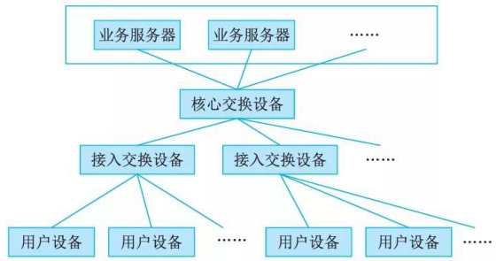

    此类局域网可通过连接核心网交换设备与广域网之间的互连路由设备(边界路由器或防火墙)接入广域网，实现业务跨局域网的访问。单核心网具有如下特点：
    - 核心交换设备通常采用二层、三层及以上交换机；如采用三层以上交换机可划分成VLAN, VLAN内采用二层数据链路转发，VLAN之间采用三层路由转发；
    - 接入交换设备采用二层交换机，仅实现二层数据链路转发；
    - 核心交换设备和接入设备之间可采用 1OOM/GE/1OGE 等以太网连接。

    接入较为方便，直接通过接入交换设备连接至核心交换设备空闲接口即可；其不足是网络地理范围受限，要求使用局域网的部门分布较为紧凑；核心网交换设备存在单点故障，容易导致网络整体或局部失效；网络扩展能力有限；在局域网接入交换设备较多的情况下，对核心交换设备的端口密度要求高。

    作为一种变通，采用此网络架构，对于较小规模网络，用户设备也可直接与核心交换设备互联，进一步减少投资成本。

2. 双核心架构

    双核心架构通常是指核心交换设备通常采用三层及以上交换机。核心交换设备和接入设备之间可采用 IOOM/GE/1OGE 等以太网连接。图给出了典型双核心局域网。

    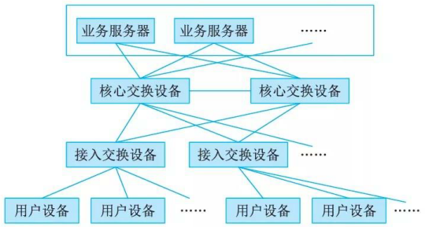

    网络内划分VLAN时，各VLAN之间访问需通过两台核心交换设备来完成。网络中仅核心交换设备具备路由功能，接入设备仅提供二层转发功能。

    核心交换设备之间互联，实现网关保护或负载均衡。核心交换设备具备保护能力，网络拓扑结构可靠。在业务路由转发上可实现热切换。接入网络的各部门局域网之间互访，或访问核心业务服务器，有一条以上条路径可选择，可靠性更高。

    需要使用局域网的部门接入较为方便，直接通过接入交换设备连接至核心交换设备空闲接口即可。设备投资相比单核心局域网的高。对核心交换设备的端口密度要求较高。所有业务服务器同时连接至两台核心交换设备，通过网关保护协议进行保护，为用户设备提供高速访问。

3. 环型架构

    环型局域网是由多台核心交换设备连接成双RPR(Res ilient Packet Ring)动态弹性分组环，构建网络的核心。核心交换设备通常采用三层或以上交换机提供业务转发功能。图给出了典型环型局域网。

    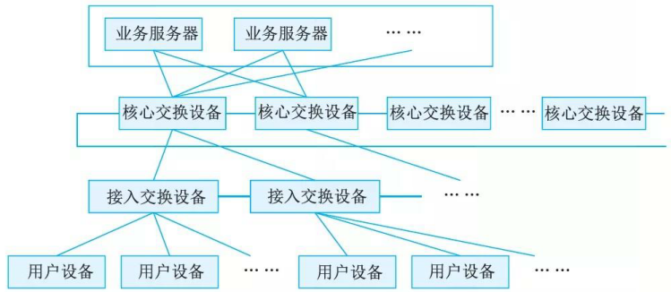

    典型环型局域网网络内各VLAN之间通过RPR环实现互访。RPR具备自愈保护功能，节省光纤资源；具备MAC层50ms自愈时间的能力，提供多等级、可靠的QoS服务，带宽公平机制和拥塞控制机制等。RPR环双向可用。网络通过两根反向光纤组成环型拓扑结构，节点在环上可从两个方向到达另一节点。每根光纤可同时传输数据和控制信号。RPR利用空间重用技术，使得环上的带宽得以有效利用。

    通过RPR组建大规模局域网时，多环之间只能通过业务接口互通，不能实现网络直接互通。环型局域网设备投资比单核心局域网的高。核心路由冗余设计实施难度较高，且容易形成环路。

    此网络通过与环上的交换设备互联的边界路由设备接入广域网。

4. 层次局域网架构

    层次局域网(或多层局域网)由核心层交换设备、汇聚层交换设备和接入层交换设备，以及用户设备等组成。图 17-4 给出了层次局域网模型。

    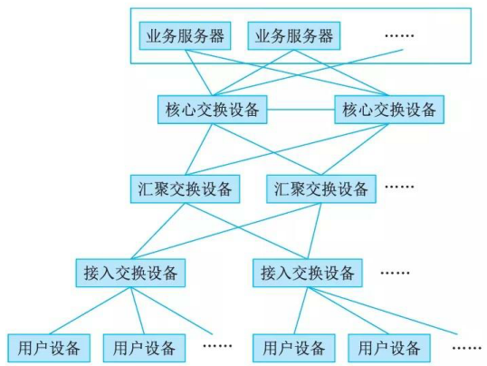

    层次局域网模型核心层设备提供高速数据转发功能。汇聚层设备提供充足接口，与接入层之间实现互访控制。汇聚层可提供所辖的不同接入设备(部门局域网内)业务的交换功能，减轻对核心交换设备的转发压力。接入层设备实现用户设备的接入。

    层次局域网网络拓扑易于扩展。网络故障可分级排查，便于维护。通常，层次局域网通过与广域网的边界路由设备接入广域网，实现局域网和广域网业务互访。

### 网络协议的应用

通常情况下，网络中互为主备的交换或路由设备之间采用必要保护协议：如VRRP、HSRP、GLBP等；网络中二层网络采用多链路机制进行链路保护或带宽扩展时采用STP、LACP等协议。网络中三层设备实现网络动态路由控制的路由协议OSPF、RIP、BGP等。

## 广域网网络架构

### 概述

通俗来讲，广域网是将分布于相比局域网络更广区域的计算机设备联接起来的网络。广域网由通信子网与资源子网组成。通信子网可以利用公用分组交换网、卫星通信网和无线分组交换网来构建，将分布在不同地区的局域网或计算机系统互连起来，实现资源子网的共享。

### 网络组成

广域网属于多级网络，通常由骨干网、分布网、接入网组成。在网络规模较小时，可仅由骨干网和接入网组成。

例如在广域网规划时，需要根据业务场景及网络规模来进行三级网络的功能进行选择。例如规划某省银行广域网，设计骨干网，如支持数据、语音、图像等信息共享，为全银行系统提供高速、可靠通信服务。设计分布网，提供数据中心与各分行、支行的数据交换，提供长途线路复用和主干访问。设计接入网，提供各分支行与各营业网点数据交换，采用访问路由方式，提供网点线路复用和终端访问。

### 网络架构

1. 单核心广域网

    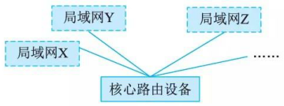

    单核心广域网通常由一台核心路由设备和各局域网组成，其典型网络架构如图 17-5 所示。

    核心路由设备采用三层及以上交换机。网络内各局域网之间访问需要通过核心路由设备。网络中各局域网之间不设立其他路由设备。各局域网至核心路由设备之间采用广播线路，路由设备与各局域网互连接口属千对应局域网子网。核心路由设备与各局域网可采用 1 OM/ 1 OOM/GE 以太接口连接。

    该类型网络结构简单，节省设备投资。各局域网访问核心局域网，以及相互访问效率高。新的部门局域网接入广域网较为方便，只要核心路由设备留有端口即可。不过，核心路由设备存在单点故障，容易导致整网失效。网络扩展能力欠佳，对核心路由设备端口密度要求较高。

2. 双核心广域网

    双核心广域网通常由两台核心路由设备和各局域网组成，其典型网络架构如图 17-6 所示。

    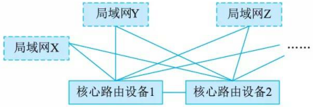

    双核心广域网模型，其主要特征是核心路由设备通常采用三层及以上交换机。核心路由设备与各局域网之间通常采用 lOM/l OOM/GE 等以太网接口连接。网络内各局域网之间访问需经过两台核心路由设备，各局域网之间不存在其他路由设备用于业务互访。核心路由设备之间实现网关保护或负载均衡。各局域网访问核心局域网，以及它们相互访问可有多条路径选择，可靠性更高，路由层面可实现热切换，提供业务连续性访问能力。在核心路由设备接口有预留情况下，新的局域网可方便接入。不过，设备投资较单核心广域网高。核心路由设备路由冗余设计实施难度较高，容易形成路由环路。网络对核心路由设备端口密度要求较高。

3. 环型广域网

    环型广域网通常是采用三台以上核心路由器设备构成路由环路，用以连接各局域网，实现广域网业务互访，其典型网络架构如图 17-7 所示。

    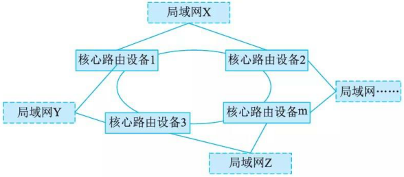

    环型广域网主要特征是核心路由设备通常采用三层或以上交换机。核心路由设备与各局域网之间通常采用 lOM/lOOM/GE 等以太网接口连接。网络内各局域网之间访问需要经过核心路由设备构成的环。各局域网之间不存在其他路由设备进行互访。核心路由设备之间具备网关保护或负载均衡机制，同时具备环路控制功能。各局域网访问核心局域网，或互相访问，有多条路径可选择，可靠性更高，路由层面可实现无缝热切换，保证业务访问连续性。

    在核心路由设备接口有预留情况下，新的部门局域网可方便接入。不过，设备投资比双核心广域网高，核心路由设备路由冗余设计实施难度较高，容易形成路由环路。环型拓扑结构需要占用较多端口，网络对核心路由设备端口密度要求较高。

4. 半冗余广域网

    半冗余广域网是由多台核心路由设备连接各局域网而形成的。其典型网络架构如图 17-8 所示。其中，任意核心路由设备至少存在两条以上连接至其他路由设备的链路。如果任何两个核心路由设备之间均存在链接，则属于半冗余广域网特例，即全冗余广域网。

    半冗余广域网主要特征是半冗余广域网结构灵活，方便扩展。部分网络核心路由设备可采用网关保护或负载均衡机制或具备环路控制功能。网络结构呈网状，各局域网访问核心局域网，以及相互访问存在多条路径，可靠性高。路由层面，路由选择较为灵活。网络结构适合于部署OSPF 等链路状态路由协议。不过，网络结构零散，不便于管理和排障。

    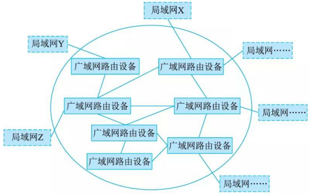

5. 对等子域广域网

    对等子域网络是通过将广域网的路由设备划分成两个独立的子域，每个子域路由设备采用半冗余方式互连。两个子域之间通过一条或多条链路互连，对等子域中任何路由设备都可接入局域网络。典型对等子域网络架构如图 17-9 所示。

    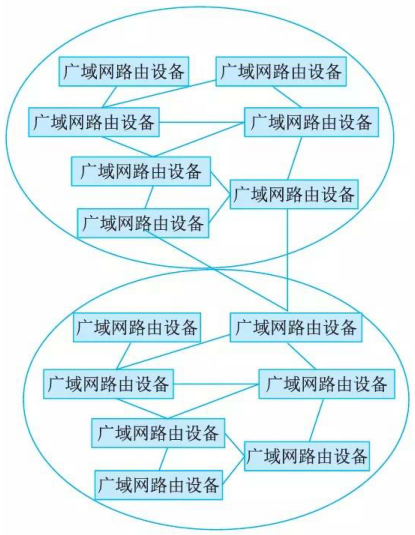

    对等子域广域网的主要特征是对等子域之间的互访是以对等子域之间互连链路为主。对等子域之间可做到路由汇总或明细路由条目匹配，路由控制灵活。通常，子域之间链路带宽应高于子域内链路带宽。域间路由冗余设计实施难度较高，容易形成路由环路，或存在发布非法路由风险。对域边界路由设备的路由性能要求较高。网络中路由协议主要以动态路由为主。对等子域适合于广域网可以明显划分为两个区域，且区域内部访问较为独立的场景。

6. 层次子域广域网

    层次子域广域网结构是将大型广域网路由设备划分成多个较为独立的子域，每个子域内路由设备采用半冗余方式互连，多个子域之间存在层次关系，高层次子域连接多个低层次子域。层次子域中任何路由设备都可以接入局域网。典型层次子域网络架构如图 17-10 所示。

    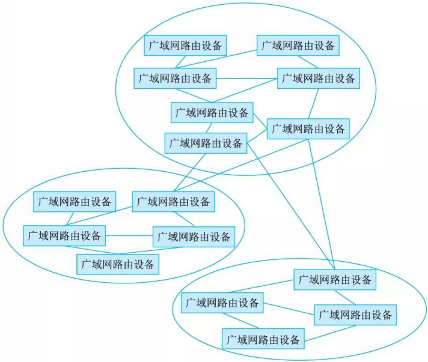

    层次子域的主要特征是层次子域结构具有较好扩展性。低层次子域之间互访需要通过高层次子域完成。域间路由冗余设计实施难度较高，容易形成路由环路，存在发布非法路由的风险。子域之间链路带宽需高于子域内链路带宽。对用千域互访的域边界路由设备的路由转发性能要求较高。路由设备路由协议主要以动态路由为主，如 OSPF 协议。层次子域与上层外网互连，主要借助高层子域完成；与下层外网互连，主要借助低层子域完成。

## 移动通信网网络架构

### 5GS与DN互连

5GS(5G System)在为移动终端用户(User Equipment, UE)提供服务时通常需要DN(Data Network)网络，如Internet、IMS(IP Media Subsystem)、专用网络等互连来为UE提供所需的业务。各式各样的上网、语音、AR/VR、工业控制和无人驾驶等5GS中UPF网元作为DN的接入点。5GS和DN之间通过5GS定义的 N6接口互连。图给出了5G网络与DN网络连接关系图。

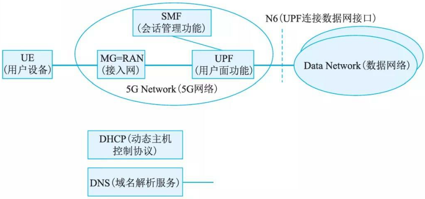

如上图所示，5G Network属于5G范畴，包括若干网络功能实体，如AMF/SMF/PCFINRF/NSSF 等。简洁起见，图中仅表示出了与用户会话密切相关的网络功能实体。

在5GS和DN基于1Pv4/1Pv6互连时，从DN来看，UPF可看作是普通路由器。相反从5GS来看，与UPF通过 N6接口互连的设备，通常也是路由器。换言之，5GS和DN之间是一种路由关系。UE访问DN的业务流在它们之间通过双向路由配置实现转发。就5G网络而言，把从UE流向DN的业务流称之为上行(UL, UpLink)业务流；把从DN流向UE的业务流称为下行(DL, DownLink)业务流。UL业务流通过UPF上配置的路由转发至 DN;DL业务流通过与UPF邻近的路由器上配置的路由转发至UPF。

此外，从UE通过5GS接入DN的方式来说，存在两种模式，即透明模式和非透明模式。

1. 透明模式

    在透明模式下，5GS通过UPF的N6接口直接连至运营商特定的IP网络，然后通过防火墙(Firewall) 或代理服务器连至DN(即外部IP网络)，如Internet等。UE分配由运营商规划的网络地址空间的IP地址。UE在向5GS发起会话建立请求时，通常5GS不触发向外部DN-AAA服务器发起认证过程。图给出了 UE透明接入5G网络的示意图。

    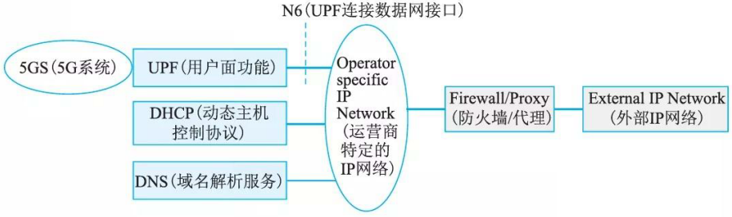

    在此模式下，5GS至少为VE提供一个基本ISP服务。对于5GS而言，它只须提供基本的隧道QoS流服务即可。VE访问某个Intranet网络时，UE级别的配置仅在UE和Intranet网络之间独立完成，这对5GS而言是透明的。

2. 非透明模式

    在非透明模式下，5GS可直接接入Intranet/ISP, 或通过其他IP网络(如Internet)接入Intranet/ISP。如5GS通过Internet方式接入Intranet/ISP, 通常需要在UPF和Intranet/ISP之间建立专用隧道来转发UE访问Intranet/ISP的业务。UE被指派属于Intranet/ISP地址空间的IP地址。此地址用于UE业务在UPF、Intranet/ISP中转发。图(a)和(b)分别给出了UE通过5GS非透明接入DN和VE的原理图。

    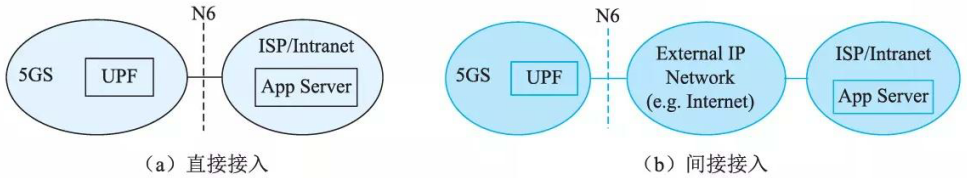

    综上所述，UE通过5GS访问Intranet/ISP的业务服务器，可基于任何网络如Internet等来进行，即使不安全也无妨，在UPF和Intranet/ISP之间可基于某种安全协议进行数据通信保护。至于采用何种安全协议由移动运营商和Intranet/ISP提供商之间协商确定。

    作为UE会话建立的一部分，5GS中SMF通常通过向外部DN-AAA服务器(如Radius、Diameter服务器)发起对UE进行认证。在对UE认证成功后，方可完成UE会话的建立，之后UE才可访问Internet/ISP的服务。

### 5G 网络边缘计算

    5G 网络在为用户提供服务的同时，更注重用户的服务体验QoE (Quality  of Exp erience) 。其中 5G 网络边缘计算能力的提供正是为垂直行业赋能、提升用户QoE 的重要举措之一。

    5G 网络的边缘计算 (Moble Edge  Com puting,  MEC) 架构如图 17-14 所示，支待在靠近终端用户 UE 的移动网络边缘部署 5GUPF 网元，结合在移动网络边缘部署边缘计算平台 (Mobi leEdge  Pla tform,  MEP), 为垂直行业提供诸如以时间敏感、高带宽为特征的业务就近分流服务。于是，一来为用户提供极佳服务体验，二来降低了移动网络后端处理的压力。

    运营商自有应用或第三方应用 AF (A pplication  Function) 通过 5GS 提供的能力开放功能网元 NEF (Ne twork  Ex posure  Function), 触发 5G 网络为边缘应用动态地生成本地分流策略，由PCF  (Pol icy Char ging Function) 将这些策略配置给相关 SMF, SMF 根据终端用户位置信息或用户移动后发生的位置变化信息动态实现 UPF (即移动边缘云中部署的 UPF) 在用户会话中插入或移除，以及对这些 UPF 分流规则的动态配置，达到用户访问所需业务的极佳效果。

    另外，从业务连续性来说， 5G 网络可提供 SSC 模式 l (在用户移动过程中用户会话的 IP接入点始终保持不变)， SSC 模式 2 (用户移动过程中网络触发用户现有会话释放并立即触发新会话建立)， SSC 模式 3 (用户移动过程中在释放用户现有会话之前先建立一个新的会话)供业务提供者 ASP (A pplication Serv ice Provider) 或运营商选择。

    

## 存储网络架构

一般来说，计算机访问磁盘存储有3种方式：

- 直连式存储(Direct Attached  Storage,  DAS)  :计算机通过1/0 端口直接访问存储设备的方式。
- 网络连接的存储 (Network Attached Storage,  NAS): 计算机通过分布式文件系统访问存储设备的方式。
- 存储区域网络(Storage Area Network, SAN): 计算机通过构建的独立存储网络访问存储设备的方式。

DAS 采用I/0 总线架构，如 IDE 或 ATA 等将存储设备挂接在计算机中，实现数据存储。多种存储设备适合用作主机连接存储；包括硬盘驱动器、 RAID 阵列、 CD 、 DVD 和磁带驱动器。对主机连接存储设备进行数据传输的I/0 指令是针对特定存储单元(例如总线 ID 和目标逻辑单元)的逻辑数据块的读和写。

NAS 和 SAN 都是基千网络构建存储系统的。网络存储采用面向网络的存储体系结构，使数据处理和数据存储分离，由专门的系统负责数据处理，存储设备或子系统负责数据的存储。网络存储结构通过网络连接服务器和存储资源，具有灵活的网络寻址能力和远距离数据传输能力，实现了在单一区域或多个区域可靠的数据存储、恢复，以及不同主机不同存储设备之间的资源共享。

### 网络连接存储(NAS)

NAS设备是一种专用存储系统，用户计算机通过数据网络(如LAN/WAN 等网络)来远程访问。如图所示，用户计算机通过远程过程调用(RPC)访问NAS存储单元。远程过程调用是通过IP网络(如基于TCP或UDP)来进行的，NAS存储单元通常采用RPC接口软件来实现。通过NAS, 使得所有通过数据网络连接的计算机与主机本地连接存储一样方便命名和访问共享存储池。当然，与主机本地连接的存储相比，它的存储访问效率及性能相对较差。

最常见的NAS协议以下：

- 公共 Internet文件服务／服务器消息块( Common Internet File Services I Server  Message Block,  CIFS/SMB) 。 CIFS/SMB 是 Windows 通常使用的协议。
- 网络文件系统 (NFS) 。 NFS 最早为 UNIX 服务器而开发，也是通用的 Linux 协议。

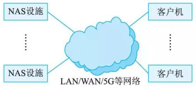

### 存储区域网络

存储区域网络(Storage Area  Network,  SAN) 是一种基于块的存储，利用专用高速通信架构将服务器与其逻辑磁盘单元 (Logical Disk Unit,  LDU) 相连。 LDU 是一系列通过共享存储池配置的块，以逻辑磁盘的形式呈现给服务器。服务器会对这些块进行分区和格式化，通常使用文件系统以便可以像在本地磁盘上存储一样在 LDU 上存储数据。此外， SAN 的设计消除了单点故障，具有极高可用性和故障恢复能力。图给出了 SAN 网络的部署示意图。

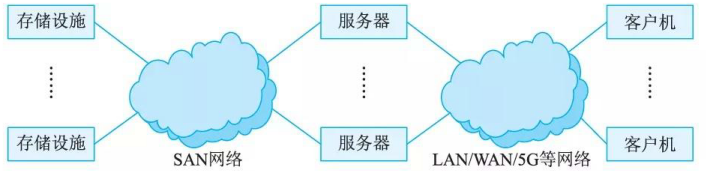

SAN 是企业最常用的存储网络架构。 SAN 将数据存储在集中式共享存储中，使企业能够运用统一的方法和工具来实施安全防护、数据保护和灾难恢复。对高吞吐量和低延迟有需求的业务关键型应用尤为适用。

SAN 为专用网络，采用存储协议而不是网络协议连接服务器和存储单元。 SAN 交换机允许或禁止主机访问存储，通过配置 SAN 来为主机提供所需存储容量。 SAN 可以让服务器集群共享同一存储，让存储阵列为多个主机提供存储服务。可见， SAN 通信具有极大灵活性。

常见的 SAN 有 FC-SAN 和 IP-SAN, 其中 FC-SAN 为通过光纤通道协议转发 SCSI 协议，IP-SAN 通过 TCP 协议转发 SCSI 协议。

最常见 SAN 协议包括以下 4 种：
(1) 光纤通道协议(Fibre Channel Protocol, FCP)。应用最为广泛的SAN或块协议，FCP使用具有嵌入式SCSI命令的光纤通道传输协议。
(2) Internet小型计算机系统接口(iSCSI): 第二大SAN或块协议。iSCSI将SCSI命令封装在以太网帧内，然后使用IP以太网络进行传输。
(3) 以太网光纤通道(Fibre Channel over Ethernet, FCoE): 其应用相对较少。它与iSCSI类似，将 FC 帧封装在以太网数据报中，然后像iSCSI一样使用IP以太网络进行传输。
(4) 基于光纤通道的非易失性内存标准(Non-Volatile Memory Express over Fibre Channel, FC-N凶e)：它是一种用于通过PCI Express (PCie)总线访问闪存存储的接口协议。NVMe支待若干并行序列，每一个序列又能支持若干并发命令。

SAN有着广泛的应用前景。SAN主要用于存储量大的工作环境，如ISP、银行等，特别地在5G网络设备部署中得到应用。5G网络设备通常采用业务处理和数据存储分离的架构进行设计，采用SAN存储网络可有效避免网元处理节点故障切换后业务数据丢失。

### NAS与SAN异同点

SAN和NAS都可以用于集中管理存储，并供多主机(服务器)共享存储。但是，NAS通常是基于以太网，而 SAN可使用以太网和光纤通道。此外，NAS注重易用性、易管理性、可扩展性和更低的总拥有成本(TCO), 而SAN则注重高性能和低延迟。

实际应用中，应根据业务特点灵活选用适合的网络存储架构。

## 软件定义网络架构

### 软件定义网络

软件定义网络(Software Defined Network, SDN)是由美国斯坦福大学CLean State课题研究组提出的一种新型网络创新架构。其核心思想是通过对网络设备的控制面与数据面进行分离，控制面集中化管控，同时对外提供开放的可编程接口，为网络应用创新提供极佳的能力开放平台；而数据面则通用化、轻量化，高效转发，以提升网络的整体运行效能。

具体来说，SDN利用分层的思想，将网络分为控制层和数据层。控制层包括可编程控制器，具有网络控制逻辑的中心，掌握网络的全局信息，方便运营商或网络管理人员配置网络和部署新协议等。数据层包括哑交换机(与传统的二层交换机不同，专指用千转发数据的设备)，仅提供简单的数据转发功能，可以快速处理匹配的数据包，适应流量日益增长的需求。两层之间采用开放的统一接口(如 OpenFlow 等)进行交互。通过此接口控制器向转发设备(如交换机等)下发统一标准的转发规则，转发设备仅需按照这些规则执行相应动作即可。

相比传统网络设备，SDN技术能够更有效降低转发设备复杂度及卸载不必要的运行负载，协助网络运营商更好地控制基础设施，降低整体运营成本，同时打破了传统网络设备的封闭性，因此， SDN 是极具前途的网络技术之一。

### SDN 网络架构

SDN 架构如图所示，由下至上分为数据平面、控制平面和应用平面。

数据平面由网络转发设备(如通常由通用硬件构成)组成，网络转发设备之间通过由不同规则形成的SDN数据通路连接起来；控制平面包含了逻辑上为中心的SDN控制器，它掌握着网络全局信息，负责转发设备的各种转发规则的下发；应用平面包含各种基于SDN的网络应用，应用无须关心网络底层细节就可以编程、部署新应用。

控制平面与数据平面之间通过 SDN 控制－数据平面接口，即南向接口SBI(South Bound Interface) 进行通信，它采用统一的通信标准，主要负责将控制器中的转发规则下发至转发设备；控制平面与应用乎面之间通过 SDN 北向接口NBI(North Bound Interface) 进行通信，它允许用户根据自身需求定制开发各种网络管理应用。

SDN 中的接口具有开放性，以控制器为逻辑中心，南向接口负责与数据平面进行通信，北向接口负责与应用平面进行通信，东西向接口负责多控制器之间的通信。

南向接口通常采用OpenFlow 协议，也是当今最主流南向接口协议。它最基本的特点是基于流 (Flow) 的概念来匹配转发规则。每一个转发设备都维护一个流表 (Flow Table), 依据流表中的转发规则进行转发，而流表的建立、维护和下发都是由控制器来完成的。

北向接口对应用开放，应用程序通过北向接口编程来调用所需网络资源，实现对网络的快速配置和部署。

东西向接口使控制器具有可扩展性，为网络负载均衡和性能提升提供了技术途径。

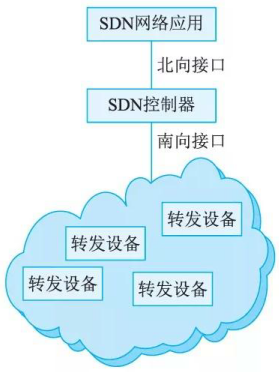
